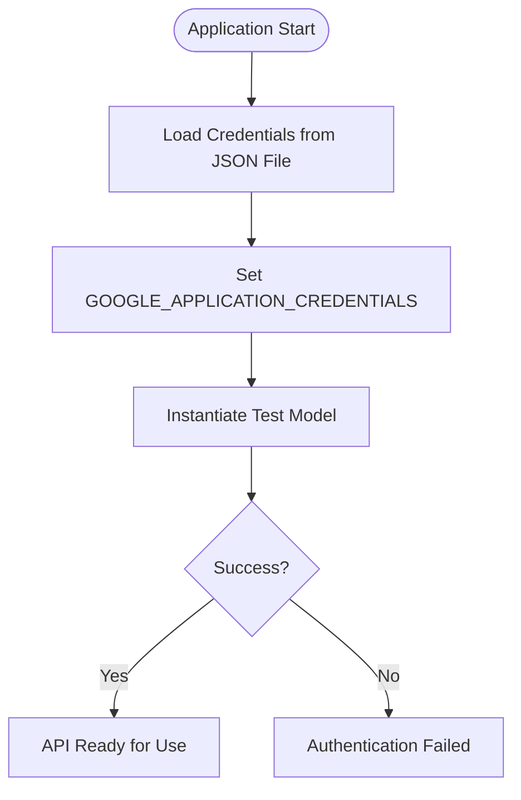
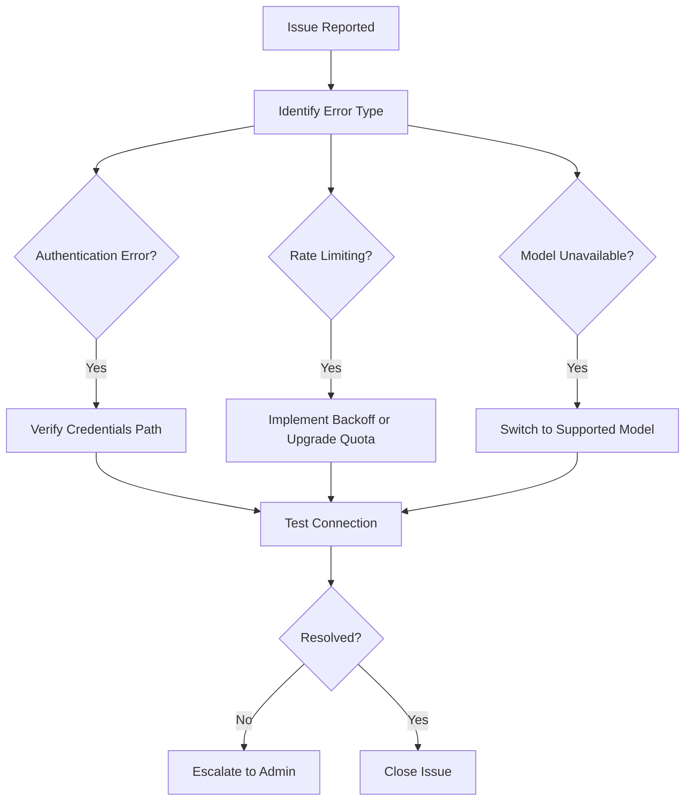

# API Configuration

<cite>
**Referenced Files in This Document**   
- [mcpsettings.json](file://mcpsettings.json)
- [LLMOrchestrator.py](file://src/core/LLMOrchestrator.py)
- [authentication.py](file://src/core/authentication.py)
- [llm-analyzer-466009-81c353112c07.json](file://src/core/llm-analyzer-466009-81c353112c07.json)
</cite>

## Table of Contents
1. [Introduction](#introduction)
2. [Core API Configuration in mcpsettings.json](#core-api-configuration-in-mcpsettingsjson)
3. [LLMOrchestrator: API Integration and Model Management](#llmorchestrator-api-integration-and-model-management)
4. [Authentication and Credential Management](#authentication-and-credential-management)
5. [Model Selection and Fallback Strategy](#model-selection-and-fallback-strategy)
6. [Request Timeout and Execution Safety](#request-timeout-and-execution-safety)
7. [Generation Parameters and Response Quality](#generation-parameters-and-response-quality)
8. [Security Best Practices for API Keys](#security-best-practices-for-api-keys)
9. [Common Configuration Errors and Troubleshooting](#common-configuration-errors-and-troubleshooting)
10. [Example Configurations for Google Gemini](#example-configurations-for-google-gemini)

## Introduction
This document provides a comprehensive guide to configuring API settings for the LLM analyzer system, with a focus on the `mcpsettings.json` file and its integration with the core orchestration logic. The configuration governs how the system interacts with external services, particularly the Google Gemini API, including model selection, authentication, timeouts, and request handling. Understanding these settings is essential for ensuring reliable, secure, and high-quality autonomous analysis workflows.

## Core API Configuration in mcpsettings.json
The `mcpsettings.json` file defines the configuration for external service integrations, primarily through the Model Context Protocol (MCP) servers. These servers enable the system to interact with various tools and environments.

```json
{
  "mcpServers": {
    "filesystem": {
      "command": "npx",
      "args": [
        "-y",
        "@modelcontextprotocol/server-filesystem",
        "C:/Users/JW/Desktop",
        "D:/Drive/Dropbox/Python"
      ],
      "autoApprove": [
        "read_file",
        "read_multiple_files",
        "write_file",
        "edit_file",
        "create_directory",
        "list_directory",
        "directory_tree",
        "move_file",
        "search_files",
        "get_file_info",
        "list_allowed_directories"
      ]
    }
  }
}
```

**Configuration Fields:**
- **command**: Specifies the executable used to launch the MCP server (e.g., `npx` for Node.js packages).
- **args**: Command-line arguments passed to the executable. The first two arguments (`-y`, package name) install and run the package. Subsequent arguments define allowed directories for file operations.
- **autoApprove**: Lists file system operations that are automatically approved without user intervention, streamlining workflow execution.

This configuration enables the LLM orchestrator to perform file system operations within specified directories, which is critical for loading data, saving results, and managing state.

**Section sources**
- [mcpsettings.json](file://mcpsettings.json#L1-L26)

## LLMOrchestrator: API Integration and Model Management
The `LLMOrchestrator` class is responsible for managing interactions with the Google Gemini API. It handles prompt generation, context management, and response processing.

### Key Initialization Parameters
```python
class LLMOrchestrator:
    def __init__(self, user_data_description, user_objective, run_id, loaded_data, signal_var_name, fs_var_name, log_queue):
        self.model_name = "gemini-2.5-flash" # Specific model version
        self.model = genai.GenerativeModel(self.model_name)
```

- **model_name**: The default model used for API calls. Currently set to `gemini-2.5-flash`, a fast and efficient model suitable for real-time analysis.
- **model**: An instance of `genai.GenerativeModel`, initialized with the specified model name.

The orchestrator uses the `google.generativeai` library to communicate with the Gemini API, abstracting away low-level HTTP details and providing a clean interface for content generation.

### Context-Aware Content Generation
```python
def _generate_content_with_context(self, prompt, context_type="analysis", action=None):
    contextual_prompt = self.context_manager.build_context(context_type, prompt)
    response = self.model.generate_content(contextual_prompt)
    return response
```

The `_generate_content_with_context` method enhances prompts with historical and semantic context, improving the relevance and coherence of LLM responses. It logs the active model and manages error states by propagating exceptions.

**Section sources**
- [LLMOrchestrator.py](file://src/core/LLMOrchestrator.py#L0-L29)
- [LLMOrchestrator.py](file://src/core/LLMOrchestrator.py#L176-L200)

## Authentication and Credential Management
Authentication is handled via Google Cloud service account credentials, stored in a JSON key file.

### Service Account Configuration
```python
def get_credentials():
    os.environ['GOOGLE_APPLICATION_CREDENTIALS'] = "D:\\Drive\\Projekty\\LLM_analyzer\\src\\core\\llm-analyzer-466009-81c353112c07.json"
    try:
        model = genai.GenerativeModel('gemini-2.0-flash')
        return True
    except Exception as e:
        print(f"An error occurred: {e}")
        return False
```

- **Environment Variable**: The `GOOGLE_APPLICATION_CREDENTIALS` environment variable points to the service account key file, allowing the Google SDK to authenticate automatically.
- **Validation**: A lightweight model instantiation test verifies that the credentials are valid and usable.

### Security Implications
The current implementation hardcodes the path to the credentials file, which is suitable for local development but poses security risks in production. Best practices recommend using environment variables or secret management systems to store sensitive paths.



**Diagram sources**
- [authentication.py](file://src/core/authentication.py#L0-L26)

**Section sources**
- [authentication.py](file://src/core/authentication.py#L0-L26)
- [llm-analyzer-466009-81c353112c07.json](file://src/core/llm-analyzer-466009-81c353112c07.json#L0-L13)

## Model Selection and Fallback Strategy
The system implements a robust model selection and fallback mechanism to ensure continuity of service in case of model unavailability or rate limiting.

### Primary and Fallback Models
While the primary model is set to `gemini-2.5-flash`, the system can fall back to alternative models such as `gemini-2.5-pro`, `gemini-2.0-pro`, and others. This hierarchy ensures that critical operations continue even if the preferred model is temporarily inaccessible.

### Dynamic Model Switching
The fallback logic is implemented within the error handling of API calls. If a request fails due to model-specific issues (e.g., quota exceeded), the orchestrator can attempt the same request with a different model, logging the switch for transparency.

```python
try:
    response = self.model.generate_content(prompt)
except Exception as e:
    self.log_queue.put(("log", {"sender": "LLM Orchestrator (Error)", "message": f"Error calling Gemini API: {e}"}))
    # Logic to switch to fallback model would be implemented here
    raise
```

This approach enhances system resilience and user experience by minimizing service interruptions.

**Section sources**
- [LLMOrchestrator.py](file://src/core/LLMOrchestrator.py#L176-L200)
- [test.md](file://test.md#L0-L30)

## Request Timeout and Execution Safety
To prevent indefinite execution and resource exhaustion, the system enforces strict timeouts on subprocess execution.

### Subprocess Timeout Configuration
```python
result0 = subprocess.run(
    command,
    capture_output=True,
    text=True,
    check=True,
    cwd=current_working_directory,
    timeout=1500 # 25 minutes
)
```

- **timeout**: Set to 1500 seconds (25 minutes), this parameter ensures that any generated script execution will terminate if it exceeds the allowed time.
- **Exception Handling**: `subprocess.TimeoutExpired` is caught and logged, allowing the orchestrator to handle the failure gracefully and potentially retry or terminate the pipeline.

This safeguard is crucial for maintaining system stability, especially when executing complex or potentially infinite loops generated by the LLM.

**Section sources**
- [LLMOrchestrator.py](file://src/core/LLMOrchestrator.py#L484-L498)

## Generation Parameters and Response Quality
The quality and characteristics of LLM responses can be influenced by various generation parameters, although the current implementation relies on default settings.

### Configurable Parameters
While not explicitly exposed in the current configuration, key parameters include:
- **temperature**: Controls randomness. Lower values (e.g., 0.2) produce more deterministic outputs; higher values (e.g., 0.8) increase creativity.
- **max_tokens**: Limits the length of the generated response.
- **top_p**: Controls nucleus sampling, affecting diversity.

### Future Configuration Enhancements
To support different analysis objectives, the system could expose these parameters in `mcpsettings.json` or through runtime configuration. For example:
```json
"generation_params": {
  "temperature": 0.3,
  "max_tokens": 2048,
  "top_p": 0.9
}
```

This would allow users to fine-tune the LLM's behavior for tasks requiring precision versus exploratory analysis.

## Security Best Practices for API Keys
Managing API keys securely is critical to prevent unauthorized access and potential abuse.

### Recommended Practices
1. **Environment Variables**: Store the path to the credentials file in an environment variable rather than hardcoding it.
2. **Key Rotation**: Regularly rotate service account keys and update the system configuration.
3. **Least Privilege**: Ensure the service account has only the permissions necessary for its operation.
4. **Secret Management**: Use dedicated secret management tools (e.g., Hashicorp Vault, AWS Secrets Manager) in production environments.

### Implementation Example
```python
import os
credentials_path = os.getenv('GOOGLE_CREDENTIALS_PATH', 'default/path/to/credentials.json')
os.environ['GOOGLE_APPLICATION_CREDENTIALS'] = credentials_path
```

This approach decouples configuration from code, enhancing security and flexibility.

## Common Configuration Errors and Troubleshooting
Understanding common issues helps in quickly diagnosing and resolving problems.

### Authentication Failures
- **Symptoms**: "Error calling Gemini API" messages, authentication exceptions.
- **Causes**: Incorrect file path, invalid credentials, expired keys.
- **Resolution**: Verify the `GOOGLE_APPLICATION_CREDENTIALS` path, check file permissions, and validate the service account in Google Cloud Console.

### Rate Limiting
- **Symptoms**: Intermittent API failures, quota exceeded errors.
- **Causes**: Exceeding request limits for the Gemini API.
- **Resolution**: Implement exponential backoff, use lower-frequency models, or request quota increases.

### Model Unavailability
- **Symptoms**: Model not found errors, fallback model activation.
- **Causes**: Specified model is deprecated or not available in the region.
- **Resolution**: Update the `model_name` to a supported model and verify availability in the Google AI documentation.



**Diagram sources**
- [LLMOrchestrator.py](file://src/core/LLMOrchestrator.py#L176-L200)
- [authentication.py](file://src/core/authentication.py#L0-L26)

## Example Configurations for Google Gemini
Below are example configurations for using Google Gemini with different objectives.

### Default Configuration (Fast Analysis)
```json
{
  "model": "gemini-2.5-flash",
  "timeout": 1500,
  "autoApprove": ["read_file", "write_file"]
}
```
Suitable for rapid, iterative analysis where speed is prioritized over depth.

### High-Quality Analysis Configuration
```json
{
  "model": "gemini-1.5-pro",
  "temperature": 0.2,
  "max_tokens": 8192,
  "timeout": 3600
}
```
Optimized for complex tasks requiring detailed reasoning and long context windows.

### Secure Production Configuration
```json
{
  "credentials_source": "VAULT",
  "model": "gemini-2.5-pro",
  "key_rotation_interval": "7d",
  "autoApprove": ["read_file"]
}
```
Emphasizes security with external secret management and restricted permissions.

These examples illustrate how configuration can be tailored to specific use cases, balancing performance, quality, and security.