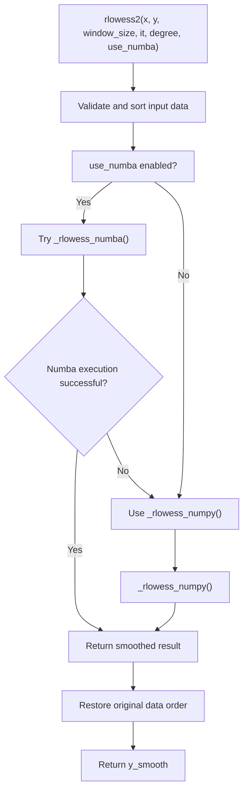
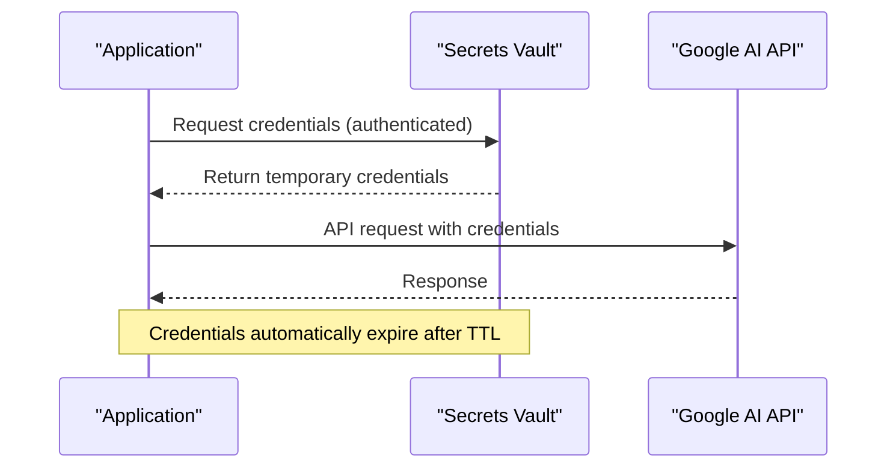

# Advanced Configuration

<cite>
**Referenced Files in This Document**   
- [mcpsettings.json](file://mcpsettings.json)
- [src/core/authentication.py](file://src/core/authentication.py)
- [src/lib/rlowess_smoother.py](file://src/lib/rlowess_smoother.py)
</cite>

## Table of Contents
1. [Introduction](#introduction)
2. [Configuration Overview](#configuration-overview)
3. [mcpsettings.json Structure and Functionality](#mcpsettingsjson-structure-and-functionality)
4. [Authentication and LLM Access Security](#authentication-and-llm-access-security)
5. [Customization of Smoothing Parameters in rlowess_smoother.py](#customization-of-smoothing-parameters-in-rlowess_smootherpy)
6. [Tool Path Configuration and Extension](#tool-path-configuration-and-extension)
7. [Example Configurations for Analysis Scenarios](#example-configurations-for-analysis-scenarios)
8. [Security Best Practices for Credentials](#security-best-practices-for-credentials)
9. [Environment-Specific Configuration](#environment-specific-configuration)
10. [Troubleshooting Configuration Failures](#troubleshooting-configuration-failures)

## Introduction
This document provides comprehensive guidance on advanced configuration options for the LLM Analyzer system. It details key configuration files, authentication mechanisms, and customization capabilities that enable users to tailor the system for diverse signal analysis tasks. The focus is on practical implementation, security, and adaptability across different environments and use cases.

## Configuration Overview
The system supports flexible configuration through JSON files, environment variables, and modular Python components. Key configuration aspects include:
- API access and authentication settings
- Model execution parameters
- Tool integration and file system access
- Signal processing algorithm tuning
- Environment-specific deployment settings

These configurations allow users to customize behavior for various signal types and analysis goals, from high-frequency vibration monitoring to low-SNR biomedical signal processing.

## mcpsettings.json Structure and Functionality

The `mcpsettings.json` file defines external tool server configurations used by the system. It enables integration with Model Context Protocol (MCP) servers for extended functionality.

```json
{
  "mcpServers": {
    "filesystem": {
      "command": "npx",
      "args": [
        "-y",
        "@modelcontextprotocol/server-filesystem",
        "C:/Users/JW/Desktop",
        "D:/Drive/Dropbox/Python"
      ],
      "autoApprove": [
        "read_file",
        "read_multiple_files",
        "write_file",
        "edit_file",
        "create_directory",
        "list_directory",
        "directory_tree",
        "move_file",
        "search_files",
        "get_file_info",
        "list_allowed_directories"
      ]
    }
  }
}
```

### Key Configuration Elements:
- **command**: Specifies the executable to launch the MCP server (`npx` in this case)
- **args**: Command-line arguments passed to the executable
  - `-y`: Automatically installs the package if not present
  - `@modelcontextprotocol/server-filesystem`: Package name
  - Directory paths: Defines accessible file system locations
- **autoApprove**: Lists file operations that are automatically permitted without user confirmation

This configuration enables secure, controlled access to specified directories on the local file system, allowing the LLM to perform file operations within defined boundaries.

**Section sources**
- [mcpsettings.json](file://mcpsettings.json#L1-L26)

## Authentication and LLM Access Security

The `authentication.py` module handles secure access to Google's Generative AI services using service account credentials.

```python
import os
import google.generativeai as genai

def get_credentials():
    os.environ['GOOGLE_APPLICATION_CREDENTIALS'] = "D:\\Drive\\Projekty\\LLM_analyzer\\src\\core\\llm-analyzer-466009-81c353112c07.json"

    try:
        model = genai.GenerativeModel('gemini-2.0-flash')
        return True
    except Exception as e:
        print(f"An error occurred: {e}")
        return False
```

### Authentication Workflow:
1. Sets the `GOOGLE_APPLICATION_CREDENTIALS` environment variable to point to the service account JSON key file
2. Attempts to instantiate a GenerativeModel to verify credential validity
3. Returns `True` on successful authentication, `False` otherwise

The system relies on Google's Application Default Credentials (ADC) mechanism, which automatically detects and uses the specified service account key for API authentication.

### Security Implications:
- Credentials are loaded from a JSON file containing private key material
- The path is currently hardcoded, which presents a security risk in production environments
- No credential encryption or obfuscation is implemented
- Authentication validation occurs through a lightweight model instantiation test

**Section sources**
- [src/core/authentication.py](file://src/core/authentication.py#L1-L26)

## Customization of Smoothing Parameters in rlowess_smoother.py

The `rlowess_smoother.py` module implements Robust Locally Weighted Scatterplot Smoothing (RLOWESS), a powerful algorithm for smoothing noisy data while preserving important features.

### Core Function: rlowess2
```python
def rlowess2(x, y, window_size=20, it=3, degree=1, use_numba=True):
    """
    Optimized RLOWESS: Robust Locally Weighted Scatterplot Smoothing
    
    Parameters:
    -----------
    x : array-like
        The independent variable values.
    y : array-like
        The dependent variable values.
    window_size : int, optional (default=20)
        The number of points to use for each local fit.
    it : int, optional (default=3)
        The number of robustifying iterations to perform.
    degree : int, optional (default=1)
        The degree of the local polynomial fit.
    use_numba : bool, optional (default=True)
        Whether to use Numba JIT compilation for performance.
    """
```

### Parameter Tuning Guide:
- **window_size**: Controls the smoothness of the output
  - Larger values produce smoother results but may obscure fine details
  - Smaller values preserve more detail but may retain noise
  - Optimal value depends on signal characteristics and sampling rate
- **it (iterations)**: Number of robustification passes
  - Higher values increase resistance to outliers
  - Values above 3-5 provide diminishing returns
  - Set to 0 for non-robust LOWESS behavior
- **degree**: Polynomial degree for local fitting
  - 1 (linear): Good for most applications
  - 2 (quadratic): Useful for signals with curvature
  - Higher degrees may cause overfitting
- **use_numba**: Performance optimization flag
  - Set to `True` for large datasets (significant speedup)
  - Set to `False` if Numba is unavailable or causing issues

### Performance Optimization:
The implementation includes two backends:
- **Numba-accelerated version**: `_rlowess_numba` - compiled for maximum speed
- **Pure NumPy version**: `_rlowess_numpy` - fallback when Numba is unavailable

The system automatically falls back to the NumPy version if Numba compilation fails.



**Diagram sources**
- [src/lib/rlowess_smoother.py](file://src/lib/rlowess_smoother.py#L1-L260)

**Section sources**
- [src/lib/rlowess_smoother.py](file://src/lib/rlowess_smoother.py#L1-L260)

## Tool Path Configuration and Extension

The system's tool integration is configured through the `mcpsettings.json` file, which defines accessible directories and permitted operations.

### File System Access Configuration
The `args` array in `mcpsettings.json` specifies directories that the MCP filesystem server can access:

```json
"args": [
  "-y",
  "@modelcontextprotocol/server-filesystem",
  "C:/Users/JW/Desktop",
  "D:/Drive/Dropbox/Python"
]
```

### Extending Tool Search Paths
To add new directories for tool access:
1. Modify the `args` array to include additional directory paths
2. Ensure proper file system permissions are granted
3. Restart the application to apply changes

### Auto-Approved Operations
The `autoApprove` list specifies operations that don't require user confirmation:
- File reading and writing operations
- Directory management functions
- File search and information retrieval

This reduces user interaction overhead while maintaining security through restricted directory access.

**Section sources**
- [mcpsettings.json](file://mcpsettings.json#L1-L26)

## Example Configurations for Analysis Scenarios

### High-Frequency Vibration Analysis
For analyzing vibration signals with high-frequency components (e.g., bearing fault detection at 19.2 kHz):

```python
# In rlowess_smoother.py usage
smoothed_signal = rlowess2(
    frequency_axis,
    spectral_feature,
    window_size=50,      # Wider window for high-frequency smoothing
    it=3,                # Standard robustification
    degree=1,            # Linear local fit
    use_numba=True       # Enable acceleration
)
```

**Rationale**: Larger window sizes help smooth high-frequency noise while preserving fault signatures visible in envelope spectra.

### Low-SNR Signal Processing
For signals with low signal-to-noise ratio (e.g., biomedical signals):

```python
# In rlowess_smoother.py usage
smoothed_signal = rlowess2(
    time_axis,
    physiological_signal,
    window_size=15,      # Narrower window to preserve transient features
    it=5,                # Extra robustification iterations
    degree=2,            # Quadratic fit for curved physiological patterns
    use_numba=True
)
```

**Rationale**: Increased iterations improve outlier rejection, while quadratic fitting better captures physiological waveform shapes.

### Gearbox Fault Detection
For industrial gearbox vibration analysis (8192 Hz sampling):

```python
# Preprocessing configuration
bandpass_filter_params = {
    'lowcut_hz': 1000,
    'highcut_hz': 3000,
    'filter_order': 6
}

# Smoothing configuration
csc_map_smoothing = rlowess2(
    carrier_frequencies,
    joint_selector,
    window_size=12,
    it=5,
    degree=2
)
```

**Rationale**: Bandpass filtering isolates the frequency band of interest, while aggressive smoothing (small window, high iterations) enhances weak fault signatures in cyclostationary maps.

**Section sources**
- [src/lib/rlowess_smoother.py](file://src/lib/rlowess_smoother.py#L1-L260)
- [src/tools/sigproc/bandpass_filter.py](file://src/tools/sigproc/bandpass_filter.py#L1-L175)
- [src/tools/transforms/create_csc_map.py](file://src/tools/transforms/create_csc_map.py#L1-L424)

## Security Best Practices for Credentials

### Current Implementation Issues
The existing authentication approach has several security concerns:
- Hardcoded credential paths in source code
- Plain text storage of service account keys
- No credential rotation mechanism
- Limited access control

### Recommended Security Practices
1. **Environment Variables**: Store credential paths in environment variables instead of hardcoding
   ```python
   credentials_path = os.getenv('GOOGLE_CREDENTIALS_PATH')
   os.environ['GOOGLE_APPLICATION_CREDENTIALS'] = credentials_path
   ```

2. **Credential Management**: Use secure credential storage solutions
   - Hashicorp Vault
   - AWS Secrets Manager
   - Azure Key Vault
   - Google Secret Manager

3. **File Permissions**: Restrict access to credential files
   ```bash
   # Set restrictive permissions
   chmod 600 llm-analyzer-466009-81c353112c07.json
   chown user:group llm-analyzer-466009-81c353112c07.json
   ```

4. **Service Account Minimization**: Apply principle of least privilege
   - Create service accounts with minimal required permissions
   - Avoid using project-owner level accounts

5. **Configuration Separation**: Keep credentials in separate, git-ignored files
   ```json
   // credentials.json (git-ignored)
   {
     "google_credentials_path": "/secure/path/to/credentials.json"
   }
   ```

6. **Regular Rotation**: Implement periodic credential rotation
   - Automate key rotation every 30-90 days
   - Monitor for unauthorized access attempts



**Diagram sources**
- [src/core/authentication.py](file://src/core/authentication.py#L1-L26)

**Section sources**
- [src/core/authentication.py](file://src/core/authentication.py#L1-L26)

## Environment-Specific Configuration

### Development vs Production
Configure different settings for various environments:

#### Development Configuration
```json
// mcpsettings.json (development)
{
  "mcpServers": {
    "filesystem": {
      "command": "npx",
      "args": [
        "-y",
        "@modelcontextprotocol/server-filesystem",
        "C:/Users/Dev/Desktop/test_data",
        "D:/Projects/LLM_analyzer/test_outputs"
      ],
      "autoApprove": ["read_file", "write_file"]
    }
  }
}
```

#### Production Configuration
```json
// mcpsettings.json (production)
{
  "mcpServers": {
    "filesystem": {
      "command": "npx",
      "args": [
        "@modelcontextprotocol/server-filesystem",
        "/opt/llm_analyzer/input",
        "/opt/llm_analyzer/output"
      ],
      "autoApprove": ["read_file"]
    }
  }
}
```

### Configuration Management Strategy
1. **Separate Configuration Files**: Use different config files for each environment
2. **Environment Variables**: Override settings via environment variables
3. **Configuration Hierarchy**: Implement fallback chain
   - Environment-specific config
   - User config
   - System default config

### Cross-Platform Path Handling
Ensure configuration works across operating systems:
```python
import os
from pathlib import Path

# Use platform-appropriate path separators
data_dirs = [
    Path("C:/Users/JW/Desktop") if os.name == 'nt' 
    else Path("/home/user/Desktop"),
    Path("D:/Drive/Dropbox/Python") if os.name == 'nt' 
    else Path("/mnt/drive/Dropbox/Python")
]
```

**Section sources**
- [mcpsettings.json](file://mcpsettings.json#L1-L26)

## Troubleshooting Configuration Failures

### Common Issues and Solutions

#### Authentication Failures
**Symptoms**: `get_credentials()` returns `False`, API access denied
**Causes and Solutions**:
- **Invalid credential path**: Verify `GOOGLE_APPLICATION_CREDENTIALS` points to existing file
- **Corrupted JSON key**: Redownload service account key from Google Cloud Console
- **Insufficient permissions**: Ensure service account has `generativelanguage.apiUser` role
- **Network issues**: Check firewall rules and proxy settings

#### File System Access Errors
**Symptoms**: File operations fail despite being in `autoApprove` list
**Causes and Solutions**:
- **Directory not in args list**: Add directory path to `mcpsettings.json` args
- **Permission denied**: Check file system permissions for the specified directories
- **Invalid path format**: Use absolute paths with proper escaping
- **MCP server not running**: Verify `@modelcontextprotocol/server-filesystem` is installed

#### Smoothing Algorithm Issues
**Symptoms**: Poor smoothing results, excessive computation time
**Parameter Tuning Guide**:

| Issue | Likely Cause | Solution |
|-------|--------------|----------|
| Over-smoothing | window_size too large | Reduce window_size by 30-50% |
| Under-smoothing | window_size too small | Increase window_size |
| Slow performance | use_numba=False | Install numba package (`pip install numba`) |
| Feature distortion | degree too high | Reduce degree to 1 or 2 |
| Outlier sensitivity | it too low | Increase iterations to 4-5 |

#### Tool Path Configuration Problems
**Symptoms**: Tools not found, import errors
**Solutions**:
1. Verify tool directories are in Python path
2. Check that `__init__.py` files exist in tool directories
3. Ensure relative imports are correctly specified
4. Validate that required packages are in `requirements.txt`

### Diagnostic Checklist
1. **Verify file existence**: Confirm all referenced files and directories exist
2. **Check permissions**: Ensure read/write access to configuration files and data directories
3. **Test authentication**: Run `get_credentials()` independently to verify API access
4. **Validate JSON syntax**: Use JSON validator on configuration files
5. **Check environment variables**: Verify all required environment variables are set
6. **Review logs**: Examine error messages for specific failure points

**Section sources**
- [mcpsettings.json](file://mcpsettings.json#L1-L26)
- [src/core/authentication.py](file://src/core/authentication.py#L1-L26)
- [src/lib/rlowess_smoother.py](file://src/lib/rlowess_smoother.py#L1-L260)