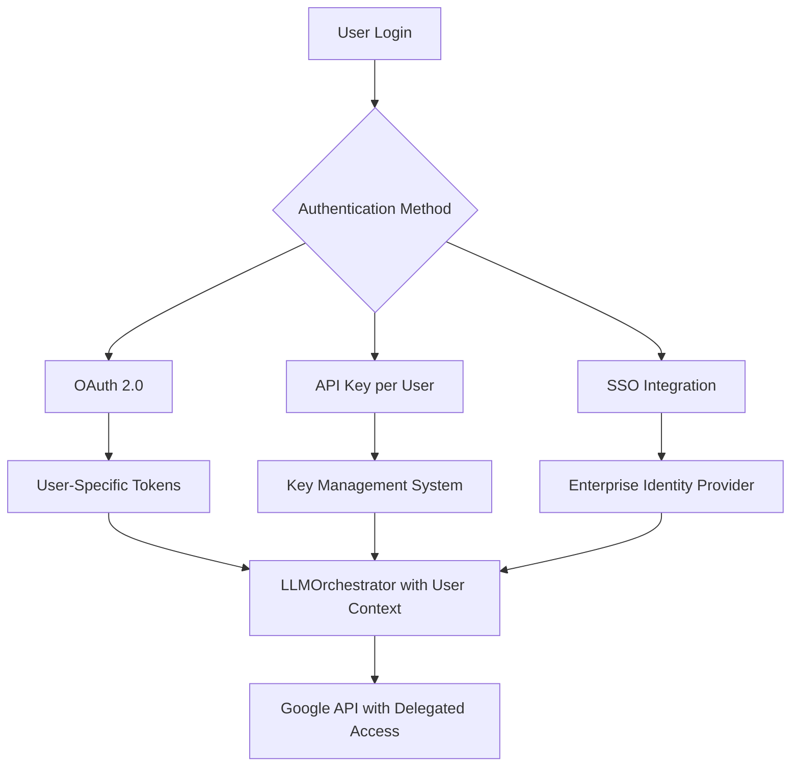

# Authentication Mechanisms

<cite>
**Referenced Files in This Document**   
- [authentication.py](file://src/core/authentication.py)
- [app.py](file://src/app.py)
- [mcpsettings.json](file://mcpsettings.json)
- [llm-analyzer-466009-81c353112c07.json](file://src/core/llm-analyzer-466009-81c353112c07.json)
</cite>

## Table of Contents
1. [Authentication Workflow Overview](#authentication-workflow-overview)
2. [Credential Loading and Environment Setup](#credential-loading-and-environment-setup)
3. [Token Validation and Credential Caching](#token-validation-and-credential-caching)
4. [Integration with mcpsettings.json](#integration-with-mcpsettingsjson)
5. [Runtime Security Checks](#runtime-security-checks)
6. [Secure Credential Access Patterns](#secure-credential-access-patterns)
7. [Error Handling for Expired or Invalid Keys](#error-handling-for-expired-or-invalid-keys)
8. [Potential Vulnerabilities and Mitigation Strategies](#potential-vulnerabilities-and-mitigation-strategies)
9. [Extending for Multi-User and Enterprise Scenarios](#extending-for-multi-user-and-enterprise-scenarios)

## Authentication Workflow Overview

The authentication system in the AIDA (AI-Driven Analyzer) project is responsible for securely loading and validating API credentials required to access Google's Generative AI services. The workflow begins at application startup in `app.py`, where the `get_credentials()` function from `authentication.py` is called before launching the GUI. This function ensures that valid credentials are available and properly configured in the environment.

The authentication process follows a two-step approach: first, it sets the necessary environment variable pointing to a service account key file; second, it performs a lightweight validation by attempting to instantiate a GenerativeModel object. If successful, the application proceeds; otherwise, it exits gracefully with an error message.

This mechanism ensures that all subsequent interactions with the LLMOrchestrator can proceed without re-authenticating, as the Google SDK automatically uses the configured credentials for all API calls.

**Section sources**
- [app.py](file://src/app.py#L1-L22)
- [authentication.py](file://src/core/authentication.py#L1-L26)

## Credential Loading and Environment Setup

Credentials are loaded through environment variable configuration rather than direct API key injection. The `get_credentials()` function in `authentication.py` sets the `GOOGLE_APPLICATION_CREDENTIALS` environment variable to point to a JSON key file containing service account credentials:

```python
os.environ['GOOGLE_APPLICATION_CREDENTIALS'] = "D:\\Drive\\Projekty\\LLM_analyzer\\src\\core\\llm-analyzer-466009-81c353112c07.json"
```

This approach leverages Google's Application Default Credentials (ADC) mechanism, which is a secure and standardized way to manage service account keys. By setting this environment variable, the `google.generativeai` library automatically detects and uses the specified credentials without requiring explicit API key passing in code.

The credential file path is currently hardcoded for local development purposes, which represents a configuration limitation. In production environments, this should be replaced with a more flexible configuration system using environment variables or configuration files.

It's important to note that the actual private key material is stored in the `llm-analyzer-466009-81c353112c07.json` file, which contains sensitive information including the private key in PEM format. This file must be protected from unauthorized access.

**Section sources**
- [authentication.py](file://src/core/authentication.py#L15-L18)
- [llm-analyzer-466009-81c353112c07.json](file://src/core/llm-analyzer-466009-81c353112c07.json#L1-L5)

## Token Validation and Credential Caching

The system implements a lightweight token validation mechanism by attempting to instantiate a `GenerativeModel` object with a known model name (`gemini-2.0-flash`). This serves as both a connectivity test and a credential validation check:

```python
try:
    model = genai.GenerativeModel('gemini-2.0-flash')
    return True
except Exception as e:
    print(f"An error occurred: {e}")
    return False
```

This validation approach has several advantages:
- It verifies that the credentials have the necessary permissions to access the Gemini API
- It confirms network connectivity to Google's services
- It tests the integrity of the credential file
- It provides immediate feedback on authentication issues

The system does not implement explicit credential caching beyond what the Google SDK provides internally. Once the environment variable is set and the initial validation passes, the SDK manages token refresh and caching automatically. This reduces complexity in the application code while leveraging Google's robust authentication infrastructure.

The validation occurs only once at application startup, which means that if credentials expire during runtime (unlikely with service accounts), the application would need to be restarted. Service account tokens typically have long lifetimes (up to 1 hour) and are automatically refreshed by the SDK when needed.

**Section sources**
- [authentication.py](file://src/core/authentication.py#L20-L26)

## Integration with mcpsettings.json

The `mcpsettings.json` file contains configuration for Model Context Protocol (MCP) servers but does not directly integrate with the authentication system for Google's Generative AI. However, it demonstrates a parallel security configuration pattern used in the application:

```json
{
  "mcpServers": {
    "filesystem": {
      "command": "npx",
      "args": [
        "-y",
        "@modelcontextprotocol/server-filesystem",
        "C:/Users/JW/Desktop",
        "D:/Drive/Dropbox/Python"
      ],
      "autoApprove": [
        "read_file",
        "read_multiple_files",
        "write_file",
        "edit_file",
        "create_directory",
        "list_directory",
        "directory_tree",
        "move_file",
        "search_files",
        "get_file_info",
        "list_allowed_directories"
      ]
    }
  }
}
```

This configuration shows that the application uses MCP servers for filesystem operations with predefined auto-approval rules for specific actions. While this is separate from the LLM authentication, it represents an additional layer of security configuration that works alongside the Google API authentication.

The presence of both authentication systems highlights the multi-layered security approach in the application: one for external AI services (Google Gemini) and another for internal tool integrations (MCP servers).

**Section sources**
- [mcpsettings.json](file://mcpsettings.json#L1-L27)

## Runtime Security Checks

The authentication system performs runtime security checks primarily through exception handling during the credential validation phase. The `get_credentials()` function wraps the model instantiation in a try-except block that catches any exceptions during the authentication process:

```python
try:
    model = genai.GenerativeModel('gemini-2.0-flash')
    return True
except Exception as e:
    print(f"An error occurred: {e}")
    return False
```

This basic error handling provides feedback about authentication failures but could be enhanced with more specific exception types and logging mechanisms. Currently, errors are printed to stdout, which may expose sensitive information in logs.

Additional runtime security considerations include:
- Ensuring the credential file is not readable by unauthorized users
- Preventing credential leakage through error messages
- Validating that the environment variable points to a legitimate file path
- Checking file permissions on the credential file

The application relies on the Google SDK to handle most security aspects, such as secure token storage and transmission, rather than implementing these mechanisms directly.

**Section sources**
- [authentication.py](file://src/core/authentication.py#L20-L26)

## Secure Credential Access Patterns

The codebase demonstrates several secure credential access patterns:

1. **Environment-based configuration**: Using `GOOGLE_APPLICATION_CREDENTIALS` instead of hardcoding API keys in source code
2. **Service account usage**: Leveraging service accounts rather than user credentials for application-level access
3. **Separation of credentials and code**: Storing credentials in a separate JSON file rather than embedding them in Python files
4. **Minimal privilege principle**: The service account should have only the permissions necessary to access Gemini API services

Example of secure credential access:
```python
def get_credentials():
    os.environ['GOOGLE_APPLICATION_CREDENTIALS'] = "path/to/credentials.json"
    try:
        model = genai.GenerativeModel('gemini-2.0-flash')
        return True
    except Exception as e:
        print(f"An error occurred: {e}")
        return False
```

Best practices followed:
- Credentials are loaded once at startup rather than repeatedly
- Error messages do not expose sensitive credential information
- The authentication check is performed before launching the main application

Potential improvements:
- Support for environment variable overrides to allow flexible deployment configurations
- Configuration file support instead of hardcoded paths
- Credential rotation mechanisms

**Section sources**
- [authentication.py](file://src/core/authentication.py#L1-L26)

## Error Handling for Expired or Invalid Keys

The current error handling for expired or invalid keys is minimal but functional. When authentication fails, the system catches the exception and returns `False`, causing the application to exit:

```python
except Exception as e:
    print(f"An error occurred: {e}")
    return False
```

This approach prevents the application from starting with invalid credentials, which is a safe default behavior. However, it lacks several features that would improve usability and security:

1. **Specific error classification**: The system does not distinguish between different types of authentication errors (e.g., network issues vs. invalid credentials vs. permission denied)
2. **Retry mechanisms**: There is no attempt to retry authentication or refresh credentials
3. **Graceful degradation**: The application simply exits rather than offering alternative modes or recovery options
4. **Secure logging**: Error messages are printed directly, which could potentially leak information in certain environments

For service accounts, key expiration is typically handled automatically by the Google SDK through token refresh mechanisms. The main failure modes are:
- Invalid or corrupted credential files
- Network connectivity issues
- Revoked service account permissions
- Incorrect file paths

The current implementation correctly identifies these failures but could provide more detailed guidance for users on how to resolve them.

**Section sources**
- [authentication.py](file://src/core/authentication.py#L23-L26)

## Potential Vulnerabilities and Mitigation Strategies

### Identified Vulnerabilities

1. **Hardcoded Credential Path**
   - **Risk**: The credential file path is hardcoded in `authentication.py`, making it difficult to deploy across different environments
   - **Mitigation**: Use environment variables or configuration files to specify the credential path

2. **Credential File Exposure**
   - **Risk**: The JSON key file contains sensitive private key material that could be compromised if the file is accessible
   - **Mitigation**: Ensure proper file permissions (600), store outside web root, and consider using secret management services

3. **Error Message Information Leakage**
   - **Risk**: Exception messages are printed directly, potentially exposing system details
   - **Mitigation**: Implement structured logging with sensitive information filtering

4. **Single Point of Failure**
   - **Risk**: Application fails completely if authentication fails, with no fallback mechanisms
   - **Mitigation**: Implement graceful degradation or alternative analysis modes

5. **No Credential Rotation**
   - **Risk**: Long-term use of the same service account key increases exposure risk
   - **Mitigation**: Implement periodic key rotation and automated credential updates

### Recommended Security Enhancements

1. **Configuration Flexibility**
```python
# Instead of hardcoded path
credential_path = os.getenv('GOOGLE_CREDENTIALS_PATH', 'default/path/to/credentials.json')
os.environ['GOOGLE_APPLICATION_CREDENTIALS'] = credential_path
```

2. **Enhanced Error Handling**
```python
except google.auth.exceptions.DefaultCredentialsError as e:
    logging.error("Authentication failed: Invalid or missing credentials")
    return False
except requests.exceptions.RequestException as e:
    logging.error("Authentication failed: Network connectivity issue")
    return False
```

3. **File Security Checks**
```python
import stat
# Check file permissions
file_stat = os.stat(credential_path)
if file_stat.st_mode & stat.S_IRGRP or file_stat.st_mode & stat.S_IROTH:
    logging.warning("Credential file is readable by group or others")
```

**Section sources**
- [authentication.py](file://src/core/authentication.py#L1-L26)
- [llm-analyzer-466009-81c353112c07.json](file://src/core/llm-analyzer-466009-81c353112c07.json#L1-L5)

## Extending for Multi-User and Enterprise Scenarios

To support multi-user and enterprise scenarios, the authentication system would require significant enhancements:

### Multi-User Authentication Architecture



**Diagram sources**
- [authentication.py](file://src/core/authentication.py#L1-L26)

### Key Extension Requirements

1. **User Session Management**
   - Implement user authentication and session tracking
   - Store user-specific credentials securely
   - Manage token lifetimes and refresh cycles

2. **Credential Isolation**
   - Ensure user credentials are isolated from each other
   - Implement proper access controls
   - Prevent credential leakage between users

3. **Scalable Credential Storage**
   - Replace file-based storage with database-backed credential management
   - Integrate with secret management services (e.g., Hashicorp Vault, AWS Secrets Manager)
   - Support credential rotation and auditing

4. **Enterprise Integration**
   - Support SSO (Single Sign-On) through SAML or OIDC
   - Integrate with enterprise identity providers
   - Implement role-based access control (RBAC)

5. **Usage Quotas and Monitoring**
   - Track API usage per user
   - Implement rate limiting
   - Provide usage reporting and alerts

### Implementation Example: API Key Management

```python
class UserCredentialManager:
    def __init__(self):
        self.credentials = {}  # In production, use secure storage
    
    def add_user_credentials(self, user_id, api_key):
        # Validate and store user credentials
        if self._validate_api_key(api_key):
            self.credentials[user_id] = {
                'api_key': api_key,
                'created_at': datetime.now(),
                'last_used': None
            }
            return True
        return False
    
    def get_user_context(self, user_id):
        if user_id in self.credentials:
            credentials = self.credentials[user_id]
            credentials['last_used'] = datetime.now()
            # Return configuration for LLMOrchestrator
            return {
                'api_key': credentials['api_key'],
                'user_id': user_id
            }
        raise ValueError("User credentials not found")
```

### Security Considerations for Enterprise Deployment

1. **Audit Logging**: Maintain comprehensive logs of authentication attempts and credential usage
2. **Compliance**: Ensure adherence to relevant regulations (GDPR, HIPAA, etc.)
3. **Data Residency**: Control where user data and credentials are stored
4. **Incident Response**: Implement procedures for credential compromise
5. **Third-Party Audits**: Regular security assessments of the authentication system

The current single-user, service-account-based approach would need to be refactored to support these enterprise requirements, potentially introducing a dedicated authentication service or integrating with existing enterprise identity systems.

**Section sources**
- [authentication.py](file://src/core/authentication.py#L1-L26)
- [app.py](file://src/app.py#L1-L22)