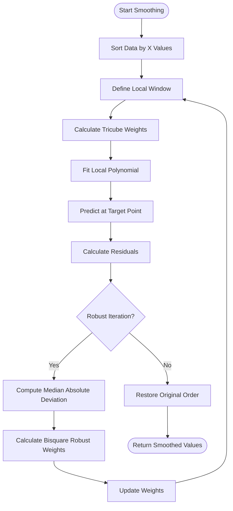
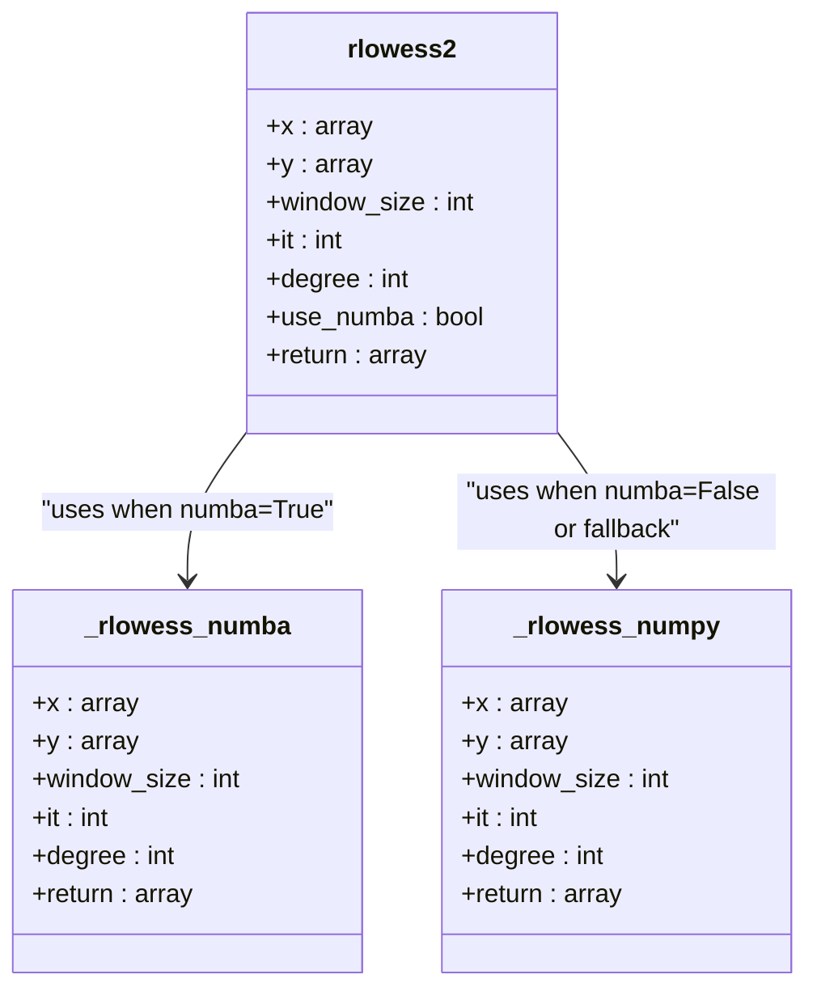
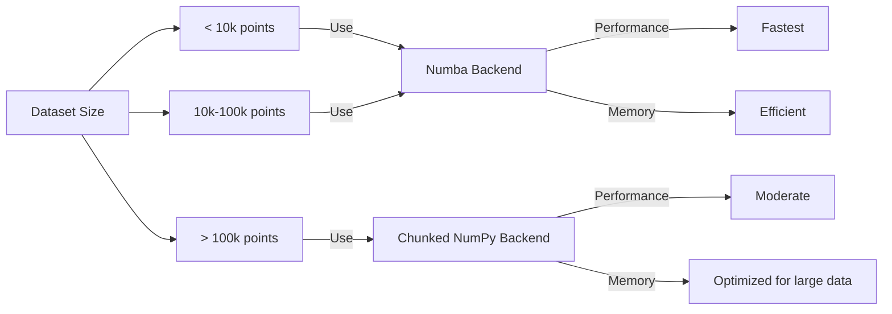

# Smoothing Parameter Customization

<cite>
**Referenced Files in This Document**   
- [src/lib/rlowess_smoother.py](file://src/lib/rlowess_smoother.py#L1-L260)
- [src/core/quantitative_parameterization_module.py](file://src/core/quantitative_parameterization_module.py#L33-L809)
- [src/tools/decomposition/decompose_matrix_nmf.py](file://src/tools/decomposition/decompose_matrix_nmf.py#L6-L154)
</cite>

## Table of Contents
1. [Introduction](#introduction)
2. [LOWESS Algorithm Overview](#lowess-algorithm-overview)
3. [Core Parameters](#core-parameters)
4. [Implementation Details](#implementation-details)
5. [Usage in Analysis Pipelines](#usage-in-analysis-pipelines)
6. [Practical Examples](#practical-examples)
7. [Best Practices](#best-practices)
8. [Performance Considerations](#performance-considerations)
9. [Troubleshooting](#troubleshooting)

## Introduction

The `rlowess2` function provides a robust implementation of the LOWESS (Locally Weighted Scatterplot Smoothing) algorithm, optimized for preprocessing noisy vibration signals in machine fault diagnosis. This document details the configurable parameters, implementation specifics, and practical usage patterns for effective signal smoothing.

**Section sources**
- [src/lib/rlowess_smoother.py](file://src/lib/rlowess_smoother.py#L1-L20)

## LOWESS Algorithm Overview

LOWESS (Locally Weighted Scatterplot Smoothing) is a non-parametric regression method that creates a smooth curve through noisy data by fitting multiple local regressions. The algorithm works by:

1. Selecting a window of neighboring points around each target point
2. Computing weights based on distance (tricube weighting)
3. Fitting a polynomial to the weighted points
4. Repeating with robust weights to reduce outlier influence

The robust version (RLOWESS) includes iterative reweighting based on residuals, making it resistant to outliers and impulsive noise commonly found in vibration signals.



**Diagram sources**
- [src/lib/rlowess_smoother.py](file://src/lib/rlowess_smoother.py#L45-L260)

## Core Parameters

### Smoothing Window Size
: The number of points used for each local fit. Larger windows produce smoother results but may obscure fine details.

- **Default**: 20 points
- **Minimum**: `degree + 1`
- **Maximum**: length of input data
- **Impact**: Controls the trade-off between noise reduction and feature preservation

### Polynomial Degree
: The degree of the local polynomial fit used in regression.

- **Default**: 1 (linear fit)
- **Options**: 1 (linear), 2 (quadratic), higher degrees
- **Impact**: Higher degrees can capture more complex local patterns but increase computational cost and risk overfitting

### Robustness Iterations
: The number of iterations for robust weight calculation to reduce outlier influence.

- **Default**: 3 iterations
- **Range**: 0 (no robustification) to higher values
- **Impact**: More iterations increase resistance to outliers but extend computation time

### Numba Optimization
: Flag to enable JIT compilation for performance acceleration.

- **Default**: True
- **Impact**: Significant speedup (typically 5-10x) when enabled; automatically falls back to NumPy implementation if Numba is unavailable

**Section sources**
- [src/lib/rlowess_smoother.py](file://src/lib/rlowess_smoother.py#L3-L45)

## Implementation Details

The `rlowess2` implementation features dual backends for optimal performance:

### Numba-Accelerated Backend
The primary implementation uses Numba's JIT compilation (`@jit` decorator) for maximum performance. Key features:
- Pre-computed power matrices for polynomial fitting
- Inlined tricube and bisquare weighting functions
- Manual QR decomposition for numerical stability
- Memory-efficient array operations

### NumPy Fallback Backend
Used when Numba is unavailable or compilation fails:
- Vectorized operations with `np.vander` for polynomial basis
- Chunked processing to manage memory usage
- `np.linalg.lstsq` for numerically stable least squares solution
- Automatic chunking for large datasets



**Diagram sources**
- [src/lib/rlowess_smoother.py](file://src/lib/rlowess_smoother.py#L45-L260)

## Usage in Analysis Pipelines

The `rlowess2` function is integrated into multiple analysis workflows:

### Quantitative Parameterization
In the `quantitative_parameterization_module`, RLOWESS smooths diagnostic selectors:
```python
joint_selector = rlowess2(frequencies, joint_selector, window_size=12, it=5, degree=2)
```

### NMF Component Analysis
In decomposition workflows, it smooths NMF prediction profiles:
```python
predictions_ma = rlowess2(np.arange(len(W[:, i])), W[:, i], window_size=9, it=5, degree=1)
```

### Signal Processing Workflow
Typical usage pattern:
1. Extract feature vector from raw signal
2. Apply RLOWESS smoothing to reduce noise
3. Normalize smoothed output
4. Use for thresholding or peak detection

**Section sources**
- [src/core/quantitative_parameterization_module.py](file://src/core/quantitative_parameterization_module.py#L679-L809)
- [src/tools/decomposition/decompose_matrix_nmf.py](file://src/tools/decomposition/decompose_matrix_nmf.py#L154)

## Practical Examples

### Vibration Signal Smoothing
```python
# Smooth a noisy vibration spectrum
smoothed_spectrum = rlowess2(
    frequencies, 
    raw_spectrum, 
    window_size=15, 
    it=3, 
    degree=1
)
```

### High-Noise Environment
```python
# Aggressive smoothing for very noisy data
smoothed_signal = rlowess2(
    time_points,
    noisy_signal,
    window_size=30,      # Wider window
    it=5,               # More robust iterations
    degree=2            # Quadratic fit
)
```

### Preserving Sharp Features
```python
# Conservative smoothing to preserve transients
smoothed_envelope = rlowess2(
    time_axis,
    envelope_signal,
    window_size=8,       # Narrow window
    it=2,               # Fewer iterations
    degree=1            # Linear fit
)
```

## Best Practices

### Parameter Selection Guidelines

**For High Sampling Rates (≥10kHz):**
- Window size: 15-25 points
- Degree: 1 (linear)
- Iterations: 3-4

**For Moderate Noise Levels:**
- Window size: 20-30 points
- Degree: 1-2
- Iterations: 3

**For High Noise or Outliers:**
- Window size: 25-40 points
- Degree: 2
- Iterations: 4-6

### Signal Characteristic-Based Tuning

**High-Frequency Components:**
Use smaller windows (10-15 points) to preserve rapid changes.

**Low-Frequency Trends:**
Use larger windows (25-35 points) for effective noise reduction.

**Mixed Frequency Content:**
Consider adaptive window sizing or multi-scale analysis.

### Performance vs. Quality Trade-offs
- Enable `use_numba=True` for production use
- For real-time applications, reduce `it` to 2-3
- For offline analysis, prioritize quality with higher `it` values

**Section sources**
- [src/lib/rlowess_smoother.py](file://src/lib/rlowess_smoother.py#L1-L260)

## Performance Considerations

### Computational Complexity
- **Time Complexity**: O(n × window_size² × it)
- **Space Complexity**: O(n × degree)
- Numba acceleration typically provides 5-10x speedup

### Large Dataset Handling
The NumPy implementation includes:
- Chunked processing (default chunk_size=10,000)
- Memory-efficient array operations
- Automatic fallback when Numba is unavailable

### Optimization Recommendations
1. Always use `use_numba=True` in production
2. Pre-allocate arrays when calling repeatedly
3. Consider downsampling for very large datasets
4. Use appropriate window sizes to balance quality and performance



**Diagram sources**
- [src/lib/rlowess_smoother.py](file://src/lib/rlowess_smoother.py#L173-L207)

## Troubleshooting

### Common Issues and Solutions

**Issue**: "Numba not available" warnings
- **Solution**: Ensure Numba is installed (`pip install numba`) or set `use_numba=False`

**Issue**: Over-smoothing of important features
- **Solution**: Reduce window_size and/or polynomial degree

**Issue**: Under-smoothing with residual noise
- **Solution**: Increase window_size and/or robustness iterations

**Issue**: Edge effects in smoothed output
- **Solution**: Ensure sufficient data points at boundaries or use reflection padding

### Error Handling
The implementation includes robust error handling:
- Automatic fallback to NumPy implementation
- Regularization to prevent singular matrix errors
- Boundary condition checks
- Input validation and type conversion

**Section sources**
- [src/lib/rlowess_smoother.py](file://src/lib/rlowess_smoother.py#L43-L81)