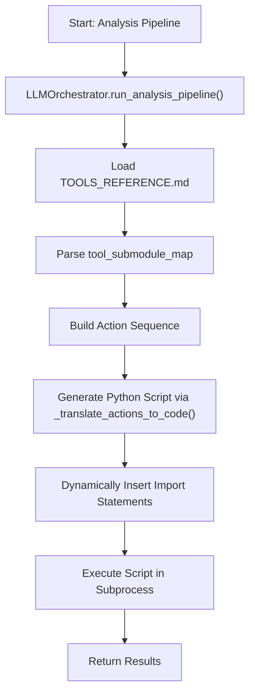

# Tool Path and Execution Settings

<cite>
**Referenced Files in This Document**   
- [mcpsettings.json](file://mcpsettings.json)
- [src/core/LLMOrchestrator.py](file://src/core/LLMOrchestrator.py)
- [src/docs/TOOLS_REFERENCE.md](file://src/docs/TOOLS_REFERENCE.md)
- [src/tools/utils/load_data.py](file://src/tools/utils/load_data.py)
- [src/tools/sigproc/bandpass_filter.py](file://src/tools/sigproc/bandpass_filter.py)
- [src/tools/transforms/create_fft_spectrum.py](file://src/tools/transforms/create_fft_spectrum.py)
- [src/tools/decomposition/decompose_matrix_nmf.py](file://src/tools/decomposition/decompose_matrix_nmf.py)
</cite>

## Table of Contents
1. [Introduction](#introduction)
2. [Tool Discovery and Module Import Mechanism](#tool-discovery-and-module-import-mechanism)
3. [Tool Execution Configuration](#tool-execution-configuration)
4. [Customizing Tool Discovery for External Modules](#customizing-tool-discovery-for-external-modules)
5. [Configuring Specialized Toolchains for Signal Processing](#configuring-specialized-toolchains-for-signal-processing)
6. [Troubleshooting Missing Tools and Import Failures](#troubleshooting-missing-tools-and-import-failures)
7. [Appendix A: mcpsettings.json Structure](#appendix-a-mcpsettingsjson-structure)

## Introduction
This document provides a comprehensive overview of the tool path and execution settings within the LLM Analyzer system. It details how modular tools are discovered, loaded, and executed, with a focus on configuration options in `mcpsettings.json`, dynamic import mechanisms, and execution parameters such as timeouts and concurrency. The system enables autonomous signal processing workflows by dynamically assembling and executing toolchains based on high-level analysis objectives. This guide is designed to help developers and analysts understand, customize, and troubleshoot the tool execution pipeline.

## Tool Discovery and Module Import Mechanism

The system dynamically discovers and imports modular tools from the `src/tools/` directory using a structured directory layout and a centralized orchestration mechanism. Tools are organized into subdirectories by functional category (e.g., `sigproc`, `transforms`, `decomposition`, `utils`), and each tool is implemented as a standalone Python module with a corresponding `.py` file.

The `LLMOrchestrator` class in `src/core/LLMOrchestrator.py` manages the tool discovery and import process. It uses a predefined mapping (`tool_submodule_map`) to associate each tool name with its respective submodule path:

```python
tool_submodule_map = {
    "bandpass_filter": "sigproc",
    "highpass_filter": "sigproc",
    "lowpass_filter": "sigproc",
    "create_csc_map": "transforms",
    "create_envelope_spectrum": "transforms",
    "create_fft_spectrum": "transforms",
    "create_signal_spectrogram": "transforms",
    "load_data": "utils",
    "select_component": "decomposition",
    "decompose_matrix_nmf": "decomposition"
}
```

During pipeline execution, the orchestrator analyzes the sequence of `Action` objects in `self.pipeline_steps` and dynamically generates import statements for each required tool. For example, if a pipeline includes `create_fft_spectrum`, the system generates:

```python
from src.tools.transforms.create_fft_spectrum import create_fft_spectrum
```

This dynamic import mechanism ensures that only the tools required for a specific analysis are loaded, minimizing memory overhead and startup time.

Additionally, the system references a `TOOLS_REFERENCE.md` file located at `src/docs/TOOLS_REFERENCE.md`, which serves as a human- and machine-readable catalog of all available tools, their signatures, and expected parameters. This file is loaded via the `_get_available_tools()` method and injected into the LLM's context to guide tool selection.



**Diagram sources**
- [src/core/LLMOrchestrator.py](file://src/core/LLMOrchestrator.py#L449-L724)

**Section sources**
- [src/core/LLMOrchestrator.py](file://src/core/LLMOrchestrator.py#L554-L570)
- [src/docs/TOOLS_REFERENCE.md](file://src/docs/TOOLS_REFERENCE.md#L1-L29)

## Tool Execution Configuration

The system executes tool pipelines as dynamically generated Python scripts within isolated subprocesses. This approach ensures stability, security, and reproducibility. Key execution settings include subprocess timeouts, working directory context, and result serialization.

### Subprocess Execution and Timeout Settings
Each pipeline is translated into a complete Python script and executed using `subprocess.run()`. The execution is configured with the following parameters:

- **Command**: Uses the Python interpreter from the virtual environment (`venv/Scripts/python.exe`)
- **Working Directory**: Set to the project root to ensure correct module resolution
- **Timeout**: Hardcoded to 1500 seconds (25 minutes) to prevent indefinite hanging
- **Output Capture**: Both stdout and stderr are captured for logging and debugging

```python
result0 = subprocess.run(
    command,
    capture_output=True,
    text=True,
    check=True,
    cwd=current_working_directory,
    timeout=1500
)
```

If the subprocess exceeds the timeout, a `subprocess.TimeoutExpired` exception is raised and logged, allowing the orchestrator to handle the failure gracefully.

### Result Handling and Serialization
Execution results are serialized using Python's `pickle` module and written to a temporary file (`current_result_{run_id}.pkl`) in the run-specific state directory (`./run_state/{run_id}`). The result is expected to be a dictionary that may include:
- `data`: The primary output (e.g., processed signal, spectral data)
- `image_path`: Path to a generated visualization (if applicable)

The orchestrator deserializes the result and forwards it to the GUI or subsequent pipeline stages.

### Logging and Monitoring
The system uses a `log_queue` to communicate execution status, logs, and image paths to the GUI. Messages include:
- Script generation
- Execution start and completion
- Warnings and errors
- Image display requests

This real-time feedback enables interactive monitoring of long-running analyses.

**Section sources**
- [src/core/LLMOrchestrator.py](file://src/core/LLMOrchestrator.py#L449-L482)
- [src/core/LLMOrchestrator.py](file://src/core/LLMOrchestrator.py#L690-L724)

## Customizing Tool Discovery for External Modules

While the default tool discovery mechanism is based on the `src/tools/` directory structure, the system can be extended to support external or user-defined modules. This is achieved through the dynamic import mechanism and Python's module path manipulation.

To register an external tool:
1. Place the tool module in a directory accessible to the Python interpreter.
2. Ensure the module exposes a function with a signature compatible with the expected tool interface (accepts `data`, `output_image_path`, and optional parameters; returns a `dict`).
3. Modify the `tool_submodule_map` in `LLMOrchestrator.py` to include the new tool and its import path.
4. Update `TOOLS_REFERENCE.md` to document the new tool's API.

Alternatively, external directories can be added to `sys.path` at runtime, allowing the system to discover tools outside the main project tree. However, this requires careful handling of security and dependency management.

For example, to add a custom tool `custom_filter.py` located in `D:/custom_tools/sigproc/`, one could:
- Add `D:/custom_tools` to `sys.path`
- Create a mapping entry: `"custom_filter": "sigproc"`
- Ensure the function `custom_filter(data, output_image_path, **kwargs)` is defined

The system's modular design makes such extensions feasible without modifying core execution logic.

**Section sources**
- [src/core/LLMOrchestrator.py](file://src/core/LLMOrchestrator.py#L554-L570)
- [src/docs/TOOLS_REFERENCE.md](file://src/docs/TOOLS_REFERENCE.md#L1-L29)

## Configuring Specialized Toolchains for Signal Processing

The system supports the creation of specialized toolchains for different signal processing workflows by combining tools from various categories. The LLM orchestrator selects and sequences tools based on the analysis objective and data characteristics.

### Example: Vibration Analysis Toolchain
For machinery vibration analysis, a typical workflow might include:
1. **Bandpass Filtering**: Isolate frequency bands of interest
2. **Envelope Spectrum Creation**: Detect bearing faults
3. **FFT Spectrum Analysis**: Identify dominant frequencies

```python
pipeline_steps = [
    {
        "tool_name": "bandpass_filter",
        "params": {"lowcut_freq": 1500, "highcut_freq": 3500, "order": 10},
        "output_variable": "filtered_vibration"
    },
    {
        "tool_name": "create_envelope_spectrum",
        "params": {"input_signal": "filtered_vibration", "image_path": "./outputs/env_spectrum.png"},
        "output_variable": "envelope_result"
    },
    {
        "tool_name": "create_fft_spectrum",
        "params": {"input_signal": "envelope_result", "image_path": "./outputs/fft_spectrum.png"},
        "output_variable": "fft_result"
    }
]
```

### Example: Signal Decomposition Workflow
For complex signal separation:
1. **NMF Decomposition**: Break signal into components
2. **Component Selection**: Choose relevant component
3. **Spectrogram Visualization**: Analyze time-frequency content

```python
pipeline_steps = [
    {
        "tool_name": "decompose_matrix_nmf",
        "params": {"n_components": 4, "max_iter": 200},
        "output_variable": "nmf_output"
    },
    {
        "tool_name": "select_component",
        "params": {"component_index": 1},
        "output_variable": "selected_comp"
    },
    {
        "tool_name": "create_signal_spectrogram",
        "params": {"window": 512, "noverlap": 480},
        "output_variable": "spectrogram"
    }
]
```

The orchestrator dynamically assembles these toolchains by translating high-level LLM decisions into executable code, enabling adaptive and context-aware analysis.

**Section sources**
- [src/core/LLMOrchestrator.py](file://src/core/LLMOrchestrator.py#L449-L724)
- [src/tools/sigproc/bandpass_filter.py](file://src/tools/sigproc/bandpass_filter.py)
- [src/tools/transforms/create_fft_spectrum.py](file://src/tools/transforms/create_fft_spectrum.py)
- [src/tools/decomposition/decompose_matrix_nmf.py](file://src/tools/decomposition/decompose_matrix_nmf.py)

## Troubleshooting Missing Tools and Import Failures

Common issues related to tool discovery and execution include missing files, import errors, and permission problems. This section provides a systematic troubleshooting guide.

### Missing Tools
**Symptom**: "Tools reference file not found" or "Module not found" error.
**Causes**:
- Incorrect file path in `tools_reference_path`
- Tool not present in `src/tools/` or subdirectories
- Typo in tool name in `tool_submodule_map`

**Solutions**:
1. Verify the existence of `src/docs/TOOLS_REFERENCE.md`
2. Check that the tool module (e.g., `create_fft_spectrum.py`) exists in the correct subdirectory
3. Ensure the tool name in the action matches the filename and function name
4. Confirm the `tool_submodule_map` contains a valid entry

### Import Failures
**Symptom**: `ImportError` during script execution.
**Causes**:
- Virtual environment not activated
- Missing dependencies in `requirements.txt`
- Incorrect `sys.path` manipulation

**Solutions**:
1. Ensure the Python interpreter points to the virtual environment
2. Install all dependencies via `pip install -r requirements.txt`
3. Verify the `sys.path.append()` call in the generated script correctly references the project root

### Permission Issues
**Symptom**: "Permission denied" when writing temporary files or logs.
**Causes**:
- Insufficient write permissions in `run_state/` or `./outputs/`
- Antivirus software blocking file creation

**Solutions**:
1. Run the application with appropriate permissions
2. Change the state directory to a user-writable location
3. Exclude the project directory from real-time antivirus scanning

### Debugging Tips
- Enable verbose logging to trace import and execution steps
- Manually execute the generated temporary script to isolate issues
- Use `print(sys.path)` in the script to verify module resolution

**Section sources**
- [src/core/LLMOrchestrator.py](file://src/core/LLMOrchestrator.py#L554-L570)
- [src/core/LLMOrchestrator.py](file://src/core/LLMOrchestrator.py#L449-L482)

## Appendix A: mcpsettings.json Structure

The `mcpsettings.json` file configures external service integrations, such as the Model Context Protocol (MCP) server for filesystem operations. While not directly involved in internal tool execution, it demonstrates the system's extensibility.

```json
{
  "mcpServers": {
    "filesystem": {
      "command": "npx",
      "args": [
        "-y",
        "@modelcontextprotocol/server-filesystem",
        "C:/Users/JW/Desktop",
        "D:/Drive/Dropbox/Python"
      ],
      "autoApprove": [
        "read_file",
        "read_multiple_files",
        "write_file",
        "edit_file",
        "create_directory",
        "list_directory",
        "directory_tree",
        "move_file",
        "search_files",
        "get_file_info",
        "list_allowed_directories"
      ]
    }
  }
}
```

**Key Fields**:
- **command**: The executable to launch (e.g., `npx`)
- **args**: Arguments passed to the command, including allowed directories
- **autoApprove**: List of filesystem operations that are automatically permitted

This configuration enables secure, sandboxed access to specified directories for data loading and saving, complementing the internal tool execution pipeline.

**Section sources**
- [mcpsettings.json](file://mcpsettings.json#L1-L27)