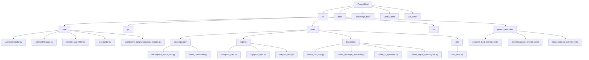
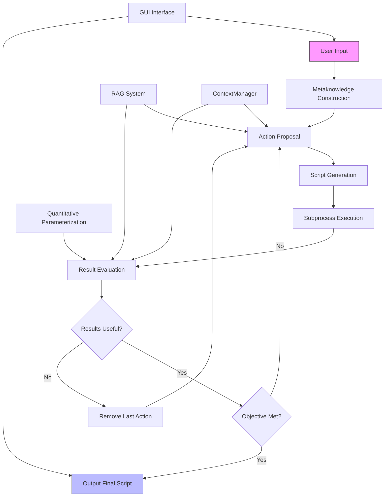
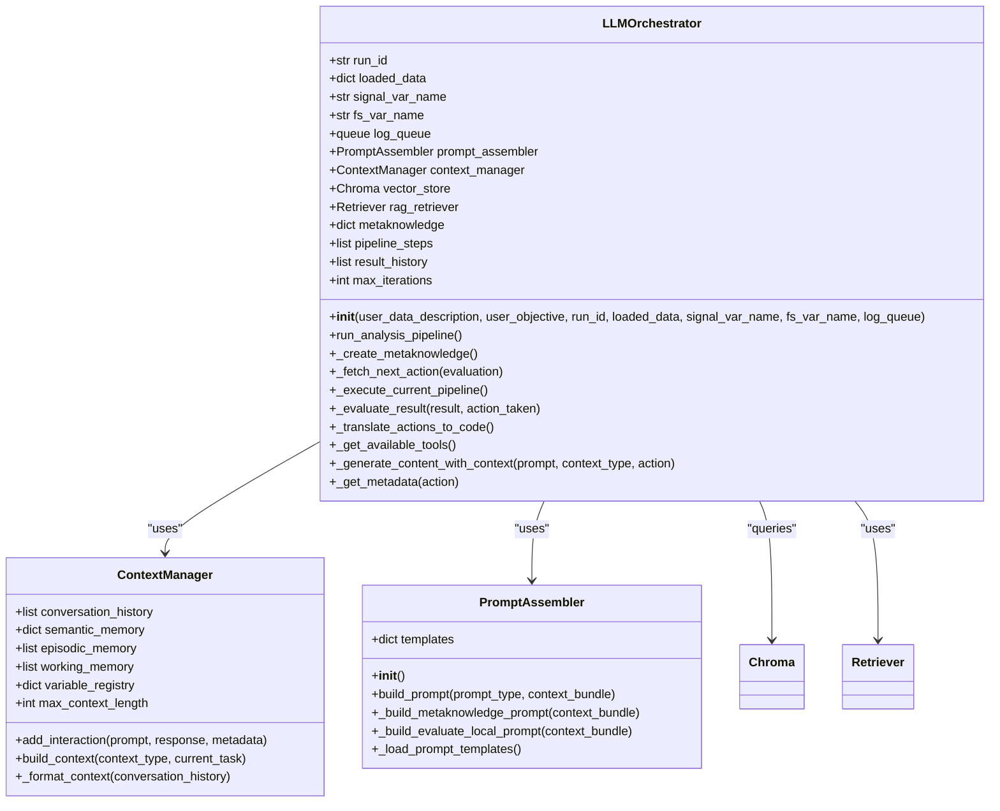
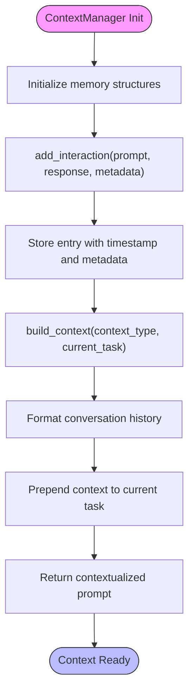
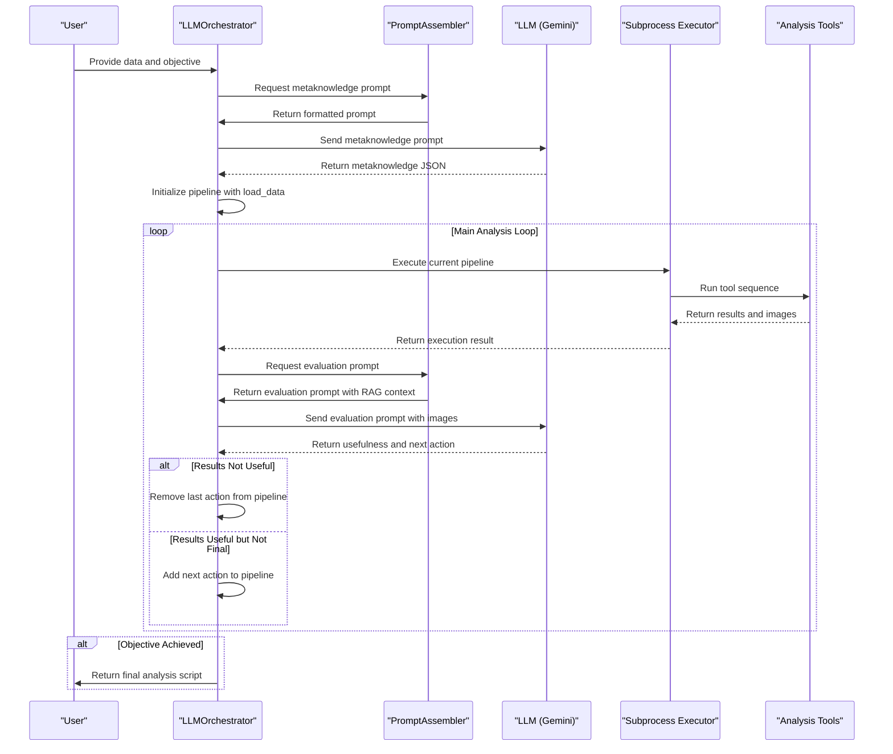
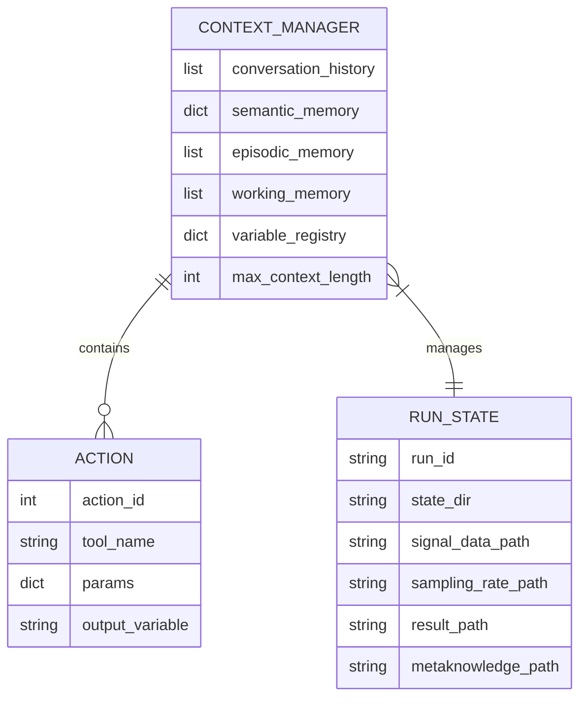
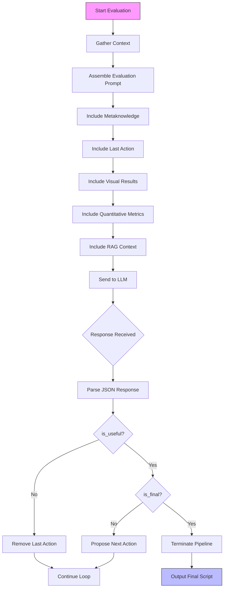

# Analysis Pipeline Orchestration

<cite>
**Referenced Files in This Document**   
- [LLMOrchestrator.py](file://src/core/LLMOrchestrator.py#L1-L725) - *Updated in recent commit*
- [ContextManager.py](file://src/core/ContextManager.py#L1-L44) - *Added in recent commit*
- [PERSISTENT_CONTEXT_IMPLEMENTATION.md](file://PERSISTENT_CONTEXT_IMPLEMENTATION.md#L1-L618) - *New implementation guide*
- [prompt_assembler.py](file://src/core/prompt_assembler.py#L1-L178)
- [quantitative_parameterization_module.py](file://src/core/quantitative_parameterization_module.py)
- [rag_builder.py](file://src/core/rag_builder.py)
- [create_signal_spectrogram.py](file://src/tools/transforms/create_signal_spectrogram.py)
- [bandpass_filter.py](file://src/tools/sigproc/bandpass_filter.py)
- [decompose_matrix_nmf.py](file://src/tools/decomposition/decompose_matrix_nmf.py)
- [load_data.py](file://src/tools/utils/load_data.py)
- [evaluate_local_prompt_v2.txt](file://src/prompt_templates/evaluate_local_prompt_v2.txt)
- [metaknowledge_prompt_v2.txt](file://src/prompt_templates/metaknowledge_prompt_v2.txt)
- [meta_template_prompt_v2.txt](file://src/prompt_templates/meta_template_prompt_v2.txt)
- [concept.md](file://concept.md#L1-L419)
- [README.md](file://README.md#L1-L244)
</cite>

## Update Summary
**Changes Made**   
- Updated documentation to reflect implementation of persistent context management
- Added detailed analysis of ContextManager class and its integration with LLMOrchestrator
- Enhanced explanation of context-aware LLM interactions and decision making
- Updated architecture overview to show contextual data flow
- Added new section on persistent context implementation details
- Updated decision loop section to include context-based evaluation
- Modified state persistence section to distinguish between short-term and long-term context storage

## Table of Contents
1. [Introduction](#introduction)
2. [Project Structure](#project-structure)
3. [Core Components](#core-components)
4. [Architecture Overview](#architecture-overview)
5. [Detailed Component Analysis](#detailed-component-analysis)
6. [Execution Model and Pipeline Flow](#execution-model-and-pipeline-flow)
7. [State Persistence and Context Management](#state-persistence-and-context-management)
8. [Decision Loop and Evaluation Criteria](#decision-loop-and-evaluation-criteria)
9. [Pipeline Evolution Example](#pipeline-evolution-example)
10. [Common Issues and Debugging](#common-issues-and-debugging)
11. [Conclusion](#conclusion)

## Introduction

The Analysis Pipeline Orchestration system, known as AIDA (AI-Driven Analyzer), is an autonomous data analysis framework that leverages Large Language Models (LLMs) to design, execute, and refine data processing pipelines without manual intervention. The system transforms user-defined objectives into structured analysis workflows by iteratively planning, executing, and evaluating processing steps. This document provides a comprehensive analysis of the orchestration mechanism, covering the LLMOrchestrator's design, execution model, state management, decision logic, and error handling strategies. The system is built for signal processing applications, particularly fault detection in vibration data, and combines multimodal LLM reasoning with Retrieval-Augmented Generation (RAG) to access domain-specific knowledge.

**Section sources**
- [README.md](file://README.md#L1-L244)
- [concept.md](file://concept.md#L1-L419)

## Project Structure

The project follows a modular architecture with clearly defined components organized by functionality. The structure emphasizes separation of concerns, with distinct directories for core logic, tools, user interface, and documentation.

**Diagram sources**
- [README.md](file://README.md#L1-L244)
- [concept.md](file://concept.md#L1-L419)

**Section sources**
- [README.md](file://README.md#L1-L244)

## Core Components

The system's functionality is driven by several interconnected core components that enable autonomous analysis. The LLMOrchestrator serves as the central decision-making engine, coordinating all aspects of the pipeline. It interfaces with the ContextManager to maintain conversation history and learned patterns across interactions. The prompt_assembler dynamically constructs context-rich prompts by integrating user objectives, retrieved knowledge, and execution history. The RAG system, built with ChromaDB and LangChain, provides domain-specific expertise to guide tool selection. Analysis tools are organized in a modular fashion within the tools directory, with each tool having a corresponding documentation file for RAG retrieval. The quantitative_parameterization_module extracts numerical metrics from results to support objective evaluation. Together, these components form a robust framework for autonomous data analysis that can adapt to intermediate results and user goals.

**Section sources**
- [LLMOrchestrator.py](file://src/core/LLMOrchestrator.py#L1-L725)
- [ContextManager.py](file://src/core/ContextManager.py#L1-L44)
- [prompt_assembler.py](file://src/core/prompt_assembler.py#L1-L178)
- [concept.md](file://concept.md#L1-L419)

## Architecture Overview

The AIDA system implements a sophisticated architecture that combines LLM reasoning with traditional data processing to create an autonomous analysis pipeline. At its core, the LLMOrchestrator acts as the central intelligence, making decisions about tool selection, parameter tuning, and pipeline progression. The system begins by constructing structured metaknowledge from user inputs, which serves as the foundation for all subsequent decisions. This metaknowledge includes data characteristics, system context, and analysis objectives in a machine-readable JSON format.

**Diagram sources**
- [concept.md](file://concept.md#L1-L419)
- [README.md](file://README.md#L1-L244)

**Section sources**
- [concept.md](file://concept.md#L1-L419)
- [LLMOrchestrator.py](file://src/core/LLMOrchestrator.py#L1-L725)

## Detailed Component Analysis

### LLMOrchestrator Analysis

The LLMOrchestrator class is the primary controller of the analysis pipeline, responsible for coordinating all aspects of autonomous analysis. It manages the complete lifecycle from initialization to final script generation. The key enhancement in the recent implementation is the integration of persistent context management through the ContextManager class, which enables contextual decision making and learning from previous steps.

**Diagram sources**
- [LLMOrchestrator.py](file://src/core/LLMOrchestrator.py#L1-L725)
- [ContextManager.py](file://src/core/ContextManager.py#L1-L44)
- [prompt_assembler.py](file://src/core/prompt_assembler.py#L1-L178)

**Section sources**
- [LLMOrchestrator.py](file://src/core/LLMOrchestrator.py#L1-L725)

### ContextManager Analysis

The ContextManager provides persistent memory capabilities to the otherwise stateless LLM interactions. It maintains conversation history, learned patterns, and variable states across pipeline iterations. The implementation follows the design outlined in PERSISTENT_CONTEXT_IMPLEMENTATION.md, providing a foundation for contextual decision making and learning from previous interactions.

**Diagram sources**
- [ContextManager.py](file://src/core/ContextManager.py#L1-L44)
- [PERSISTENT_CONTEXT_IMPLEMENTATION.md](file://PERSISTENT_CONTEXT_IMPLEMENTATION.md#L1-L618)

**Section sources**
- [ContextManager.py](file://src/core/ContextManager.py#L1-L44)

## Execution Model and Pipeline Flow

The execution model follows a structured workflow that begins with initialization and proceeds through an iterative main loop until the analysis objective is met. The process starts with the LLMOrchestrator creating structured metaknowledge from user inputs, which captures data characteristics, system context, and analysis objectives in a standardized JSON format. This metaknowledge serves as the foundation for all subsequent decisions.

The main execution loop consists of four key phases: execute, evaluate, decide usefulness, and decide finality. In the execute phase, the current pipeline is translated from a list of Action objects into executable Python code and run in a subprocess. The _translate_actions_to_code method performs deterministic translation, ensuring syntactically correct scripts by importing required tools and managing data flow between steps.

During evaluation, both visual and quantitative feedback are collected. Visual results (plots, spectrograms) are provided to the multimodal LLM for qualitative assessment, while the quantitative_parameterization_module extracts numerical metrics from the output data. The _evaluate_result method assembles a comprehensive context bundle including metaknowledge, the last action taken, the result, and relevant RAG-retrieved documentation to inform the LLM's assessment.

The decision phase determines whether the results are useful and whether the objective has been met. If results are not useful, the last action is removed from the pipeline_steps list, enabling safe self-correction without fragile text manipulation. If results are useful but the objective is not yet met, the loop continues to propose the next action. The process terminates when the LLM determines that sufficient evidence has been gathered to satisfy the original objective.

**Diagram sources**
- [LLMOrchestrator.py](file://src/core/LLMOrchestrator.py#L1-L725)
- [concept.md](file://concept.md#L1-L419)

**Section sources**
- [LLMOrchestrator.py](file://src/core/LLMOrchestrator.py#L1-L725)

## State Persistence and Context Management

The system implements sophisticated state persistence mechanisms to maintain continuity across pipeline iterations and enable learning from past experiences. The ContextManager class serves as the central repository for conversation history, storing each interaction with metadata including timestamps, step numbers, and execution outcomes.

State persistence occurs at multiple levels. At the pipeline level, the entire analysis sequence is maintained as a list of Action objects in memory, with each action containing its tool name, parameters, and output variable. This stack-like structure enables safe self-correction by simply removing the last action when a step proves unproductive. For long-term persistence, the system saves intermediate results using pickle serialization to .pkl files in a run-specific state directory. The _execute_current_pipeline method saves the final result to a timestamped pickle file, while the _translate_actions_to_code method ensures data continuity by serializing input data to temporary pickle files that are loaded at script startup.

The ContextManager implements a multi-layered memory system with episodic memory (time-ordered events), semantic memory (learned patterns), and working memory (current session state). This architecture supports the system's ability to learn from successful and failed attempts, recognize patterns in analysis strategies, and make contextually informed decisions. The build_context method constructs contextual prompts by formatting the conversation history, providing the LLM with relevant background information for each decision point.

The system also maintains a variable registry to track the state of data variables throughout the pipeline, ensuring consistency in naming and availability. This registry helps prevent errors that might arise from inconsistent variable references across iterations. The combination of in-memory state management and disk-based persistence creates a robust foundation for iterative refinement and adaptive behavior.

**Diagram sources**
- [ContextManager.py](file://src/core/ContextManager.py#L1-L44)
- [LLMOrchestrator.py](file://src/core/LLMOrchestrator.py#L1-L725)
- [PERSISTENT_CONTEXT_IMPLEMENTATION.md](file://PERSISTENT_CONTEXT_IMPLEMENTATION.md#L1-L618)

**Section sources**
- [ContextManager.py](file://src/core/ContextManager.py#L1-L44)
- [LLMOrchestrator.py](file://src/core/LLMOrchestrator.py#L1-L725)

## Decision Loop and Evaluation Criteria

The decision loop is the core intelligence mechanism that enables the system to autonomously refine its analysis strategy based on intermediate results. This loop operates on two levels: local evaluation of individual steps and global assessment of overall progress toward the objective.

Local evaluation determines whether a specific analysis step was useful. The _evaluate_result method constructs a comprehensive assessment prompt that includes the metaknowledge, details of the last action, visual results (images), quantitative metrics, and relevant RAG-retrieved documentation. The LLM evaluates whether the step achieved its intended purpose and whether its parameters could be refined. This evaluation follows a structured JSON response format with fields for is_useful, is_final, tool_name, input_variable, params, and justification.

Global evaluation determines whether the accumulated results satisfy the original analysis objective. This assessment considers the entire pipeline history and final evidence against the initial goal specified in the metaknowledge. The system uses a hybrid approach where explicit, structured prompts frame the evaluation question, while implicit context from the RAG system provides domain-specific examples of what constitutes conclusive evidence.

The decision logic incorporates several guardrails to prevent unproductive loops. A maximum iteration limit (20 steps) ensures termination. For any single action, parameter refinement is attempted a limited number of times before the action is discarded. A temporary exclusion list prevents the system from repeatedly selecting tools that have already failed in the current context. These constraints create a balanced approach that allows exploration while preventing infinite loops or redundant attempts.

The quantitative_parameterization_module plays a crucial role in objective evaluation by extracting numerical metrics from results. This module uses a dispatcher pattern with specialized handlers for different data types, ensuring context-appropriate metrics are calculated. For example, spectrogram results might yield sparsity measures, while filtered signals could produce kurtosis values. These quantitative metrics complement visual assessment, providing hard data to support the LLM's evaluation.

**Diagram sources**
- [LLMOrchestrator.py](file://src/core/LLMOrchestrator.py#L1-L725)
- [prompt_assembler.py](file://src/core/prompt_assembler.py#L1-L178)
- [concept.md](file://concept.md#L1-L419)

**Section sources**
- [LLMOrchestrator.py](file://src/core/LLMOrchestrator.py#L1-L725)
- [prompt_assembler.py](file://src/core/prompt_assembler.py#L1-L178)

## Pipeline Evolution Example

This section illustrates the pipeline evolution process through a practical example of fault detection in vibration signals. Consider a scenario where the user objective is to "Detect bearing faults in vibration signals" with a description of "vibration data from industrial bearing under stationary operating conditions."

The pipeline evolution begins with metaknowledge construction, where the LLM analyzes the input to create a structured JSON object identifying the data as a single-channel time-series with a specific sampling frequency. The initial action is always data loading, which generates a time-domain plot of the raw signal.

In the first evaluation, the LLM determines that frequency domain analysis would be more informative for fault detection. Based on RAG-retrieved knowledge about bearing fault diagnosis, it proposes creating a spectrogram to visualize time-frequency characteristics. The pipeline now consists of two actions: load_data followed by create_signal_spectrogram.

After executing this pipeline, the spectrogram reveals potential fault-related frequency bands. The evaluation determines this step is useful but not final. The LLM then proposes applying a bandpass filter to isolate the frequency range showing anomalous activity. Parameters for the filter (lowcut_freq, highcut_freq) are suggested based on the spectrogram analysis.

Suppose the filtered signal does not show clear fault signatures. The evaluation may determine the results are not useful, prompting removal of the bandpass_filter action. The LLM might then propose an alternative approach, such as creating an envelope spectrum, which is particularly effective for detecting amplitude modulation caused by bearing faults.

If the envelope spectrum reveals peaks at characteristic fault frequencies, the evaluation may determine the results are both useful and final. The pipeline has successfully evolved from raw data to a diagnostic conclusion through iterative refinement. The final output is a complete Python script containing the successful sequence: load_data → create_signal_spectrogram → create_envelope_spectrum.

This example demonstrates the system's ability to explore different analytical approaches, learn from unsuccessful attempts, and converge on an effective solution path. The use of structured Action objects enables safe experimentation, as failed steps can be removed without compromising the integrity of the pipeline.

**Section sources**
- [LLMOrchestrator.py](file://src/core/LLMOrchestrator.py#L1-L725)
- [concept.md](file://concept.md#L1-L419)
- [README.md](file://README.md#L1-L244)

## Common Issues and Debugging

Despite its sophisticated design, the system may encounter several common issues that require debugging and mitigation strategies. Understanding these issues and their solutions is crucial for reliable operation.

**Infinite Loops**: The system could potentially enter an infinite loop if the termination conditions are never met. This is mitigated by the max_iterations parameter (set to 20), which provides a hard limit on the number of pipeline steps. Additionally, the exclusion list prevents repeated selection of failed tools, reducing the likelihood of cycling through unproductive approaches.

**Tool Execution Failures**: Individual tools may fail due to invalid parameters or data type mismatches. The system handles this through robust error handling in the _execute_current_pipeline method, which catches subprocess exceptions and propagates them to the orchestrator. Failed executions are logged, and the pipeline can remove the problematic action and try an alternative approach.

**Suboptimal Pipeline Decisions**: The LLM might propose tools or parameters that are theoretically sound but practically ineffective for the specific data. This is addressed through the evaluation feedback loop, where poor results lead to action removal and alternative strategies. The RAG system helps by providing domain-specific guidance on tool selection, while quantitative metrics offer objective assessment criteria.

**Context Management Issues**: As the conversation history grows, context management becomes critical. The ContextManager's design includes mechanisms to prevent context explosion, such as the max_context_length parameter. Future enhancements could include context compression algorithms that summarize older interactions while preserving key information.

**Data Serialization Problems**: The pickle-based state persistence relies on proper serialization of complex data structures. Issues can arise with certain object types or version incompatibilities. Mitigation strategies include using standardized data formats (numpy arrays, dictionaries) and maintaining compatibility across Python versions.

**RAG Retrieval Failures**: The system might retrieve irrelevant or incomplete context from the knowledge base. This is mitigated by using targeted queries that combine user objectives with specific tool names, and by retrieving multiple documents (k=10) to increase the likelihood of relevant results.

Debugging strategies include comprehensive logging through the log_queue, which captures all system messages, LLM interactions, and execution results. The run_state directory provides persistent storage of intermediate results, metaknowledge, and final scripts, enabling post-hoc analysis of the pipeline evolution. The modular design allows individual components to be tested in isolation, facilitating systematic troubleshooting.

**Section sources**
- [LLMOrchestrator.py](file://src/core/LLMOrchestrator.py#L1-L725)
- [PERSISTENT_CONTEXT_IMPLEMENTATION.md](file://PERSISTENT_CONTEXT_IMPLEMENTATION.md#L1-L618)
- [concept.md](file://concept.md#L1-L419)

## Conclusion

The Analysis Pipeline Orchestration system represents a sophisticated approach to autonomous data analysis, leveraging LLM intelligence to design, execute, and refine processing workflows without manual intervention. The LLMOrchestrator serves as the central intelligence, coordinating a complex interplay of metaknowledge extraction, tool selection, script generation, and result evaluation. The system's strength lies in its iterative refinement capability, where each analysis step informs the next through a structured decision loop that combines visual and quantitative assessment.

Key architectural innovations include the use of structured Action objects instead of raw code manipulation, enabling safe self-correction and state management. The ContextManager provides persistent memory across interactions, allowing the system to learn from past experiences and maintain variable consistency. The integration of RAG technology enhances the LLM's domain expertise, guiding tool selection with specialized knowledge. State persistence through pickle serialization ensures continuity across pipeline iterations while enabling result inspection and debugging.

The system demonstrates how AI can transform data analysis from a manual, expertise-intensive process into an autonomous workflow that adapts to intermediate results. While challenges remain around infinite loops, execution failures, and suboptimal decisions, the implemented guardrails and debugging infrastructure provide robust mitigation strategies. Future enhancements could include advanced context compression, collaborative learning across analysis sessions, and free-form code generation capabilities built upon the existing foundation.

This documentation provides a comprehensive understanding of the system's architecture and operation, serving as a valuable resource for users and developers alike. The combination of detailed component analysis, visual representations, and practical examples illustrates both the theoretical framework and practical implementation of autonomous analysis pipeline orchestration.

**Section sources**
- [LLMOrchestrator.py](file://src/core/LLMOrchestrator.py#L1-L725)
- [ContextManager.py](file://src/core/ContextManager.py#L1-L44)
- [concept.md](file://concept.md#L1-L419)
- [PERSISTENT_CONTEXT_IMPLEMENTATION.md](file://PERSISTENT_CONTEXT_IMPLEMENTATION.md#L1-L618)
- [README.md](file://README.md#L1-L244)