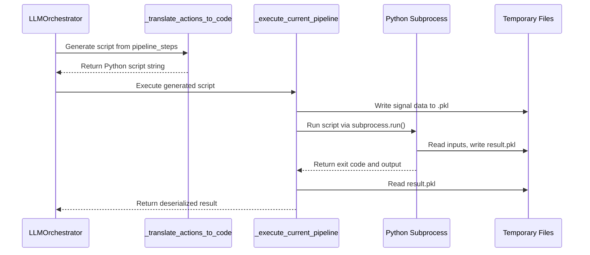
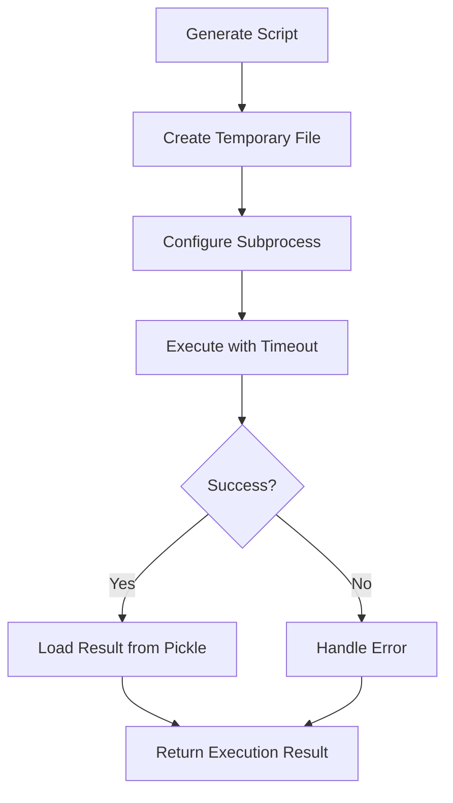
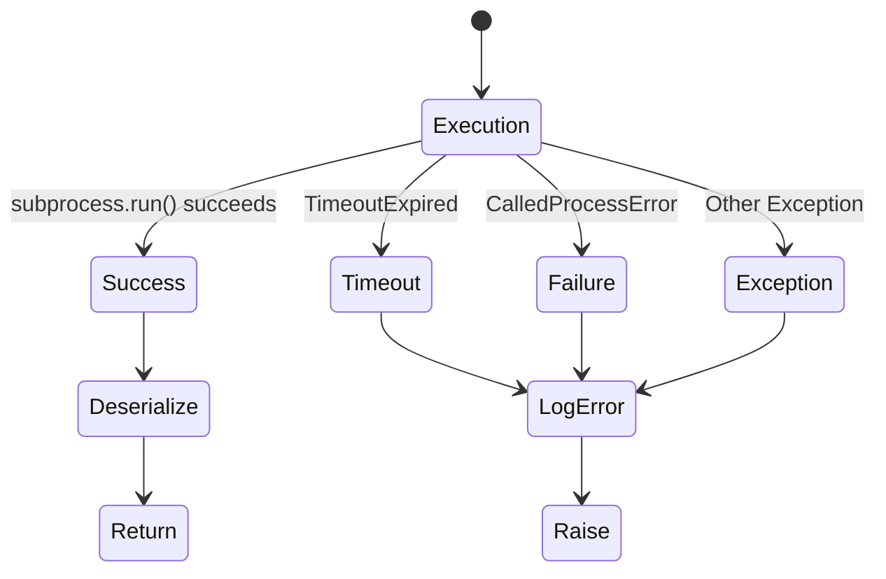
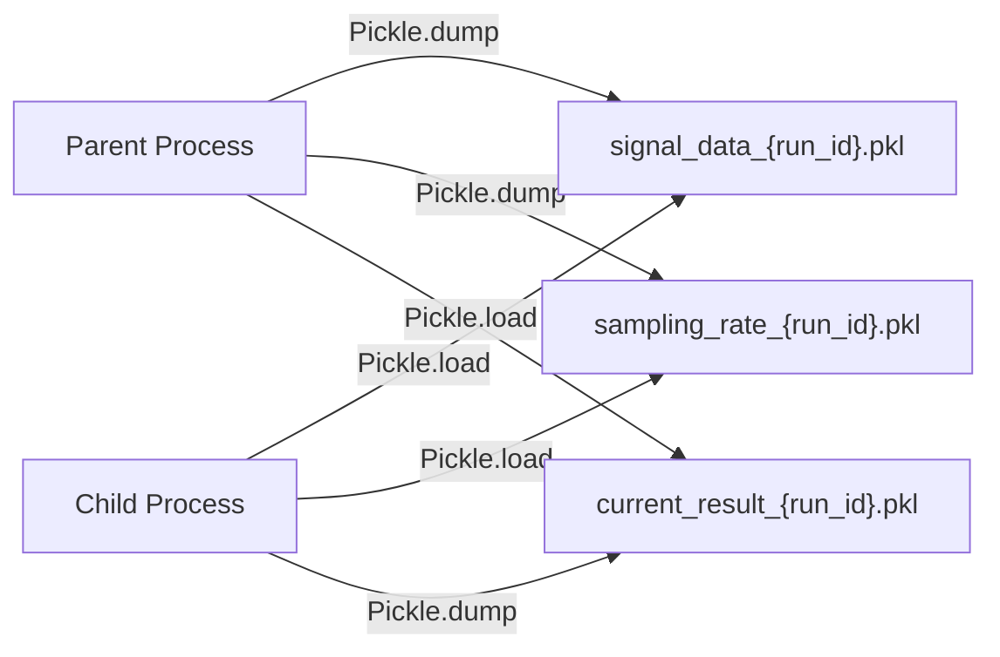

# Dynamic Script Generation and Execution

<cite>
**Referenced Files in This Document**   
- [LLMOrchestrator.py](file://src/core/LLMOrchestrator.py#L0-L725)
</cite>

## Table of Contents
1. [Introduction](#introduction)
2. [Core Methods Overview](#core-methods-overview)
3. [_translate_actions_to_code Method](#translate_actions_to_code-method)
4. [_execute_current_pipeline Method](#execute_current_pipeline-method)
5. [Import Resolution and Module Access](#import-resolution-and-module-access)
6. [Subprocess Execution Model](#subprocess-execution-model)
7. [Data Exchange via Temporary Files](#data-exchange-via-temporary-files)
8. [Security Considerations](#security-considerations)
9. [Example Generated Scripts](#example-generated-scripts)
10. [Troubleshooting Common Failures](#troubleshooting-common-failures)

## Introduction
This document provides a comprehensive analysis of the dynamic script generation and execution system implemented in the `LLMOrchestrator` class. The system enables autonomous analysis pipelines by converting high-level action sequences into executable Python scripts, executing them in isolated subprocesses, and managing complex data exchange between processes. This architecture supports iterative, LLM-driven decision-making for signal processing and data analysis workflows.

## Core Methods Overview
The two primary methods responsible for dynamic code execution are `_translate_actions_to_code` and `_execute_current_pipeline`. These methods work in tandem to transform a sequence of `Action` objects into a runnable Python script, execute it in a secure environment, and return structured results.



**Diagram sources**
- [LLMOrchestrator.py](file://src/core/LLMOrchestrator.py#L500-L725)

**Section sources**
- [LLMOrchestrator.py](file://src/core/LLMOrchestrator.py#L500-L725)

## _translate_actions_to_code Method
This method deterministically converts a list of `Action` objects into a complete, executable Python script.

### Code Generation Process
The method follows a structured approach to script generation:

1. **Import Statements**: Adds essential imports including `numpy`, `pickle`, and `sys`.
2. **Path Configuration**: Modifies `sys.path` to enable absolute imports from the `src` package.
3. **Tool Imports**: Dynamically imports required tool functions based on the current pipeline.
4. **Data Initialization**: Sets up code to load input data from temporary pickle files.
5. **Action Translation**: Converts each `Action` object into corresponding function calls.
6. **Result Serialization**: Adds code to save the final result to a pickle file.

```python
def _translate_actions_to_code(self):
    code_lines = [
        "import numpy as np",
        "import pickle",
        "import sys",
        "import os",
        "",
        "# Add project root to sys.path",
        "sys.path.append(os.path.dirname(os.path.dirname(os.path.dirname(os.path.abspath(__file__)))))",
        "from src.core.quantitative_parameterization_module import calculate_quantitative_metrics",
        ""
    ]
    # ... rest of implementation
```

### Variable Reference Resolution
The method intelligently distinguishes between different types of parameter values:

- **String literals**: Wrapped in quotes (e.g., file paths)
- **Variable references**: Direct references to previous output variables
- **Numeric values**: Used as-is
- **Initial data variables**: References to `signal_data` and `fs`

This ensures proper variable scoping and data flow between consecutive actions in the pipeline.

**Section sources**
- [LLMOrchestrator.py](file://src/core/LLMOrchestrator.py#L600-L700)

## _execute_current_pipeline Method
This method handles the execution of the generated Python script in a separate process.

### Execution Workflow


**Diagram sources**
- [LLMOrchestrator.py](file://src/core/LLMOrchestrator.py#L500-L550)

The method implements robust error handling for:
- **TimeoutExpired**: Script execution exceeds 1500 seconds
- **CalledProcessError**: Script exits with non-zero status
- **General exceptions**: Unexpected errors during execution

### Result Structure
The method returns a standardized result dictionary:
```json
{
  "data": "Deserialized result object",
  "image_path": "Path to generated visualization (if any)"
}
```

**Section sources**
- [LLMOrchestrator.py](file://src/core/LLMOrchestrator.py#L500-L599)

## Import Resolution and Module Access
The system uses a sophisticated import resolution strategy to dynamically access tools from different submodules.

### Tool Submodule Mapping
The `tool_submodule_map` dictionary defines the relationship between tool names and their locations:

```python
tool_submodule_map = {
    "bandpass_filter": "sigproc",
    "highpass_filter": "sigproc",
    "lowpass_filter": "sigproc",
    "create_csc_map": "transforms",
    "create_envelope_spectrum": "transforms",
    "create_fft_spectrum": "transforms",
    "create_signal_spectrogram": "transforms",
    "load_data": "utils",
    "select_component": "decomposition",
    "decompose_matrix_nmf": "decomposition"
}
```

### Dynamic Import Generation
For each action in the pipeline, the method generates appropriate import statements:
```python
from src.tools.{submodule}.{tool_name} import {tool_name}
```

This approach enables modular tool organization while maintaining clean, direct function imports in the generated script.

**Section sources**
- [LLMOrchestrator.py](file://src/core/LLMOrchestrator.py#L620-L640)

## Subprocess Execution Model
The system executes generated scripts in isolated subprocesses to ensure stability and security.

### Execution Parameters
- **Python executable**: Uses virtual environment interpreter
- **Working directory**: Project root directory
- **Timeout**: 1500 seconds (25 minutes)
- **Output capture**: Both stdout and stderr are captured

### Error Handling Strategy
The method implements comprehensive error handling:



**Diagram sources**
- [LLMOrchestrator.py](file://src/core/LLMOrchestrator.py#L530-L570)

All errors are logged through the `log_queue` and re-raised to maintain the orchestrator's error propagation model.

**Section sources**
- [LLMOrchestrator.py](file://src/core/LLMOrchestrator.py#L520-L580)

## Data Exchange via Temporary Files
The system uses pickle files for data exchange between the parent and child processes.

### File Management
- **Input data**: Serialized to temporary pickle files before script execution
- **Results**: Saved to a designated result pickle file by the subprocess
- **Cleanup**: Temporary files are retained for debugging purposes

### Data Flow


**Diagram sources**
- [LLMOrchestrator.py](file://src/core/LLMOrchestrator.py#L650-L680)

The use of pickle enables serialization of complex Python objects including NumPy arrays, dictionaries, and custom objects.

**Section sources**
- [LLMOrchestrator.py](file://src/core/LLMOrchestrator.py#L645-L690)

## Security Considerations
The dynamic code generation and execution system incorporates several security measures.

### Risk Mitigation
- **Sandboxed execution**: Scripts run in isolated subprocesses
- **Limited imports**: Only pre-approved tools can be imported
- **Path control**: Explicit control over import paths
- **Timeout enforcement**: Prevents infinite loops
- **Input validation**: Parameter types are validated during translation

### Potential Vulnerabilities
Despite these measures, potential risks include:
- **Code injection**: Malicious content in action parameters
- **Resource exhaustion**: Memory or CPU overuse
- **File system access**: Unrestricted file operations

The system mitigates these through careful parameter handling and execution constraints.

**Section sources**
- [LLMOrchestrator.py](file://src/core/LLMOrchestrator.py#L500-L725)

## Example Generated Scripts
The following examples illustrate typical generated scripts for common analysis pipelines.

### FFT Spectrum Analysis
```python
import numpy as np
import pickle
import sys
import os

# Add the project root to sys.path
sys.path.append(os.path.dirname(os.path.dirname(os.path.dirname(os.path.abspath(__file__)))))
from src.core.quantitative_parameterization_module import calculate_quantitative_metrics

from src.tools.transforms.create_fft_spectrum import create_fft_spectrum
from src.tools.utils.load_data import load_data

signal_data_path = './run_state/123/signal_data_123.pkl'
sampling_rate_path = './run_state/123/sampling_rate_123.pkl'
input_image_path = './run_state/123/step_0_input_image.png'
result_path = './run_state/123/current_result_123.pkl'

with open(signal_data_path, 'rb') as f:
    signal_data = pickle.load(f)
with open(sampling_rate_path, 'rb') as f:
    fs = int(pickle.load(f))

# --- Action 0: Executing load_data ---
loaded_signal = load_data(signal_data, fs, input_image_path)
loaded_signal_with_params = calculate_quantitative_metrics(loaded_signal)
loaded_signal_with_params['image_path'] = loaded_signal['image_path']

# --- Action 1: Executing create_fft_spectrum ---
fft_spectrum_1 = create_fft_spectrum(loaded_signal, './run_state/123/step_1_fft_spectrum.png')
fft_spectrum_1 = calculate_quantitative_metrics(fft_spectrum_1)

with open(result_path, 'wb') as f:
    pickle.dump(fft_spectrum_1, f)
```

### Signal Filtering Pipeline
```python
# ... imports and setup ...

# --- Action 0: Executing load_data ---
loaded_signal = load_data(signal_data, fs, input_image_path)
# ... parameterization ...

# --- Action 1: Executing bandpass_filter ---
bp_filter_1 = bandpass_filter(loaded_signal, './run_state/123/step_1_bandpass_filter.png', 1500, 3500, 10)
bp_filter_1 = calculate_quantitative_metrics(bp_filter_1)

# --- Action 2: Executing create_envelope_spectrum ---
envelope_spectrum_2 = create_envelope_spectrum(bp_filter_1, './run_state/123/step_2_env_spectrum.png')
envelope_spectrum_2 = calculate_quantitative_metrics(envelope_spectrum_2)

with open(result_path, 'wb') as f:
    pickle.dump(envelope_spectrum_2, f)
```

**Section sources**
- [LLMOrchestrator.py](file://src/core/LLMOrchestrator.py#L600-L700)

## Troubleshooting Common Failures
This section addresses frequent execution issues and their solutions.

### Timeout Errors
**Symptom**: "Script execution timed out after 1500 seconds"
**Causes**:
- Complex computations exceeding time limits
- Infinite loops in generated code
- Large data processing requirements

**Solutions**:
- Optimize algorithms for performance
- Break complex pipelines into smaller steps
- Increase timeout value if appropriate

### Import Errors
**Symptom**: "ModuleNotFoundError" for tool modules
**Causes**:
- Incorrect `sys.path` configuration
- Missing tool files
- Typos in module names

**Solutions**:
- Verify project structure matches import paths
- Check `tool_submodule_map` for correct mappings
- Ensure virtual environment is properly configured

### Pickle Serialization Issues
**Symptom**: "Can't pickle object" errors
**Causes**:
- Attempting to serialize unpickleable objects
- Complex custom classes without proper pickle support

**Solutions**:
- Simplify data structures before serialization
- Implement `__getstate__` and `__setstate__` methods
- Use alternative serialization formats if necessary

### Parameter Type Mismatches
**Symptom**: Function calls fail due to incorrect parameter types
**Causes**:
- String literals not properly quoted
- Variable references incorrectly identified
- Type coercion issues

**Solutions**:
- Review parameter handling logic in `_translate_actions_to_code`
- Add type validation in tool functions
- Implement more robust parameter type detection

**Section sources**
- [LLMOrchestrator.py](file://src/core/LLMOrchestrator.py#L500-L725)