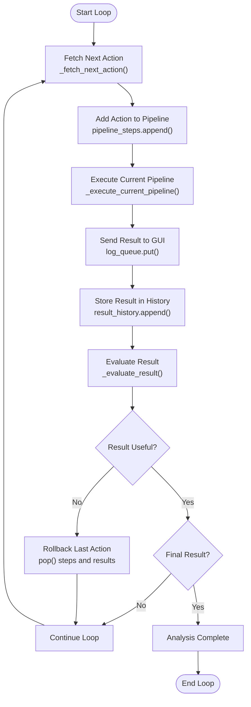
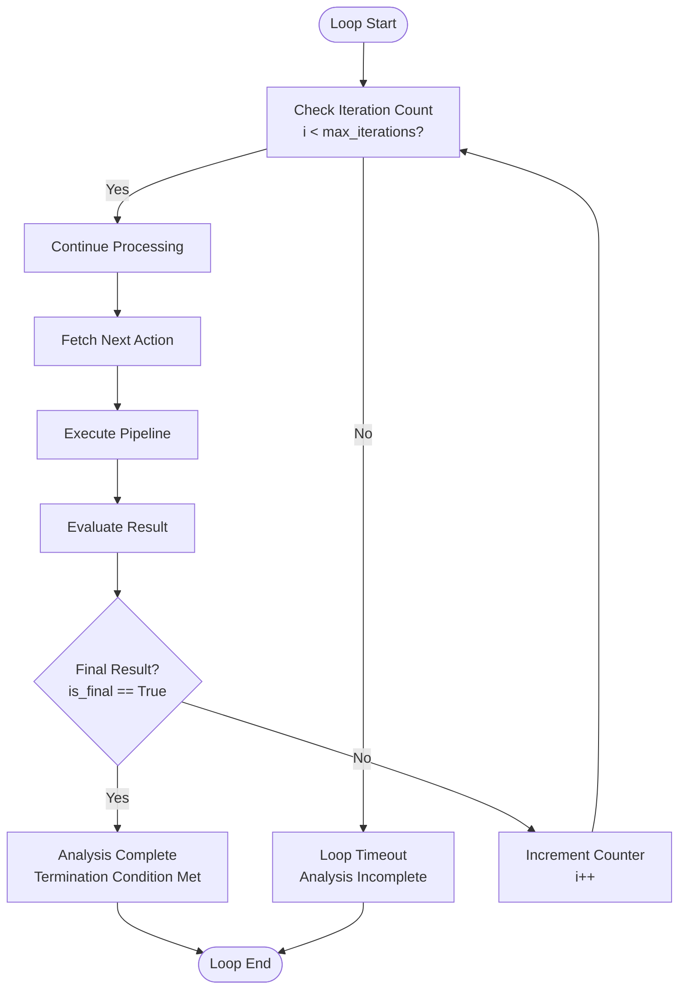
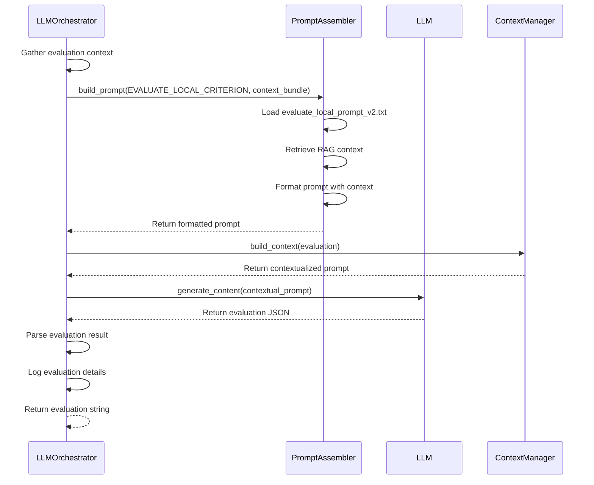

# Execution Loop and Pipeline Control

<cite>
**Referenced Files in This Document**   
- [LLMOrchestrator.py](file://src/core/LLMOrchestrator.py#L0-L725)
- [prompt_assembler.py](file://src/core/prompt_assembler.py#L0-L178)
- [ContextManager.py](file://src/core/ContextManager.py#L0-L44)
- [create_fft_spectrum.py](file://src/tools/transforms/create_fft_spectrum.py#L0-L199)
- [create_envelope_spectrum.py](file://src/tools/transforms/create_envelope_spectrum.py#L0-L273)
</cite>

## Table of Contents
1. [Execution Loop and Pipeline Control](#execution-loop-and-pipeline-control)
2. [Main Execution Loop Overview](#main-execution-loop-overview)
3. [Pipeline Control Flow](#pipeline-control-flow)
4. [Dynamic Tool Selection and Script Generation](#dynamic-tool-selection-and-script-generation)
5. [Safety Mechanisms and Loop Termination](#safety-mechanisms-and-loop-termination)
6. [Result Evaluation and Action Rollback](#result-evaluation-and-action-rollback)
7. [Bearing Fault Detection Workflow Example](#bearing-fault-detection-workflow-example)
8. [Debugging Stalled or Divergent Pipelines](#debugging-stalled-or-divergent-pipelines)

## Main Execution Loop Overview

The `run_analysis_pipeline` method in the `LLMOrchestrator` class implements the core execution loop that drives the autonomous analysis process. This loop orchestrates the iterative sequence of action proposal, execution, and evaluation, forming a closed feedback system that enables intelligent exploration of signal analysis workflows.

The execution begins with initialization steps that establish the foundational context for analysis. The orchestrator first injects a meta-template prompt into the context manager, which serves as the initial framework for all subsequent interactions. Following this, it creates structured metaknowledge from the raw signal data and user-provided descriptions through the `_create_metaknowledge` method. This metaknowledge captures essential characteristics of the signal, including its length, sampling frequency, and other statistical properties derived directly from the data.

After initialization, the pipeline executes two mandatory preliminary steps: data loading and the first analysis action. The data loading step uses the `load_data` tool to prepare the signal for processing, while the first analysis action represents the initial analytical approach proposed by the LLM based on the metaknowledge and user objective.

**Section sources**
- [LLMOrchestrator.py](file://src/core/LLMOrchestrator.py#L100-L150)

## Pipeline Control Flow

The control flow of the execution loop follows a well-defined sequence of operations that coordinate the interaction between the LLM, the execution environment, and the evaluation system. The loop operates through three primary phases: action fetching, pipeline execution, and result evaluation.



**Diagram sources**
- [LLMOrchestrator.py](file://src/core/LLMOrchestrator.py#L150-L200)

The flowchart above illustrates the complete control flow of the execution loop. Each iteration begins with `_fetch_next_action`, which queries the LLM for the next analytical step based on the evaluation of the previous result. The selected action is then appended to the `pipeline_steps` list, which maintains the complete sequence of operations performed during the analysis.

Following action selection, `_execute_current_pipeline` translates the entire sequence of actions into executable Python code and runs it in a separate subprocess. This approach provides isolation between the orchestrator and the analysis code, preventing potential conflicts and enabling the use of potentially unstable or resource-intensive operations.

After execution, the results are communicated to the GUI through the `log_queue` for visualization, stored in the `result_history` for future reference, and finally passed to `_evaluate_result` for assessment of their usefulness and relevance to the analysis objective.

**Section sources**
- [LLMOrchestrator.py](file://src/core/LLMOrchestrator.py#L150-L250)

## Dynamic Tool Selection and Script Generation

The dynamic tool selection process is implemented in the `_fetch_next_action` method, which acts as the decision-making engine of the analysis pipeline. This method receives evaluation feedback from the previous step and determines the most appropriate next action based on the current state of the analysis.

The tool selection mechanism uses pattern matching on the evaluation response to determine which tool should be invoked next. The available tools include various signal processing operations such as `create_fft_spectrum`, `create_envelope_spectrum`, `bandpass_filter`, and others organized across different submodules in the tools directory.

```mermaid
classDiagram
class LLMOrchestrator {
+pipeline_steps List[Action]
+result_history List[Result]
+max_iterations int
+_fetch_next_action(evaluation) Action
+_execute_current_pipeline() Result
+_evaluate_result(result, action) Evaluation
+_translate_actions_to_code() str
}
class Action {
+action_id int
+tool_name str
+params Dict[str, Any]
+output_variable str
}
class Result {
+data Dict[str, Any]
+image_path str
}
class Evaluation {
+is_useful bool
+is_final bool
+tool_name str
+input_variable str
+params Dict[str, Any]
+justification str
}
LLMOrchestrator --> Action : "contains"
LLMOrchestrator --> Result : "stores"
LLMOrchestrator --> Evaluation : "processes"
LLMOrchestrator --> "Script Generator" : "uses"
class "Script Generator" {
+_translate_actions_to_code() str
+tool_submodule_map Dict[str, str]
}
Script Generator --> Action : "translates"
```

**Diagram sources**
- [LLMOrchestrator.py](file://src/core/LLMOrchestrator.py#L250-L300)

The script generation process, implemented in `_translate_actions_to_code`, converts the abstract sequence of actions into executable Python code. This translation follows several key steps:

1. **Import Generation**: The method first generates the necessary import statements for all tools required by the current pipeline. It uses a `tool_submodule_map` to determine which submodule contains each tool function.

2. **Data Preparation**: The raw signal data and sampling rate are serialized to temporary pickle files, and code is generated to load these files at runtime, ensuring the analysis script has access to the input data.

3. **Action Translation**: Each action in the pipeline is translated into a corresponding function call. The method handles parameter formatting, distinguishing between literal values and variable references to previous outputs.

4. **Code Assembly**: The individual code segments are combined into a complete Python script that can be executed in a subprocess.

The generated script follows a consistent structure that begins with imports, followed by data loading, and then a sequence of tool function calls that implement the analysis pipeline. Each tool output is passed as input to subsequent tools, creating a data processing chain.

**Section sources**
- [LLMOrchestrator.py](file://src/core/LLMOrchestrator.py#L500-L700)

## Safety Mechanisms and Loop Termination

The execution loop incorporates several safety mechanisms to prevent infinite loops and ensure stable operation. The primary safeguard is the `max_iterations` limit, which is set to 20 iterations by default. This limit prevents the analysis from continuing indefinitely in cases where the LLM fails to reach a conclusive result.



**Diagram sources**
- [LLMOrchestrator.py](file://src/core/LLMOrchestrator.py#L180-L200)

The loop termination logic is implemented in the main for-loop of `run_analysis_pipeline`. After each iteration, the evaluation result is checked for the `is_final` flag. When this flag is set to `True`, the loop breaks, signaling that the analysis objective has been achieved and no further steps are needed.

Additional safety mechanisms include:

- **Subprocess Timeout**: The `_execute_current_pipeline` method sets a 1500-second timeout for script execution, preventing individual steps from hanging indefinitely.
- **Error Propagation**: Exceptions during script execution are re-raised, allowing the orchestrator to handle them appropriately rather than silently failing.
- **Resource Management**: Temporary files are created in a run-specific state directory, preventing conflicts between different analysis sessions.

These safety features work together to create a robust execution environment that can handle both expected and unexpected conditions during the analysis process.

**Section sources**
- [LLMOrchestrator.py](file://src/core/LLMOrchestrator.py#L180-L200)

## Result Evaluation and Action Rollback

The result evaluation process is central to the adaptive nature of the analysis pipeline. Implemented in the `_evaluate_result` method, this process uses the LLM to assess the usefulness of each step in the context of the overall analysis objective.

The evaluation workflow follows these steps:

1. **Context Assembly**: The orchestrator gathers all relevant information, including the metaknowledge, the last action taken, the result produced, the complete sequence of steps so far, and the user's original objective.

2. **Prompt Construction**: The `PromptAssembler` builds a comprehensive evaluation prompt using the `EVALUATE_LOCAL_CRITERION` template. This prompt includes both textual context and visual information from the result's image output.

3. **LLM Assessment**: The constructed prompt is sent to the LLM, which returns a structured JSON response containing:
   - `is_useful`: Boolean indicating whether the result advances the analysis
   - `is_final`: Boolean indicating whether the analysis objective has been met
   - `tool_name`: Recommendation for the next tool to use
   - `input_variable`: Specification of which variable to use as input
   - `params`: Custom parameters for the next tool
   - `justification`: Explanation of the evaluation decision

4. **Action Decision**: Based on the evaluation, the orchestrator either proceeds with the next action or rolls back the last step.



**Diagram sources**
- [LLMOrchestrator.py](file://src/core/LLMOrchestrator.py#L400-L450)
- [prompt_assembler.py](file://src/core/prompt_assembler.py#L100-L150)

When an evaluation determines that a result is not useful (`is_useful == False`), the orchestrator performs an action rollback by removing the last action from `pipeline_steps` and the corresponding result from `result_history`. This mechanism allows the system to recover from unproductive analytical paths and explore alternative approaches.

The evaluation process also incorporates Retrieval-Augmented Generation (RAG) by querying knowledge bases about both the domain context and tool documentation. This ensures that the evaluation considers both the technical characteristics of the tools and the domain-specific requirements of the analysis.

**Section sources**
- [LLMOrchestrator.py](file://src/core/LLMOrchestrator.py#L400-L450)
- [prompt_assembler.py](file://src/core/prompt_assembler.py#L100-L150)

## Bearing Fault Detection Workflow Example

A concrete example of the execution loop in action can be seen in a bearing fault detection scenario. Consider a vibration signal from a rotating machine where the user objective is to detect potential bearing faults.

The workflow might proceed as follows:

1. **Initialization**: The orchestrator loads the vibration signal and creates metaknowledge that identifies the signal as a 10-second vibration recording sampled at 10,000 Hz from a motor bearing.

2. **Initial Analysis**: The first proposed action is `create_fft_spectrum`, which generates a frequency spectrum of the signal. The evaluation determines that while the spectrum shows elevated noise, it doesn't clearly reveal fault frequencies.

3. **Adaptive Response**: Based on the evaluation, the next action selected is `create_envelope_spectrum`, which is more sensitive to the impulsive signals characteristic of bearing faults.

4. **Positive Result**: The envelope spectrum reveals clear peaks at the bearing's characteristic fault frequencies (e.g., ball pass frequency outer race). The evaluation determines this result is useful and suggests no further analysis is needed.

5. **Termination**: The evaluation sets `is_final = True`, causing the loop to terminate and report the successful detection of a bearing fault.

```python
# Example action sequence for bearing fault detection
pipeline_steps = [
    {
        "action_id": 0,
        "tool_name": "load_data",
        "params": {"signal_data": "vibration_signal", "sampling_rate": "fs"},
        "output_variable": "loaded_signal"
    },
    {
        "action_id": 1,
        "tool_name": "create_fft_spectrum",
        "params": {"input_signal": "loaded_signal", "image_path": "step1_fft.png"},
        "output_variable": "fft_spectrum_1"
    },
    {
        "action_id": 2,
        "tool_name": "create_envelope_spectrum",
        "params": {"input_signal": "loaded_signal", "image_path": "step2_envelope.png"},
        "output_variable": "envelope_spectrum_2"
    }
]
```

Throughout this workflow, the execution loop demonstrates its adaptive capabilities by shifting from general frequency analysis to more specialized fault detection techniques based on the evaluation of intermediate results.

**Section sources**
- [LLMOrchestrator.py](file://src/core/LLMOrchestrator.py#L250-L300)
- [create_envelope_spectrum.py](file://src/tools/transforms/create_envelope_spectrum.py#L0-L273)

## Debugging Stalled or Divergent Pipelines

When the analysis pipeline stalls or diverges from the intended objective, several debugging techniques can be employed to diagnose and resolve the issues.

**Log Analysis**: The `log_queue` provides a comprehensive record of the analysis process, including:
- LLM model selection and API calls
- Metaknowledge creation and content
- Generated scripts and their execution
- Result evaluations and justifications
- GUI interactions and visualizations

By examining these logs, developers can trace the decision-making process and identify where the pipeline may be going astray.

**State Inspection**: The run-specific state directory contains several artifacts that aid debugging:
- `metaknowledge.json`: The structured representation of the signal characteristics
- `current_result_*.pkl`: Pickle files containing the output of each step
- Step-specific image files: Visualizations of intermediate results
- Generated Python scripts: The actual code executed in the subprocess

**Common Issues and Solutions**:

1. **Infinite Looping**: If the pipeline exceeds the `max_iterations` limit, check whether the evaluation criteria are too strict or if the LLM is unable to recognize when the objective has been met. Adjusting the evaluation prompts or expanding the RAG context may help.

2. **Unproductive Tool Sequences**: If the pipeline cycles through tools without progress, examine the evaluation justifications to understand why certain results are deemed useful. The issue may lie in the tool documentation or the metaknowledge representation.

3. **Execution Failures**: When subprocess execution fails, check the generated script for syntax errors or incorrect parameter types. The error messages from the subprocess can provide specific clues about the nature of the failure.

4. **Poor Result Quality**: If the analysis produces technically correct but irrelevant results, the issue may be in the initial metaknowledge construction. Ensuring accurate signal characterization and clear user objectives can improve the relevance of subsequent steps.

The modular design of the execution loop facilitates targeted debugging by isolating the concerns of action selection, script generation, execution, and evaluation, allowing developers to focus on specific components when troubleshooting issues.

**Section sources**
- [LLMOrchestrator.py](file://src/core/LLMOrchestrator.py#L0-L725)
- [ContextManager.py](file://src/core/ContextManager.py#L0-L44)