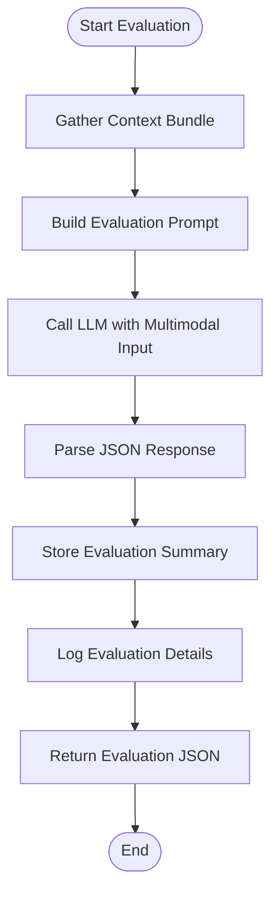
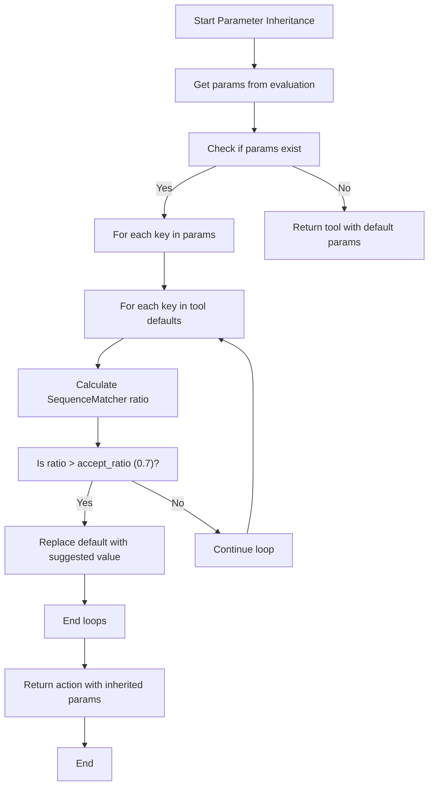
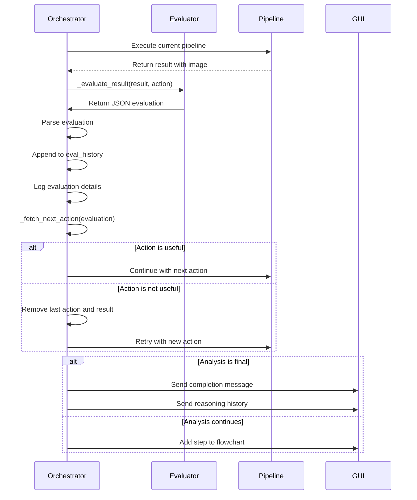

# LLM-Driven Decision Making and Evaluation

<cite>
**Referenced Files in This Document**   
- [src/core/LLMOrchestrator.py](file://src/core/LLMOrchestrator.py#L500-L552)
- [src/core/prompt_assembler.py](file://src/core/prompt_assembler.py#L100-L178)
- [src/prompt_templates/evaluate_local_prompt_v2.txt](file://src/prompt_templates/evaluate_local_prompt_v2.txt#L1-L58)
</cite>

## Table of Contents
1. [Introduction](#introduction)
2. [Core Evaluation Workflow](#core-evaluation-workflow)
3. [Evaluation Context Composition](#evaluation-context-composition)
4. [JSON Schema for Evaluation Responses](#json-schema-for-evaluation-responses)
5. [Parameter Inheritance Mechanism](#parameter-inheritance-mechanism)
6. [Feedback Loop and Pipeline Progression](#feedback-loop-and-pipeline-progression)
7. [Prompt Engineering for Evaluation Quality](#prompt-engineering-for-evaluation-quality)
8. [Common Failure Modes and Mitigation](#common-failure-modes-and-mitigation)

## Introduction
This document details the core decision-making engine of the autonomous analysis system, focusing on the `_evaluate_result` and `_fetch_next_action` methods. These components form a closed-loop reasoning system where an LLM evaluates intermediate results and determines subsequent analytical steps. The evaluation process integrates multimodal context including metaknowledge, action history, domain-specific RAG retrievals, and visual outputs from prior tool executions. The system uses structured JSON responses to maintain deterministic control over the analysis pipeline while allowing flexible reasoning.

## Core Evaluation Workflow

The `_evaluate_result` method orchestrates a comprehensive evaluation of each pipeline step's output. It follows a three-phase process: context gathering, prompt assembly, and response parsing.



**Diagram sources**
- [src/core/LLMOrchestrator.py](file://src/core/LLMOrchestrator.py#L500-L528)

**Section sources**
- [src/core/LLMOrchestrator.py](file://src/core/LLMOrchestrator.py#L500-L528)

## Evaluation Context Composition

The evaluation context is a rich multimodal bundle that provides the LLM with comprehensive information for decision-making. The `context_bundle` includes:

- **metaknowledge**: Structured metadata about the signal and analysis objective
- **last_action**: Complete specification of the most recently executed tool
- **last_result**: Output data and image path from the last action
- **sequence_steps**: Complete history of pipeline actions
- **rag_retriever**: Domain-specific knowledge retrieval interface
- **rag_retriever_tools**: Tool-specific documentation retrieval
- **tools_list**: Comprehensive reference of available tools
- **user_data_description**: User-provided signal context
- **user_analysis_objective**: User-defined analysis goal
- **result_history**: Complete history of prior results

The `prompt_assembler` constructs the final prompt by combining the static template with dynamic context. It retrieves relevant documentation for the last action and formats supporting images for multimodal evaluation.

```python
def _build_evaluate_local_prompt(self, context_bundle: dict) -> str:
    # Retrieve RAG context based on combined user objective and action
    rag_query = context_bundle['user_data_description'] + " " + context_bundle['user_analysis_objective'] + " " + context_bundle['last_action'].get('tool_name') + " next steps"
    retrieved_docs = context_bundle['rag_retriever'].invoke(rag_query)
    
    # Load specific tool documentation
    action_documentation_path = ""
    fname = context_bundle["last_action"].get('tool_name') + ".md"
    for root, dirs, files in os.walk('src/tools/',topdown=True):
        for name in files:
            if fnmatch.fnmatch(name, fname):
                action_documentation_path = os.path.join(root, name)
                break

    with open(action_documentation_path, 'r') as f:
        tool_doc = f.read()
        
    # Assemble final prompt with images
    image_prompts = ['Main image for evaluation: ']
    ipath = context_bundle["last_result"]["image_path"]
    supporting_image = Image.open(ipath)
    image_prompts.append(ipath.split('\\')[-1])
    image_prompts.append(supporting_image)
    
    return [prompt0,*image_prompts]
```

**Section sources**
- [src/core/prompt_assembler.py](file://src/core/prompt_assembler.py#L100-L178)

## JSON Schema for Evaluation Responses

The LLM must return a strictly formatted JSON object that drives the next pipeline step. The schema includes both decision-making flags and action specification fields.

```json
{
  "evaluation_summary": "string",
  "tool_name": "string",
  "input_variable": "string",
  "justification": "string",
  "is_final": "integer",
  "is_useful": "integer",
  "params": {
    "param_1": "integer",
    "param_2": "integer"
  }
}
```

**Key fields:**

- **evaluation_summary**: Natural language description of the assessment and proposed next step
- **tool_name**: Name of the next tool to execute (must match available tools)
- **input_variable**: Output variable from a prior step to use as input (domain-matched)
- **justification**: Brief rationale for input variable selection
- **is_final**: Binary flag (0/1) indicating if analysis objectives are met
- **is_useful**: Binary flag (0/1) indicating if the last step advanced the analysis
- **params**: Dictionary of parameter overrides for the next tool

The system enforces a domain map that restricts valid input domains for each tool:

- create_fft_spectrum: time-series
- create_envelope_spectrum: time-series or bi-frequency-matrix
- create_signal_spectrogram: time-series
- create_csc_map: time-series
- bandpass_filter: time-series
- lowpass_filter: time-series
- highpass_filter: time-series
- decompose_matrix_nmf: time-frequency-matrix or bi-frequency-matrix
- select_component: decomposed_matrix

**Section sources**
- [src/prompt_templates/evaluate_local_prompt_v2.txt](file://src/prompt_templates/evaluate_local_prompt_v2.txt#L35-L58)

## Parameter Inheritance Mechanism

The system implements intelligent parameter inheritance using fuzzy string matching to propagate relevant parameters from prior steps. When `_fetch_next_action` processes the evaluation response, it compares parameter keys from the suggested `params` dictionary with the default parameters of the proposed tool.



**Diagram sources**
- [src/core/LLMOrchestrator.py](file://src/core/LLMOrchestrator.py#L231-L251)

The `SequenceMatcher` from Python's `difflib` module computes similarity ratios between parameter names. For example, if an evaluation suggests `"cutoff_frequency": 2000` and the tool expects `"cutoff_freq"`, the similarity ratio would be high enough (above the 0.7 threshold) to trigger value inheritance.

```python
accept_ratio = 0.7
for key in param_keys:
    for key_orig in action['params'].keys():
        ratio = SequenceMatcher(None, key, key_orig).ratio()
        if ratio > accept_ratio:
            action['params'][key_orig] = params[key]
```

This mechanism allows the LLM to use natural parameter naming while maintaining compatibility with tool APIs.

**Section sources**
- [src/core/LLMOrchestrator.py](file://src/core/LLMOrchestrator.py#L231-L251)

## Feedback Loop and Pipeline Progression

The evaluation system forms a tight feedback loop that directly controls pipeline progression. After executing a step, the result is evaluated, and the response determines the next action.



**Diagram sources**
- [src/core/LLMOrchestrator.py](file://src/core/LLMOrchestrator.py#L500-L552)

The main loop in `run_analysis_pipeline` implements this feedback mechanism:

```python
evaluation = self._evaluate_result(current_result, current_action)
if not json.loads(evaluation).get("is_useful"):
    self.pipeline_steps.pop()
    self.result_history.pop()
    continue

if json.loads(evaluation).get("is_final"):
    break
```

This creates a self-correcting system where ineffective steps are automatically discarded, and the analysis continues with a new approach.

**Section sources**
- [src/core/LLMOrchestrator.py](file://src/core/LLMOrchestrator.py#L152-L174)

## Prompt Engineering for Evaluation Quality

The evaluation prompt is carefully engineered to maximize decision quality. Key strategies include:

**Domain Map Enforcement**: The prompt explicitly lists valid input domains for each tool, preventing type mismatches.

**Mandatory Post-Processing**: After `decompose_matrix_nmf`, the prompt requires proposing `select_component` with the appropriate `component_index`.

**Visual Evaluation Emphasis**: Instructions emphasize assessing "visually the provided images" and "progress made and insight gathered."

**Structured Output Requirement**: The prompt provides a complete JSON template that must be followed exactly.

**RAG Context Integration**: The system retrieves relevant documentation snippets based on the user objective and current action.

Example prompt structure:

```
Your current task is to evaluate the results of the last action. Based on all the information provided below, assess visually the provided images...

DOMAIN MAP:
- create_fft_spectrum: time-series;
- create_envelope_spectrum: time-series or bi-frequency-matrix;
...

IMPORTANT: If the last tool was "decompose_matrix_nmf", visually evaluate the plot... Then, propose the tool "select_component" with the parameter "component_index" set to the index of the selected component.
```

This prompt design ensures consistent, domain-aware decisions while allowing flexibility in parameter specification.

**Section sources**
- [src/prompt_templates/evaluate_local_prompt_v2.txt](file://src/prompt_templates/evaluate_local_prompt_v2.txt#L1-L58)

## Common Failure Modes and Mitigation

### Oscillating Decisions
**Problem**: The LLM alternates between two tools without progress.
**Solution**: The system's state includes the complete `sequence_steps` history, allowing the LLM to recognize repetitive patterns. The prompt could be enhanced with explicit instructions to avoid recently used tools unless justified.

### Premature Termination
**Problem**: `is_final=1` is set before objectives are met.
**Solution**: The prompt emphasizes that results must "allow to observe the component of interest and visualize it in an identifiable way." The RAG system provides objective criteria for fault detection that can be referenced.

### Domain Violations
**Problem**: Proposing tools with incompatible input domains.
**Solution**: The explicit domain map in the prompt and the mandatory domain checking prevent most violations. The system would throw an error if domain rules are violated.

### Parameter Mismatch
**Problem**: Suggested parameters don't match tool expectations.
**Solution**: The `SequenceMatcher`-based inheritance with 0.7 threshold handles minor naming variations. Clear parameter documentation in the RAG context helps alignment.

### Useless Action Propagation
**Problem**: Continuing with ineffective steps.
**Solution**: The `is_useful` flag enables automatic removal of ineffective steps. The system maintains a `max_iterations=20` safety limit to prevent infinite loops.

These failure modes are mitigated through a combination of prompt engineering, structured output requirements, and system-level safeguards that maintain pipeline integrity.

**Section sources**
- [src/core/LLMOrchestrator.py](file://src/core/LLMOrchestrator.py#L152-L174)
- [src/prompt_templates/evaluate_local_prompt_v2.txt](file://src/prompt_templates/evaluate_local_prompt_v2.txt#L1-L58)