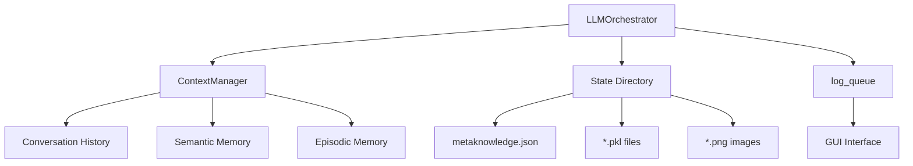
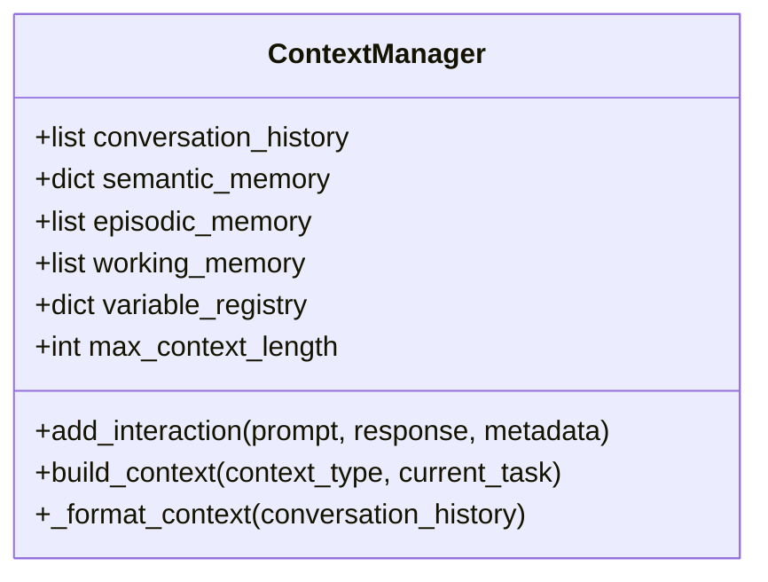

# State Management and Persistence

<cite>
**Referenced Files in This Document**   
- [src/core/ContextManager.py](file://src/core/ContextManager.py) - *Updated in recent commit*
- [src/core/LLMOrchestrator.py](file://src/core/LLMOrchestrator.py) - *Updated in recent commit*
- [PERSISTENT_CONTEXT_IMPLEMENTATION.md](file://PERSISTENT_CONTEXT_IMPLEMENTATION.md) - *Added in recent commit*
- [run_state/run_20250829_075105/metaknowledge.json](file://run_state/run_20250829_075105/metaknowledge.json)
</cite>

## Update Summary
**Changes Made**   
- Updated documentation to reflect integration of persistent context management in LLMOrchestrator
- Added details on ContextManager's role in maintaining conversation history and memory systems
- Enhanced description of state persistence architecture with new context injection mechanisms
- Clarified interaction between LLMOrchestrator and ContextManager for stateful operations
- Updated section sources to reflect actual file changes in recent commit

## Table of Contents
1. [Introduction](#introduction)
2. [State Persistence Architecture](#state-persistence-architecture)
3. [Run State Directory Structure](#run-state-directory-structure)
4. [ContextManager: Conversation and Memory Management](#contextmanager-conversation-and-memory-management)
5. [Metaknowledge Construction and Storage](#metaknowledge-construction-and-storage)
6. [Pickle-Based Data Serialization](#pickle-based-data-serialization)
7. [State Restoration Mechanism](#state-restoration-mechanism)
8. [GUI Integration via log_queue](#gui-integration-via-log_queue)
9. [Error Handling and State Corruption Recovery](#error-handling-and-state-corruption-recovery)
10. [Best Practices for Disk Space and Data Security](#best-practices-for-disk-space-and-data-security)

## Introduction
The LLMOrchestrator system implements a robust state management framework to maintain execution context across analysis sessions. This document details the architecture and implementation of persistent state storage, focusing on how execution state is serialized, stored, and restored. The system uses pickle serialization for binary data and JSON for structured metadata, organizing all artifacts under run-specific directories in ./run_state/{run_id}. The ContextManager class maintains conversation history and semantic memory, while the LLMOrchestrator coordinates state persistence and restoration. Integration with the GUI through the log_queue enables real-time updates and monitoring of the analysis pipeline.

## State Persistence Architecture
The state management system follows a hybrid approach combining in-memory context with persistent disk storage. Each analysis session is assigned a unique run_id, creating an isolated namespace for all generated artifacts. The architecture separates concerns between conversation context (managed by ContextManager) and execution state (managed by LLMOrchestrator). The system uses pickle for serializing complex Python objects like NumPy arrays and function results, while JSON handles structured metadata such as metaknowledge. This separation allows efficient state restoration and enables the system to resume interrupted analyses from the last successful step.

**Diagram sources**
- [src/core/LLMOrchestrator.py](file://src/core/LLMOrchestrator.py#L1-L100)
- [src/core/ContextManager.py](file://src/core/ContextManager.py#L1-L20)

**Section sources**
- [src/core/LLMOrchestrator.py](file://src/core/LLMOrchestrator.py#L1-L50)
- [PERSISTENT_CONTEXT_IMPLEMENTATION.md](file://PERSISTENT_CONTEXT_IMPLEMENTATION.md#L1-L100)

## Run State Directory Structure
Each analysis run creates a dedicated directory under ./run_state/{run_id} where {run_id} follows the format run_YYYYMMDD_HHMMSS. This directory contains all artifacts generated during the analysis pipeline. The structure includes metaknowledge.json for initial analysis context, temporary pickle files for intermediate data, PNG images for visualizations, and executable Python scripts generated from the action pipeline. The directory is created at initialization and persists until explicitly cleaned up, allowing complete reconstruction of the analysis process. This organization enables easy inspection, debugging, and sharing of analysis results.

**Section sources**
- [src/core/LLMOrchestrator.py](file://src/core/LLMOrchestrator.py#L50-L100)

## ContextManager: Conversation and Memory Management
The ContextManager class maintains multiple memory systems to support different aspects of the analysis process. The conversation_history stores complete interaction records including prompts, responses, and metadata. Semantic_memory captures learned patterns from successful analyses, while episodic_memory preserves time-ordered events. Working_memory holds the current session state, and variable_registry tracks variable states across the pipeline. The build_context method constructs contextual prompts by formatting the conversation history, enabling the LLM to maintain consistency across interactions. This multi-layered memory system allows the orchestrator to make informed decisions based on historical context.

**Diagram sources**
- [src/core/ContextManager.py](file://src/core/ContextManager.py#L1-L45)

**Section sources**
- [src/core/ContextManager.py](file://src/core/ContextManager.py#L1-L45)

## Metaknowledge Construction and Storage
Metaknowledge represents the system's understanding of the input data and analysis objectives. It is constructed during initialization by querying the LLM with a structured context bundle containing raw signal data, sampling frequency, user descriptions, and available tools. The resulting JSON response is saved to metaknowledge.json in the run directory and loaded into memory for subsequent use. This file serves as the foundation for all analysis decisions, containing data summaries, signal characteristics, and recommended analysis strategies. The metaknowledge structure includes data_summary, signal_characteristics, and recommended_approaches sections that guide the pipeline execution.

**Section sources**
- [src/core/LLMOrchestrator.py](file://src/core/LLMOrchestrator.py#L200-L250)
- [run_state/run_20250829_075105/metaknowledge.json](file://run_state/run_20250829_075105/metaknowledge.json)

## Pickle-Based Data Serialization
The system uses Python's pickle module for serializing complex data structures that cannot be easily represented in JSON. Temporary data files such as signal_data_{run_id}.pkl and sampling_rate_{run_id}.pkl store the input signal and sampling rate for use in the generated analysis script. The current_result_{run_id}.pkl file captures the output of each pipeline execution, enabling state preservation between steps. Pickle is chosen for its ability to handle NumPy arrays, custom objects, and complex data types used in signal processing. However, this introduces security considerations as pickle files can execute arbitrary code during deserialization.

**Section sources**
- [src/core/LLMOrchestrator.py](file://src/core/LLMOrchestrator.py#L600-L650)

## State Restoration Mechanism
State restoration occurs when resuming an interrupted analysis session. The system loads the metaknowledge.json file to reconstruct the initial context and reads the last successful result from the current_result_{run_id}.pkl file. The ContextManager is repopulated with conversation history from previous interactions, allowing the LLM to maintain continuity. Pipeline steps are reconstructed from the action history, and variable states are restored from the registry. This enables the orchestrator to continue from the point of interruption rather than restarting the analysis from scratch. The restoration process validates the integrity of stored artifacts before proceeding.

**Section sources**
- [src/core/LLMOrchestrator.py](file://src/core/LLMOrchestrator.py#L500-L550)

## GUI Integration via log_queue
The log_queue provides bidirectional communication between the LLMOrchestrator and the GUI interface. It transmits real-time updates including log messages, image displays, and flowchart modifications. The orchestrator sends ("log", message) tuples for textual output, ("image_display", path) for visualization updates, and ("flowchart_add_step", data) to extend the analysis pipeline visualization. This asynchronous communication allows the GUI to remain responsive during long-running analyses. The queue also supports error reporting and progress tracking, enabling users to monitor the analysis status and intervene if necessary.

**Section sources**
- [src/core/LLMOrchestrator.py](file://src/core/LLMOrchestrator.py#L100-L150)

## Error Handling and State Corruption Recovery
The system implements multiple strategies for handling state corruption and recovery. When pickle deserialization fails, the system attempts to reconstruct state from available artifacts or prompts the user for intervention. Corrupted metaknowledge.json files trigger re-execution of the metaknowledge construction phase. The variable_registry includes timestamps and usage tracking to identify stale or inconsistent states. For severe corruption, the system can initiate a clean restart while preserving the original input data. Regular state validation checks ensure integrity throughout the analysis pipeline.

**Section sources**
- [src/core/LLMOrchestrator.py](file://src/core/LLMOrchestrator.py#L700-L726)

## Best Practices for Disk Space and Data Security
To manage disk space efficiently, implement automated cleanup of old run directories based on age or size thresholds. Sensitive data should be encrypted at rest, especially when dealing with proprietary or personal information. Avoid storing credentials or authentication tokens in state files. Use file permissions to restrict access to run directories. For production environments, consider implementing a database backend instead of file-based storage for better performance and reliability. Regularly backup important analysis results and implement version control for critical metaknowledge files.

**Section sources**
- [src/core/LLMOrchestrator.py](file://src/core/LLMOrchestrator.py#L50-L100)
- [PERSISTENT_CONTEXT_IMPLEMENTATION.md](file://PERSISTENT_CONTEXT_IMPLEMENTATION.md#L500-L600)