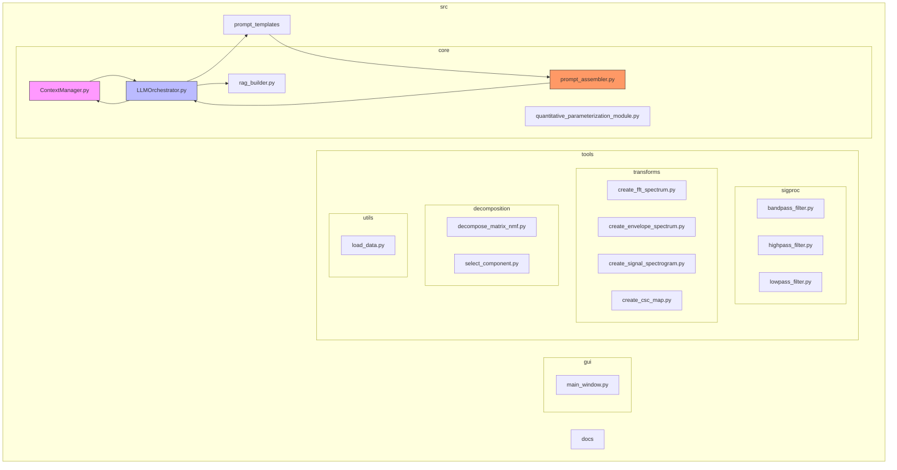
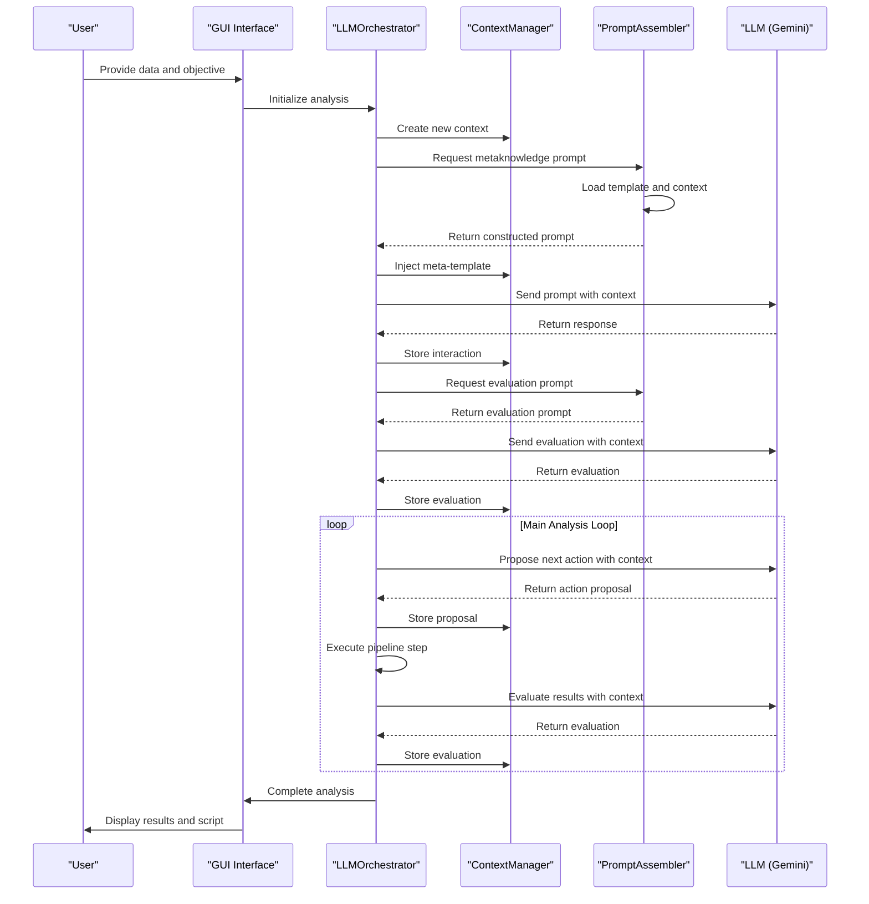
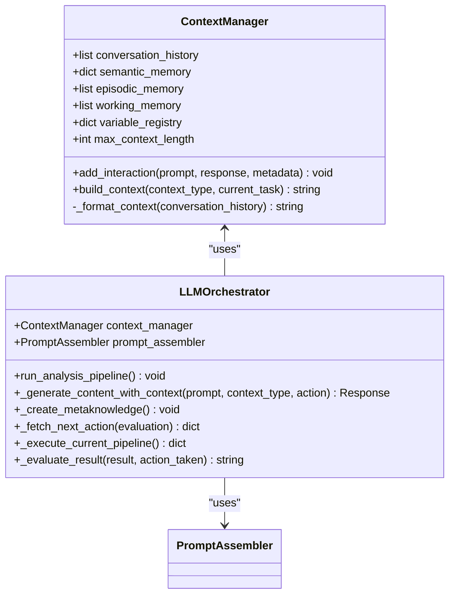
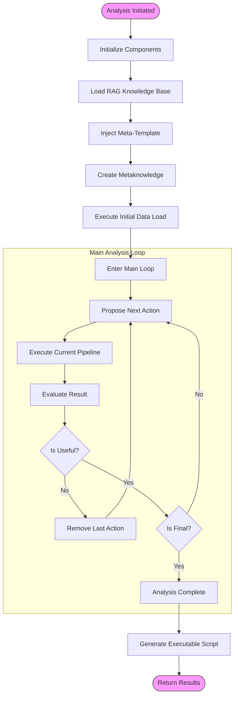
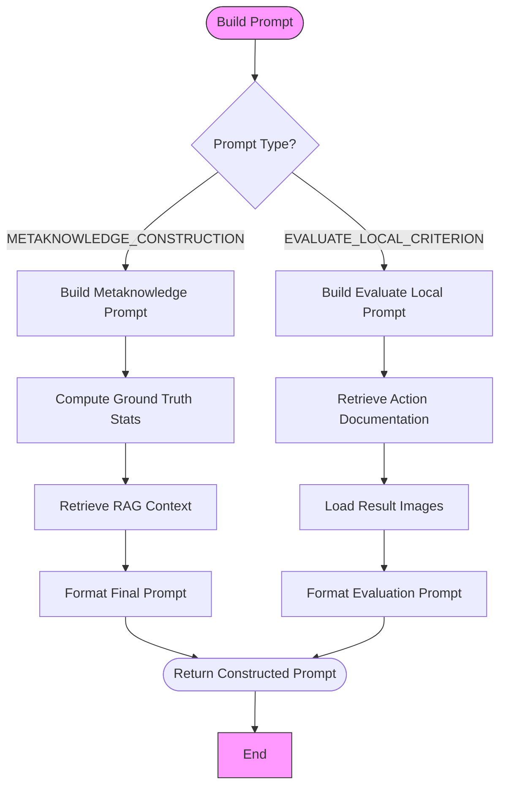

# Context-Aware Prompt Engineering

<cite>
**Referenced Files in This Document**   
- [ContextManager.py](file://src/core/ContextManager.py)
- [LLMOrchestrator.py](file://src/core/LLMOrchestrator.py)
- [prompt_assembler.py](file://src/core/prompt_assembler.py)
- [PERSISTENT_CONTEXT_IMPLEMENTATION.md](file://PERSISTENT_CONTEXT_IMPLEMENTATION.md)
- [PROJECT_DESCRIPTION.md](file://PROJECT_DESCRIPTION.md)
- [README.md](file://README.md)
- [meta_template_prompt_v2.txt](file://src/prompt_templates/meta_template_prompt_v2.txt)
- [metaknowledge_prompt_v2.txt](file://src/prompt_templates/metaknowledge_prompt_v2.txt)
- [evaluate_local_prompt_v2.txt](file://src/prompt_templates/evaluate_local_prompt_v2.txt)
</cite>

## Table of Contents
1. [Introduction](#introduction)
2. [Project Structure](#project-structure)
3. [Core Components](#core-components)
4. [Architecture Overview](#architecture-overview)
5. [Detailed Component Analysis](#detailed-component-analysis)
6. [Contextual Prompt Assembly](#contextual-prompt-assembly)
7. [Context Injection Implementation](#context-injection-implementation)
8. [API Interfaces for Context-Aware Templates](#api-interfaces-for-context-aware-templates)
9. [Integration with ContextManager](#integration-with-contextmanager)
10. [Practical Examples of Contextual Prompts](#practical-examples-of-contextual-prompts)
11. [Troubleshooting Common Context Issues](#troubleshooting-common-context-issues)
12. [Conclusion](#conclusion)

## Introduction

Context-Aware Prompt Engineering is a critical component of the AIDA (AI-Driven Analyzer) system, enabling autonomous data analysis through persistent context management and intelligent prompt construction. This documentation provides a comprehensive analysis of the contextual prompt engineering framework, focusing on the architecture of contextual prompt assembly, implementation of context injection, API interfaces for context-aware templates, and integration patterns with the ContextManager.

The AIDA system leverages Large Language Models (LLMs) to autonomously design and execute data processing pipelines without manual intervention. At the heart of this capability is a sophisticated context management system that maintains conversation history, learns from previous interactions, and injects relevant context into LLM prompts to improve analysis consistency and decision quality.

This document details how the system implements context-aware prompt engineering to transform AIDA from a stateless tool into an intelligent system that learns and adapts throughout the analysis process, providing a foundation for future capabilities like free-form code generation and meta-learning.

## Project Structure

The AIDA project follows a modular, feature-based organization that separates concerns and enables extensibility. The structure is designed to support autonomous analysis workflows with clear separation between core orchestration logic, domain-specific tools, and user interface components.



**Diagram sources**
- [ContextManager.py](file://src/core/ContextManager.py)
- [LLMOrchestrator.py](file://src/core/LLMOrchestrator.py)
- [prompt_assembler.py](file://src/core/prompt_assembler.py)

**Section sources**
- [README.md](file://README.md#L0-L297)
- [PROJECT_DESCRIPTION.md](file://PROJECT_DESCRIPTION.md#L0-L393)

## Core Components

The context-aware prompt engineering system in AIDA consists of three core components that work together to enable intelligent, context-aware interactions with the LLM: the ContextManager, LLMOrchestrator, and PromptAssembler. These components form a cohesive architecture that manages conversation history, builds contextual prompts, and orchestrates the analysis pipeline.

The ContextManager serves as the central repository for conversation history and learned patterns, maintaining state across analysis steps. The LLMOrchestrator coordinates the end-to-end analysis workflow, leveraging context to make informed decisions about the next steps in the pipeline. The PromptAssembler constructs context-aware prompts by combining static templates with dynamic context from the ContextManager and other sources.

Together, these components enable AIDA to maintain variable naming consistency, learn from successful and failed attempts, recover from errors with context awareness, and build upon previous understanding rather than starting fresh with each interaction.

**Section sources**
- [ContextManager.py](file://src/core/ContextManager.py#L1-L44)
- [LLMOrchestrator.py](file://src/core/LLMOrchestrator.py#L1-L725)
- [prompt_assembler.py](file://src/core/prompt_assembler.py#L1-L178)

## Architecture Overview

The context-aware prompt engineering architecture in AIDA follows a layered design that separates concerns while enabling tight integration between components. The architecture is built around the principle of maintaining persistent context across analysis steps to improve decision quality and analysis consistency.



**Diagram sources**
- [LLMOrchestrator.py](file://src/core/LLMOrchestrator.py#L1-L725)
- [ContextManager.py](file://src/core/ContextManager.py#L1-L44)
- [prompt_assembler.py](file://src/core/prompt_assembler.py#L1-L178)

## Detailed Component Analysis

### ContextManager Analysis

The ContextManager is the cornerstone of AIDA's context-aware capabilities, providing persistent storage for conversation history and learned patterns. It enables the system to maintain memory across analysis steps, leading to more consistent and intelligent decision-making.



**Diagram sources**
- [ContextManager.py](file://src/core/ContextManager.py#L1-L44)
- [LLMOrchestrator.py](file://src/core/LLMOrchestrator.py#L1-L725)

**Section sources**
- [ContextManager.py](file://src/core/ContextManager.py#L1-L44)
- [PERSISTENT_CONTEXT_IMPLEMENTATION.md](file://PERSISTENT_CONTEXT_IMPLEMENTATION.md#L0-L618)

### LLMOrchestrator Analysis

The LLMOrchestrator serves as the central decision-making engine in AIDA, coordinating the entire analysis workflow and leveraging context to make informed decisions. It manages the pipeline of structured actions, executes steps as generated scripts, evaluates results, and iteratively proposes next actions.

The orchestrator integrates tightly with the ContextManager to maintain conversation history and inject context into LLM interactions. It also interfaces with the PromptAssembler to construct context-aware prompts for different stages of the analysis pipeline.



**Diagram sources**
- [LLMOrchestrator.py](file://src/core/LLMOrchestrator.py#L1-L725)

**Section sources**
- [LLMOrchestrator.py](file://src/core/LLMOrchestrator.py#L1-L725)
- [PROJECT_DESCRIPTION.md](file://PROJECT_DESCRIPTION.md#L0-L393)

### PromptAssembler Analysis

The PromptAssembler is responsible for constructing concrete prompts for different stages of the analysis pipeline. It loads text templates from files and assembles prompts for metaknowledge construction, local evaluation, tool selection, and attempt refinement.

The assembler integrates RAG (Retrieval-Augmented Generation) to enhance prompts with domain-specific knowledge, improving the quality of LLM responses. It also supports multimodal prompts by incorporating images into the prompt construction process.



**Diagram sources**
- [prompt_assembler.py](file://src/core/prompt_assembler.py#L1-L178)

**Section sources**
- [prompt_assembler.py](file://src/core/prompt_assembler.py#L1-L178)
- [PERSISTENT_CONTEXT_IMPLEMENTATION.md](file://PERSISTENT_CONTEXT_IMPLEMENTATION.md#L0-L618)

## Contextual Prompt Assembly

Contextual prompt assembly in AIDA involves the systematic construction of prompts that incorporate relevant context from previous interactions, domain knowledge, and current analysis state. This process transforms simple, isolated prompts into rich, context-aware instructions that enable more intelligent LLM responses.

The prompt assembly process follows a structured workflow that begins with template loading and proceeds through context gathering, information integration, and final prompt construction. This ensures that each prompt contains the necessary information for the LLM to make informed decisions while maintaining consistency with previous analysis steps.

### Template Management System

The template management system in AIDA loads and organizes prompt templates from text files, making them available for dynamic assembly. Templates are stored in the `src/prompt_templates/` directory and loaded into memory during initialization.

```python
def _load_prompt_templates(self) -> dict:
    """A utility function to load all .txt prompt templates from a directory."""
    templates = {}
    template_dir = "src/prompt_templates"
    for filename in os.listdir(template_dir):
        if filename.endswith(".txt"):
            template_name = filename.replace('.txt', '')
            with open(os.path.join(template_dir, filename), 'r') as f:
                templates[template_name] = f.read()
    return templates
```

The system supports multiple template variants (e.g., `metaknowledge_prompt.txt` and `metaknowledge_prompt_v2.txt`), allowing for iterative improvement of prompt designs without disrupting existing functionality.

### Metaknowledge Prompt Construction

The metaknowledge prompt construction process creates a structured JSON representation of the analysis context by combining user input, data characteristics, and retrieved domain knowledge. This process ensures that the LLM has a comprehensive understanding of the analysis objective and data characteristics.

The construction process involves three key steps:
1. **Ground Truth Computation**: Calculate objective facts directly from the data (signal length, sample count, sampling frequency)
2. **RAG Context Retrieval**: Query the knowledge base for domain-specific information related to the user's description and objective
3. **Template Assembly**: Combine the gathered information with a static template to create the final prompt

```python
def _build_metaknowledge_prompt(self, context_bundle: dict) -> str:
    # Compute ground truth statistics
    signal_length_sec = len(context_bundle['raw_signal_data']) / context_bundle['sampling_frequency']
    number_of_samples = len(context_bundle['raw_signal_data'])
    
    # Create formatted string of ground truth facts
    ground_truth_summary = f"""
- Signal Length: {signal_length_sec:.2f} seconds
    - Total Samples: {number_of_samples}
    - Sampling Frequency: {context_bundle['sampling_frequency']} Hz"""
    
    # Retrieve relevant context using RAG
    rag_query = context_bundle['user_data_description'] + " " + context_bundle['user_analysis_objective']
    retrieved_docs = context_bundle['rag_retriever'].invoke(rag_query)
    retrieved_docs_tools = context_bundle['rag_retriever_tools'].invoke(rag_query)
    
    # Format retrieved documents
    rag_context_str = "\n\n".join([f"Context Snippet {i+1}:\n{doc.page_content}" for i, doc in enumerate(retrieved_docs)])
    rag_context_str_tools = "\n\n".join([f"Context Snippet {i+1}:\n{doc.page_content}" for i, doc in enumerate(retrieved_docs_tools)])
    
    # Assemble final prompt using template
    final_prompt = self.templates['metaknowledge_prompt_v2'].format(
        ground_truth_summary=ground_truth_summary,
        rag_context=rag_context_str,
        rag_context_tools=rag_context_str_tools,
        tools_list=context_bundle['tools_list'],
        user_data_description=context_bundle['user_data_description'],
        user_analysis_objective=context_bundle['user_analysis_objective']
    )
    return final_prompt
```

### Evaluation Prompt Construction

The evaluation prompt construction process creates prompts for assessing the usefulness of analysis results, incorporating visual and quantitative feedback. This process enables the LLM to evaluate results in context, considering previous steps and the overall analysis objective.

The evaluation prompt includes:
- **Metaknowledge**: The structured analysis context
- **Action Documentation**: Documentation for the tool that produced the results
- **Result History**: Previous analysis steps and outcomes
- **Visual Evidence**: Images of the current and previous results
- **Parameter Information**: Parameters used in the current step

```python
def _build_evaluate_local_prompt(self, context_bundle: dict) -> str:
    # Retrieve relevant context using RAG
    rag_query = context_bundle['user_data_description'] + " " + context_bundle['user_analysis_objective'] + " " + context_bundle['last_action'].get('tool_name') + " next steps"
    retrieved_docs = context_bundle['rag_retriever'].invoke(rag_query)
    retrieved_docs_tools = context_bundle['rag_retriever_tools'].invoke(rag_query)
    
    # Format retrieved documents
    rag_context_str = "\n\n".join([f"Context Snippet {i+1}:\n{doc.page_content}" for i, doc in enumerate(retrieved_docs)])
    rag_context_str_tools = "\n\n".join([f"Context Snippet {i+1}:\n{doc.page_content}" for i, doc in enumerate(retrieved_docs_tools)])
    
    # Load result images for multimodal evaluation
    ipath = context_bundle["last_result"]["image_path"]
    supporting_image = Image.open(ipath)
    image_prompts = ['Main image for evaluation: ']
    image_prompts.append(ipath.split('\\')[-1])
    image_prompts.append(supporting_image)
    
    # Include supporting images from result history
    for result in result_history:
        if len(result["data"].get("supporting_image_paths",[]))>0:
            image_prompts.append('Supporting images for evaluation (plots of all results):\n')
            for ipath in result["data"].get("supporting_image_paths",[]):
                supporting_image0 = result["data"]["supporting_image_paths"].get(f"{ipath}")
                supporting_image = Image.open(supporting_image0)
                image_prompts.append(ipath.split('/')[-1])
                image_prompts.append(supporting_image)
    
    # Retrieve action documentation
    action_documentation_path = ""
    fname = context_bundle["last_action"].get('tool_name') + ".md"
    for root, dirs, files in os.walk('src/tools/',topdown=True):
        for name in files:
            if fnmatch.fnmatch(name, fname):
                action_documentation_path = os.path.join(root, name)
                break
    
    with open(action_documentation_path, 'r') as f:
        fileString = f.read()
        tool_doc = fileString
    
    # Get parameters from last result
    last_result_params = context_bundle['last_result']['data']['new_params'] if 'new_params' in context_bundle['last_result']['data'] else {}
    
    # Construct final prompt
    prompt0 = self.templates['evaluate_local_prompt_v2'].format(
        metaknowledge=context_bundle['metaknowledge'],
        last_action_documenation=tool_doc,
        tools_list=tools_list,
        result_history=result_history,
        sequence_steps=json.dumps(context_bundle['sequence_steps'], indent=4),
        last_result_params=last_result_params
    )
    
    prompt=[prompt0,*image_prompts]
    return prompt
```

**Section sources**
- [prompt_assembler.py](file://src/core/prompt_assembler.py#L1-L178)
- [PERSISTENT_CONTEXT_IMPLEMENTATION.md](file://PERSISTENT_CONTEXT_IMPLEMENTATION.md#L0-L618)

## Context Injection Implementation

Context injection in AIDA is implemented through the ContextManager class, which maintains conversation history and injects relevant context into LLM prompts. This implementation transforms the system from stateless interactions to a context-aware, learning-capable analyzer.

### Context Storage Strategy

The ContextManager implements a comprehensive context storage strategy that captures multiple dimensions of the analysis process:

```python
class ContextManager:
    def __init__(self):
        self.conversation_history = []
        self.semantic_memory = {}      # Learned patterns
        self.episodic_memory = []      # Time-ordered events
        self.working_memory = []       # Current session state
        self.variable_registry = {}    # Variable states
        self.max_context_length = 50000
```

Each interaction with the LLM is stored as a structured entry containing:
- **Timestamp**: When the interaction occurred
- **Step Number**: The sequence in the analysis pipeline
- **Interaction Type**: Analysis proposal, evaluation, or error recovery
- **Prompt**: The full prompt sent to the LLM
- **Response**: The LLM's response
- **Metadata**: Additional information about the interaction

```python
def add_interaction(self, prompt, response, metadata):
    """Add interaction to conversation history"""
    history_entry = {
        'timestamp': datetime.now(),
        'step_number': metadata.get('step_number'),
        'interaction_type': metadata.get('interaction_type'),
        'prompt': prompt,
        'response': response,
        'metadata': metadata
    }
    self.conversation_history.append(history_entry)
```

### Context Building Process

The context building process formats the conversation history into a string that can be prepended to current prompts, providing the LLM with relevant context from previous interactions:

```python
def build_context(self, context_type, current_task):
    """Build contextual prompt for LLM"""
    formatted_context = self._format_context(self.conversation_history)
    
    # Prepend context to current task prompt
    return f"--- CONTEXT: ---\n\n{formatted_context}\n\n--- END OF CONTEXT ---\n\n{current_task}"

def _format_context(self, conversation_history):
    """Formats conversation history into a string for the prompt."""
    if not conversation_history:
        return "No conversation history yet."
    
    formatted_history = []
    for entry in conversation_history:
        formatted_history.append(f"On {entry['timestamp']}, the following interaction occurred:")
        formatted_history.append(f"Prompt: {entry['prompt']}")
        formatted_history.append(f"Response: {entry['response']}")
        formatted_history.append("-" * 20)
        
    return "\n".join(formatted_history)
```

### Integration with LLMOrchestrator

The LLMOrchestrator integrates with the ContextManager to enable context-aware LLM interactions. The `_generate_content_with_context` method is the primary interface for context injection:

```python
def _generate_content_with_context(self, prompt, context_type="analysis", action=None):
    """
    Generates content using the LLM with added conversation context.
    """
    # Build contextual prompt
    contextual_prompt = self.context_manager.build_context(context_type, prompt)
    
    response = None
    try:
        # Call LLM with contextual prompt
        response = self.model.generate_content(contextual_prompt)
        self.log_queue.put(("log", {"sender": "LLM Orchestrator", "message": f"--- ACTIVE MODEL: {self.model_name} ---"}))
        
        # Add interaction to context history
        metadata = self._get_metadata(action)
        self.context_manager.add_interaction(prompt, response.text, metadata)
        
        return response
    except Exception as e:
        self.log_queue.put(("log", {"sender": "LLM Orcheator (Error)", "message": f"Error calling Gemini API: {e}"}))
        # Add failed interaction to context
        metadata = self._get_metadata(action)
        metadata['error'] = str(e)
        self.context_manager.add_interaction(prompt, "ERROR", metadata)
        raise
```

The orchestrator uses this method throughout the analysis pipeline, including during metaknowledge construction, action proposal, and result evaluation.

### Initialization and Context Seeding

The analysis pipeline is initialized with a meta-template that sets the system persona and analysis objectives, providing a foundation for subsequent context accumulation:

```python
def run_analysis_pipeline(self):
    # Inject the meta-template into the context at the beginning
    meta_template = self.prompt_assembler.templates['meta_template_prompt_v2']
    self.context_manager.add_interaction(meta_template, "Initial context set.", self._get_metadata())
    self._create_metaknowledge()
    self.context_manager.add_interaction(str(self.metaknowledge), "Metaknowledge created.", self._get_metadata())
    self.context_manager.add_interaction(self.tools_reference, "Tools list loaded.", self._get_metadata())
```

This initialization ensures that the system starts with a consistent understanding of its role, capabilities, and the current analysis objective.

**Section sources**
- [ContextManager.py](file://src/core/ContextManager.py#L1-L44)
- [LLMOrchestrator.py](file://src/core/LLMOrchestrator.py#L1-L725)

## API Interfaces for Context-Aware Templates

The API interfaces for context-aware templates in AIDA provide a structured way to construct prompts that incorporate dynamic context while maintaining consistency with predefined templates. These interfaces enable the system to generate rich, context-aware prompts for different stages of the analysis pipeline.

### PromptAssembler Public Interface

The PromptAssembler class exposes a simple public interface for building prompts, abstracting away the complexity of template management and context integration:

```python
def build_prompt(self, prompt_type: str, context_bundle: dict) -> str:
    """
    The main entry point. It takes the desired prompt type and a bundle
    of all necessary context, then routes to the correct handler.
    
    Args:
        prompt_type (str): The type of prompt to build (e.g., "METAKNOWLEDGE_CONSTRUCTION")
        context_bundle (dict): A dictionary containing all necessary context for prompt construction
        
    Returns:
        str or list: The fully constructed prompt, which may include text and image objects
    """
    if prompt_type == "METAKNOWLEDGE_CONSTRUCTION":
        temp_prompt = self._build_metaknowledge_prompt(context_bundle)
    elif prompt_type == "EVALUATE_LOCAL_CRITERION":
        temp_prompt = self._build_evaluate_local_prompt(context_bundle)
    else:
        raise ValueError(f"Unknown prompt type: {prompt_type}")
    return temp_prompt
```

### Context Bundle Structure

The context bundle is a dictionary that contains all necessary information for prompt construction. Its structure varies depending on the prompt type but generally includes:

**For Metaknowledge Construction:**
- `raw_signal_data`: The actual 1D vibration signal
- `sampling_frequency`: The signal's sampling rate
- `user_data_description`: The user's description of the data
- `user_analysis_objective`: The user's analysis objective
- `rag_retriever`: The retriever object for the knowledge base
- `rag_retriever_tools`: The retriever object for tool documentation
- `tools_list`: The list of available tools

**For Evaluation:**
- `metaknowledge`: The structured analysis context
- `last_action`: The action that produced the results being evaluated
- `last_result`: The result to be evaluated
- `sequence_steps`: The history of pipeline steps
- `rag_retriever`: The retriever object for the knowledge base
- `rag_retriever_tools`: The retriever object for tool documentation
- `tools_list`: The list of available tools
- `user_data_description`: The user's description of the data
- `user_analysis_objective`: The user's analysis objective
- `result_history`: The history of previous results

### Template Variables

The template system uses named placeholders that are replaced with actual values during prompt construction. Key template variables include:

**Metaknowledge Template Variables:**
- `{ground_truth_summary}`: Objective facts calculated from the data
- `{rag_context}`: Retrieved domain knowledge snippets
- `{rag_context_tools}`: Retrieved tool documentation snippets
- `{tools_list}`: The complete list of available tools
- `{user_data_description}`: The user's description of the data
- `{user_analysis_objective}`: The user's analysis objective

**Evaluation Template Variables:**
- `{metaknowledge}`: The structured analysis context
- `{last_action_documenation}`: Documentation for the tool being evaluated
- `{tools_list}`: The complete list of available tools
- `{result_history}`: History of previous results
- `{sequence_steps}`: JSON representation of the pipeline steps
- `{last_result_params}`: Parameters used in the current step

### Error Handling and Fallbacks

The template system includes robust error handling to ensure reliable prompt construction:

```python
def _load_prompt_templates(self) -> dict:
    """A utility function to load all .txt prompt templates from a directory."""
    templates = {}
    template_dir = "src/prompt_templates"
    for filename in os.listdir(template_dir):
        if filename.endswith(".txt"):
            template_name = filename.replace('.txt', '')
            try:
                with open(os.path.join(template_dir, filename), 'r') as f:
                    templates[template_name] = f.read()
            except Exception as e:
                print(f"Error loading template {filename}: {e}")
                templates[template_name] = f"ERROR: Template {filename} could not be loaded"
    return templates
```

If a template cannot be loaded, the system provides a fallback message rather than failing completely, ensuring that the analysis can continue with degraded functionality.

**Section sources**
- [prompt_assembler.py](file://src/core/prompt_assembler.py#L1-L178)
- [PERSISTENT_CONTEXT_IMPLEMENTATION.md](file://PERSISTENT_CONTEXT_IMPLEMENTATION.md#L0-L618)

## Integration with ContextManager

The integration between the LLMOrchestrator and ContextManager is a critical aspect of AIDA's context-aware capabilities. This integration enables the system to maintain conversation history, learn from previous interactions, and make context-aware decisions throughout the analysis pipeline.

### Initialization and Context Setup

The integration begins during the initialization of the LLMOrchestrator, where the ContextManager is instantiated and seeded with initial context:

```python
def __init__(self, user_data_description, user_objective, run_id, loaded_data, signal_var_name, fs_var_name, log_queue):
    # Initialize core components
    self.log_queue = log_queue
    self.prompt_assembler = PromptAssembler()
    self.context_manager = ContextManager()
    # ... other initialization code ...
```

The analysis pipeline is initialized with a meta-template that establishes the system persona and analysis objectives:

```python
def run_analysis_pipeline(self):
    # Inject the meta-template into the context at the beginning
    meta_template = self.prompt_assembler.templates['meta_template_prompt_v2']
    self.context_manager.add_interaction(meta_template, "Initial context set.", self._get_metadata())
    self._create_metaknowledge()
    self.context_manager.add_interaction(str(self.metaknowledge), "Metaknowledge created.", self._get_metadata())
    self.context_manager.add_interaction(self.tools_reference, "Tools list loaded.", self._get_metadata())
```

### Context-Aware LLM Interactions

All LLM interactions in the orchestrator are context-aware, using the `_generate_content_with_context` method to include relevant history in prompts:

```python
def _create_metaknowledge(self):
    # ... context bundle construction ...
    prompt = self.prompt_assembler.build_prompt(
        prompt_type="METAKNOWLEDGE_CONSTRUCTION",
        context_bundle=context_bundle
    )
    # Use context-aware generation
    response = self._generate_content_with_context(prompt, context_type="metaknowledge")
    # ... response processing ...
```

```python
def _evaluate_result(self, result, action_taken):
    # ... context bundle construction ...
    prompt = self.prompt_assembler.build_prompt(
        prompt_type="EVALUATE_LOCAL_CRITERION",
        context_bundle=context_bundle
    )
    # Use context-aware generation with evaluation context
    response = self._generate_content_with_context(prompt, context_type="evaluation", action=action_taken)
    # ... response processing ...
```

### Metadata Management

The integration includes comprehensive metadata management, capturing important information about each interaction:

```python
def _get_metadata(self, action=None):
    """Gathers metadata for the current context."""
    metadata = {
        'run_id': self.run_id,
        'step_number': len(self.pipeline_steps),
        'model_name': self.model_name,
        'timestamp': f"run_{datetime.now().strftime('%Y%m%d_%H%M%S')}"
    }
    if action:
        metadata['tool_selected'] = action.get('tool_name')
        metadata['parameters'] = action.get('params')
    return metadata
```

This metadata is stored with each interaction, enabling detailed analysis of the decision-making process and facilitating debugging and performance optimization.

### Error Recovery and Context Preservation

The integration includes robust error recovery mechanisms that preserve context even when LLM interactions fail:

```python
def _generate_content_with_context(self, prompt, context_type="analysis", action=None):
    try:
        response = self.model.generate_content(contextual_prompt)
        # ... success handling ...
        return response
    except Exception as e:
        # Add failed interaction to context with error information
        metadata = self._get_metadata(action)
        metadata['error'] = str(e)
        self.context_manager.add_interaction(prompt, "ERROR", metadata)
        raise
```

This ensures that the system maintains a complete record of all interactions, including failures, which can be valuable for learning and debugging.

**Section sources**
- [LLMOrchestrator.py](file://src/core/LLMOrchestrator.py#L1-L725)
- [ContextManager.py](file://src/core/ContextManager.py#L1-L44)

## Practical Examples of Contextual Prompts

This section provides practical examples of contextual prompts generated by the AIDA system, illustrating how context is injected into different types of prompts to improve analysis quality and consistency.

### Example 1: Metaknowledge Construction Prompt

The metaknowledge construction prompt combines user input, data characteristics, and retrieved domain knowledge to create a structured analysis context:

```
--- CONTEXT: ---
No conversation history yet.
--- END OF CONTEXT ---

Based on the user's description of the data and analysis objective, create a structured JSON object that captures the essential characteristics of the signal and the analysis goals.

Ground Truth Summary:
- Signal Length: 10.24 seconds
    - Total Samples: 10240
    - Sampling Frequency: 1000 Hz

Retrieved Context:
Context Snippet 1:
Inner race faults in bearings typically produce characteristic frequencies that can be calculated based on bearing geometry. The ball pass frequency inner race (BPFI) is given by BPFI = (N/2) * (1 + (d/D)*cos(θ)) * RPM/60, where N is the number of rolling elements, d is the roller diameter, D is the pitch diameter, θ is the contact angle, and RPM is the shaft speed.

Context Snippet 2:
When analyzing vibration signals for bearing faults, it's important to consider both time-domain and frequency-domain characteristics. Envelope spectrum analysis is particularly effective for detecting early-stage bearing faults as it can reveal high-frequency resonances modulated by fault-related impacts.

Tools List:
Available tools include: bandpass_filter, highpass_filter, lowpass_filter, create_csc_map, create_envelope_spectrum, create_fft_spectrum, create_signal_spectrogram, decompose_matrix_nmf, select_component, load_data.

User Data Description:
Vibration signal from a rotating machine bearing, sampled at 1000 Hz for approximately 10 seconds.

User Analysis Objective:
Detect potential bearing faults in the vibration signal.
```

### Example 2: Evaluation Prompt with Visual Context

The evaluation prompt includes both textual context and visual evidence, enabling multimodal assessment of analysis results:

```
--- CONTEXT: ---
On 2025-08-26 14:30:25.123456, the following interaction occurred:
Prompt: [Metaknowledge Construction Prompt as above]
Response: {"data_summary": {"signal_length_sec": 10.24, "total_samples": 10240, "sampling_frequency_hz": 1000, "dominant_frequency_range_hz": "1500-2500", "amplitude_range_g": "0.1-0.8"}, "analysis_objectives": ["detect bearing faults", "identify characteristic fault frequencies", "assess severity of any detected faults"], "recommended_approach": ["perform FFT analysis to identify dominant frequencies", "apply envelope spectrum analysis to detect amplitude modulation", "use bandpass filtering to isolate frequency bands of interest"]}
--------------------
On 2025-08-26 14:30:30.678901, the following interaction occurred:
Prompt: [FFT Spectrum Analysis Prompt]
Response: {"tool_name": "create_fft_spectrum", "params": {"input_signal": "loaded_signal", "image_path": "./run_state/20250826_143025/step_1_fft_spectrum.png"}, "output_variable": "fft_spectrum_1", "justification": "FFT analysis will reveal the frequency content of the signal, which is essential for identifying characteristic bearing fault frequencies."}
--------------------
--- END OF CONTEXT ---

Evaluate the results of the FFT spectrum analysis to determine if they are useful for detecting bearing faults.

Metaknowledge:
{"data_summary": {"signal_length_sec": 10.24, "total_samples": 10240, "sampling_frequency_hz": 1000, "dominant_frequency_range_hz": "1500-2500", "amplitude_range_g": "0.1-0.8"}, "analysis_objectives": ["detect bearing faults", "identify characteristic fault frequencies", "assess severity of any detected faults"], "recommended_approach": ["perform FFT analysis to identify dominant frequencies", "apply envelope spectrum analysis to detect amplitude modulation", "use bandpass filtering to isolate frequency bands of interest"]}

Last Action Documentation:
## create_fft_spectrum
Creates a frequency spectrum plot of the input signal using FFT.

Parameters:
- input_signal: The time-domain signal to analyze
- image_path: Path where the spectrum plot will be saved
- sampling_frequency: Sampling frequency of the signal (optional, can be inferred)

Returns:
- Dictionary containing the frequency spectrum data and image path

Tools List:
Available tools include: bandpass_filter, highpass_filter, lowpass_filter, create_csc_map, create_envelope_spectrum, create_fft_spectrum, create_signal_spectrogram, decompose_matrix_nmf, select_component, load_data.

Result History:
[Previous results would be listed here]

Sequence Steps:
[
    {
        "action_id": 0,
        "tool_name": "load_data",
        "params": {
            "signal_data": "signal_var",
            "sampling_rate": "fs_var",
            "output_image_path": "./run_state/20250826_143025/step0_loaded_data.png"
        },
        "output_variable": "loaded_signal"
    },
    {
        "action_id": 1,
        "tool_name": "create_fft_spectrum",
        "params": {
            "input_signal": "loaded_signal",
            "image_path": "./run_state/20250826_143025/step_1_fft_spectrum.png"
        },
        "output_variable": "fft_spectrum_1"
    }
]

Last Result Parameters:
{}
```

### Example 3: Context-Aware Action Proposal

The action proposal prompt includes context from previous steps, enabling the LLM to make informed decisions about the next analysis step:

```
--- CONTEXT: ---
On 2025-08-26 14:30:25.123456, the following interaction occurred:
Prompt: [Metaknowledge Construction Prompt]
Response: {"data_summary": {"signal_length_sec": 10.24, "total_samples": 10240, "sampling_frequency_hz": 1000, "dominant_frequency_range_hz": "1500-2500", "amplitude_range_g": "0.1-0.8"}, "analysis_objectives": ["detect bearing faults", "identify characteristic fault frequencies", "assess severity of any detected faults"], "recommended_approach": ["perform FFT analysis to identify dominant frequencies", "apply envelope spectrum analysis to detect amplitude modulation", "use bandpass filtering to isolate frequency bands of interest"]}
--------------------
On 2025-08-26 14:30:30.678901, the following interaction occurred:
Prompt: [FFT Spectrum Analysis Prompt]
Response: {"tool_name": "create_fft_spectrum", "params": {"input_signal": "loaded_signal", "image_path": "./run_state/20250826_143025/step_1_fft_spectrum.png"}, "output_variable": "fft_spectrum_1", "justification": "FFT analysis will reveal the frequency content of the signal, which is essential for identifying characteristic bearing fault frequencies."}
--------------------
On 2025-08-26 14:30:35.234567, the following interaction occurred:
Prompt: [FFT Result Evaluation Prompt]
Response: {"is_useful": true, "is_final": false, "tool_name": "create_envelope_spectrum", "input_variable": "loaded_signal", "params": {"frequency_band": "1500-2500"}, "justification": "The FFT analysis revealed dominant frequencies in the 1500-2500 Hz range, which is consistent with potential bearing faults. Envelope spectrum analysis should be performed on this frequency band to detect amplitude modulation characteristic of bearing faults."}
--------------------
--- END OF CONTEXT ---

Based on the evaluation of the FFT spectrum results, propose the next action in the analysis pipeline.

The FFT analysis was useful and revealed dominant frequencies in the 1500-2500 Hz range. The evaluation recommended performing envelope spectrum analysis on this frequency band to detect amplitude modulation characteristic of bearing faults.

Available tools include: bandpass_filter, highpass_filter, lowpass_filter, create_csc_map, create_envelope_spectrum, create_fft_spectrum, create_signal_spectrogram, decompose_matrix_nmf, select_component, load_data.

What should be the next step in the analysis pipeline?
```

**Section sources**
- [PERSISTENT_CONTEXT_IMPLEMENTATION.md](file://PERSISTENT_CONTEXT_IMPLEMENTATION.md#L0-L618)
- [PROJECT_DESCRIPTION.md](file://PROJECT_DESCRIPTION.md#L0-L393)

## Troubleshooting Common Context Issues

This section addresses common issues related to context management in AIDA and provides guidance for diagnosis and resolution.

### Issue 1: Context Size Limit Exceeded

**Symptoms:**
- Analysis pipeline slows down significantly over time
- LLM responses become less coherent or relevant
- Memory usage increases steadily during analysis
- "Context length exceeded" errors in logs

**Root Cause:**
The ContextManager stores all interactions in memory without compression, potentially leading to unbounded context growth. The default maximum context length is 50,000 characters, but complex analyses with many steps can exceed this limit.

**Solutions:**
1. **Implement Context Compression**: Add a method to summarize older interactions while preserving key information:
```python
def compress_context(self):
    """Compress old context while preserving key information"""
    if len(str(self.conversation_history)) < self.max_context_length * 0.8:
        return  # No compression needed
        
    # Keep recent interactions as-is
    recent_count = max(1, len(self.conversation_history) // 4)
    compressed = self.conversation_history[-recent_count:]
    
    # Summarize older interactions
    for entry in self.conversation_history[:-recent_count]:
        compressed.append(self._summarize_entry(entry))
        
    self.conversation_history = compressed
```

2. **Configure Context Size**: Adjust the `max_context_length` parameter based on available memory and analysis requirements.

3. **Periodic Reset**: Implement a mechanism to reset context at logical breakpoints in the analysis.

### Issue 2: Inconsistent Variable Naming

**Symptoms:**
- Generated scripts fail due to undefined variables
- Pipeline steps cannot access outputs from previous steps
- Error messages indicate "variable not found" or "name error"

**Root Cause:**
The system relies on consistent variable naming across pipeline steps, but the LLM may generate inconsistent names. The variable registry in ContextManager is not being properly maintained or referenced.

**Solutions:**
1. **Enforce Variable Registry**: Ensure all pipeline steps use variables from the registry:
```python
def _fetch_next_action(self, evaluation):
    # Ensure input variable comes from variable registry
    input_variable = json.loads(evaluation).get('input_variable')
    if input_variable not in self.context_manager.variable_registry:
        # Fall back to last output variable
        input_variable = f"output_{len(self.pipeline_steps)-1}"
    
    # Register output variable
    output_variable = f"{tool_name}_{len(self.pipeline_steps)}"
    self.context_manager.variable_registry[output_variable] = {
        'type': 'signal',
        'created_step': len(self.pipeline_steps),
        'source': input_variable
    }
```

2. **Add Validation**: Implement validation to check variable references before executing pipeline steps.

3. **Improve Prompt Design**: Enhance prompts to emphasize the importance of consistent variable naming.

### Issue 3: Context Pollution

**Symptoms:**
- LLM makes irrelevant or inappropriate tool selections
- Analysis pipeline diverges from the original objective
- Increasing number of unproductive steps
- Difficulty recovering from errors

**Root Cause:**
Irrelevant or low-quality interactions are polluting the context, influencing subsequent decisions. The system lacks mechanisms to filter or de-prioritize less relevant context.

**Solutions:**
1. **Implement Relevance Scoring**: Assign relevance scores to context entries and prioritize the most relevant ones:
```python
def _score_relevance(self, entry, current_objective):
    """Score how relevant a context entry is to the current objective"""
    score = 0.0
    
    # Time decay (recent entries are more relevant)
    hours_old = (datetime.now() - entry['timestamp']).total_seconds() / 3600
    score += max(0.1, 1.0 - hours_old/24) * 0.3
    
    # Similarity to current objective
    similarity = self._calculate_text_similarity(
        current_objective, 
        entry['prompt'] + " " + entry['response']
    )
    score += similarity * 0.4
    
    # Success rate of similar approaches
    if entry['metadata'].get('execution_success', False):
        score += 0.3
        
    return score
```

2. **Context Filtering**: Implement filters to exclude low-relevance entries from prompts.

3. **Learning from Success**: Weight successful approaches more heavily in context.

### Issue 4: Failed Context Initialization

**Symptoms:**
- Analysis starts without proper context
- LLM behaves as if it has no memory of previous interactions
- Metaknowledge is not properly constructed
- Tools list is missing from context

**Root Cause:**
The initialization sequence in `run_analysis_pipeline` is not properly injecting the meta-template and metaknowledge into the context.

**Solutions:**
1. **Verify Initialization Sequence**: Ensure all initialization steps are executed:
```python
def run_analysis_pipeline(self):
    # Verify meta-template is available
    if 'meta_template_prompt_v2' not in self.prompt_assembler.templates:
        raise RuntimeError("Meta-template not loaded")
        
    # Inject meta-template
    meta_template = self.prompt_assembler.templates['meta_template_prompt_v2']
    self.context_manager.add_interaction(
        meta_template, 
        "Initial context set.", 
        self._get_metadata()
    )
    
    # Create and inject metaknowledge
    self._create_metaknowledge()
    if self.metaknowledge is None:
        raise RuntimeError("Failed to create metaknowledge")
        
    self.context_manager.add_interaction(
        str(self.metaknowledge), 
        "Metaknowledge created.", 
        self._get_metadata()
    )
```

2. **Add Error Handling**: Implement robust error handling for initialization failures.

3. **Logging**: Add comprehensive logging to track initialization progress.

### Issue 5: Memory Leaks in Context Storage

**Symptoms:**
- Memory usage increases monotonically during analysis
- System becomes sluggish after multiple analysis runs
- Eventually runs out of memory
- Temporary files not cleaned up

**Root Cause:**
The ContextManager stores all interactions in memory without proper cleanup, and temporary files from pipeline execution are not removed.

**Solutions:**
1. **Implement Proper Cleanup**: Add cleanup mechanisms:
```python
def __del__(self):
    """Clean up temporary files when context manager is destroyed"""
    self._cleanup_temp_files()
    
def _cleanup_temp_files(self):
    """Remove temporary files created during analysis"""
    import shutil
    if os.path.exists(self.state_dir):
        shutil.rmtree(self.state_dir)
```

2. **Use Weak References**: For non-essential context data, consider using weak references.

3. **Periodic Garbage Collection**: Implement periodic garbage collection for long-running analyses.

**Section sources**
- [ContextManager.py](file://src/core/ContextManager.py#L1-L44)
- [LLMOrchestrator.py](file://src/core/LLMOrchestrator.py#L1-L725)
- [PERSISTENT_CONTEXT_IMPLEMENTATION.md](file://PERSISTENT_CONTEXT_IMPLEMENTATION.md#L0-L618)

## Conclusion

The context-aware prompt engineering system in AIDA represents a significant advancement in autonomous data analysis, transforming the system from a stateless tool into an intelligent, learning-capable analyzer. By implementing persistent context management through the ContextManager, LLMOrchestrator, and PromptAssembler components, AIDA can maintain conversation history, learn from previous interactions, and make context-aware decisions throughout the analysis pipeline.

The architecture enables several key benefits:
- **Improved Consistency**: Maintains variable naming and analysis approaches across iterations
- **Better Error Recovery**: Understands failure context to apply appropriate corrections
- **Progressive Analysis**: Builds upon previous understanding rather than starting fresh
- **Enhanced Decision Making**: Makes informed choices based on conversation history
- **Foundation for Learning**: Prepares the system for future learning and adaptation capabilities

The implementation demonstrates a well-architected approach to context management, with clear separation of concerns and extensible design. The system's modular architecture provides an excellent foundation for future enhancements, including multi-LLM support, advanced learning features, and distributed processing capabilities.

While the current implementation is robust, there are opportunities for improvement, particularly in context compression, relevance scoring, and memory management. Addressing these areas will further enhance the system's performance and scalability.

Overall, the context-aware prompt engineering framework in AIDA sets a high standard for autonomous analysis systems, demonstrating how persistent context management can significantly improve the quality and reliability of AI-driven data analysis.