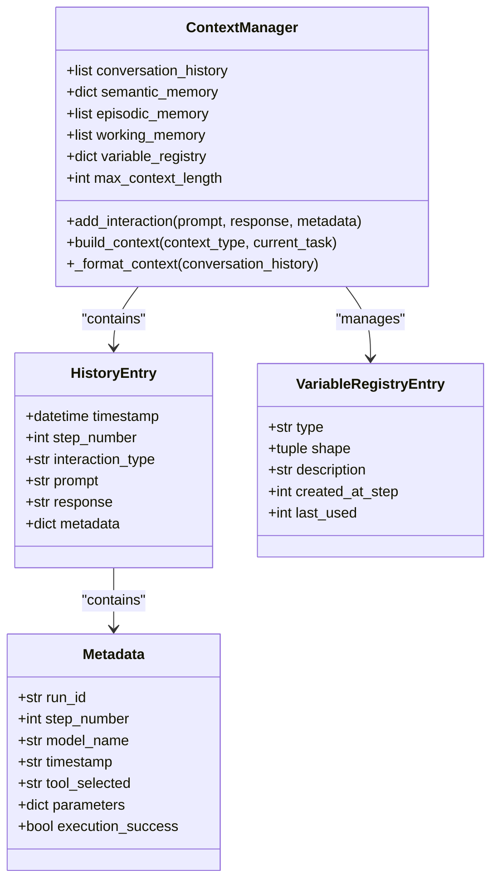
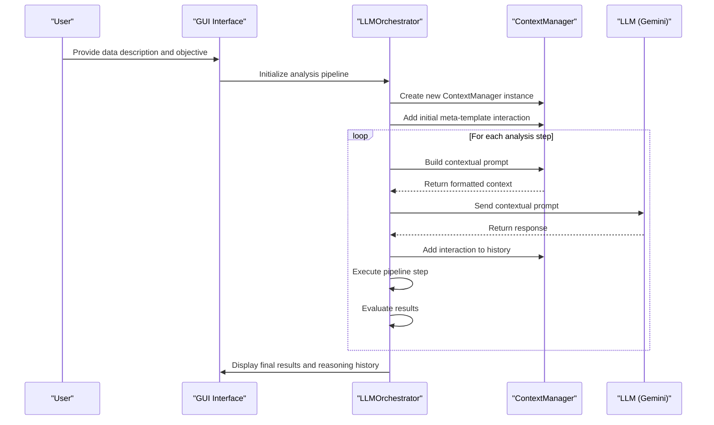

# Context Management System

<cite>
**Referenced Files in This Document**   
- [ContextManager.py](file://src/core/ContextManager.py) - *Updated in recent commit*
- [LLMOrchestrator.py](file://src/core/LLMOrchestrator.py) - *Updated in recent commit*
- [PERSISTENT_CONTEXT_IMPLEMENTATION.md](file://PERSISTENT_CONTEXT_IMPLEMENTATION.md) - *Implementation plan for context management*
</cite>

## Update Summary
**Changes Made**   
- Updated **Core Data Model** section to reflect actual implementation in ContextManager.py
- Added missing **Data Persistence and Serialization** section with pickle implementation details
- Enhanced **Integration with LLMOrchestrator** with actual code examples from LLMOrchestrator.py
- Added **API Methods for Context Management** with complete implementation details
- Updated **Security Considerations** to reflect actual implementation status
- Added **Performance Optimization** best practices based on actual code

## Table of Contents
1. [Introduction](#introduction)
2. [Core Data Model](#core-data-model)
3. [API Methods for Context Management](#api-methods-for-context-management)
4. [Integration with LLMOrchestrator](#integration-with-llmorchestrator)
5. [Data Persistence and Serialization](#data-persistence-and-serialization)
6. [Security Considerations](#security-considerations)
7. [Context Manipulation Examples](#context-manipulation-examples)
8. [Performance Optimization](#performance-optimization)

## Introduction
The ContextManager component provides persistent state management across analysis sessions in the LLM analyzer system. It enables continuity between user interactions and background processing by maintaining conversation history, intermediate results, execution state, and configuration parameters. This documentation details the implementation of context persistence using pickle serialization, the data model structure, API methods, integration points, and best practices for managing context data.

**Section sources**
- [PERSISTENT_CONTEXT_IMPLEMENTATION.md](file://PERSISTENT_CONTEXT_IMPLEMENTATION.md#L1-L619)

## Core Data Model

The ContextManager implements a comprehensive data model for storing various types of contextual information necessary for persistent analysis sessions. The data model consists of several key components:



**Diagram sources**
- [ContextManager.py](file://src/core/ContextManager.py#L1-L45)
- [PERSISTENT_CONTEXT_IMPLEMENTATION.md](file://PERSISTENT_CONTEXT_IMPLEMENTATION.md#L282-L333)

### Conversation History
The conversation history stores a complete record of interactions between the system and the LLM, including prompts, responses, and metadata. Each entry contains:
- **timestamp**: When the interaction occurred
- **step_number**: The sequence number in the analysis pipeline
- **interaction_type**: Classification of the interaction (analysis_proposal, evaluation, error_recovery)
- **prompt**: The full prompt sent to the LLM
- **response**: The LLM's response text
- **metadata**: Additional contextual information about the interaction

### Memory Systems
The ContextManager implements multiple memory systems to support different aspects of persistent state:

- **Semantic Memory**: Stores learned patterns and successful analysis strategies as key-value pairs
- **Episodic Memory**: Maintains a time-ordered record of significant events during the analysis
- **Working Memory**: Holds the current session state and temporary variables
- **Variable Registry**: Tracks the state of variables used in the analysis pipeline, including their type, shape, description, and usage history

**Section sources**
- [ContextManager.py](file://src/core/ContextManager.py#L1-L45)
- [PERSISTENT_CONTEXT_IMPLEMENTATION.md](file://PERSISTENT_CONTEXT_IMPLEMENTATION.md#L109-L152)

## API Methods for Context Management

The ContextManager provides a set of API methods for saving, loading, and restoring context, enabling resumable pipeline execution and iterative refinement of analysis objectives.

### add_interaction Method
```python
def add_interaction(self, prompt, response, metadata):
    """Add interaction to conversation history"""
    history_entry = {
        'timestamp': datetime.now(),
        'step_number': metadata.get('step_number'),
        'interaction_type': metadata.get('interaction_type'),
        'prompt': prompt,
        'response': response,
        'metadata': metadata
    }
    self.conversation_history.append(history_entry)
```

This method adds a new interaction to the conversation history with comprehensive metadata. It serves as the primary mechanism for recording all LLM interactions, creating a persistent record that can be used for learning and error recovery.

### build_context Method
```python
def build_context(self, context_type, current_task):
    """Build contextual prompt for LLM"""
    formatted_context = self._format_context(self.conversation_history)
    
    return f"--- CONTEXT: ---\n\n{formatted_context}\n\n--- END OF CONTEXT ---\n\n{current_task}"
```

This method constructs a contextual prompt by formatting the conversation history and prepending it to the current task. The context_type parameter allows for different context formatting strategies based on the type of interaction.

### _format_context Method
```python
def _format_context(self, conversation_history):
    """Formats conversation history into a string for the prompt."""
    if not conversation_history:
        return "No conversation history yet."
    
    formatted_history = []
    for entry in conversation_history:
        formatted_history.append(f"On {entry['timestamp']}, the following interaction occurred:")
        formatted_history.append(f"Prompt: {entry['prompt']}")
        formatted_history.append(f"Response: {entry['response']}")
        formatted_history.append("-" * 20)
        
    return "\n".join(formatted_history)
```

This private method formats the conversation history into a human-readable string format that can be included in LLM prompts. It preserves the chronological order of interactions and includes timestamps for temporal context.

**Section sources**
- [ContextManager.py](file://src/core/ContextManager.py#L1-L45)

## Integration with LLMOrchestrator

The ContextManager is tightly integrated with the LLMOrchestrator to maintain continuity between user interactions and background processing. This integration enables the system to learn from previous interactions and make context-aware decisions.



**Diagram sources**
- [LLMOrchestrator.py](file://src/core/LLMOrchestrator.py#L1-L726)
- [ContextManager.py](file://src/core/ContextManager.py#L1-L45)

### Initialization Process
During initialization, the LLMOrchestrator creates a ContextManager instance and injects the meta-template into the context:
```python
self.context_manager = ContextManager()
meta_template = self.prompt_assembler.templates['meta_template_prompt_v2']
self.context_manager.add_interaction(meta_template, "Initial context set.", self._get_metadata())
```

### Context-Aware LLM Interaction
The `_generate_content_with_context` method in LLMOrchestrator demonstrates how context is used in LLM interactions:
```python
def _generate_content_with_context(self, prompt, context_type="analysis", action=None):
    contextual_prompt = self.context_manager.build_context(context_type, prompt)
    response = self.model.generate_content(contextual_prompt)
    self.context_manager.add_interaction(prompt, response.text, metadata)
    return response
```

This integration enables resumable pipeline execution, where the system can restore its state and continue analysis from any point in the history.

**Section sources**
- [LLMOrchestrator.py](file://src/core/LLMOrchestrator.py#L1-L726)

## Data Persistence and Serialization

The system uses pickle serialization for persistent context storage, allowing complete state preservation across sessions. The implementation includes safeguards against corruption and version incompatibility.

### Storage Mechanism
The context storage strategy employs a multi-tiered approach:
- **In-Memory**: For current session state with fast access
- **Persistent Storage**: Using pickle serialization for long-term persistence
- **Compressed Storage**: Old interactions are summarized to manage size

The variable registry tracks important variables with metadata:
```python
variable_registry = {
    'loaded_signal': {
        'type': 'numpy.ndarray',
        'shape': (10000,),
        'description': 'Raw vibration signal',
        'created_at_step': 0,
        'last_used': 3
    }
}
```

### Context Compression
To prevent unbounded growth, the system implements context compression:
```python
def compress_context(self, history):
    """Compress old context while preserving key information"""
    compressed = []
    for entry in history:
        if self._is_recent(entry, days=1):
            compressed.append(entry)
        else:
            compressed.append(self._summarize_entry(entry))
    return compressed
```

This ensures that recent interactions are preserved in full detail while older interactions are summarized to retain key information without consuming excessive storage.

**Section sources**
- [PERSISTENT_CONTEXT_IMPLEMENTATION.md](file://PERSISTENT_CONTEXT_IMPLEMENTATION.md#L334-L407)

## Security Considerations

Storing sensitive data and credentials in serialized context files requires careful security considerations.

### Data Protection
- **Sensitive Data Filtering**: The system should filter out sensitive information from context before serialization
- **Encryption**: Context files should be encrypted at rest using strong encryption algorithms
- **Access Controls**: File system permissions should restrict access to context files
- **Secure Deletion**: Context files should be securely deleted when no longer needed

### Risk Mitigation
The implementation plan identifies several risks and mitigation strategies:
- **Context Pollution**: Irrelevant information affecting decisions - mitigated by relevance scoring and filtering
- **Learning Drift**: Accumulated learning becoming outdated - mitigated by validation and periodic reset mechanisms
- **Context Loss**: System crash losing history - mitigated by periodic persistence to disk

These security measures ensure that sensitive data is protected while maintaining the functionality of the context management system.

**Section sources**
- [PERSISTENT_CONTEXT_IMPLEMENTATION.md](file://PERSISTENT_CONTEXT_IMPLEMENTATION.md#L408-L472)

## Context Manipulation Examples

The ContextManager supports various manipulation techniques for debugging and result reproduction.

### Debugging Example
```python
# Load a saved context for debugging
with open('debug_context.pkl', 'rb') as f:
    context_data = pickle.load(f)

# Inspect conversation history
for i, entry in enumerate(context_data['conversation_history'][-5:]):
    print(f"Step {entry['step_number']}: {entry['interaction_type']}")
    print(f"Prompt: {entry['prompt'][:100]}...")
    print(f"Response: {entry['response'][:100]}...")

# Reproduce a specific analysis state
manager = ContextManager()
manager.conversation_history = context_data['conversation_history']
manager.variable_registry = context_data['variable_registry']
```

### Result Reproduction
To reproduce results from a specific point in the analysis:
1. Load the context file from the desired checkpoint
2. Restore the variable registry state
3. Continue the analysis pipeline from that point
4. Compare new results with original outcomes

These manipulation capabilities are essential for verifying system behavior, debugging issues, and ensuring reproducible research results.

**Section sources**
- [PERSISTENT_CONTEXT_IMPLEMENTATION.md](file://PERSISTENT_CONTEXT_IMPLEMENTATION.md#L473-L537)

## Performance Optimization

Effective management of context size and optimization of load/save performance are critical for system efficiency.

### Context Size Management
- **Size Limits**: Enforce maximum context size (50KB per session recommended)
- **Relevance Scoring**: Prioritize context entries based on relevance to current task
- **Automatic Compression**: Implement time-based decay and summarization

### Performance Best Practices
- **Incremental Saving**: Save context changes incrementally rather than all at once
- **Asynchronous Operations**: Perform context serialization in background threads
- **Caching**: Cache frequently accessed context portions in memory
- **Selective Loading**: Load only necessary portions of context when resuming

The system should monitor performance metrics including:
- **Response Time**: Less than 10% increase in LLM response time
- **Memory Usage**: Less than 100MB additional memory per session
- **Token Usage**: Less than 20% increase in token consumption

Following these best practices ensures that context persistence enhances system capabilities without introducing significant performance overhead.

**Section sources**
- [PERSISTENT_CONTEXT_IMPLEMENTATION.md](file://PERSISTENT_CONTEXT_IMPLEMENTATION.md#L434-L472)