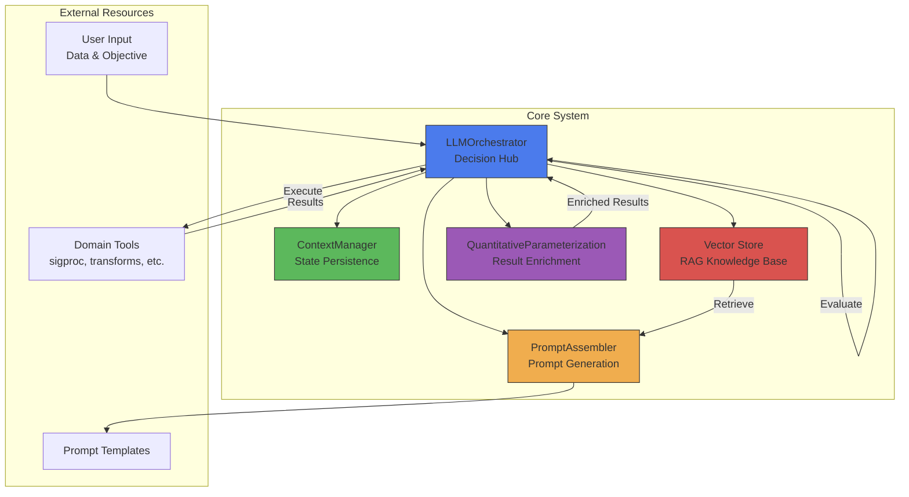
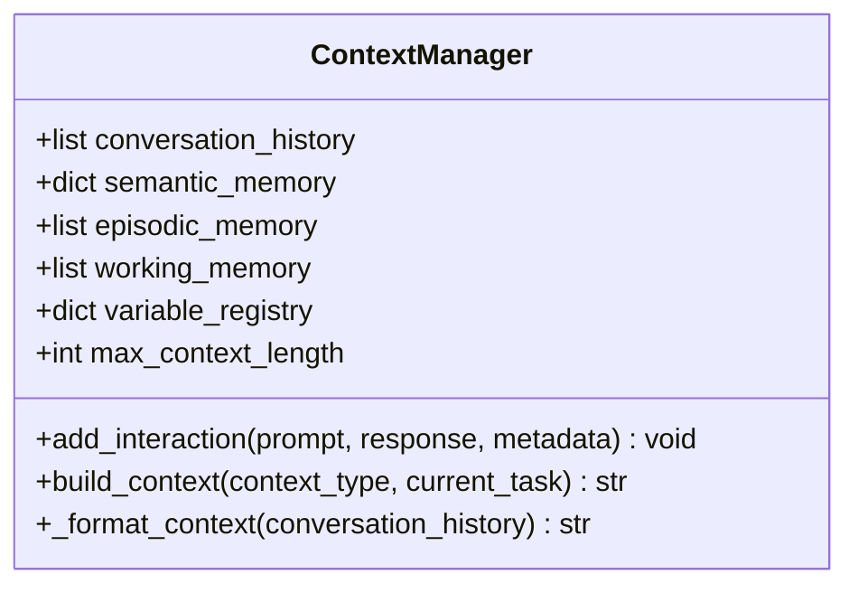
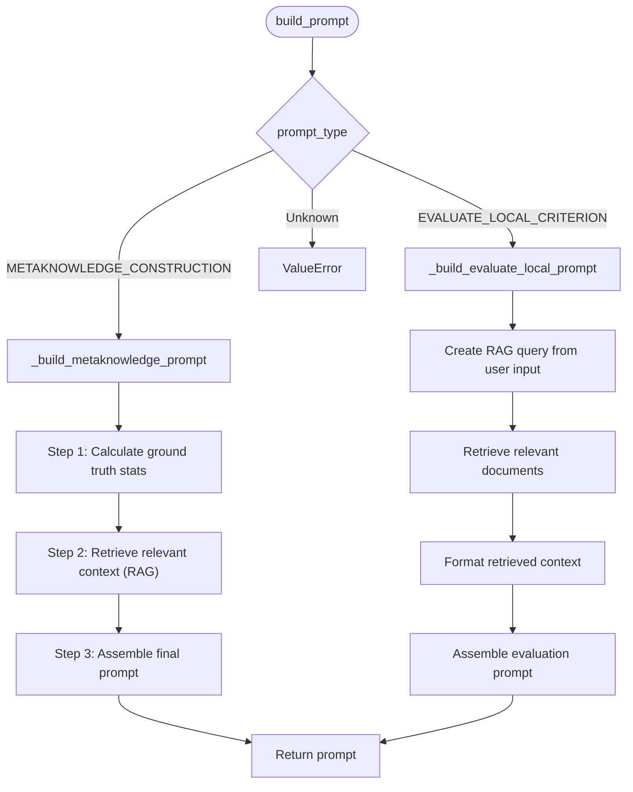
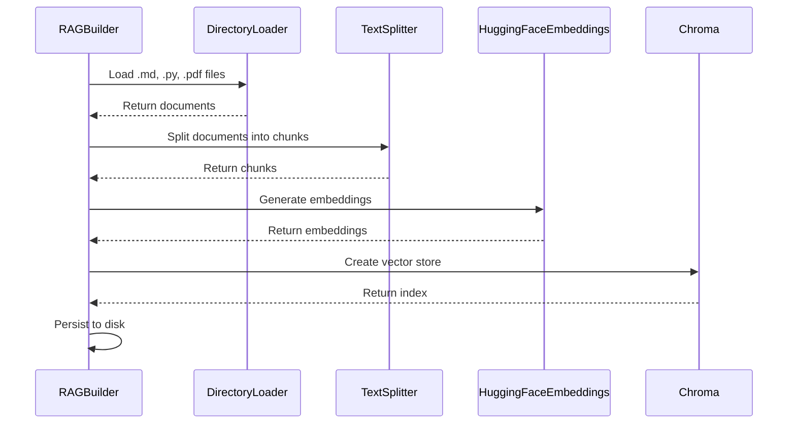
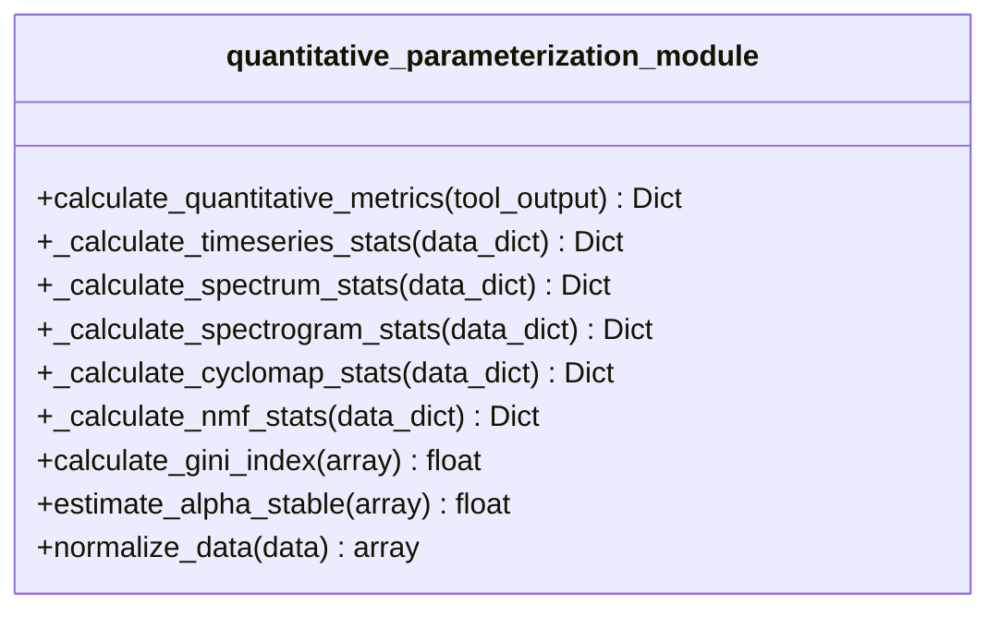
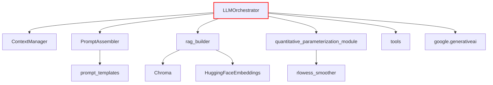

# Core System Architecture

<cite>
**Referenced Files in This Document**   
- [LLMOrchestrator.py](file://src/core/LLMOrchestrator.py) - *Updated in recent commit*
- [ContextManager.py](file://src/core/ContextManager.py) - *Added in recent commit*
- [prompt_assembler.py](file://src/core/prompt_assembler.py) - *Modified for context-aware processing*
- [metaknowledge_prompt_v2.txt](file://src/prompt_templates/metaknowledge_prompt_v2.txt)
- [evaluate_local_prompt_v2.txt](file://src/prompt_templates/evaluate_local_prompt_v2.txt)
- [TOOLS_REFERENCE.md](file://src/docs/TOOLS_REFERENCE.md)
</cite>

## Update Summary
**Changes Made**   
- Updated documentation to reflect implementation of persistent context management
- Added detailed analysis of ContextManager component and its integration
- Revised LLMOrchestrator section to show context-aware prompt generation
- Updated PromptAssembler section to reflect context integration
- Enhanced architecture overview with context flow
- Added new sequence diagram showing context management workflow

## Table of Contents
1. [Introduction](#introduction)
2. [Project Structure](#project-structure)
3. [Core Components](#core-components)
4. [Architecture Overview](#architecture-overview)
5. [Detailed Component Analysis](#detailed-component-analysis)
6. [Dependency Analysis](#dependency-analysis)
7. [Performance Considerations](#performance-considerations)
8. [Troubleshooting Guide](#troubleshooting-guide)
9. [Conclusion](#conclusion)

## Introduction
This document provides a comprehensive architectural overview of the **LLM Analyzer Context** system, an autonomous signal analysis pipeline that leverages large language models (LLMs) to guide data processing workflows. The system is designed to analyze complex signals (e.g., vibration data) by dynamically orchestrating a sequence of domain-specific tools based on user objectives and real-time evaluation of results.

At its core, the system uses a **decision-making hub** (LLMOrchestrator) that integrates with multiple components to:
- Construct structured knowledge from unstructured user input
- Dynamically generate and execute analysis pipelines
- Evaluate results and iteratively refine the analysis strategy
- Maintain state and context across steps

The architecture emphasizes **modularity**, **stateful execution**, and **domain-aware reasoning** through retrieval-augmented generation (RAG), enabling robust and interpretable autonomous analysis.

## Project Structure
The project follows a modular, layered structure organized by functional responsibility:

```
src/
├── core/                  # Core orchestration and state management
│   ├── LLMOrchestrator.py
│   ├── ContextManager.py
│   ├── prompt_assembler.py
│   ├── rag_builder.py
│   └── quantitative_parameterization_module.py
├── docs/                  # Documentation and tool references
│   └── TOOLS_REFERENCE.md
├── gui/                   # User interface components
├── lib/                   # Utility libraries
├── prompt_templates/      # LLM prompt templates
├── tools/                 # Domain-specific analysis tools
│   ├── sigproc/           # Signal processing
│   ├── transforms/        # Signal transformations
│   ├── decomposition/     # Matrix decomposition
│   └── utils/             # Data loading utilities
└── app.py                 # Application entry point
```

Key organizational principles:
- **Separation of concerns**: Each module has a well-defined responsibility
- **Configurable workflows**: Tools and prompts are externalized for easy modification
- **State persistence**: Run-specific state is stored in timestamped directories
- **Extensibility**: New tools can be added without modifying core logic

**Diagram sources**
- [LLMOrchestrator.py](file://src/core/LLMOrchestrator.py)
- [prompt_assembler.py](file://src/core/prompt_assembler.py)

## Core Components
The system's functionality is driven by five core components that work in concert to enable autonomous analysis:

1. **LLMOrchestrator**: The central decision-making engine that manages the analysis pipeline
2. **ContextManager**: Maintains conversation history and contextual state
3. **PromptAssembler**: Constructs dynamic prompts for the LLM using templates and context
4. **RAGBuilder**: Enables domain-specific reasoning through knowledge retrieval
5. **QuantitativeParameterizationModule**: Enriches tool outputs with statistical metrics

These components form a closed-loop system where the orchestrator proposes actions, executes them, evaluates results, and iteratively refines the analysis strategy.

**Section sources**
- [LLMOrchestrator.py](file://src/core/LLMOrchestrator.py#L1-L725)
- [ContextManager.py](file://src/core/ContextManager.py#L1-L45)
- [prompt_assembler.py](file://src/core/prompt_assembler.py#L1-L179)

## Architecture Overview
The system follows an **orchestrator pattern** where the LLMOrchestrator acts as the central hub, coordinating interactions between state management, knowledge retrieval, and tool execution components.



**Diagram sources**
- [LLMOrchestrator.py](file://src/core/LLMOrchestrator.py#L1-L725)
- [ContextManager.py](file://src/core/ContextManager.py#L1-L45)
- [prompt_assembler.py](file://src/core/prompt_assembler.py#L1-L179)
- [rag_builder.py](file://src/core/rag_builder.py#L1-L116)
- [quantitative_parameterization_module.py](file://src/core/quantitative_parameterization_module.py#L1-L799)

## Detailed Component Analysis

### LLMOrchestrator Analysis
The `LLMOrchestrator` class is the central component responsible for managing the end-to-end autonomous analysis pipeline. It coordinates all aspects of the analysis workflow, from initialization to termination.

#### Key Responsibilities:
- **Pipeline Management**: Maintains a sequence of tool-based actions as a script
- **LLM Interaction**: Builds prompts and communicates with the Gemini LLM
- **Execution Control**: Executes pipeline steps in subprocesses
- **Result Evaluation**: Assesses outcomes and determines next actions
- **State Management**: Interfaces with ContextManager for persistence
- **GUI Integration**: Communicates with the user interface via log_queue

#### Initialization Process:
```python
def __init__(self, user_data_description, user_objective, run_id, loaded_data, signal_var_name, fs_var_name, log_queue):
    # Initialize core components
    self.prompt_assembler = PromptAssembler()
    self.context_manager = ContextManager()
    
    # Configure LLM and RAG systems
    self.model = genai.GenerativeModel("gemini-2.5-flash")
    self.vector_store = Chroma(persist_directory="./vector_store", embedding_function=embedding_model)
    self.rag_retriever = self.vector_store.as_retriever(search_kwargs={"k": 10})
    
    # Initialize run-specific state
    self.run_id = run_id
    self.state_dir = f"./run_state/{self.run_id}"
    os.makedirs(self.state_dir, exist_ok=True)
    
    # Store user inputs and data references
    self.user_data_description = user_data_description
    self.user_objective = user_objective
    self.loaded_data = loaded_data
    self.signal_var_name = signal_var_name
    self.fs_var_name = fs_var_name
```

The orchestrator initializes with user-provided data and objectives, sets up the LLM and RAG systems, and creates a dedicated directory for storing run-specific state.

#### Main Execution Flow:
The `run_analysis_pipeline()` method implements the core control loop:

1. **Initialization Phase**: 
   - Injects meta-template into context
   - Creates metaknowledge from user input
   - Loads available tools reference

2. **Data Loading**: 
   - Executes initial `load_data` action
   - Sends results to GUI for visualization

3. **Main Loop**: 
   - Proposes next action based on evaluation
   - Executes current pipeline
   - Evaluates results
   - Continues until final result is achieved or maximum iterations reached

```mermaid
sequenceDiagram
participant Orchestrator as LLMOrchestrator
participant PromptAssembler as PromptAssembler
participant ContextManager as ContextManager
participant LLM as Gemini LLM
participant Executor as Subprocess Executor
participant Tools as Analysis Tools
participant GUI as GUI Interface
Orchestrator->>Orchestrator : Initialize components
Orchestrator->>PromptAssembler : Build metaknowledge prompt
PromptAssembler->>Orchestrator : Return prompt
Orchestrator->>LLM : Generate metaknowledge
LLM-->>Orchestrator : JSON metaknowledge
Orchestrator->>ContextManager : Store metaknowledge
Orchestrator->>Executor : Execute load_data
Executor->>Tools : Call load_data()
Tools-->>Executor : Return loaded data
Executor-->>Orchestrator : Execution result
Orchestrator->>GUI : Send result for display
loop For max_iterations
Orchestrator->>PromptAssembler : Build evaluation prompt
PromptAssembler->>Orchestrator : Return evaluation prompt
Orchestrator->>LLM : Evaluate result
LLM-->>Orchestrator : JSON evaluation
Orchestrator->>Orchestrator : Parse evaluation
Orchestrator->>Executor : Execute next action
Executor->>Tools : Call tool function
Tools-->>Executor : Return result
Executor-->>Orchestrator : Execution result
Orchestrator->>GUI : Send result for display
alt Result is final
Orchestrator->>GUI : Send completion message
break
end
end
```

**Diagram sources**
- [LLMOrchestrator.py](file://src/core/LLMOrchestrator.py#L1-L725)

**Section sources**
- [LLMOrchestrator.py](file://src/core/LLMOrchestrator.py#L1-L725)

### ContextManager Analysis
The `ContextManager` class handles the persistence and management of conversation state throughout the analysis process.

#### Data Structures:
```python
class ContextManager:
    def __init__(self):
        self.conversation_history = []  # Complete interaction log
        self.semantic_memory = {}       # Learned patterns
        self.episodic_memory = []       # Time-ordered events
        self.working_memory = []        # Current session state
        self.variable_registry = {}     # Variable states
        self.max_context_length = 50000 # Character limit
```

#### Key Methods:
- **add_interaction()**: Records each LLM interaction with metadata
- **build_context()**: Constructs contextual prompts for the LLM
- **_format_context()**: Formats history for inclusion in prompts

The context manager maintains a comprehensive record of all interactions, which is used to provide continuity across analysis steps. This enables the system to maintain stateful execution while allowing the LLM to reason about the analysis progression.



**Diagram sources**
- [ContextManager.py](file://src/core/ContextManager.py#L1-L45)

**Section sources**
- [ContextManager.py](file://src/core/ContextManager.py#L1-L45)

### PromptAssembler Analysis
The `PromptAssembler` class is responsible for constructing the final prompts sent to the LLM by combining templates, user input, and retrieved context.

#### Template Management:
```python
def __init__(self):
    self.templates = self._load_prompt_templates()

def _load_prompt_templates(self) -> dict:
    """Load all .txt prompt templates from src/prompt_templates"""
    templates = {}
    template_dir = "src/prompt_templates"
    for filename in os.listdir(template_dir):
        if filename.endswith(".txt"):
            template_name = filename.replace('.txt', '')
            with open(os.path.join(template_dir, filename), 'r') as f:
                templates[template_name] = f.read()
    return templates
```

#### Prompt Construction Workflow:
1. **Metaknowledge Construction**: Converts user input into structured JSON
2. **Local Evaluation**: Assesses results of individual actions
3. **Tool Selection**: Determines next steps in the analysis pipeline

The assembler uses a dispatcher pattern (`build_prompt()`) to route requests to specialized handlers based on the prompt type.



**Diagram sources**
- [prompt_assembler.py](file://src/core/prompt_assembler.py#L1-L179)

**Section sources**
- [prompt_assembler.py](file://src/core/prompt_assembler.py#L1-L179)

### RAGBuilder Analysis
The `RAGBuilder` class enables domain-specific reasoning by constructing and loading vector stores from knowledge bases.

#### Key Features:
- **Multi-format Support**: Processes .md, .py, and .pdf documents
- **Document Chunking**: Splits documents into manageable pieces
- **Embedding Generation**: Uses sentence-transformers for semantic representation
- **Persistent Storage**: Saves vector stores for later retrieval

#### Index Building Process:
```python
def build_index(self, knowledge_base_paths, queue, persist_directory, embedding_model="all-MiniLM-L12-v2"):
    # 1. Load Documents
    loader = DirectoryLoader(knowledge_base_path, glob="**/*.md", loader_cls=TextLoader)
    documents = loader.load()
    
    # 2. Split Documents
    text_splitter = RecursiveCharacterTextSplitter(chunk_size=800, chunk_overlap=500)
    chunks = text_splitter.split_documents(all_documents)
    
    # 3. Generate Embeddings
    embeddings = HuggingFaceEmbeddings(model_name=model_name)
    
    # 4. Create Vector Store
    self.index = Chroma.from_documents(chunks, embeddings, persist_directory=persist_directory)
```

The RAG system allows the LLM to access domain-specific knowledge about signal processing tools and fault diagnosis, significantly enhancing its reasoning capabilities.



**Diagram sources**
- [rag_builder.py](file://src/core/rag_builder.py#L1-L116)

**Section sources**
- [rag_builder.py](file://src/core/rag_builder.py#L1-L116)

### QuantitativeParameterizationModule Analysis
The `quantitative_parameterization_module` enriches tool outputs with statistical metrics, enabling more sophisticated analysis and comparison.

#### Architecture:
```python
def calculate_quantitative_metrics(tool_output: Dict[str, Any]) -> Dict[str, Any]:
    """Main dispatcher function"""
    domain_handlers = {
        'time-series': _calculate_timeseries_stats,
        'time-frequency-matrix': _calculate_spectrogram_stats,
        'frequency-spectrum': _calculate_spectrum_stats,
        'bi-frequency-matrix': _calculate_cyclomap_stats,
        'decomposed_matrix': _calculate_nmf_stats
    }
    
    domain = result.get('domain', 'unknown_domain')
    handler = domain_handlers.get(domain)
    result["new_params"] = handler(result) if handler else {}
    return result
```

#### Domain-Specific Metrics:
- **Time-series**: Kurtosis, skewness, RMS, crest factor
- **Frequency-spectrum**: Dominant frequency, spectral centroid
- **Time-frequency-matrix**: Gini index, spectral kurtosis
- **Bi-frequency-matrix**: Maximum coherence, peak frequencies
- **Decomposed-matrix**: Component selection metrics

The module also generates diagnostic visualizations that are used in subsequent evaluation steps.



**Diagram sources**
- [quantitative_parameterization_module.py](file://src/core/quantitative_parameterization_module.py#L1-L799)

**Section sources**
- [quantitative_parameterization_module.py](file://src/core/quantitative_parameterization_module.py#L1-L799)

## Dependency Analysis
The system components are interconnected in a hierarchical dependency structure:



Key dependency relationships:
- **LLMOrchestrator** depends on all core modules
- **PromptAssembler** depends on prompt templates
- **RAGBuilder** depends on LangChain and Chroma
- **QuantitativeParameterization** depends on scientific computing libraries

The dependency graph reveals a **hub-and-spoke architecture** with LLMOrchestrator at the center, minimizing direct dependencies between peripheral components and enhancing modularity.

**Diagram sources**
- [LLMOrchestrator.py](file://src/core/LLMOrchestrator.py#L1-L725)
- [ContextManager.py](file://src/core/ContextManager.py#L1-L45)
- [prompt_assembler.py](file://src/core/prompt_assembler.py#L1-L179)

**Section sources**
- [LLMOrchestrator.py](file://src/core/LLMOrchestrator.py#L1-L725)

## Performance Considerations
The system architecture incorporates several performance optimizations:

### State Management
- **Run-specific state directories**: Isolate execution state to prevent interference
- **Pickle-based serialization**: Efficient storage of complex Python objects
- **Temporary files**: Minimize memory usage during script execution

### LLM Interaction
- **Context window management**: Limit history to prevent token overflow
- **Caching avoidance**: Treat each prompt as a new request for consistency
- **Error handling**: Graceful degradation on API failures

### Execution Model
- **Subprocess isolation**: Prevent memory leaks from tool execution
- **Timeout protection**: 1500-second limit on script execution
- **Incremental execution**: Build and execute pipeline step-by-step

### Scalability Factors
**Advantages:**
- **Modular design**: Components can be scaled independently
- **Stateless LLM calls**: Easy to distribute across multiple instances
- **Persistent vector stores**: Fast retrieval without regeneration

**Limitations:**
- **Sequential execution**: Pipeline steps execute one at a time
- **Memory accumulation**: Context grows with each step
- **Single-threaded orchestrator**: Bottleneck in decision-making

The architecture prioritizes **reliability and interpretability** over raw performance, making it suitable for complex analysis tasks where correctness is paramount.

## Troubleshooting Guide
Common issues and their solutions:

### LLM API Errors
**Symptoms:**
- "Error calling Gemini API" messages
- Failed prompt generation

**Solutions:**
1. Verify API key configuration
2. Check network connectivity
3. Implement retry logic with exponential backoff
4. Validate prompt size within token limits

### Tool Execution Failures
**Symptoms:**
- Script execution timeouts
- Subprocess errors

**Solutions:**
1. Check tool parameter compatibility
2. Validate input data formats
3. Increase timeout threshold if needed
4. Verify tool dependencies are installed

### RAG Retrieval Issues
**Symptoms:**
- Poor quality context retrieval
- Missing relevant documents

**Solutions:**
1. Verify vector store exists and is populated
2. Adjust chunk size and overlap parameters
3. Update embedding model if domain-specific terms are not captured
4. Expand knowledge base with additional documentation

### Context Management Problems
**Symptoms:**
- Loss of analysis state
- Inconsistent decision-making

**Solutions:**
1. Verify state directory permissions
2. Check context length limits
3. Validate metadata tracking
4. Ensure proper error handling in state updates

**Section sources**
- [LLMOrchestrator.py](file://src/core/LLMOrchestrator.py#L1-L725)
- [ContextManager.py](file://src/core/ContextManager.py#L1-L45)

## Conclusion
The LLM Analyzer Context system presents a sophisticated architecture for autonomous signal analysis, centered around the LLMOrchestrator as a decision-making hub. The design successfully integrates several key components:

1. **Orchestrator Pattern**: The LLMOrchestrator effectively coordinates the analysis pipeline, maintaining state and making iterative decisions.

2. **Domain-Aware Reasoning**: The RAG system enables the LLM to access domain-specific knowledge, significantly enhancing its ability to reason about signal processing tasks.

3. **Stateful Execution**: The ContextManager provides persistent state across analysis steps, enabling complex, multi-stage workflows.

4. **Dynamic Prompt Generation**: The PromptAssembler creates contextually rich prompts by combining templates, user input, and retrieved knowledge.

5. **Quantitative Evaluation**: The parameterization module enriches tool outputs with statistical metrics, enabling more sophisticated analysis.

**Key Design Trade-offs:**
- **Stateful vs. Reproducible**: The system maintains state for continuity but may sacrifice perfect reproducibility.
- **Autonomy vs. Control**: The autonomous pipeline reduces user intervention but may require oversight for critical decisions.
- **Comprehensiveness vs. Performance**: The comprehensive context management enhances reasoning but increases computational overhead.

The architecture demonstrates a robust approach to autonomous analysis, with clear pathways for extension and improvement. Future enhancements could include parallel execution of independent pipeline branches, more sophisticated context management, and enhanced error recovery mechanisms.