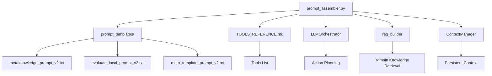
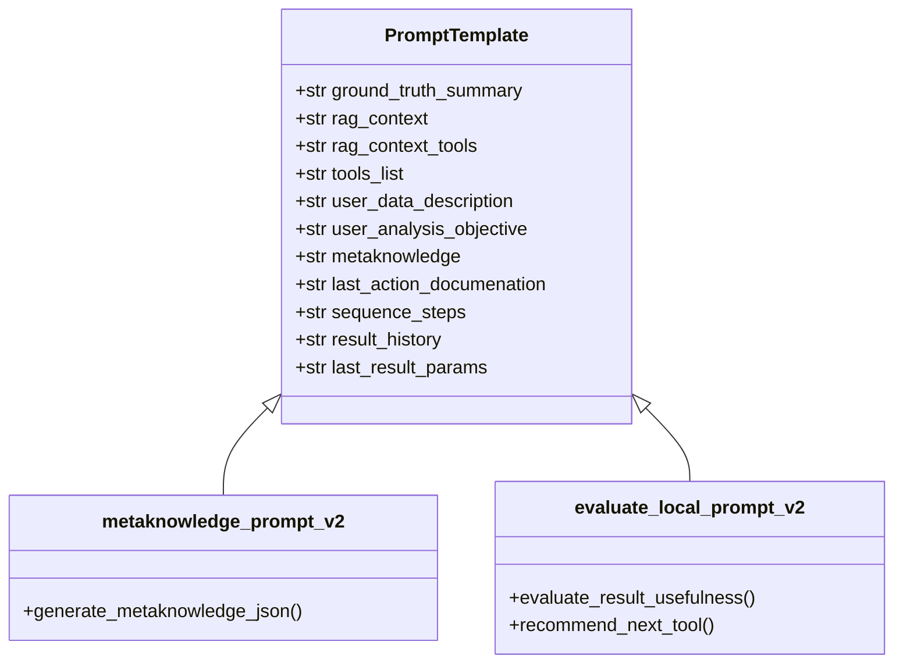
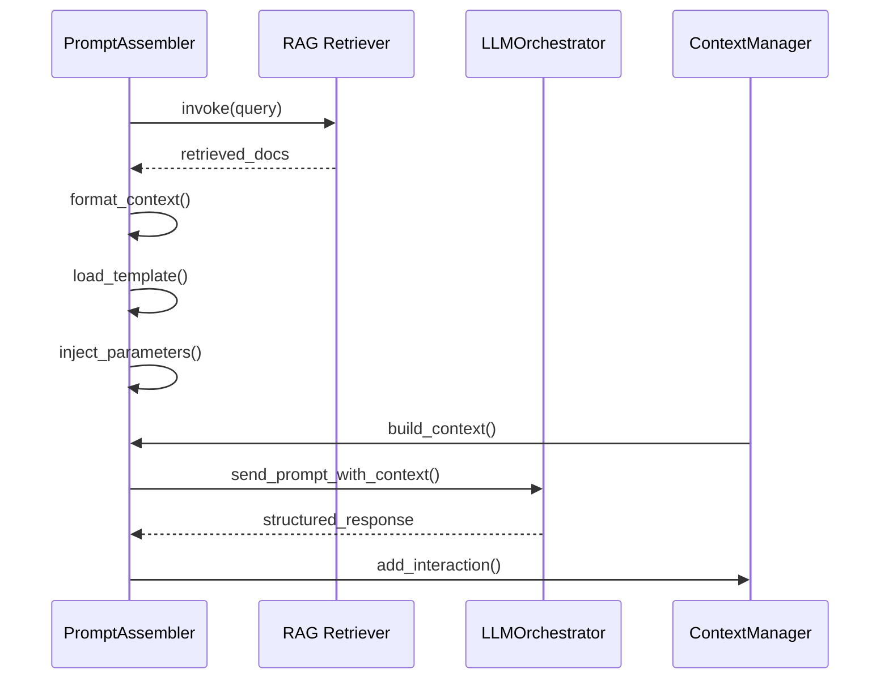

# Dynamic Prompt Assembly

<cite>
**Referenced Files in This Document**   
- [src/core/prompt_assembler.py](file://src/core/prompt_assembler.py#L1-L178) - *Updated in recent commit*
- [src/prompt_templates/metaknowledge_prompt_v2.txt](file://src/prompt_templates/metaknowledge_prompt_v2.txt#L1-L61) - *Updated in recent commit*
- [src/prompt_templates/evaluate_local_prompt_v2.txt](file://src/prompt_templates/evaluate_local_prompt_v2.txt#L1-L59) - *Updated in recent commit*
- [src/prompt_templates/meta_template_prompt_v2.txt](file://src/prompt_templates/meta_template_prompt_v2.txt#L1-L10) - *Updated in recent commit*
- [src/docs/TOOLS_REFERENCE.md](file://src/docs/TOOLS_REFERENCE.md#L1-L29)
- [src/core/ContextManager.py](file://src/core/ContextManager.py#L1-L44) - *Added in recent commit*
</cite>

## Update Summary
**Changes Made**   
- Updated Introduction to reflect persistent context management implementation
- Added new section on ContextManager integration
- Revised Integration with RAG and LLMOrchestrator to include context persistence
- Updated Examples of Assembled Prompts to show context inclusion
- Added new diagram showing context flow
- Enhanced Common Issues section with context-specific mitigation strategies
- Updated all file references with proper annotations

## Table of Contents
1. [Introduction](#introduction)
2. [Project Structure](#project-structure)
3. [Core Components](#core-components)
4. [Prompt Assembly Process](#prompt-assembly-process)
5. [Template System and Versioning](#template-system-and-versioning)
6. [Parameterization and Dynamic Injection](#parameterization-and-dynamic-injection)
7. [Integration with RAG and LLMOrchestrator](#integration-with-rag-and-llmorchestrator)
8. [ContextManager Integration](#contextmanager-integration)
9. [Examples of Assembled Prompts](#examples-of-assembled-prompts)
10. [Common Issues and Mitigation Strategies](#common-issues-and-mitigation-strategies)
11. [Conclusion](#conclusion)

## Introduction
The **Dynamic Prompt Assembly** system is a core component of the LLM-based signal analysis pipeline. It enables context-aware, adaptive prompting by combining user objectives, raw data characteristics, domain knowledge from Retrieval-Augmented Generation (RAG), historical execution context, and persistent conversation memory. The `PromptAssembler` class dynamically constructs structured prompts for various stages of the analysis workflow, including metaknowledge extraction, tool selection, result evaluation, and pipeline refinement. This document details the architecture, implementation, and operational logic of the prompt assembly mechanism, with updates to reflect the recent implementation of persistent context management.

**Section sources**
- [src/core/prompt_assembler.py](file://src/core/prompt_assembler.py#L1-L178) - *Updated in recent commit*

## Project Structure
The project follows a modular structure organized by functional components. The prompt assembly logic resides in the `src/core/prompt_assembler.py` module, which depends on templates stored in `src/prompt_templates/`. Supporting documentation, including tool references, is located in `src/docs/`. The system integrates with RAG retrievers, the `LLMOrchestrator`, and the newly implemented `ContextManager` to enable intelligent, knowledge-enriched, and context-aware decision-making.



**Diagram sources**
- [src/core/prompt_assembler.py](file://src/core/prompt_assembler.py#L1-L178) - *Updated in recent commit*
- [src/prompt_templates/metaknowledge_prompt_v2.txt](file://src/prompt_templates/metaknowledge_prompt_v2.txt#L1-L61) - *Updated in recent commit*
- [src/core/ContextManager.py](file://src/core/ContextManager.py#L1-L44) - *Added in recent commit*

## Core Components
The `PromptAssembler` class is the central component responsible for constructing final prompts sent to the LLM. It initializes by loading all `.txt` template files from the `src/prompt_templates` directory into an in-memory dictionary. The class exposes a public method `build_prompt()` that dispatches to private handler methods based on the requested prompt type.

Key components:
- **`__init__()`**: Loads all prompt templates at initialization.
- **`build_prompt(prompt_type, context_bundle)`**: Entry point that routes to appropriate handler.
- **`_build_metaknowledge_prompt()`**: Constructs prompt for extracting structured metaknowledge.
- **`_build_evaluate_local_prompt()`**: Builds evaluation prompt for assessing result usefulness.
- **`_load_prompt_templates()`**: Utility to read and store all `.txt` templates.

**Section sources**
- [src/core/prompt_assembler.py](file://src/core/prompt_assembler.py#L1-L178) - *Updated in recent commit*

## Prompt Assembly Process
The prompt assembly process involves three main stages: pre-computation, context retrieval, and template formatting.

### Metaknowledge Construction
When `prompt_type = "METAKNOWLEDGE_CONSTRUCTION"`, the `_build_metaknowledge_prompt()` method:
1. Computes ground truth statistics (signal length, sample count, sampling frequency).
2. Queries the RAG system using a composite query from user description and objective.
3. Formats retrieved domain and tool context into strings.
4. Injects all data into the `metaknowledge_prompt_v2.txt` template.

### Local Evaluation
For `prompt_type = "EVALUATE_LOCAL_CRITERION"`, the `_build_evaluate_local_prompt()` method:
1. Retrieves relevant documentation for the last executed tool.
2. Loads image paths and opens PIL.Image objects for visual evaluation.
3. Gathers historical results and sequence steps.
4. Formats the `evaluate_local_prompt_v2.txt` template with dynamic parameters.

This method returns a list containing both the prompt string and image objects for multimodal input.

**Section sources**
- [src/core/prompt_assembler.py](file://src/core/prompt_assembler.py#L50-L150) - *Updated in recent commit*

## Template System and Versioning
The system uses a versioned template approach, with `v2` variants currently active. Templates are plain text files with named placeholders using Python `.format()` syntax.

### Template Types
- **`metaknowledge_prompt_v2.txt`**: For structured JSON schema generation.
- **`evaluate_local_prompt_v2.txt`**: For evaluating result usefulness and selecting next actions.
- **`meta_template_prompt_v2.txt`**: High-level role and operating principles (not directly used in current code).

Each template defines strict output formats to ensure parseable responses from the LLM.



**Diagram sources**
- [src/prompt_templates/metaknowledge_prompt_v2.txt](file://src/prompt_templates/metaknowledge_prompt_v2.txt#L1-L61) - *Updated in recent commit*
- [src/prompt_templates/evaluate_local_prompt_v2.txt](file://src/prompt_templates/evaluate_local_prompt_v2.txt#L1-L59) - *Updated in recent commit*

## Parameterization and Dynamic Injection
The system supports dynamic injection of runtime values into templates. Key injected parameters include:

- **Signal Statistics**: Automatically computed from raw data.
- **User Inputs**: Direct inclusion of user-provided descriptions and objectives.
- **RAG Context**: Retrieved snippets from domain and tool knowledge bases.
- **Execution History**: Previous actions, results, and parameters.
- **Tool Documentation**: Markdown documentation of the last executed tool.

These values are passed via the `context_bundle` dictionary and formatted into templates using `.format()`.

**Section sources**
- [src/core/prompt_assembler.py](file://src/core/prompt_assembler.py#L70-L130) - *Updated in recent commit*

## Integration with RAG and LLMOrchestrator
The `PromptAssembler` integrates tightly with three key components:

- **RAG System**: Uses `rag_retriever` and `rag_retriever_tools` to fetch relevant context based on user queries.
- **LLMOrchestrator**: Receives assembled prompts and executes them, feeding results back into the context bundle.
- **ContextManager**: Stores conversation history and builds contextual prompts for persistent memory.

This integration enables context-aware prompting where the LLM has access to both domain-specific knowledge, real-time execution state, and historical conversation context.



**Diagram sources**
- [src/core/prompt_assembler.py](file://src/core/prompt_assembler.py#L1-L178) - *Updated in recent commit*
- [src/core/ContextManager.py](file://src/core/ContextManager.py#L1-L44) - *Added in recent commit*

## ContextManager Integration
The newly implemented `ContextManager` class provides persistent context management for the analysis pipeline. It stores conversation history, semantic memory, episodic memory, working memory, and variable registry to enable stateful interactions with the LLM.

Key features:
- **`add_interaction(prompt, response, metadata)`**: Records each LLM interaction with timestamp and metadata.
- **`build_context(context_type, current_task)`**: Constructs contextual prompts by prepending conversation history.
- **`_format_context(conversation_history)`**: Formats historical interactions for LLM consumption.

The ContextManager integrates with the PromptAssembler to provide persistent memory across analysis sessions, enabling the system to learn from previous interactions and maintain consistent variable states.

**Section sources**
- [src/core/ContextManager.py](file://src/core/ContextManager.py#L1-L44) - *Added in recent commit*

## Examples of Assembled Prompts
### Metaknowledge Prompt Example
```text
--- CONTEXT: ---

No conversation history yet.

--- END OF CONTEXT ---

Your current task is to parse the user's description and objective, along with provided context, and convert this information into a single, structured JSON object.

Adhere strictly to the following JSON schema:
{...schema...}

GROUND TRUTH DATA STATISTICS: 
- Signal Length: 10.24 seconds
    - Total Samples: 10240
    - Sampling Frequency: 1000 Hz

RELEVANT CONTEXT FROM KNOWLEDGE BASE: 
Context Snippet 1:
Vibration signals from bearing faults often exhibit cyclic impulses...

RELEVANT CONTEXT FROM TOOL BASE: 
Context Snippet 1:
The create_envelope_spectrum tool is effective for detecting...

TOOLKIT: 
### transforms
- create_envelope_spectrum: Extracts envelope spectrum from time-series
...

USER-PROVIDED DATA DESCRIPTION: 
Vibration data from a faulty bearing in a gearbox

USER-PROVIDED ANALYSIS OBJECTIVE: 
Detect inner race fault using spectral analysis
```

### Evaluation Prompt Example
```text
--- CONTEXT: ---
On 2025-08-26 10:00:00, the following interaction occurred:
Prompt: [Previous metaknowledge prompt]
Response: {"data_summary": {...}, "system_context": {...}, "analysis_objective": {...}}
--------------------
On 2025-08-26 10:01:00, the following interaction occurred:
Prompt: [Previous tool selection prompt]
Response: {"tool_name": "create_fft_spectrum", "params": {}, "input_variable": "signal_1"}
--------------------

--- END OF CONTEXT ---

Your current task is to evaluate the results of the last action. Based on all the information provided below, assess visually the provided images...

Previous actions: 
[{"tool_name": "create_fft_spectrum", "output_variable": "fft_1"}, ...]

Output evaluation parameters for current result: 
{"cutoff_frequency": 3500}

History of results:
[...]

Current action documentation: 
### create_fft_spectrum
- create_fft_spectrum(data: dict, output_image_path: str) -> dict
Computes FFT spectrum of input signal...
```

**Section sources**
- [src/prompt_templates/metaknowledge_prompt_v2.txt](file://src/prompt_templates/metaknowledge_prompt_v2.txt#L1-L61) - *Updated in recent commit*
- [src/prompt_templates/evaluate_local_prompt_v2.txt](file://src/prompt_templates/evaluate_local_prompt_v2.txt#L1-L59) - *Updated in recent commit*
- [src/core/ContextManager.py](file://src/core/ContextManager.py#L1-L44) - *Added in recent commit*

## Common Issues and Mitigation Strategies
### Prompt Overflow
Large RAG results, long histories, or extensive context can exceed token limits.  
**Mitigation**: Truncate retrieved documents to top 3 snippets; limit history to last 5 steps; implement context compression in ContextManager.

### Template Errors
Missing keys in `.format()` cause runtime errors.  
**Mitigation**: Validate all required keys in `context_bundle` before formatting.

### Context Leakage
Sensitive data might be included in prompts.  
**Mitigation**: Sanitize inputs; avoid logging full prompts; implement data masking in ContextManager.

### Image Handling
Improper image loading can crash the process.  
**Mitigation**: Wrap image operations in try-except; validate paths.

### Context Pollution
Irrelevant historical information can degrade decision quality.  
**Mitigation**: Implement relevance scoring in ContextManager; prioritize recent and successful interactions.

**Section sources**
- [src/core/prompt_assembler.py](file://src/core/prompt_assembler.py#L100-L150) - *Updated in recent commit*
- [src/core/ContextManager.py](file://src/core/ContextManager.py#L1-L44) - *Added in recent commit*

## Conclusion
The Dynamic Prompt Assembly system enables intelligent, context-sensitive interaction with LLMs by combining structured templates, real-time data analysis, domain knowledge retrieval, and persistent conversation memory. Its modular design supports extensibility for new prompt types and integration with evolving toolsets. By enforcing strict output schemas and leveraging RAG-augmented context with persistent memory management, it ensures reliable and interpretable LLM behavior within the signal analysis pipeline. The recent addition of the ContextManager class enhances the system's ability to learn from previous interactions and maintain consistent analysis states across multiple iterations.