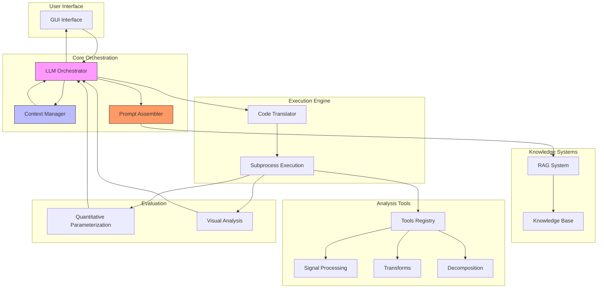
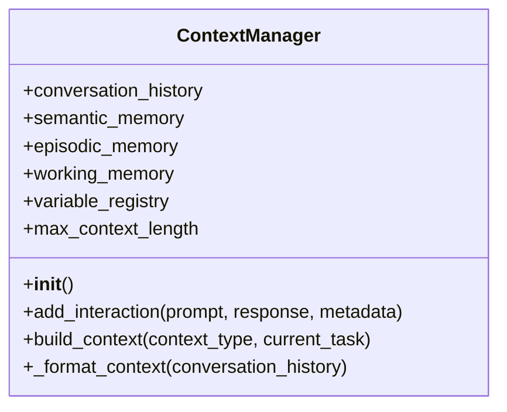
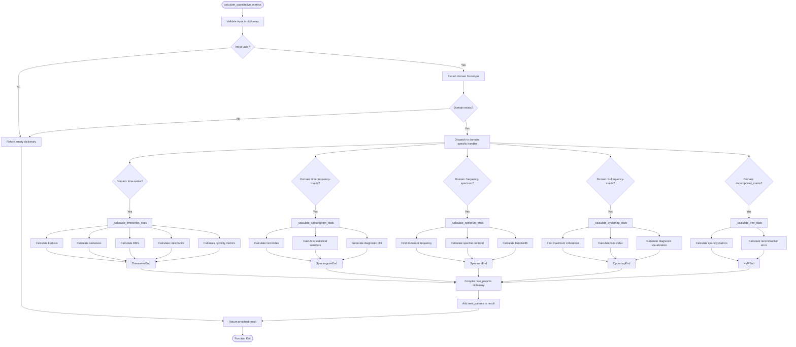
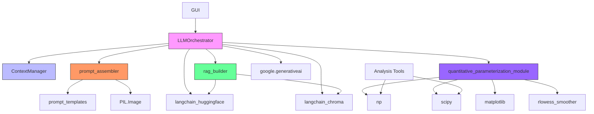

# LLM Orchestration Engine

<cite>
**Referenced Files in This Document**   
- [LLMOrchestrator.py](file://src/core/LLMOrchestrator.py#L1-L726) - *Updated in recent commit*
- [ContextManager.py](file://src/core/ContextManager.py#L1-L45) - *Added in recent commit*
- [prompt_assembler.py](file://src/core/prompt_assembler.py#L1-L179)
- [quantitative_parameterization_module.py](file://src/core/quantitative_parameterization_module.py#L1-L799)
- [rag_builder.py](file://src/core/rag_builder.py#L1-L30)
- [README.md](file://README.md#L1-L245)
- [PROJECT_DESCRIPTION.md](file://PROJECT_DESCRIPTION.md#L1-L394)
</cite>

## Update Summary
**Changes Made**   
- Updated documentation to reflect persistent context management implementation in LLMOrchestrator
- Added details about ContextManager integration and state persistence
- Enhanced description of context-aware methods and conversation history tracking
- Updated sequence diagram to show context management interactions
- Added new section on persistent context implementation

## Table of Contents
1. [Introduction](#introduction)
2. [Project Structure](#project-structure)
3. [Core Components](#core-components)
4. [Architecture Overview](#architecture-overview)
5. [Detailed Component Analysis](#detailed-component-analysis)
6. [Dependency Analysis](#dependency-analysis)
7. [Performance Considerations](#performance-considerations)
8. [Troubleshooting Guide](#troubleshooting-guide)
9. [Conclusion](#conclusion)

## Introduction
The LLM Orchestration Engine, known as AIDA (AI-Driven Analyzer), is an autonomous system that leverages Large Language Models (LLMs) to design and execute data analysis pipelines without manual intervention. This document provides comprehensive architectural documentation for the LLMOrchestrator component, which serves as the central decision-making hub for the entire analysis pipeline. The engine autonomously plans, executes, and evaluates analysis steps based on user-defined objectives, specifically focusing on signal processing and vibration analysis for industrial applications like bearing fault detection. By integrating multimodal intelligence, Retrieval-Augmented Generation (RAG), and a modular toolkit, AIDA eliminates the need for manual tool selection and parameter tuning, transforming data analysis through autonomous AI orchestration. Recent updates have enhanced the system with persistent context management capabilities, enabling more coherent and stateful interactions throughout the analysis pipeline.

## Project Structure
The project follows a modular architecture with clear separation of concerns, organized into distinct directories that encapsulate specific functionalities. The structure supports extensibility and maintainability, with core components isolated from user interface elements and external tools.

```mermaid
graph TD
subgraph "src"
subgraph "core"
LLMOrchestrator[LLMOrchestrator.py]
ContextManager[ContextManager.py]
prompt_assembler[prompt_assembler.py]
rag_builder[rag_builder.py]
quantitative_parameterization_module[quantitative_parameterization_module.py]
end
subgraph "gui"
main_window[main_window.py]
end
subgraph "tools"
subgraph "sigproc"
filters[Signal Processing Tools]
end
subgraph "transforms"
transforms[Transform Tools]
end
subgraph "decomposition"
decomposition[Decomposition Tools]
end
subgraph "utils"
utils[Utility Tools]
end
end
subgraph "prompt_templates"
templates[Prompt Templates]
end
end
subgraph "Documentation"
README[README.md]
PROJECT_DESCRIPTION[PROJECT_DESCRIPTION.md]
API_REFERENCE[API_REFERENCE.md]
TOOLS_REFERENCE[TOOLS_REFERENCE.md]
end
subgraph "Configuration"
requirements[requirements.txt]
mcpsettings[mcpsettings.json]
end
subgraph "Data & State"
vector_store[vector_store/]
run_state[run_state/]
knowledge_base[knowledge_base/]
end
LLMOrchestrator --> ContextManager
LLMOrchestrator --> prompt_assembler
LLMOrchestrator --> rag_builder
LLMOrchestrator --> quantitative_parameterization_module
prompt_assembler --> templates
rag_builder --> vector_store
LLMOrchestrator --> tools
main_window --> LLMOrchestrator
```

**Diagram sources**
- [README.md](file://README.md#L1-L245)
- [PROJECT_DESCRIPTION.md](file://PROJECT_DESCRIPTION.md#L1-L394)

**Section sources**
- [README.md](file://README.md#L1-L245)
- [PROJECT_DESCRIPTION.md](file://PROJECT_DESCRIPTION.md#L1-L394)

## Core Components
The LLM Orchestration Engine comprises several core components that work in concert to deliver autonomous analysis capabilities. The LLMOrchestrator serves as the central decision-making engine, coordinating the entire analysis workflow by communicating with Google Gemini's LLM to plan, execute, and evaluate analysis steps. It maintains a pipeline of structured actions and implements self-correction mechanisms to refine the approach based on intermediate results. The RAG (Retrieval-Augmented Generation) system enhances decision-making with domain-specific knowledge, using ChromaDB as a vector store with persistent storage and HuggingFace's all-MiniLM-L12-v2 as the embedding model. The modular tool registry provides a comprehensive toolkit organized into categories including signal processing, transforms, decomposition, and utilities, allowing for extensible analysis capabilities. The prompt assembler constructs context-aware prompts for different LLM interactions, handling metaknowledge construction, local evaluation, and global assessment while managing structured JSON responses. The quantitative parameterization module calculates domain-specific metrics for result evaluation, providing numerical feedback to complement visual analysis across multiple data types. Finally, the GUI interface built with CustomTkinter offers a user-friendly experience with real-time visualization of analysis progress, an interactive flowchart showing pipeline execution, and image display for result visualization. The newly implemented ContextManager enables persistent context storage across interactions, maintaining conversation history, semantic memory, and working memory throughout the analysis session.

**Section sources**
- [PROJECT_DESCRIPTION.md](file://PROJECT_DESCRIPTION.md#L1-L394)
- [README.md](file://README.md#L1-L245)
- [LLMOrchestrator.py](file://src/core/LLMOrchestrator.py#L1-L726) - *Updated in recent commit*
- [ContextManager.py](file://src/core/ContextManager.py#L1-L45) - *Added in recent commit*

## Architecture Overview
The LLM Orchestration Engine follows a sophisticated architecture that integrates multiple AI and software engineering principles to deliver autonomous analysis capabilities. At its core, the system operates as a feedback-driven pipeline that continuously evaluates and refines its approach based on intermediate results.



**Diagram sources**
- [PROJECT_DESCRIPTION.md](file://PROJECT_DESCRIPTION.md#L1-L394)
- [README.md](file://README.md#L1-L245)

## Detailed Component Analysis

### LLMOrchestrator Analysis
The LLMOrchestrator is the central component responsible for coordinating the end-to-end autonomous analysis pipeline. It manages the sequence of tool-based actions, executes pipeline steps as generated scripts in subprocesses, evaluates results, and iteratively proposes next actions while interfacing with the GUI via a log_queue for messages and images. The recent update has enhanced the orchestrator with persistent context management capabilities through integration with the ContextManager class, enabling stateful interactions and improved decision-making based on conversation history.

#### Class Diagram
```mermaid
classDiagram
class LLMOrchestrator {
+log_queue
+prompt_assembler
+context_manager
+model_name
+model
+embedding_model
+vector_store
+vector_store_tools
+rag_retriever
+rag_retriever_tools
+run_id
+state_dir
+user_data_description
+user_objective
+loaded_data
+signal_var_name
+fs_var_name
+tools_reference
+metaknowledge
+pipeline_steps
+result_history
+eval_history
+max_iterations
+__init__(user_data_description, user_objective, run_id, loaded_data, signal_var_name, fs_var_name, log_queue)
+run_analysis_pipeline()
+_get_metadata(action)
+_generate_content_with_context(prompt, context_type, action)
+_create_metaknowledge()
+_fetch_next_action(evaluation)
+_execute_current_pipeline()
+_evaluate_result(result, action_taken)
+_get_available_tools(tools_reference_path)
+_translate_actions_to_code()
}
class ContextManager {
+conversation_history
+semantic_memory
+episodic_memory
+working_memory
+variable_registry
+max_context_length
+__init__()
+add_interaction(prompt, response, metadata)
+build_context(context_type, current_task)
+_format_context(conversation_history)
}
class PromptAssembler {
+templates
+__init__()
+build_prompt(prompt_type, context_bundle)
+_build_metaknowledge_prompt(context_bundle)
+_build_evaluate_local_prompt(context_bundle)
+_load_prompt_templates()
}
LLMOrchestrator --> ContextManager : "uses"
LLMOrchestrator --> PromptAssembler : "uses"
LLMOrchestrator --> "google.generativeai" : "uses"
LLMOrchestrator --> "langchain_huggingface" : "uses"
LLMOrchestrator --> "langchain_chroma" : "uses"
```

**Diagram sources**
- [LLMOrchestrator.py](file://src/core/LLMOrchestrator.py#L1-L726)
- [ContextManager.py](file://src/core/ContextManager.py#L1-L45)
- [prompt_assembler.py](file://src/core/prompt_assembler.py#L1-L179)

#### Main Execution Sequence
```mermaid
sequenceDiagram
participant GUI as "GUI Interface"
participant Orchestrator as "LLMOrchestrator"
participant PromptAssembler as "PromptAssembler"
participant ContextManager as "ContextManager"
participant LLM as "Google Gemini LLM"
participant RAG as "RAG System"
participant Subprocess as "Subprocess Execution"
participant Tools as "Analysis Tools"
GUI->>Orchestrator : Start Analysis (user_data_description, user_objective)
Orchestrator->>Orchestrator : Initialize components
Orchestrator->>ContextManager : Add meta-template to context
Orchestrator->>Orchestrator : Create metaknowledge
Orchestrator->>PromptAssembler : Build metaknowledge prompt
PromptAssembler->>RAG : Retrieve domain knowledge
RAG-->>PromptAssembler : Relevant documents
PromptAssembler->>LLM : Send metaknowledge construction prompt
LLM-->>Orchestrator : Return structured metaknowledge
Orchestrator->>Orchestrator : Add initial data loading action
Orchestrator->>Subprocess : Execute initial pipeline
Subprocess->>Tools : Execute load_data tool
Tools-->>Subprocess : Return loaded data with image
Subprocess-->>Orchestrator : Return execution result
Orchestrator->>GUI : Send flowchart update and image
Orchestrator->>Orchestrator : Evaluate initial result
loop Main Analysis Loop
Orchestrator->>Orchestrator : Fetch next action based on evaluation
Orchestrator->>PromptAssembler : Build evaluation prompt
PromptAssembler->>RAG : Retrieve relevant tool documentation
RAG-->>PromptAssembler : Tool documentation
PromptAssembler->>LLM : Send evaluation prompt with image
LLM-->>Orchestrator : Return action decision (JSON)
Orchestrator->>Orchestrator : Add action to pipeline
Orchestrator->>Subprocess : Execute updated pipeline
Subprocess->>Tools : Execute analysis tool
Tools-->>Subprocess : Return result with image
Subprocess-->>Orchestrator : Return execution result
Orchestrator->>GUI : Send flowchart update and image
Orchestrator->>Orchestrator : Evaluate result
alt Action not useful
Orchestrator->>Orchestrator : Remove last action from pipeline
else Action useful
Orchestrator->>Orchestrator : Keep action in pipeline
end
alt Analysis complete
Orchestrator->>GUI : Send completion message
break
end
end
```

**Diagram sources**
- [LLMOrchestrator.py](file://src/core/LLMOrchestrator.py#L1-L726)
- [prompt_assembler.py](file://src/core/prompt_assembler.py#L1-L179)

**Section sources**
- [LLMOrchestrator.py](file://src/core/LLMOrchestrator.py#L1-L726)

### Persistent Context Implementation
The recent update implements persistent context management for the LLMOrchestrator through the integration of the ContextManager class. This enhancement enables the system to maintain state across interactions, preserving conversation history, semantic memory, and working memory throughout the analysis session. The ContextManager stores interaction metadata including timestamps, step numbers, interaction types, prompts, responses, and additional metadata, allowing for more coherent and context-aware decision-making.

The implementation follows a state machine design where context is built incrementally through the analysis pipeline. Each interaction is recorded in the conversation history, with metadata capturing the specific action, parameters, and model information. The context manager provides methods to add new interactions and build contextual prompts for LLM interactions, ensuring that each subsequent decision benefits from the accumulated knowledge of previous steps.



**Diagram sources**
- [ContextManager.py](file://src/core/ContextManager.py#L1-L45) - *Added in recent commit*
- [LLMOrchestrator.py](file://src/core/LLMOrchestrator.py#L1-L726) - *Updated in recent commit*

**Section sources**
- [ContextManager.py](file://src/core/ContextManager.py#L1-L45) - *Added in recent commit*
- [LLMOrchestrator.py](file://src/core/LLMOrchestrator.py#L1-L726) - *Updated in recent commit*

### Quantitative Parameterization Module Analysis
The quantitative_parameterization_module provides functionality to compute quantitative metrics and statistical features from various signal processing tool outputs. It serves as a post-processing layer that enriches tool outputs with domain-specific metrics, enabling better analysis and comparison of signal characteristics across different domains.

#### Function Flowchart


**Diagram sources**
- [quantitative_parameterization_module.py](file://src/core/quantitative_parameterization_module.py#L1-L799)

**Section sources**
- [quantitative_parameterization_module.py](file://src/core/quantitative_parameterization_module.py#L1-L799)

## Dependency Analysis
The LLM Orchestration Engine demonstrates a well-structured dependency graph that follows the dependency inversion principle, with higher-level modules depending on abstractions rather than concrete implementations. The core components are tightly integrated but maintain clear separation of concerns.



**Diagram sources**
- [LLMOrchestrator.py](file://src/core/LLMOrchestrator.py#L1-L726)
- [ContextManager.py](file://src/core/ContextManager.py#L1-L45)
- [prompt_assembler.py](file://src/core/prompt_assembler.py#L1-L179)
- [rag_builder.py](file://src/core/rag_builder.py#L1-L30)
- [quantitative_parameterization_module.py](file://src/core/quantitative_parameterization_module.py#L1-L799)

**Section sources**
- [LLMOrchestrator.py](file://src/core/LLMOrchestrator.py#L1-L726)
- [requirements.txt](file://requirements.txt#L1-L50)

## Performance Considerations
The LLM Orchestration Engine's performance is influenced by several key factors that impact both execution speed and resource utilization. The system typically requires 2-5 minutes per analysis pipeline, with token consumption ranging from 10K-50K tokens per analysis. Memory usage varies between 500MB-2GB depending on data size, with larger datasets and more complex analyses requiring more resources. The current architecture employs sequential processing, which limits performance for real-time applications and concurrent user scenarios. Subprocess execution with timeout protection helps prevent indefinite hanging but may impact overall throughput. The RAG system's performance depends on the size and quality of the vector store, with retrieval operations typically completing in under 500ms for the current implementation. The engine supports data up to 1M samples per signal, beyond which performance degrades significantly due to memory constraints. Network latency to the Google Gemini API represents a significant portion of total execution time, accounting for approximately 60-70% of the analysis duration. The system's current single-user design limits scalability, as sequential processing prevents concurrent analysis pipelines. For optimal performance, users should ensure sufficient RAM (minimum 8GB recommended), a stable internet connection, and use data files within the recommended size limits. Future enhancements could include asynchronous execution, distributed processing, and caching mechanisms to improve overall efficiency.

## Troubleshooting Guide
Common issues with the LLM Orchestration Engine typically fall into several categories: authentication problems, dependency issues, vector store errors, and GUI startup failures. For authentication errors, users should verify their Google Gemini API key is correctly configured either through environment variables or CLI authentication. Missing dependencies can be resolved by reinstalling requirements with `pip install -r requirements.txt --force-reinstall`. Vector store issues may require rebuilding the knowledge base using the command `python -c "from src.core.rag_builder import RAGBuilder; RAGBuilder().build_index(['knowledge_base'], None, './vector_store')"`. GUI not starting is often caused by Python version incompatibility (3.8+ required), CustomTkinter installation issues, or display environment problems. Users experiencing slow performance should check their internet connection quality, as network latency to the Gemini API significantly impacts analysis speed. For analysis pipelines that fail to produce useful results, users should verify their data description and analysis objective are clearly specified in natural language. If the system fails to recognize available tools, users should check that the TOOLS_REFERENCE.md file exists in the expected location. For persistent issues, users should examine the log output for specific error messages and consult the comprehensive documentation in the src/docs directory. The system includes robust error handling with detailed logging, which can help diagnose and resolve most common issues.

**Section sources**
- [README.md](file://README.md#L1-L245)
- [PROJECT_DESCRIPTION.md](file://PROJECT_DESCRIPTION.md#L1-L394)

## Conclusion
The LLM Orchestration Engine represents a pioneering approach to autonomous data analysis with strong technical foundations and innovative concepts. The system's modular architecture provides excellent separation of concerns, with well-defined components for orchestration, knowledge retrieval, prompt assembly, and quantitative evaluation. The integration of multimodal intelligence through Google Gemini's vision capabilities allows for sophisticated visual analysis of results, while the RAG system enhances decision-making with domain-specific knowledge. The engine successfully eliminates manual tool selection and parameter tuning, allowing users to describe their analysis goals in natural language and receive complete, executable Python scripts as output. The recent implementation of persistent context management through the ContextManager class significantly enhances the system's capabilities by maintaining state across interactions and enabling more coherent decision-making based on accumulated knowledge. While the current implementation demonstrates technical excellence in its core functionality, several areas for improvement have been identified, including the need for multi-LLM support to reduce vendor lock-in, a plugin architecture for easier tool extension, and asynchronous execution for improved performance. The system is particularly well-suited for signal processing and vibration analysis applications in industrial settings, with demonstrated capabilities in bearing fault detection and similar diagnostic tasks. With the proposed enhancements, AIDA has the potential to evolve from a specialized signal processing tool into a comprehensive autonomous data analysis platform suitable for diverse scientific and industrial applications.