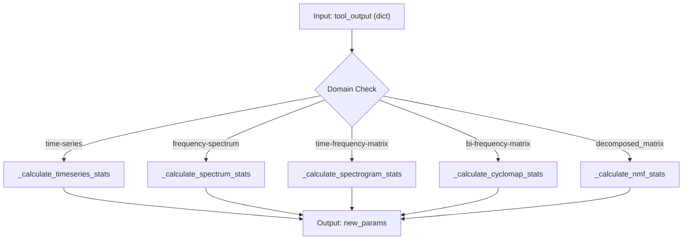
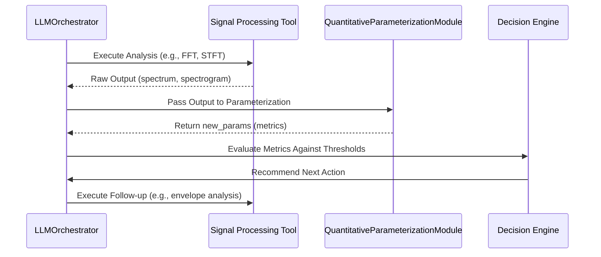

# Quantitative Parameterization and Evaluation

<cite>
**Referenced Files in This Document**   
- [quantitative_parameterization_module.py](file://src/core/quantitative_parameterization_module.py#L0-L1075)
</cite>

## Table of Contents
1. [Introduction](#introduction)
2. [Core Functionality Overview](#core-functionality-overview)
3. [Metric Calculation Methods](#metric-calculation-methods)
4. [Integration with LLMOrchestrator](#integration-with-llmorchestrator)
5. [Feedback Loop and Pipeline Optimization](#feedback-loop-and-pipeline-optimization)
6. [Thresholds and Diagnostic Interpretation](#thresholds-and-diagnostic-interpretation)
7. [Numerical Stability and Edge Cases](#numerical-stability-and-edge-cases)
8. [Extending with Custom Metrics](#extending-with-custom-metrics)
9. [Conclusion](#conclusion)

## Introduction

The **Quantitative Parameterization Module** serves as a critical post-processing component in the LLM-based signal analysis pipeline. It transforms raw outputs from various signal processing tools into structured, domain-specific quantitative metrics that enable objective evaluation of analysis results. These metrics are essential for assessing signal characteristics such as impulsiveness, periodicity, spectral concentration, and cyclostationarity—key indicators in vibration analysis and fault detection.

By computing statistical features and diagnostic parameters from time-series, frequency spectra, spectrograms, cyclostationary maps, and NMF decompositions, this module bridges the gap between numerical signal processing and qualitative interpretation by large language models (LLMs). The computed metrics inform decision-making within the **LLMOrchestrator**, enabling intelligent pipeline adaptation based on analysis outcomes.

**Section sources**
- [quantitative_parameterization_module.py](file://src/core/quantitative_parameterization_module.py#L1-L50)

## Core Functionality Overview

The module operates through a dispatcher pattern implemented in the `calculate_quantitative_metrics` function, which routes input data to specialized handlers based on the `'domain'` field in the input dictionary. This design enables extensible, domain-aware metric computation across multiple signal representations.



**Diagram sources**
- [quantitative_parameterization_module.py](file://src/core/quantitative_parameterization_module.py#L250-L275)

**Section sources**
- [quantitative_parameterization_module.py](file://src/core/quantitative_parameterization_module.py#L250-L300)

## Metric Calculation Methods

### Time-Series Metrics
For signals in the time domain, the module computes the following key parameters:

- **Kurtosis**: Measures the impulsiveness of the signal. Computed using `scipy.stats.kurtosis(signal, fisher=False)` to retain the standard definition where Gaussian noise has kurtosis ≈ 3.
- **Skewness**: Indicates asymmetry in the amplitude distribution.
- **RMS (Root Mean Square)**: Reflects the overall energy level:  
  `rms = sqrt(mean(signal^2))`
- **Crest Factor**: Ratio of peak absolute value to RMS, indicating transient content:  
  `crest_factor = max(|signal|) / rms`
- **Cyclicity Strength and Period**: Derived from autocorrelation peaks, measuring periodic behavior.

**Section sources**
- [quantitative_parameterization_module.py](file://src/core/quantitative_parameterization_module.py#L310-L350)

### Frequency Spectrum Metrics
For FFT-based spectra, the module identifies dominant spectral components and distribution characteristics:

- **Dominant Frequency (Hz)**: Frequency corresponding to the maximum spectral amplitude.
- **Spectral Centroid**: Weighted average of frequency components.
- **Bandwidth**: Spread of significant frequency content.
- **Spectral Flatness**: Measure of tonality (0 = noise-like, 1 = tone-like).
- **Spectral Rolloff**: Frequency below which 85% of total energy is contained.

These metrics are calculated from the primary spectrum data and its associated frequency axis.

**Section sources**
- [quantitative_parameterization_module.py](file://src/core/quantitative_parameterization_module.py#L360-L390)

### Time-Frequency and Cyclostationary Analysis
For 2D representations like spectrograms and cyclostationary maps (CSC), the module computes:

- **Gini Index**: Quantifies sparsity or concentration of energy across time-frequency bins. A higher Gini index indicates more localized, impulsive events.
- **Spectral Kurtosis Selector**: Frequency-dependent kurtosis values indicating non-Gaussian behavior.
- **Jarque-Bera Selector**: Normality test statistic per frequency bin.
- **Alpha-Stable Parameter**: Estimated tail heaviness of the distribution per frequency.
- **Joint Selector**: Combined metric derived from multiplication of normalized selectors.

Diagnostic plots are generated to visualize these selectors, aiding in identifying frequency bands with anomalous behavior.

```mermaid
flowchart TD
A["Spectrogram Matrix"] --> B[Flatten for Gini]
A --> C[Slice per Frequency]
C --> D[kurtosis(slice)]
C --> E[jarque_bera(slice)]
C --> F[estimate_alpha_stable(slice)]
D --> G[Normalize]
E --> G
F --> G
G --> H[Joint Selector]
H --> I[Plot & Save]
```

**Diagram sources**
- [quantitative_parameterization_module.py](file://src/core/quantitative_parameterization_module.py#L400-L480)

**Section sources**
- [quantitative_parameterization_module.py](file://src/core/quantitative_parameterization_module.py#L400-L550)

### NMF Component Analysis
For Non-negative Matrix Factorization (NMF) results, the module reconstructs time-domain signals from basis and coefficient matrices and computes component-specific statistics:

- **Signal Reconstruction**: Uses Griffin-Lim algorithm for time-frequency inputs or custom FIR filtering for cyclostationary maps.
- **Component Kurtosis**: Measures impulsiveness of each reconstructed signal.
- **Dominant Frequencies**: Identified from the spectral basis vectors.
- **Gini Index per Component**: Assesses energy localization.

Reconstructed component signals are saved as diagnostic plots for visual inspection.

**Section sources**
- [quantitative_parameterization_module.py](file://src/core/quantitative_parameterization_module.py#L700-L850)

## Integration with LLMOrchestrator

The computed metrics are structured under the `'new_params'` key in the output dictionary, making them directly accessible to the **LLMOrchestrator**. This integration follows a transformation pattern where numerical results are converted into qualitative assessments:

```python
enriched_output = calculate_quantitative_metrics(tool_output)
metrics = enriched_output['new_params']
```

The LLM interprets these metrics to generate natural language summaries such as:
- "High kurtosis (K > 5) suggests impulsive behavior typical of bearing faults."
- "Strong cyclicity at 30 Hz may indicate rotational imbalance."
- "Energy concentration in the 1–2 kHz band aligns with gear meshing frequencies."

This enables the orchestrator to reason about signal health, select follow-up analyses, or conclude diagnostic findings.

**Section sources**
- [quantitative_parameterization_module.py](file://src/core/quantitative_parameterization_module.py#L250-L300)

## Feedback Loop and Pipeline Optimization

A closed-loop feedback mechanism exists between tool execution, metric computation, and pipeline control:



**Diagram sources**
- [quantitative_parameterization_module.py](file://src/core/quantitative_parameterization_module.py#L250-L850)

**Section sources**
- [quantitative_parameterization_module.py](file://src/core/quantitative_parameterization_module.py#L250-L850)

This loop allows dynamic adaptation of the analysis pipeline. For example, high kurtosis may trigger envelope spectrum analysis, while strong cyclicity may prompt order tracking.

## Thresholds and Diagnostic Interpretation

Specific parameter thresholds are used to detect meaningful signal characteristics:

| Parameter | Normal Range | Fault Indicator | Interpretation |
|---------|-------------|------------------|----------------|
| Kurtosis | 3–5 | >6 | Impulsive behavior, likely fault |
| Crest Factor | 3–5 | >8 | High peak energy, possible impact |
| Cyclicity Strength | <0.3 | >0.6 | Strong periodic component |
| Gini Index | <0.5 | >0.7 | Sparse, transient events |

These thresholds are domain-specific and can be calibrated based on baseline measurements stored in `baseline_results.json`.

**Section sources**
- [quantitative_parameterization_module.py](file://src/core/quantitative_parameterization_module.py#L310-L350)

## Numerical Stability and Edge Cases

The module includes robust handling of edge cases:

- **Empty or Invalid Input**: Returns empty `new_params` without raising errors.
- **Zero-Range Signals**: Normalization functions add epsilon to prevent division by zero.
- **Missing Phase in Reconstruction**: Uses random initialization in Griffin-Lim algorithm.
- **Boundary Conditions**: Peak detection uses prominence thresholds to avoid noise triggers.

Helper functions like `normalize_data`, `calculate_gini_index`, and `_smooth_spectrum` ensure numerical stability across diverse input conditions.

**Section sources**
- [quantitative_parameterization_module.py](file://src/core/quantitative_parameterization_module.py#L200-L240)

## Extending with Custom Metrics

To support specialized analysis scenarios, the module can be extended with custom metric calculators:

1. Define a new handler function (e.g., `_calculate_custom_stats`).
2. Register it in the `domain_handlers` dictionary within `calculate_quantitative_metrics`.
3. Ensure the function accepts a dictionary and returns a dict of float or serializable values.

Example extension:
```python
def _calculate_custom_stats(data_dict):
    signal = data_dict[data_dict['primary_data']]
    custom_metric = np.percentile(np.abs(signal), 99)
    return {'99th_percentile': float(custom_metric)}
```

New domains (e.g., `'wavelet-coefficients'`) can be added to enable domain-specific processing.

**Section sources**
- [quantitative_parameterization_module.py](file://src/core/quantitative_parameterization_module.py#L250-L300)

## Conclusion

The **Quantitative Parameterization Module** plays a pivotal role in transforming raw signal processing outputs into actionable, interpretable metrics. By computing domain-specific statistical features and generating diagnostic visualizations, it enables the **LLMOrchestrator** to make informed decisions about signal health and analysis progression. Its modular design supports easy extension with new metrics, ensuring adaptability to evolving diagnostic requirements. The integration of numerical analysis with qualitative reasoning forms the foundation of an intelligent, self-optimizing signal analysis pipeline.