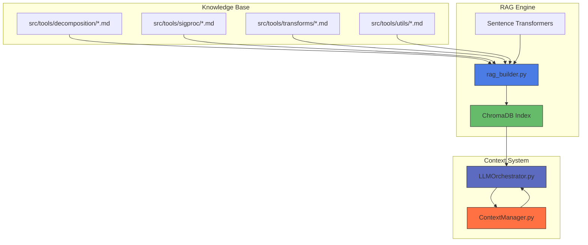
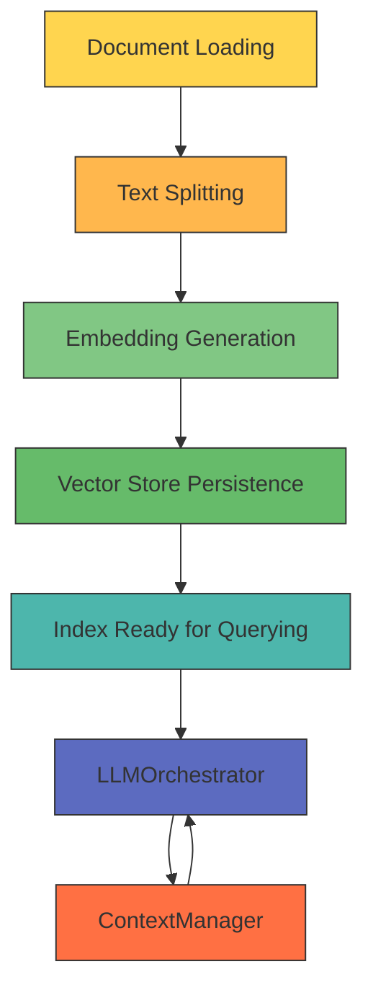
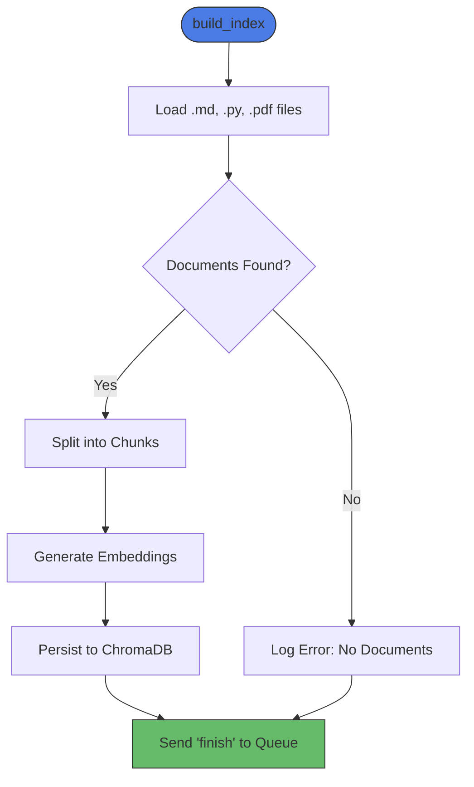
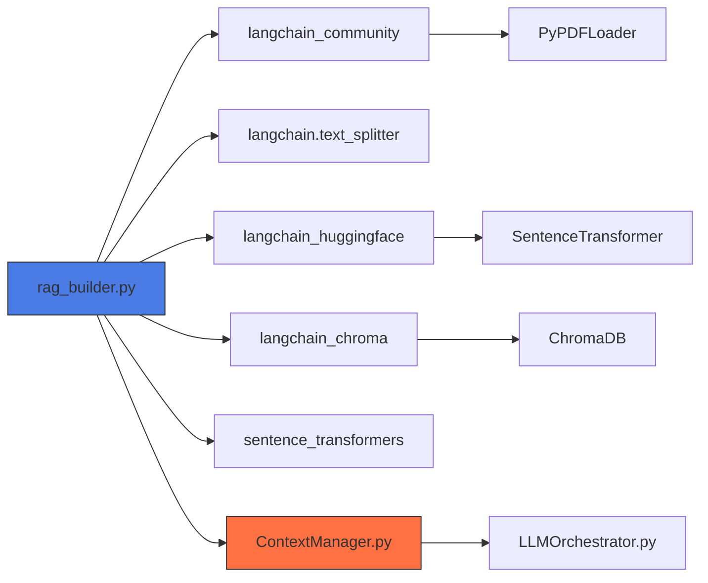

# RAG System Integration

<cite>
**Referenced Files in This Document**   
- [rag_builder.py](file://src/core/rag_builder.py) - *Updated in recent commit*
- [ContextManager.py](file://src/core/ContextManager.py) - *Added in recent commit*
- [LLMOrchestrator.py](file://src/core/LLMOrchestrator.py) - *Modified in recent commit*
- [decompose_matrix_nmf.md](file://src/tools/decomposition/decompose_matrix_nmf.md)
- [select_component.md](file://src/tools/decomposition/select_component.md)
- [bandpass_filter.md](file://src/tools/sigproc/bandpass_filter.md)
- [highpass_filter.md](file://src/tools/sigproc/highpass_filter.md)
- [lowpass_filter.md](file://src/tools/sigproc/lowpass_filter.md)
- [create_csc_map.md](file://src/tools/transforms/create_csc_map.md)
- [create_envelope_spectrum.md](file://src/tools/transforms/create_envelope_spectrum.md)
- [create_fft_spectrum.md](file://src/tools/transforms/create_fft_spectrum.md)
- [create_signal_spectrogram.md](file://src/tools/transforms/create_signal_spectrogram.md)
- [load_data.md](file://src/tools/utils/load_data.md)
</cite>

## Update Summary
**Changes Made**   
- Updated documentation to reflect integration of persistent context management
- Added new section on ContextManager integration and its role in RAG
- Updated LLMOrchestrator section to reflect context-aware processing
- Enhanced architecture overview with context flow
- Added new diagram showing context integration
- Updated section sources to reflect new and modified files

## Table of Contents
1. [Introduction](#introduction)
2. [Project Structure](#project-structure)
3. [Core Components](#core-components)
4. [Architecture Overview](#architecture-overview)
5. [Detailed Component Analysis](#detailed-component-analysis)
6. [Dependency Analysis](#dependency-analysis)
7. [Performance Considerations](#performance-considerations)
8. [Troubleshooting Guide](#troubleshooting-guide)
9. [Conclusion](#conclusion)

## Introduction
This document provides comprehensive architectural documentation for the Retrieval-Augmented Generation (RAG) system implemented in the `rag_builder.py` module. The system enables semantic retrieval of tool documentation to support intelligent decision-making by the LLMOrchestrator during pipeline execution. It constructs a persistent ChromaDB vector index from markdown and code files located in the `src/tools/` directory, allowing for context-aware retrieval of technical specifications, usage examples, and functional descriptions. The integration supports dynamic knowledge base updates and ensures alignment between code implementation and accessible domain knowledge. Recent enhancements have integrated persistent context management through the ContextManager class, enabling more sophisticated context-aware processing.

## Project Structure
The project follows a modular structure organized by functional domains. The RAG system primarily interacts with tool documentation files stored in the `src/tools/` subdirectories. Each tool has a corresponding `.md` file that describes its functionality, parameters, and usage patterns. The core RAG logic resides in `src/core/rag_builder.py`, which orchestrates document loading, chunking, embedding, and vector store persistence. The enhanced system now integrates with `src/core/ContextManager.py` for persistent context management and `src/core/LLMOrchestrator.py` for context-aware decision making.



**Diagram sources**
- [rag_builder.py](file://src/core/rag_builder.py#L1-L115)
- [ContextManager.py](file://src/core/ContextManager.py#L1-L44)
- [LLMOrchestrator.py](file://src/core/LLMOrchestrator.py#L1-L725)

**Section sources**
- [rag_builder.py](file://src/core/rag_builder.py#L1-L115)
- [ContextManager.py](file://src/core/ContextManager.py#L1-L44)
- [LLMOrchestrator.py](file://src/core/LLMOrchestrator.py#L1-L725)

## Core Components
The primary component of the RAG system is the `RAGBuilder` class defined in `src/core/rag_builder.py`. This class is responsible for ingesting tool documentation, processing it into semantically meaningful chunks, generating embeddings using a Hugging Face sentence transformer model, and storing the results in a persistent ChromaDB vector index. The system supports both index creation and loading operations, enabling efficient reuse of precomputed embeddings. Communication with the GUI is facilitated through a queue-based logging mechanism that reports progress, completion, or errors. The system now integrates with the `ContextManager` class for persistent context storage and retrieval, enhancing the LLM's ability to make context-aware decisions.

**Section sources**
- [rag_builder.py](file://src/core/rag_builder.py#L1-L115)
- [ContextManager.py](file://src/core/ContextManager.py#L1-L44)

## Architecture Overview
The RAG system follows a pipeline architecture consisting of four sequential stages: document loading, text splitting, embedding generation, and vector store persistence. The process begins by scanning specified directories for `.md`, `.py`, and `.pdf` files. These documents are loaded, split into manageable chunks using a recursive character splitter, and converted into dense vector representations using the `all-MiniLM-L6-v2` sentence transformer model. Finally, the embedded chunks are stored in a ChromaDB instance for fast similarity-based retrieval. The enhanced architecture now incorporates persistent context management through the `ContextManager` class, which maintains conversation history, semantic memory, and working memory across analysis sessions.



**Diagram sources**
- [rag_builder.py](file://src/core/rag_builder.py#L1-L115)
- [ContextManager.py](file://src/core/ContextManager.py#L1-L44)
- [LLMOrchestrator.py](file://src/core/LLMOrchestrator.py#L1-L725)

## Detailed Component Analysis

### RAGBuilder Class Analysis
The `RAGBuilder` class encapsulates the entire RAG pipeline. It initializes with a default embedding model and provides two main methods: `build_index()` and `load_index()`. The `build_index()` method orchestrates the full ingestion pipeline, while `load_index()` enables fast restoration of a previously built index.

#### Key Methods and Flow


**Diagram sources**
- [rag_builder.py](file://src/core/rag_builder.py#L25-L115)

#### Document Loading Strategy
The system uses `DirectoryLoader` from LangChain to recursively scan directories for specific file types:
- **Markdown files**: Glob pattern `**/*.md` with `TextLoader`
- **Python files**: Glob pattern `**/*.py` with `TextLoader`
- **PDF files**: Glob pattern `**/*.pdf` with `PyPDFLoader`

Each file type is processed separately and combined into a unified document list before chunking.

**Section sources**
- [rag_builder.py](file://src/core/rag_builder.py#L45-L65)

#### Text Splitting Configuration
The system uses `RecursiveCharacterTextSplitter` with the following parameters:
- **chunk_size**: 800 characters
- **chunk_overlap**: 500 characters

This configuration ensures sufficient context retention across chunk boundaries while maintaining manageable segment sizes for embedding and retrieval.

```python
text_splitter = RecursiveCharacterTextSplitter(chunk_size=800, chunk_overlap=500)
```

**Section sources**
- [rag_builder.py](file://src/core/rag_builder.py#L75-L80)

#### Embedding Model Configuration
The system leverages the `sentence-transformers` library via `HuggingFaceEmbeddings`. The default model is `all-MiniLM-L6-v2`, though the system allows runtime specification of alternative models. The embeddings are generated using CPU-only execution (`device='cpu'`) with disabled normalization (`normalize_embeddings=False`).

```python
model_kwargs = {'device': 'cpu'}
encode_kwargs = {'normalize_embeddings': False}
client = SentenceTransformer(model_name)
embeddings = HuggingFaceEmbeddings(
    client=client,
    model_kwargs=model_kwargs,
    encode_kwargs=encode_kwargs,
    multi_process=True
)
```

**Section sources**
- [rag_builder.py](file://src/core/rag_builder.py#L85-L95)

#### Vector Store Persistence
The final index is persisted using ChromaDB with the following configuration:
- **Input**: Document chunks and embeddings
- **Output**: Persistent vector store at `persist_directory`
- **Retrieval Interface**: `Chroma.from_documents()` for creation, `Chroma(persist_directory=...)` for loading

The persistent index enables fast similarity searches during orchestration without reprocessing the entire knowledge base.

**Section sources**
- [rag_builder.py](file://src/core/rag_builder.py#L98-L110)

### ContextManager Integration
The `ContextManager` class, introduced in the recent update, provides persistent context management for the LLMOrchestrator. It maintains several types of memory:
- **Conversation history**: Complete record of interactions
- **Semantic memory**: Learned patterns and insights
- **Episodic memory**: Time-ordered events
- **Working memory**: Current session state
- **Variable registry**: Variable states across the pipeline

The `build_context()` method constructs contextual prompts by formatting the conversation history and prepending it to the current task, enabling context-aware processing.

```python
def build_context(self, context_type, current_task):
    formatted_context = self._format_context(self.conversation_history)
    return f"--- CONTEXT: ---\n\n{formatted_context}\n\n--- END OF CONTEXT ---\n\n{current_task}"
```

**Section sources**
- [ContextManager.py](file://src/core/ContextManager.py#L25-L44)

## Dependency Analysis
The RAG system depends on several external libraries and internal components:
- **LangChain**: For document loading and text splitting
- **ChromaDB**: For vector storage and similarity search
- **Sentence Transformers**: For embedding generation
- **HuggingFaceEmbeddings**: LangChain integration layer
- **PyPDFLoader**: For PDF document ingestion
- **ContextManager**: For persistent context management (new dependency)

These dependencies are managed via the project's `requirements.txt` and are essential for the system's functionality.



**Diagram sources**
- [rag_builder.py](file://src/core/rag_builder.py#L1-L115)
- [ContextManager.py](file://src/core/ContextManager.py#L1-L44)
- [LLMOrchestrator.py](file://src/core/LLMOrchestrator.py#L1-L725)

## Performance Considerations
The RAG system's performance is influenced by several factors:
- **Indexing Time**: Proportional to the number and size of documents; mitigated by multi-process embedding
- **Memory Usage**: Dominated by the loaded sentence transformer model and document chunks
- **Query Latency**: Typically low due to ChromaDB's optimized ANN search
- **Chunk Size**: Larger chunks preserve context but increase embedding cost
- **Overlap**: High overlap (500 chars) improves context continuity at the cost of redundancy
- **Context Management**: The ContextManager adds memory overhead but enables more sophisticated reasoning

For optimal performance, consider:
- Using GPU acceleration when available
- Adjusting chunk size based on document complexity
- Periodic index optimization
- Caching frequently retrieved documents
- Monitoring context size to prevent excessive memory usage

## Troubleshooting Guide
Common issues and their resolutions:
- **No documents found**: Verify that `knowledge_base_paths` point to directories containing `.md`, `.py`, or `.pdf` files
- **Embedding model fails to load**: Ensure internet connectivity or pre-download the model
- **Index persistence fails**: Check write permissions on `persist_directory`
- **High memory usage**: Reduce batch size or use smaller embedding models
- **Poor retrieval quality**: Adjust chunk size or overlap parameters
- **Context management errors**: Verify that ContextManager is properly initialized and has sufficient memory allocation

Error handling is implemented via try-except blocks that communicate failures through the queue mechanism.

**Section sources**
- [rag_builder.py](file://src/core/rag_builder.py#L105-L115)
- [ContextManager.py](file://src/core/ContextManager.py#L1-L44)

## Conclusion
The RAG system provides a robust foundation for semantic retrieval of tool documentation, enabling the LLMOrchestrator to make informed decisions based on precise technical knowledge. By integrating LangChain, ChromaDB, and sentence transformers, the system achieves high-quality embeddings and efficient querying. The recent integration of the ContextManager class enhances the system's capabilities by providing persistent context management, allowing for more sophisticated context-aware processing and decision making. The modular design allows for easy extension with new tools and documentation formats. Future improvements could include support for real-time indexing, enhanced metadata tagging, and query-time relevance scoring.