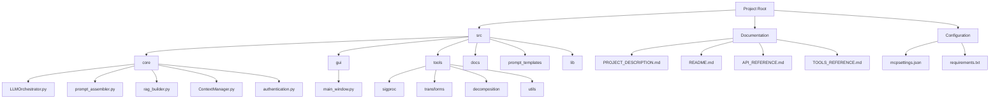
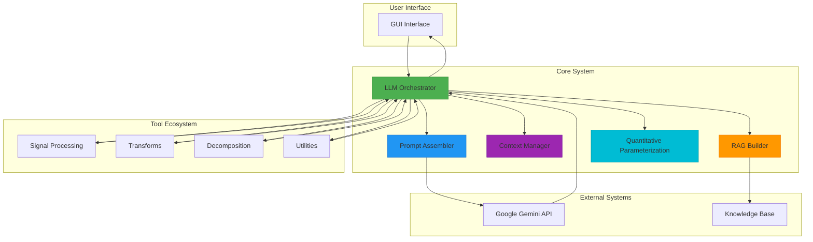
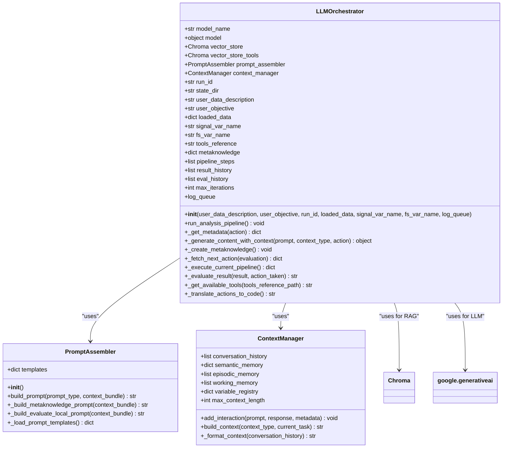
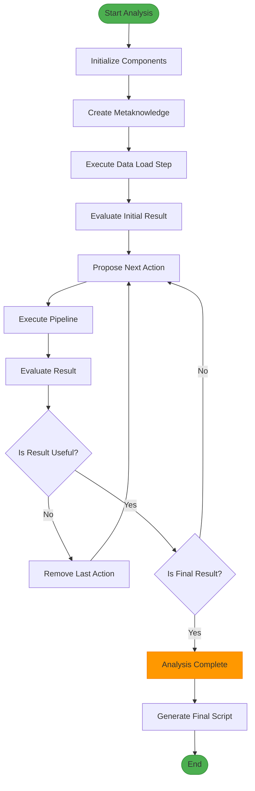
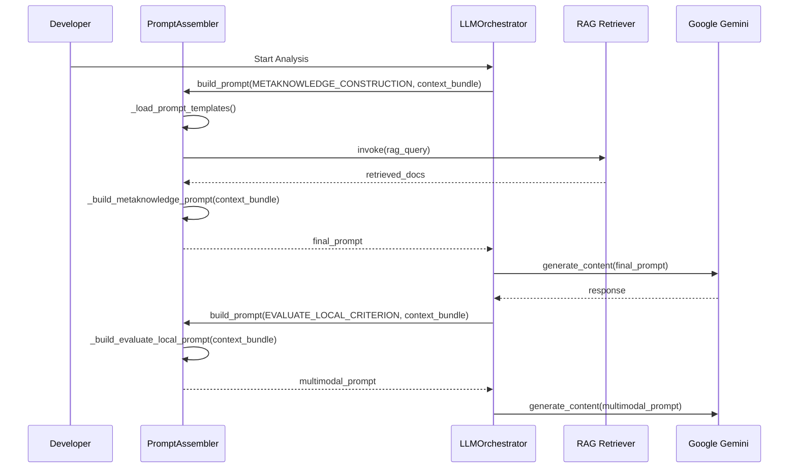
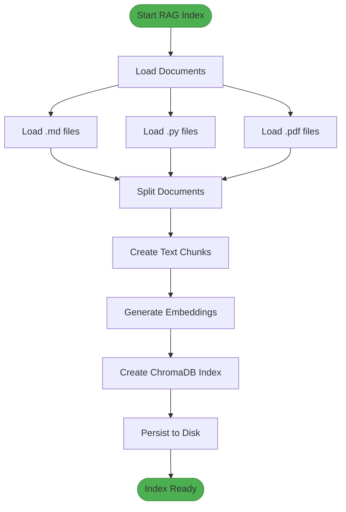
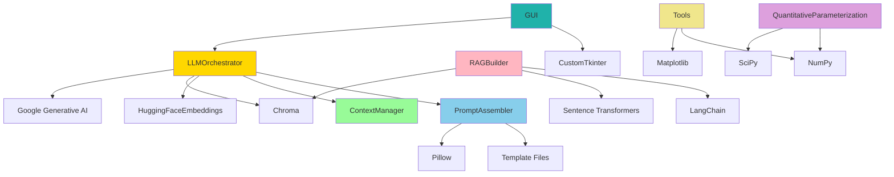

# Development Guide

<cite>
**Referenced Files in This Document**   
- [LLMOrchestrator.py](file://src/core/LLMOrchestrator.py#L1-L725)
- [prompt_assembler.py](file://src/core/prompt_assembler.py#L1-L178)
- [rag_builder.py](file://src/core/rag_builder.py#L1-L115)
- [ContextManager.py](file://src/core/ContextManager.py#L1-L44)
- [app.py](file://src/app.py)
- [main_window.py](file://src/gui/main_window.py)
- [quantitative_parameterization_module.py](file://src/core/quantitative_parameterization_module.py)
- [authentication.py](file://src/core/authentication.py)
- [create_fft_spectrum.py](file://src/tools/transforms/create_fft_spectrum.py)
- [bandpass_filter.py](file://src/tools/sigproc/bandpass_filter.py)
- [decompose_matrix_nmf.py](file://src/tools/decomposition/decompose_matrix_nmf.py)
- [load_data.py](file://src/tools/utils/load_data.py)
- [TOOLS_REFERENCE.md](file://src/docs/TOOLS_REFERENCE.md)
- [API_REFERENCE.md](file://src/docs/API_REFERENCE.md)
- [PROJECT_DESCRIPTION.md](file://PROJECT_DESCRIPTION.md)
- [README.md](file://README.md)
</cite>

## Table of Contents
1. [Introduction](#introduction)
2. [Project Structure](#project-structure)
3. [Core Components](#core-components)
4. [Architecture Overview](#architecture-overview)
5. [Detailed Component Analysis](#detailed-component-analysis)
6. [Dependency Analysis](#dependency-analysis)
7. [Performance Considerations](#performance-considerations)
8. [Troubleshooting Guide](#troubleshooting-guide)
9. [Conclusion](#conclusion)

## Introduction
This Development Guide provides a comprehensive overview of the AIDA (AI-Driven Analyzer) system, an autonomous data analysis pipeline orchestrated by Large Language Models (LLMs). The guide is designed for developers contributing to the project, offering insights into the code structure, module responsibilities, and integration points. It details the system's architecture, core logic, and development practices, enabling contributors to extend functionality, debug issues, and maintain high code quality. The system leverages Google Gemini for multimodal decision-making, uses Retrieval-Augmented Generation (RAG) for domain knowledge, and features a modular tool system for signal processing and analysis.

## Project Structure
The AIDA project follows a modular, layer-based organization that separates concerns into distinct directories. The structure is designed for extensibility, with clear boundaries between core logic, user interface, tools, and configuration.

**Diagram sources**
- [README.md](file://README.md#L1-L244)
- [PROJECT_DESCRIPTION.md](file://PROJECT_DESCRIPTION.md#L1-L393)

**Section sources**
- [README.md](file://README.md#L1-L244)
- [PROJECT_DESCRIPTION.md](file://PROJECT_DESCRIPTION.md#L1-L393)

## Core Components
The system's core functionality is distributed across several key modules in the `src/core` directory. These components work together to orchestrate the autonomous analysis pipeline, manage context, and interface with external systems.

**Section sources**
- [LLMOrchestrator.py](file://src/core/LLMOrchestrator.py#L1-L725)
- [prompt_assembler.py](file://src/core/prompt_assembler.py#L1-L178)
- [rag_builder.py](file://src/core/rag_builder.py#L1-L115)
- [ContextManager.py](file://src/core/ContextManager.py#L1-L44)

## Architecture Overview
AIDA's architecture is built around a central LLM orchestrator that manages the entire analysis workflow. The system uses a RAG-enhanced approach to incorporate domain knowledge, and executes analysis steps through a dynamically generated Python script. The architecture is designed for autonomy, with self-correction mechanisms and iterative refinement of the analysis pipeline.

**Diagram sources**
- [LLMOrchestrator.py](file://src/core/LLMOrchestrator.py#L1-L725)
- [PROJECT_DESCRIPTION.md](file://PROJECT_DESCRIPTION.md#L1-L393)

## Detailed Component Analysis

### LLM Orchestrator Analysis
The `LLMOrchestrator` class is the central decision-making engine of the AIDA system. It manages the entire analysis workflow, from initialization to pipeline execution and result evaluation. The orchestrator uses a stateful approach to maintain context across interactions and implements a self-correcting mechanism to refine the analysis pipeline.

**Diagram sources**
- [LLMOrchestrator.py](file://src/core/LLMOrchestrator.py#L1-L725)
- [prompt_assembler.py](file://src/core/prompt_assembler.py#L1-L178)
- [ContextManager.py](file://src/core/ContextManager.py#L1-L44)

**Section sources**
- [LLMOrchestrator.py](file://src/core/LLMOrchestrator.py#L1-L725)

#### Analysis of Main Workflow
The orchestrator's main workflow is implemented in the `run_analysis_pipeline` method, which follows a three-phase approach: initialization, main loop, and output generation. The method first creates metaknowledge from user input and data, then enters an iterative loop where it proposes, executes, and evaluates analysis steps.

**Diagram sources**
- [LLMOrchestrator.py](file://src/core/LLMOrchestrator.py#L150-L250)

### Prompt Assembler Analysis
The `PromptAssembler` class is responsible for constructing the prompts sent to the LLM. It manages template loading and implements specific logic for different prompt types, including metaknowledge construction and result evaluation. The assembler uses RAG to inject relevant domain knowledge into prompts, enhancing the LLM's decision-making capabilities.

**Diagram sources**
- [prompt_assembler.py](file://src/core/prompt_assembler.py#L1-L178)
- [LLMOrchestrator.py](file://src/core/LLMOrchestrator.py#L1-L725)

**Section sources**
- [prompt_assembler.py](file://src/core/prompt_assembler.py#L1-L178)

### RAG System Analysis
The RAG (Retrieval-Augmented Generation) system enhances the LLM's capabilities by providing access to domain-specific knowledge. The `RAGBuilder` class constructs and loads vector stores from documentation, code, and research papers, enabling context-aware decision making during the analysis process.

**Diagram sources**
- [rag_builder.py](file://src/core/rag_builder.py#L1-L115)

**Section sources**
- [rag_builder.py](file://src/core/rag_builder.py#L1-L115)

## Dependency Analysis
The AIDA system has a well-defined dependency structure with clear separation between components. The core modules depend on external libraries for LLM integration, vector storage, and document processing, while maintaining loose coupling between internal components.

**Diagram sources**
- [LLMOrchestrator.py](file://src/core/LLMOrchestrator.py#L1-L725)
- [rag_builder.py](file://src/core/rag_builder.py#L1-L115)
- [prompt_assembler.py](file://src/core/prompt_assembler.py#L1-L178)

**Section sources**
- [LLMOrchestrator.py](file://src/core/LLMOrchestrator.py#L1-L725)
- [rag_builder.py](file://src/core/rag_builder.py#L1-L115)

## Performance Considerations
The AIDA system's performance is influenced by several factors, including LLM response times, data processing complexity, and RAG retrieval efficiency. The system is designed for batch processing of time-series data, with typical analysis times ranging from 2 to 5 minutes per pipeline. Memory usage ranges from 500MB to 2GB depending on data size, and the system supports signals with up to 1 million samples.

The main performance bottleneck is the LLM interaction, which involves multiple round-trips for metaknowledge construction, action proposal, and result evaluation. Each LLM call consumes between 10K and 50K tokens per analysis. The system mitigates this through efficient context management and caching of vector store embeddings.

For optimal performance, ensure that:
- The vector stores are pre-built and persisted to disk
- The LLM API connection is stable and low-latency
- Data files are pre-processed and in efficient formats (HDF5 preferred over CSV)
- Sufficient RAM is available for large signal processing operations

The subprocess execution model provides isolation and timeout protection, preventing individual analysis steps from hanging indefinitely. However, this approach incurs overhead from process creation and inter-process communication.

## Troubleshooting Guide
This section addresses common issues developers may encounter when working with the AIDA system, along with debugging strategies and solutions.

**Section sources**
- [LLMOrchestrator.py](file://src/core/LLMOrchestrator.py#L1-L725)
- [rag_builder.py](file://src/core/rag_builder.py#L1-L115)
- [prompt_assembler.py](file://src/core/prompt_assembler.py#L1-L178)

### Common Issues and Solutions

**LLM API Connection Errors**
- **Symptoms**: "Error calling Gemini API" messages in logs
- **Causes**: Invalid API key, network connectivity issues, rate limiting
- **Solutions**: 
  - Verify API key in authentication configuration
  - Check network connectivity to Google APIs
  - Implement retry logic with exponential backoff
  - Monitor token usage and adjust rate limits

**RAG Index Not Found**
- **Symptoms**: "Persisted index not found" errors
- **Causes**: Vector store not built, incorrect path, permissions
- **Solutions**:
  - Run RAGBuilder to create the index: `python -c "from src.core.rag_builder import RAGBuilder; RAGBuilder().build_index(['knowledge_base'], None, './vector_store')"`
  - Verify the `persist_directory` path in code
  - Check file system permissions

**Tool Execution Failures**
- **Symptoms**: Subprocess errors, timeout exceptions
- **Causes**: Invalid parameters, missing dependencies, data format issues
- **Solutions**:
  - Check tool parameter validation in the tool implementation
  - Verify all required Python packages are installed
  - Validate input data format and dimensions
  - Increase timeout values for complex operations

**GUI Not Responding**
- **Symptoms**: Frozen interface, no updates
- **Causes**: Blocking operations on main thread, logging queue issues
- **Solutions**:
  - Ensure long-running operations are in background threads
  - Verify the log_queue is properly connected and processed
  - Check for infinite loops in event handlers

### Debugging Strategies
1. **Enable Verbose Logging**: Set logging level to DEBUG to capture detailed execution information
2. **Inspect State Files**: Check the `run_state` directory for intermediate results, metaknowledge, and generated scripts
3. **Validate Prompts**: Examine the constructed prompts in the context manager to ensure proper RAG integration
4. **Test Tools Independently**: Run individual tools outside the orchestrator to isolate issues
5. **Monitor Resource Usage**: Track memory and CPU usage during analysis to identify bottlenecks

The system's modular design allows for component isolation, making it easier to identify and resolve issues. The persistent state management enables post-mortem analysis of failed runs by examining the generated scripts and intermediate results.

## Conclusion
The AIDA system represents an innovative approach to autonomous data analysis, leveraging LLMs to design and execute complex signal processing pipelines. The architecture demonstrates strong engineering principles with its modular design, clear separation of concerns, and robust error handling. The integration of RAG enhances the system's domain expertise, while the self-correcting workflow enables adaptive analysis strategies.

For developers, the system provides a solid foundation for extending autonomous analysis capabilities. The well-defined component interfaces and tool registration system make it relatively straightforward to add new analysis functions. Future improvements could include multi-LLM support, enhanced performance through asynchronous execution, and a more sophisticated plugin architecture for tool extensions.

The documentation and code structure support maintainability and collaboration, making AIDA a promising platform for advancing AI-driven data analysis in industrial and scientific applications.