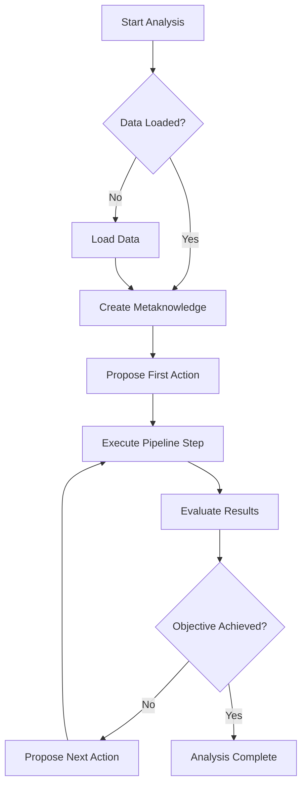

# Getting Started

<cite>
**Referenced Files in This Document**   
- [README.md](file://README.md)
- [requirements.txt](file://requirements.txt)
- [mcpsettings.json](file://mcpsettings.json)
- [src/app.py](file://src/app.py)
- [src/core/authentication.py](file://src/core/authentication.py)
- [src/gui/main_window.py](file://src/gui/main_window.py)
- [src/tools/utils/load_data.py](file://src/tools/utils/load_data.py)
</cite>

## Table of Contents
1. [Prerequisites](#prerequisites)
2. [Installation](#installation)
3. [Configuration](#configuration)
4. [Launching the Application](#launching-the-application)
5. [Quick Start Tutorial](#quick-start-tutorial)
6. [Troubleshooting](#troubleshooting)

## Prerequisites

Before installing and running the AIDA (AI-Driven Analyzer) application, ensure your system meets the following requirements:

- **Python Version**: 3.8 or higher
- **Google Gemini API Access**: Required for LLM orchestration capabilities
- **Virtual Environment**: Recommended for dependency isolation
- **Operating System**: Windows, macOS, or Linux with GUI support

The application leverages several key Python libraries for data processing and visualization:
- **numpy**: For numerical operations
- **scipy**: For scientific computing
- **matplotlib**: For data visualization
- **h5py**: For HDF5 file handling
- **CustomTkinter**: For the graphical user interface

**Section sources**
- [README.md](file://README.md#L25-L44)
- [requirements.txt](file://requirements.txt#L1-L14)

## Installation

Follow these steps to set up the AIDA environment:

### 1. Clone the Repository
```bash
git clone https://github.com/yourusername/LLM_analyzer.git
cd LLM_analyzer
```

### 2. Set Up Virtual Environment
Create and activate a virtual environment to isolate project dependencies:

```bash
python -m venv venv
source venv/bin/activate  # On Windows: venv\Scripts\activate
```

### 3. Install Dependencies
Install all required packages from the requirements file:

```bash
pip install -r requirements.txt
```

The requirements.txt file contains the following essential packages:
```
customtkinter
scipy
numpy
langchain
langchain-community
langchain-huggingface
sentence-transformers
chromadb
pypdf
h5py
langchain-chroma
matplotlib
google-generativeai
Pillow
```

**Section sources**
- [README.md](file://README.md#L46-L60)
- [requirements.txt](file://requirements.txt#L1-L14)

## Configuration

### API Credentials Setup
The application requires Google Gemini API credentials for LLM functionality. Configuration is handled in two places:

1. **Service Account Key**: The path is hardcoded in `src/core/authentication.py`:
```python
os.environ['GOOGLE_APPLICATION_CREDENTIALS'] = "D:\\Drive\\Projekty\\LLM_analyzer\\src\\core\\llm-analyzer-466009-81c353112c07.json"
```

2. **Environment Variable**: Alternatively, set the GEMINI_API_KEY environment variable.

### MCP Settings
The mcpsettings.json file configures the Model Context Protocol server:
```json
{
  "mcpServers": {
    "filesystem": {
      "command": "npx",
      "args": [
        "-y",
        "@modelcontextprotocol/server-filesystem",
        "C:/Users/JW/Desktop",
        "D:/Drive/Dropbox/Python"
      ],
      "autoApprove": [
        "read_file",
        "read_multiple_files",
        "write_file",
        "edit_file",
        "create_directory",
        "list_directory",
        "directory_tree",
        "move_file",
        "search_files",
        "get_file_info",
        "list_allowed_directories"
      ]
    }
  }
}
```

This configuration enables filesystem operations for the specified directories.

**Section sources**
- [src/core/authentication.py](file://src/core/authentication.py#L10-L15)
- [mcpsettings.json](file://mcpsettings.json#L1-L27)

## Launching the Application

### Running the Application
Start the AIDA application by executing the main script:

```bash
python src/app.py
```

The application entry point (`src/app.py`) performs the following:
1. Imports the GUI application and authentication module
2. Checks for valid credentials
3. Launches the GUI if authentication succeeds

```python
if __name__ == "__main__":
    if get_credentials():
        app = App()
        app.mainloop()
    else:
        print("Authentication failed. Exiting application.")
```

### Authentication Process
The `get_credentials()` function in `authentication.py`:
1. Sets the GOOGLE_APPLICATION_CREDENTIALS environment variable
2. Attempts to instantiate a Gemini model to verify credentials
3. Returns True if successful, False otherwise

**Section sources**
- [src/app.py](file://src/app.py#L1-L24)
- [src/core/authentication.py](file://src/core/authentication.py#L1-L27)

## Quick Start Tutorial

### 1. Load Sample Data
When the application launches, you have two options to load data:

**Option A: Load Demo Data**
- Click the dropdown menu labeled "Load demo data"
- Select from available datasets:
  - **Kruszarka**: Vibration signal at 25 kHz, bearing fault frequency ~30.7 Hz
  - **Łożysko B**: Vibration signal at 19.2 kHz, bearing fault frequency ~12.7 Hz
  - **Przekładnia**: Gearbox vibration signal at 8192 Hz

**Option B: Load Custom Data**
- Click "Load Data File (.mat)"
- Select a .mat or HDF5 file containing your time-series data
- The application automatically identifies the signal and sampling rate variables

### 2. Specify Analysis Objective
Enter your analysis goal in the "Analysis Objective" text box. Examples include:
- "Detect bearing faults in vibration signals"
- "Identify periodic components in the time series"
- "Perform spectral analysis to find dominant frequencies"

Provide additional context in the "Data Description" box, including:
- Sampling frequency
- Measurement conditions
- Expected fault frequencies
- Signal characteristics

### 3. Configure Knowledge Base
Before starting analysis, set up the RAG (Retrieval-Augmented Generation) system:

**Build RAG Index**
- Click "Build RAG Index"
- Select the knowledge base directory (e.g., containing domain expertise)
- Select the tools directory (src/tools)
- The system will create vector stores in ./vector_store and ./vector_store_tools

**Load Existing RAG Index**
- Click "Load RAG Index"
- The application loads pre-built indices from ./vector_store and ./vector_store_tools

### 4. Initiate Autonomous Analysis
Click "Start Analysis" to begin the autonomous pipeline. The system will:

1. **Initialize**: Create metaknowledge from your input and data
2. **Plan**: The LLM orchestrator designs the first analysis step
3. **Execute**: Run the generated analysis script
4. **Evaluate**: Assess results and plan next steps
5. **Iterate**: Continue until the objective is achieved

### 5. Monitor Progress
The interface displays:
- **Action Sequence Flowchart**: Visual representation of the analysis pipeline
- **Result Plot**: Current analysis output
- **Log**: Detailed progress messages from the orchestrator



**Diagram sources**
- [src/core/LLMOrchestrator.py](file://src/core/LLMOrchestrator.py#L1-L726)
- [src/gui/main_window.py](file://src/gui/main_window.py#L1-L649)

**Section sources**
- [src/gui/main_window.py](file://src/gui/main_window.py#L1-L649)
- [src/core/LLMOrchestrator.py](file://src/core/LLMOrchestrator.py#L1-L726)

## Troubleshooting

### Common Issues and Solutions

**Authentication Errors**
```
An error occurred: <error message>
Authentication failed. Exiting application.
```
- **Solution**: Verify the path to your service account key in `authentication.py`
- Ensure the JSON key file exists and has proper permissions
- Check that the Google Cloud project has the Generative AI API enabled

**Missing Dependencies**
```
ModuleNotFoundError: No module named 'customtkinter'
```
- **Solution**: Reinstall dependencies with:
```bash
pip install -r requirements.txt --force-reinstall
```
- Ensure you're using the correct Python environment

**GUI Not Starting**
- **Symptoms**: Application starts but no window appears
- **Causes and Solutions**:
  - Missing DISPLAY environment (Linux): Set DISPLAY variable or use X11 forwarding
  - Graphics driver issues: Update graphics drivers
  - Python version incompatibility: Ensure Python 3.8+

**Data Loading Issues**
- **Symptoms**: "No suitable data arrays found"
- **Solutions**:
  - Ensure .mat files contain 2D arrays with signal data in the first column
  - Verify file format compatibility (MATLAB v7.3 or earlier)
  - Check that variable names don't start with '__'

**RAG Index Building Failures**
```
Error building RAG index: <error message>
```
- **Solution**: Rebuild the knowledge base:
```bash
python -c "from src.core.rag_builder import RAGBuilder; RAGBuilder().build_index(['knowledge_base'], None, './vector_store')"
```

**Performance Issues**
- Large datasets may cause memory issues
- Consider downsampling data or increasing system RAM
- Close other memory-intensive applications

**Section sources**
- [README.md](file://README.md#L215-L244)
- [src/core/authentication.py](file://src/core/authentication.py#L1-L27)
- [src/gui/main_window.py](file://src/gui/main_window.py#L1-L649)