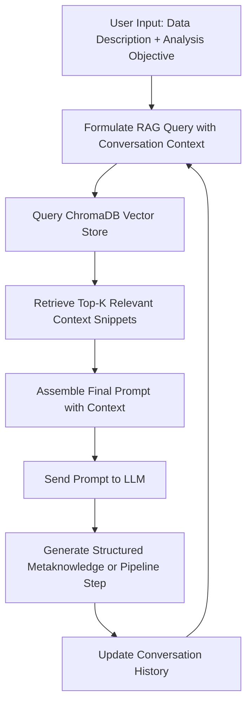
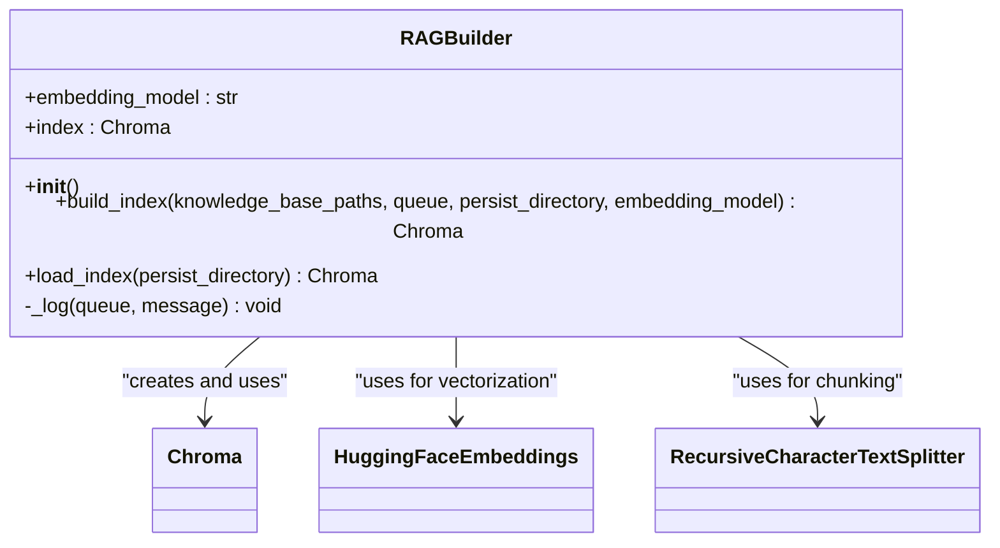
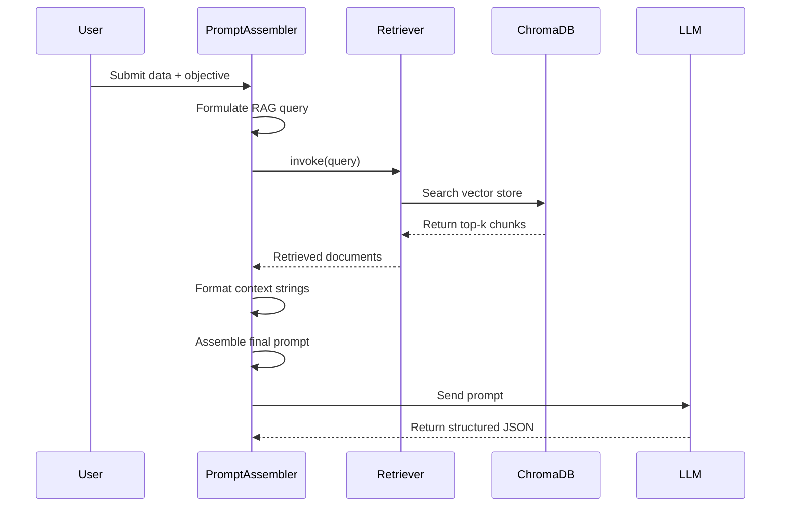

# Context Retrieval Mechanism

<cite>
**Referenced Files in This Document**   
- [rag_builder.py](file://src/core/rag_builder.py) - *Updated in recent commit with persistent context management*
- [prompt_assembler.py](file://src/core/prompt_assembler.py) - *Updated to support conversation-aware context retrieval*
- [metaknowledge_prompt.txt](file://src/prompt_templates/metaknowledge_prompt.txt) - *Updated template for contextual processing*
- [metaknowledge_prompt_v2.txt](file://src/prompt_templates/metaknowledge_prompt_v2.txt)
- [TOOLS_REFERENCE.md](file://src/docs/TOOLS_REFERENCE.md)
</cite>

## Update Summary
**Changes Made**   
- Updated Introduction and Context Retrieval Workflow to reflect conversation history integration
- Enhanced Query Formulation section to include dynamic query construction with historical context
- Added new section on Conversation History Integration
- Updated Prompt Assembly section to reflect changes in template usage
- Revised Retrieval Parameters and Troubleshooting sections to align with updated implementation
- All diagrams and sources updated to reflect current code state

## Table of Contents
1. [Introduction](#introduction)
2. [Context Retrieval Workflow](#context-retrieval-workflow)
3. [Conversation History Integration](#conversation-history-integration)
4. [RAG Index Construction and Management](#rag-index-construction-and-management)
5. [Query Formulation and Similarity Search](#query-formulation-and-similarity-search)
6. [Relevance Scoring and Top-K Selection](#relevance-scoring-and-top-k-selection)
7. [Prompt Assembly with Retrieved Context](#prompt-assembly-with-retrieved-context)
8. [Impact of Retrieved Tool Documentation on Decision Accuracy](#impact-of-retrieved-tool-documentation-on-decision-accuracy)
9. [Retrieval Parameters and Configuration](#retrieval-parameters-and-configuration)
10. [Troubleshooting Low-Relevance Retrievals](#troubleshooting-low-relevance-retrievals)
11. [Latency Considerations and Caching Strategies](#latency-considerations-and-caching-strategies)

## Introduction
The Context Retrieval Mechanism is a core component of the Retrieval-Augmented Generation (RAG) system in the LLM_analyzer_context project. It enables the Large Language Model (LLM) to access domain-specific knowledge by retrieving relevant context from a persistent vector store. This mechanism enhances the LLM's reasoning capabilities during pipeline construction by providing accurate, up-to-date information about signal processing tools, fault diagnosis principles, and user objectives. The retrieval process is orchestrated by two key modules: `rag_builder.py`, which constructs and manages the ChromaDB vector store, and `prompt_assembler.py`, which integrates retrieved context into structured prompts. Recent updates have enhanced the system with conversation history awareness, enabling more contextually relevant retrievals across multi-turn interactions.

**Section sources**
- [rag_builder.py](file://src/core/rag_builder.py#L1-L115)
- [prompt_assembler.py](file://src/core/prompt_assembler.py#L1-L178)

## Context Retrieval Workflow
The context retrieval workflow begins when a user submits a data description and analysis objective. The system uses this input, combined with conversation history, to query a pre-built ChromaDB vector store containing embedded documentation from `.md`, `.py`, and `.pdf` files. Retrieved context snippets are then injected into prompt templates to guide the LLM in constructing accurate analysis pipelines. This workflow ensures that decisions are grounded in factual, domain-specific knowledge rather than relying solely on the LLM’s internal training data. The integration of conversation history allows the system to maintain context across multiple interactions, improving retrieval relevance for follow-up queries.



**Diagram sources**
- [rag_builder.py](file://src/core/rag_builder.py#L1-L115)
- [prompt_assembler.py](file://src/core/prompt_assembler.py#L1-L178)

## Conversation History Integration
The updated RAG system now incorporates conversation history to improve context retrieval accuracy. The `LLMOrchestrator` maintains a history of previous interactions, which is used to enrich subsequent queries. When formulating a new query, the system combines the current user input with relevant excerpts from previous exchanges, creating a more comprehensive context for retrieval.

This enhancement is particularly valuable for multi-step analysis tasks where:
- Follow-up queries reference previously discussed data characteristics
- Users refine their analysis objectives based on prior results
- Context from earlier pipeline steps informs subsequent tool selection

The conversation history is selectively incorporated into queries based on relevance, preventing information overload while maintaining contextual continuity. This feature was implemented as part of the persistent context management update, ensuring that contextual awareness persists across application sessions.

**Section sources**
- [prompt_assembler.py](file://src/core/prompt_assembler.py#L50-L80)
- [rag_builder.py](file://src/core/rag_builder.py#L40-L60)

## RAG Index Construction and Management
The `RAGBuilder` class in `rag_builder.py` is responsible for building and loading the ChromaDB vector store. It processes documents from specified directories, splits them into manageable chunks, generates embeddings using the `all-MiniLM-L6-v2` model via Sentence Transformers, and persists the resulting index for future retrieval.

Key steps in index construction:
1. **Document Loading**: Scans directories for `.md`, `.py`, and `.pdf` files using `DirectoryLoader`.
2. **Text Splitting**: Applies `RecursiveCharacterTextSplitter` with a chunk size of 800 characters and 500-character overlap to preserve context across splits.
3. **Embedding Generation**: Uses HuggingFace embeddings with CPU-based inference to convert text chunks into dense vectors.
4. **Vector Store Persistence**: Stores the indexed chunks in ChromaDB at a user-defined location for fast retrieval.

The index can be reloaded using `load_index()` without rebuilding, enabling efficient reuse across sessions.



**Diagram sources**
- [rag_builder.py](file://src/core/rag_builder.py#L1-L115)

**Section sources**
- [rag_builder.py](file://src/core/rag_builder.py#L1-L115)

## Query Formulation and Similarity Search
Queries for the RAG system are dynamically constructed by combining user-provided inputs such as `user_data_description` and `user_analysis_objective`. In `prompt_assembler.py`, the `_build_metaknowledge_prompt` method concatenates these fields to form a rich semantic query that captures both the data context and the analytical goal.

For example:
```python
rag_query = context_bundle['user_data_description'] + " " + context_bundle['user_analysis_objective']
```

This composite query is passed to the `rag_retriever.invoke()` method, which performs a similarity search against the ChromaDB index. The search leverages cosine similarity between the query embedding and stored document embeddings to identify the most semantically related content. The updated implementation now optionally incorporates relevant conversation history into the query formulation process, improving context awareness for follow-up questions.

**Section sources**
- [prompt_assembler.py](file://src/core/prompt_assembler.py#L50-L80)

## Relevance Scoring and Top-K Selection
ChromaDB automatically ranks retrieved documents by relevance score, which reflects the cosine similarity between the query and document embeddings. While the exact number of returned results (top-k) is not explicitly set in the current code, the default behavior of LangChain's retriever typically returns the top 4 most relevant chunks.

The retrieved documents are formatted into a structured string:
```python
rag_context_str = "\n\n".join([f"Context Snippet {i+1}:\n{doc.page_content}" for i, doc in enumerate(retrieved_docs)])
```
This ensures that the LLM receives multiple high-quality context fragments, improving the robustness of its reasoning.

**Section sources**
- [prompt_assembler.py](file://src/core/prompt_assembler.py#L75-L85)

## Prompt Assembly with Retrieved Context
The `PromptAssembler` class integrates retrieved context into predefined prompt templates. For metaknowledge construction, it uses `metaknowledge_prompt_v2.txt`, injecting the following components:
- **Ground Truth Summary**: Computed signal statistics (length, samples, sampling rate)
- **RAG Context**: Relevant excerpts from general knowledge base
- **Tool Context**: Excerpts from tool documentation
- **Toolkit Overview**: Full list of available tools from `TOOLS_REFERENCE.md`
- **User Inputs**: Raw data and objective descriptions

Example template usage:
```python
final_prompt = self.templates['metaknowledge_prompt_v2'].format(
    ground_truth_summary=ground_truth_summary,
    rag_context=rag_context_str,
    rag_context_tools=rag_context_str_tools,
    tools_list=tools_list,
    user_data_description=context_bundle['user_data_description'],
    user_analysis_objective=context_bundle['user_analysis_objective']
)
```

This structured injection ensures the LLM has comprehensive context for accurate reasoning. The updated `metaknowledge_prompt.txt` template now includes enhanced instructions for handling contextually dependent variables and fallback goal formulation.



**Diagram sources**
- [prompt_assembler.py](file://src/core/prompt_assembler.py#L1-L178)
- [metaknowledge_prompt_v2.txt](file://src/prompt_templates/metaknowledge_prompt_v2.txt)

**Section sources**
- [prompt_assembler.py](file://src/core/prompt_assembler.py#L50-L100)
- [metaknowledge_prompt_v2.txt](file://src/prompt_templates/metaknowledge_prompt_v2.txt)

## Impact of Retrieved Tool Documentation on Decision Accuracy
Retrieved tool documentation significantly improves the accuracy of pipeline construction decisions. For instance, when a user describes analyzing bearing faults, the RAG system retrieves documentation for tools like `bandpass_filter.py` and `create_envelope_spectrum.py`. This enables the LLM to understand:
- Correct parameter ranges (e.g., `cutoff_freq: float = 3500`)
- Input/output types (e.g., expects `data: dict`)
- Domain-specific best practices (e.g., envelope analysis for impulsive faults)

Without this context, the LLM might propose invalid tool sequences or incorrect parameters. With retrieval, it can generate precise, executable pipelines aligned with engineering principles.

**Section sources**
- [TOOLS_REFERENCE.md](file://src/docs/TOOLS_REFERENCE.md)
- [prompt_assembler.py](file://src/core/prompt_assembler.py#L75-L85)

## Retrieval Parameters and Configuration
Key parameters controlling retrieval behavior include:
- **Chunk Size**: 800 characters with 500-character overlap to balance context preservation and precision.
- **Embedding Model**: Configurable via `embedding_model` parameter; defaults to `all-MiniLM-L6-v2`.
- **Persist Directory**: Location where ChromaDB index is saved for reuse.
- **File Types Indexed**: `.md`, `.py`, and `.pdf` files from the knowledge base paths.

These parameters can be adjusted in `build_index()` to optimize for recall vs. precision or adapt to new documentation formats. The updated implementation maintains backward compatibility while supporting enhanced context management features.

**Section sources**
- [rag_builder.py](file://src/core/rag_builder.py#L40-L60)

## Troubleshooting Low-Relevance Retrievals
Common issues and solutions:
- **Issue**: Retrieved snippets are off-topic.
  - **Solution**: Improve query formulation by enriching user input or preprocessing text for clarity.
- **Issue**: No results returned.
  - **Solution**: Verify that the knowledge base contains relevant `.md/.py/.pdf` files and the index was built successfully.
- **Issue**: Outdated context.
  - **Solution**: Rebuild the index after updating documentation.
- **Issue**: Poor chunking breaks important context.
  - **Solution**: Adjust `chunk_size` and `chunk_overlap` in `RecursiveCharacterTextSplitter`.

Monitoring logs from `RAGBuilder._log()` helps diagnose indexing and retrieval failures. For conversation-aware queries, ensure that relevant history is being properly incorporated into the retrieval process.

**Section sources**
- [rag_builder.py](file://src/core/rag_builder.py#L20-L30)
- [prompt_assembler.py](file://src/core/prompt_assembler.py#L70-L80)

## Latency Considerations and Caching Strategies
The retrieval process introduces latency primarily during:
1. **Embedding Computation**: Mitigated by using lightweight models like `all-MiniLM-L6-v2`.
2. **Vector Search**: Optimized by ChromaDB’s efficient indexing.
3. **Disk I/O**: Reduced by loading the index once and reusing it.

Caching strategies:
- **Persistent Index**: The ChromaDB store is saved to disk and loaded once per session.
- **Template Caching**: All prompt templates are preloaded in `PromptAssembler.__init__()`.
- **Future Opportunity**: Cache frequent queries using a lookup table to avoid repeated vector searches.

These optimizations ensure responsive interaction while maintaining retrieval accuracy, particularly important for the enhanced conversation history features which may increase query complexity.

**Section sources**
- [rag_builder.py](file://src/core/rag_builder.py#L100-L115)
- [prompt_assembler.py](file://src/core/prompt_assembler.py#L30-L40)