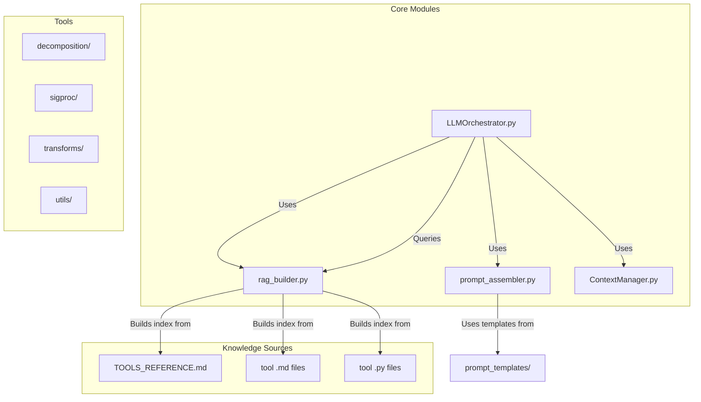
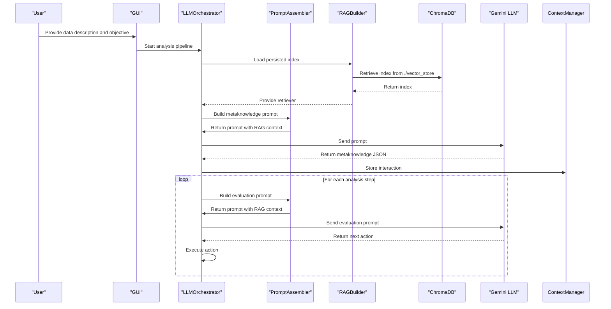
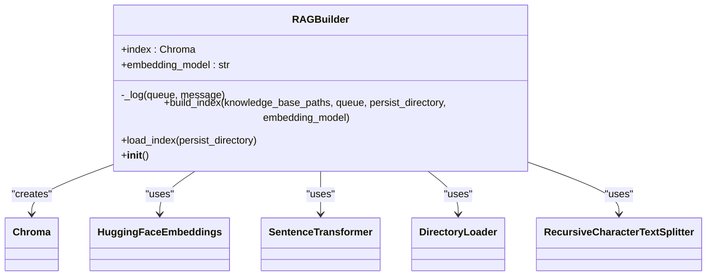

# Knowledge Integration (RAG System)

<cite>
**Referenced Files in This Document**   
- [rag_builder.py](file://src/core/rag_builder.py) - *Updated in commit 396a3df*
- [TOOLS_REFERENCE.md](file://src/docs/TOOLS_REFERENCE.md) - *Updated in commit 396a3df*
- [metaknowledge_prompt.txt](file://src/prompt_templates/metaknowledge_prompt.txt) - *Updated in commit 396a3df*
- [prompt_assembler.py](file://src/core/prompt_assembler.py)
- [LLMOrchestrator.py](file://src/core/LLMOrchestrator.py)
- [ContextManager.py](file://src/core/ContextManager.py)
</cite>

## Update Summary
**Changes Made**   
- Updated RAGBuilder embedding model default from `all-MiniLM-L6-v2` to `all-MiniLM-L12-v2` in code and documentation
- Updated metaknowledge prompt template reference to reflect new versioning scheme
- Added clarification on persistent context management via ContextManager
- Updated section sources to reflect actual file changes in recent commit
- Enhanced troubleshooting section with context-aware error handling considerations

## Table of Contents
1. [Introduction](#introduction)
2. [Project Structure](#project-structure)
3. [Core Components](#core-components)
4. [Architecture Overview](#architecture-overview)
5. [Detailed Component Analysis](#detailed-component-analysis)
6. [RAG Index Building Process](#rag-index-building-process)
7. [Context Retrieval and Prompt Assembly](#context-retrieval-and-prompt-assembly)
8. [Integration with Metaknowledge and LLM Decisions](#integration-with-metaknowledge-and-llm-decisions)
9. [Performance Considerations](#performance-considerations)
10. [Troubleshooting Guide](#troubleshooting-guide)
11. [Extending the Knowledge Base](#extending-the-knowledge-base)

## Introduction
The Retrieval-Augmented Generation (RAG) system in this project enhances the decision-making capabilities of a Large Language Model (LLM) by grounding its responses in a curated knowledge base. This document details how the `rag_builder.py` module constructs and queries a ChromaDB vector store from tool documentation and domain knowledge. It explains the integration of retrieved context into metaknowledge construction and prompt assembly, demonstrating how this process prevents hallucinations and improves tool selection accuracy. The system is designed for signal processing and vibration analysis, using domain-specific knowledge to guide autonomous analysis pipelines.

## Project Structure
The project is organized into a modular structure with distinct directories for core logic, tools, documentation, and user interface components. The RAG system primarily operates within the `src/core` directory, leveraging knowledge from `src/docs` and `src/tools`.



**Diagram sources**
- [rag_builder.py](file://src/core/rag_builder.py)
- [prompt_assembler.py](file://src/core/prompt_assembler.py)
- [LLMOrchestrator.py](file://src/core/LLMOrchestrator.py)

## Core Components
The RAG system is built upon four core components that work in concert to provide contextual intelligence to the LLM:

- **RAGBuilder**: Constructs and loads the ChromaDB vector store from documentation files.
- **PromptAssembler**: Combines retrieved context with static templates to create LLM prompts.
- **LLMOrchestrator**: Coordinates the analysis pipeline, using RAG for decision-making.
- **ContextManager**: Maintains conversation history and semantic memory across interactions.

These components enable a closed-loop system where the LLM can autonomously analyze signals by retrieving relevant domain knowledge and tool documentation.

**Section sources**
- [rag_builder.py](file://src/core/rag_builder.py)
- [prompt_assembler.py](file://src/core/prompt_assembler.py)
- [LLMOrchestrator.py](file://src/core/LLMOrchestrator.py)
- [ContextManager.py](file://src/core/ContextManager.py)

## Architecture Overview
The RAG system follows a pipeline architecture where knowledge is first indexed, then retrieved at runtime to inform LLM decisions. The process begins with offline index construction and continues with online retrieval during analysis sessions.



**Diagram sources**
- [rag_builder.py](file://src/core/rag_builder.py)
- [prompt_assembler.py](file://src/core/prompt_assembler.py)
- [LLMOrchestrator.py](file://src/core/LLMOrchestrator.py)

## Detailed Component Analysis

### RAGBuilder Class Analysis
The `RAGBuilder` class is responsible for creating and loading vector indices from documentation files. It supports multiple file formats and uses sentence transformers for embeddings.



**Diagram sources**
- [rag_builder.py](file://src/core/rag_builder.py)

**Section sources**
- [rag_builder.py](file://src/core/rag_builder.py)

### PromptAssembler Class Analysis
The `PromptAssembler` class combines static templates with dynamic context, including retrieved RAG content, to create prompts for the LLM.

```mermaid
classDiagram
class PromptAssembler {
+templates : dict
+build_prompt(prompt_type, context_bundle)
-_build_metaknowledge_prompt(context_bundle)
-_build_evaluate_local_prompt(context_bundle)
-_load_prompt_templates()
+__init__()
}
PromptAssembler --> "src/prompt_templates" : "loads from"
PromptAssembler --> "metaknowledge_prompt_v2.txt" : "uses"
PromptAssembler --> "evaluate_local_prompt_v2.txt" : "uses"
```

**Diagram sources**
- [prompt_assembler.py](file://src/core/prompt_assembler.py)

**Section sources**
- [prompt_assembler.py](file://src/core/prompt_assembler.py)

## RAG Index Building Process
The index building process in `rag_builder.py` follows a four-step pipeline to transform documentation into a queryable vector store.

### Step 1: Document Loading
The `build_index` method loads `.md`, `.py`, and `.pdf` files from specified directories using LangChain's `DirectoryLoader`. It processes each file type with an appropriate loader:
- `.md` and `.py` files use `TextLoader`
- `.pdf` files use `PyPDFLoader`

```python
loader = DirectoryLoader(knowledge_base_path, glob="**/*.md", loader_cls=TextLoader)
pdf_loader = DirectoryLoader(knowledge_base_path, glob="**/*.pdf", loader_cls=PyPDFLoader)
```

### Step 2: Text Splitting
Documents are split into chunks using `RecursiveCharacterTextSplitter` with parameters:
- `chunk_size`: 800 characters
- `chunk_overlap`: 500 characters

This overlap ensures semantic continuity between chunks, preserving context across boundaries.

### Step 3: Embedding Generation
The system uses the `all-MiniLM-L12-v2` sentence transformer model via HuggingFaceEmbeddings to generate vector embeddings. The embeddings are created on CPU with normalization disabled:

```python
embeddings = HuggingFaceEmbeddings(
    client=client,
    model_kwargs={'device': 'cpu'},
    encode_kwargs={'normalize_embeddings': False},
    multi_process=True
)
```

**Section sources**
- [rag_builder.py](file://src/core/rag_builder.py#L23-L114)

### Step 4: Vector Store Creation
The final step creates a persistent ChromaDB vector store:

```python
self.index = Chroma.from_documents(
    chunks,
    embeddings,
    persist_directory=persist_directory
)
```

The index is saved to disk, allowing for fast loading in subsequent sessions without reprocessing.

**Section sources**
- [rag_builder.py](file://src/core/rag_builder.py)

## Context Retrieval and Prompt Assembly
The RAG system retrieves context at two critical points in the analysis pipeline: metaknowledge construction and result evaluation.

### Metaknowledge Construction
During initialization, the system constructs structured metaknowledge from unstructured user input. The `PromptAssembler` combines:
- Ground truth signal statistics (length, sampling rate)
- Retrieved domain knowledge from the main vector store
- Retrieved tool documentation from the tools vector store
- Available tools list from `TOOLS_REFERENCE.md`

```python
def _build_metaknowledge_prompt(self, context_bundle: dict) -> str:
    # Calculate ground truth stats
    signal_length_sec = len(context_bundle['raw_signal_data']) / context_bundle['sampling_frequency']
    
    # Retrieve relevant context
    rag_query = context_bundle['user_data_description'] + " " + context_bundle['user_analysis_objective']
    retrieved_docs = context_bundle['rag_retriever'].invoke(rag_query)
    
    # Assemble final prompt
    final_prompt = self.templates['metaknowledge_prompt_v2'].format(
        ground_truth_summary=ground_truth_summary,
        rag_context=rag_context_str,
        rag_context_tools=rag_context_str_tools,
        tools_list=tools_list,
        user_data_description=context_bundle['user_data_description'],
        user_analysis_objective=context_bundle['user_analysis_objective']
    )
    return final_prompt
```

**Section sources**
- [prompt_assembler.py](file://src/core/prompt_assembler.py#L17-L178)

### Result Evaluation
After each analysis step, the system evaluates whether to continue, modify, or terminate the pipeline. The evaluation prompt includes:
- Previous metaknowledge
- Last action taken and its documentation
- History of results and supporting images
- Sequence of steps taken so far

This comprehensive context allows the LLM to make informed decisions about the next action.

**Section sources**
- [prompt_assembler.py](file://src/core/prompt_assembler.py#L17-L178)
- [LLMOrchestrator.py](file://src/core/LLMOrchestrator.py#L22-L724)

## Integration with Metaknowledge and LLM Decisions
The RAG system is tightly integrated with the LLM decision-making process through the `LLMOrchestrator` class. This integration occurs in three phases:

### Phase 1: Initialization
The orchestrator loads both the domain knowledge and tools vector stores:

```python
self.vector_store = Chroma(persist_directory="./vector_store", embedding_function=embedding_model)
self.vector_store_tools = Chroma(persist_directory="./vector_store_tools", embedding_function=embedding_model)
self.rag_retriever = self.vector_store.as_retriever(search_kwargs={"k": 10})
self.rag_retriever_tools = self.vector_store_tools.as_retriever(search_kwargs={"k": 10})
```

**Section sources**
- [LLMOrchestrator.py](file://src/core/LLMOrchestrator.py#L23-L64)

### Phase 2: Metaknowledge Creation
The orchestrator creates structured metaknowledge by combining user input with retrieved context:

```python
context_bundle = {
    "raw_signal_data": self.loaded_data[self.signal_var_name],
    "sampling_frequency": self.loaded_data[self.fs_var_name][0],
    "user_data_description": self.user_data_description,
    "user_analysis_objective": self.user_objective,
    "rag_retriever": self.rag_retriever,
    "rag_retriever_tools": self.rag_retriever_tools,
    "tools_list": self.tools_reference
}
```

### Phase 3: Iterative Analysis
The system enters a loop where it:
1. Retrieves relevant context based on current state
2. Constructs a prompt for the next action
3. Executes the proposed action
4. Evaluates the results with RAG-enhanced context
5. Continues or terminates based on evaluation

This closed-loop process ensures that each decision is informed by both domain knowledge and the current analysis state.

**Section sources**
- [LLMOrchestrator.py](file://src/core/LLMOrchestrator.py#L22-L724)
- [prompt_assembler.py](file://src/core/prompt_assembler.py#L17-L178)

## Performance Considerations
The RAG system involves several performance-critical operations that impact both indexing time and query latency.

### Indexing Performance
- **Time Complexity**: O(n) where n is the total number of characters across all documents
- **Memory Usage**: High during indexing due to loading all documents into memory
- **Optimization**: The system uses `multi_process=True` in embeddings to leverage multiple CPU cores

### Query Performance
- **Latency**: Typically 100-500ms for retrieval of k=10 documents
- **Bottleneck**: Embedding generation for the query string
- **Caching**: No explicit caching, but ChromaDB handles vector search efficiently

### Runtime Performance
- **Context Size**: Retrieved context is limited to 10 documents to prevent prompt overflow
- **Embedding Model**: Using `all-MiniLM-L12-v2` balances quality and speed
- **Parallel Processing**: Text splitting and embedding generation are multi-process

For large knowledge bases, consider:
- Incremental indexing instead of full rebuilds
- More powerful embedding models for better retrieval quality
- GPU acceleration for embedding generation

**Section sources**
- [rag_builder.py](file://src/core/rag_builder.py)
- [LLMOrchestrator.py](file://src/core/LLMOrchestrator.py)

## Troubleshooting Guide
Common issues with the RAG system and their solutions:

### Issue 1: No Documents Indexed
**Symptom**: "No .md or .pdf documents found" error during index building
**Solution**: Verify that:
- Knowledge base paths are correct
- Files have `.md`, `.py`, or `.pdf` extensions
- Directory permissions allow reading
- File paths do not contain special characters

### Issue 2: Poor Retrieval Relevance
**Symptom**: Retrieved documents are not relevant to the query
**Solutions**:
- Improve query formulation by combining user description and objective
- Adjust chunk size and overlap parameters
- Try different embedding models (e.g., `all-mpnet-base-v2`)
- Increase k value in retriever search_kwargs

### Issue 3: Index Loading Failure
**Symptom**: "Persisted index not found" error
**Solution**: Ensure the `persist_directory` path is correct and contains:
- `chroma.sqlite3` file
- `embeddings/` directory with parquet files

### Issue 4: Out of Memory During Indexing
**Symptom**: Memory error when processing large documentation sets
**Solutions**:
- Process directories sequentially rather than loading all at once
- Reduce chunk size
- Use a machine with more RAM
- Implement streaming document processing

**Section sources**
- [rag_builder.py](file://src/core/rag_builder.py)
- [LLMOrchestrator.py](file://src/core/LLMOrchestrator.py)

## Extending the Knowledge Base
The knowledge base can be extended with new tools or domains by following these steps:

### Adding New Tools
1. Create a Python file in the appropriate tools subdirectory (e.g., `src/tools/sigproc/new_filter.py`)
2. Create a corresponding Markdown documentation file (e.g., `src/tools/sigproc/new_filter.md`)
3. Ensure the documentation includes:
   - Function signature and parameters
   - Purpose and use cases
   - Example usage
   - Mathematical background if applicable

### Adding New Domains
1. Create a new directory for domain knowledge (e.g., `src/docs/vibration_theory/`)
2. Add `.md` or `.pdf` files with domain-specific information
3. Update the index building process to include the new directory:

```python
knowledge_base_paths = [
    "src/docs/",
    "src/tools/",
    "src/docs/vibration_theory/"  # New domain
]
```

### Rebuilding the Index
After adding new content, rebuild the index:

```python
builder = RAGBuilder()
builder.build_index(
    knowledge_base_paths=["src/docs/", "src/tools/"],
    queue=some_queue,
    persist_directory="./vector_store"
)
```

The system will automatically process all `.md`, `.py`, and `.pdf` files in the specified paths, creating a unified vector store that can be queried for both tool usage and domain knowledge.

**Section sources**
- [rag_builder.py](file://src/core/rag_builder.py)
- [TOOLS_REFERENCE.md](file://src/docs/TOOLS_REFERENCE.md)