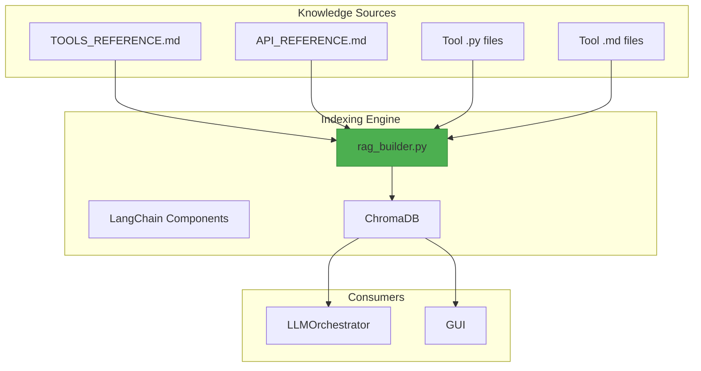
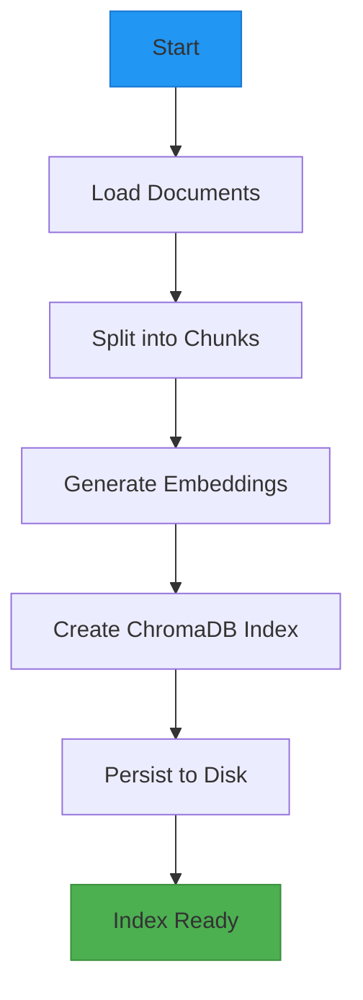
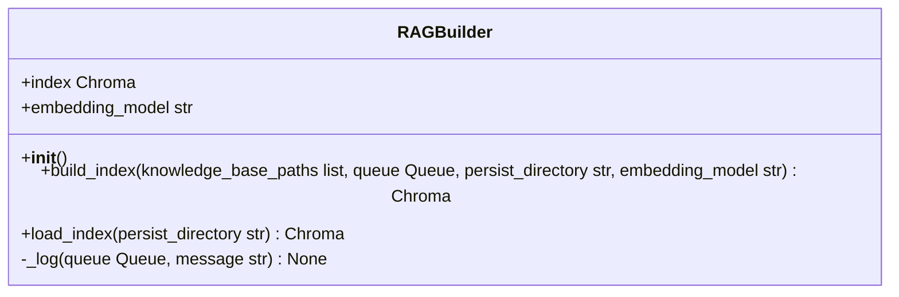

# RAG Index Construction

<cite>
**Referenced Files in This Document**   
- [rag_builder.py](file://src/core/rag_builder.py#L1-L115)
- [TOOLS_REFERENCE.md](file://src/docs/TOOLS_REFERENCE.md#L1-L28)
- [API_REFERENCE.md](file://src/docs/API_REFERENCE.md#L1-L96)
</cite>

## Table of Contents
1. [Introduction](#introduction)
2. [Project Structure](#project-structure)
3. [Core Components](#core-components)
4. [Architecture Overview](#architecture-overview)
5. [Detailed Component Analysis](#detailed-component-analysis)
6. [Indexing Pipeline](#indexing-pipeline)
7. [Configuration and Customization](#configuration-and-customization)
8. [Adding New Knowledge Sources](#adding-new-knowledge-sources)
9. [Common Issues and Troubleshooting](#common-issues-and-troubleshooting)
10. [Performance Optimization](#performance-optimization)
11. [Conclusion](#conclusion)

## Introduction
The Retrieval-Augmented Generation (RAG) index construction process is central to enabling the LLM-based analyzer to access domain-specific knowledge and tool documentation. This document details how the `RAGBuilder` class in `rag_builder.py` constructs a searchable vector store using ChromaDB and LangChain, ingesting documentation from `.md`, `.py`, and `.pdf` files located in specified directories. The index supports semantic search for tools, parameters, and workflows, which are then used by the LLM orchestrator to generate accurate, context-aware responses and action plans.

The system is designed for extensibility, allowing new tools and documentation to be added seamlessly. It also integrates with the GUI via a progress queue to provide real-time feedback during index building.

**Section sources**
- [rag_builder.py](file://src/core/rag_builder.py#L1-L20)
- [API_REFERENCE.md](file://src/docs/API_REFERENCE.md#L1-L10)

## Project Structure
The project is organized into modular directories based on functionality:
- `src/core`: Core logic including RAG indexing, LLM orchestration, and prompt assembly.
- `src/docs`: Static documentation files used as knowledge sources for indexing.
- `src/tools`: Domain-specific signal processing and transformation tools with associated `.md` and `.py` files.
- `src/gui`: Graphical user interface components.
- Root-level configuration and metadata files (e.g., `mcpsettings.json`, `requirements.txt`).

The RAG index primarily draws from `src/docs` and recursively scans `src/tools` for `.md` and `.py` documentation files.



**Diagram sources**
- [rag_builder.py](file://src/core/rag_builder.py#L1-L115)
- [TOOLS_REFERENCE.md](file://src/docs/TOOLS_REFERENCE.md#L1-L28)
- [API_REFERENCE.md](file://src/docs/API_REFERENCE.md#L1-L96)

## Core Components
The primary component responsible for RAG index construction is the `RAGBuilder` class defined in `src/core/rag_builder.py`. It handles document loading, text splitting, embedding generation, and persistence of the vector store.

Key responsibilities:
- **Document Ingestion**: Loads `.md`, `.py`, and `.pdf` files from specified paths.
- **Text Processing**: Splits documents into manageable chunks using `RecursiveCharacterTextSplitter`.
- **Embedding Generation**: Uses `sentence-transformers` via `HuggingFaceEmbeddings` to convert text chunks into vector embeddings.
- **Vector Store Management**: Creates and persists a ChromaDB index for efficient retrieval.
- **Progress Reporting**: Communicates status updates to the GUI via a thread-safe queue.

```python
class RAGBuilder:
    def __init__(self):
        self.index = None
        self.embedding_model = "all-MiniLM-L6-v2"
```

**Section sources**
- [rag_builder.py](file://src/core/rag_builder.py#L15-L25)

## Architecture Overview
The RAG index construction follows a four-stage pipeline:
1. **Document Loading**: Recursively scan directories for `.md`, `.py`, and `.pdf` files.
2. **Text Splitting**: Break documents into overlapping chunks to preserve context.
3. **Embedding Generation**: Convert text chunks into dense vectors using a pre-trained transformer model.
4. **Index Persistence**: Store vectors and metadata in a ChromaDB instance on disk.

This architecture enables efficient, scalable retrieval of domain knowledge during LLM inference.



**Diagram sources**
- [rag_builder.py](file://src/core/rag_builder.py#L40-L115)

## Detailed Component Analysis

### RAGBuilder Class Analysis
The `RAGBuilder` class encapsulates the entire indexing workflow. It is initialized without arguments and uses default values for the embedding model and persistence directory.

#### Key Methods

##### `build_index`
Orchestrates the full indexing pipeline. Accepts:
- `knowledge_base_paths`: List of directories to index.
- `queue`: Thread-safe queue for progress logging.
- `persist_directory`: Path to save the ChromaDB index.
- `embedding_model`: Name of the Hugging Face sentence-transformer model.

```python
def build_index(self, knowledge_base_paths, queue, persist_directory, embedding_model="all-MiniLM-L12-v2"):
```

It logs progress at each stage and handles errors by sending an `"error"` message to the queue.

##### `load_index`
Loads a previously persisted index from disk. Validates the existence of the directory and reconstructs the embedding function using the same model.

```python
def load_index(self, persist_directory="./vector_store"):
```

##### `_log`
Internal utility to send log messages to the GUI via the queue.

```python
def _log(self, queue, message):
    queue.put(("log", {"sender": "RAGBuilder", "message": message}))
```



**Diagram sources**
- [rag_builder.py](file://src/core/rag_builder.py#L15-L115)

**Section sources**
- [rag_builder.py](file://src/core/rag_builder.py#L15-L115)

## Indexing Pipeline

### Document Loading
The `build_index` method uses `DirectoryLoader` from LangChain to recursively scan directories:
- `**/*.md` and `**/*.py` files are loaded using `TextLoader`.
- `**/*.pdf` files are loaded using `PyPDFLoader`.

```python
loader = DirectoryLoader(knowledge_base_path, glob="**/*.md", loader_cls=TextLoader)
documents = loader.load()
```

If no documents are found, a warning is logged and indexing continues to the next path.

### Text Splitting
Documents are split using `RecursiveCharacterTextSplitter` with:
- `chunk_size=800` characters
- `chunk_overlap=500` characters

This ensures contextual continuity while keeping chunks small enough for efficient embedding and retrieval.

```python
text_splitter = RecursiveCharacterTextSplitter(chunk_size=800, chunk_overlap=500)
chunks = text_splitter.split_documents(all_documents)
```

### Embedding Generation
The system uses `sentence-transformers` via `HuggingFaceEmbeddings`. A `SentenceTransformer` client is instantiated with:
- `device='cpu'`
- `normalize_embeddings=False`
- `multi_process=True` for parallel encoding

The model name is dynamically constructed from the `embedding_model` parameter:
```python
model_name = f"sentence-transformers/{self.embedding_model}"
```

### Vector Store Creation
The final index is created using `Chroma.from_documents`, which:
- Embeds all chunks
- Stores them in a persistent directory
- Enables future loading via `Chroma(persist_directory=...)`

```python
self.index = Chroma.from_documents(chunks, embeddings, persist_directory=persist_directory)
```

**Section sources**
- [rag_builder.py](file://src/core/rag_builder.py#L50-L100)

## Configuration and Customization

### Embedding Models
The default embedding model is `all-MiniLM-L6-v2`, but this can be overridden via the `embedding_model` parameter in `build_index`. Supported models must be available in the `sentence-transformers` library.

Example:
```python
builder.build_index(
    knowledge_base_paths=["src/docs", "src/tools"],
    queue=log_queue,
    persist_directory="./vector_store",
    embedding_model="all-MiniLM-L12-v2"
)
```

Ensure the model name matches a valid Hugging Face model under `sentence-transformers/`.

### Chunking Strategy
The current strategy uses fixed-size chunks (800 chars) with high overlap (500 chars). To customize:
- Adjust `chunk_size` and `chunk_overlap` in the `RecursiveCharacterTextSplitter`.
- Consider using `LanguageAwareTextSplitter` for code-heavy content.

Example modification:
```python
text_splitter = RecursiveCharacterTextSplitter(chunk_size=1000, chunk_overlap=200)
```

### Persistence Directory
The index is saved to `./vector_store` by default. This can be changed by passing a different `persist_directory` argument.

Ensure the directory is writable and included in `.gitignore` to avoid bloating version control.

**Section sources**
- [rag_builder.py](file://src/core/rag_builder.py#L70-L90)

## Adding New Knowledge Sources

### Step-by-Step Instructions
To add new tool documentation or domain knowledge to the index:

1. **Create Documentation File**
   - Save as `.md`, `.py`, or `.pdf` in a directory within the knowledge base (e.g., `src/docs/new_guide.md`).

2. **Ensure Correct Format**
   - For `.md` files, use clear headings and descriptive text.
   - For `.py` files, include docstrings and comments.

3. **Update Knowledge Base Path**
   - Pass the directory path to `build_index`:
     ```python
     builder.build_index(
         knowledge_base_paths=["src/docs", "src/tools", "src/new_domain"],
         ...
     )
     ```

4. **Rebuild the Index**
   - Run the index build process via the GUI (`on_build_rag_index`) or directly in code.

5. **Verify Ingestion**
   - Check logs for successful loading of new files.
   - Test retrieval via the LLM interface.

### Example: Adding a New Tool
Suppose you add `src/tools/analysis/detect_anomalies.py` with a docstring:
```python
def detect_anomalies(data: dict, threshold: float = 0.95) -> dict:
    """
    Detects anomalies in time-series data using statistical thresholds.
    Args:
        data: Input signal data dictionary
        threshold: Confidence threshold for anomaly detection
    Returns:
        Dictionary with anomaly locations and scores
    """
```

After rebuilding the index, queries like "How do I detect anomalies in my signal?" will retrieve this documentation.

**Section sources**
- [rag_builder.py](file://src/core/rag_builder.py#L50-L60)
- [TOOLS_REFERENCE.md](file://src/docs/TOOLS_REFERENCE.md#L1-L28)

## Common Issues and Troubleshooting

### Issue: No Documents Indexed
**Symptoms**: Log shows "No .md or .pdf documents found".
**Causes**:
- Incorrect `knowledge_base_paths` provided.
- Files not in `.md`, `.py`, or `.pdf` format.
- Directory permissions or path typos.

**Solution**:
- Verify paths exist and contain valid files.
- Use absolute paths if necessary.
- Check file extensions and glob patterns.

### Issue: Embedding Mismatch on Load
**Symptoms**: `ValueError` when loading index, often related to embedding dimension mismatch.
**Cause**: Different embedding model used during build vs. load.
**Solution**:
- Ensure `embedding_model` is consistent.
- Rebuild the index if the model has changed.

### Issue: High Memory Usage or Slow Indexing
**Symptoms**: Process hangs or crashes during indexing.
**Causes**:
- Large PDFs or many files.
- CPU-only embedding with `multi_process=True` causing resource contention.

**Solutions**:
- Reduce `chunk_size`.
- Set `multi_process=False`.
- Use GPU if available (`device='cuda'`).

### Issue: Corrupted Index
**Symptoms**: `Chroma` fails to load with database errors.
**Solution**:
- Delete the `persist_directory` folder and rebuild.

**Section sources**
- [rag_builder.py](file://src/core/rag_builder.py#L30-L115)

## Performance Optimization

### Indexing Speed
- **Use GPU**: Set `device='cuda'` in `model_kwargs` if a GPU is available.
- **Disable Multi-Process**: For small datasets, set `multi_process=False` to reduce overhead.
- **Pre-Split Large Files**: Manually split large `.md` or `.pdf` files to avoid memory spikes.

### Retrieval Accuracy
- **Tune Chunk Size**: For technical content, smaller chunks (500–600 chars) may improve precision.
- **Use Semantic Splitting**: Consider `NLTKTextSplitter` or custom logic for code/documentation separation.
- **Model Selection**: Use larger models like `all-MiniLM-L12-v2` or `BAAI/bge-small-en` for better semantic understanding.

### Memory Efficiency
- **Batch Processing**: Modify `build_index` to process one directory at a time and clear intermediate variables.
- **Stream Embeddings**: Use `Chroma.add_documents()` in batches instead of `from_documents()`.

Example batched insertion:
```python
vectorstore = Chroma(embedding_function=embeddings, persist_directory=persist_directory)
for i in range(0, len(chunks), 100):
    batch = chunks[i:i+100]
    vectorstore.add_documents(batch)
```

**Section sources**
- [rag_builder.py](file://src/core/rag_builder.py#L80-L95)

## Conclusion
The RAG index construction process is a robust, extensible pipeline that enables the LLM analyzer to leverage domain-specific knowledge. By ingesting documentation from `.md`, `.py`, and `.pdf` files, splitting text intelligently, and using state-of-the-art embeddings, the system creates a high-quality vector store for accurate retrieval. Configuration options allow tuning for performance and accuracy, while clear error handling and logging ensure maintainability. With proper optimization, the index can scale to large knowledge bases without sacrificing responsiveness.