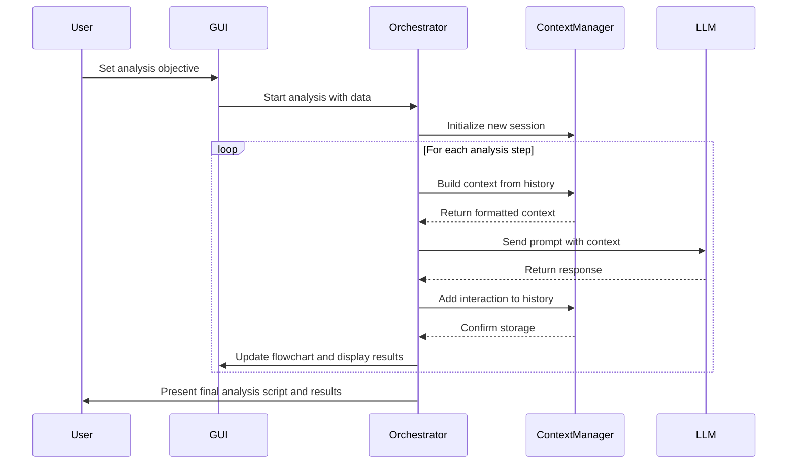
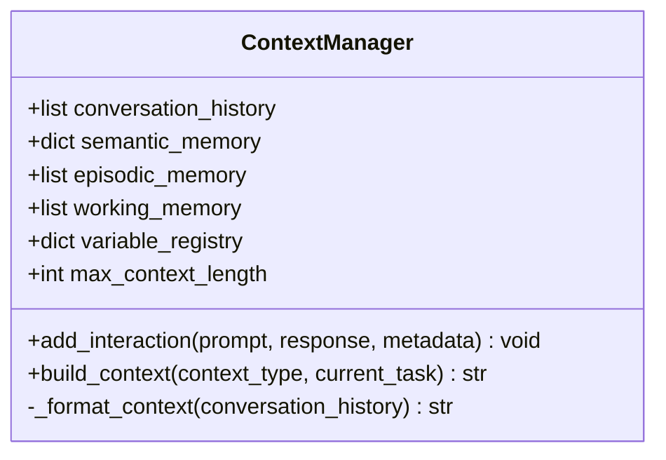
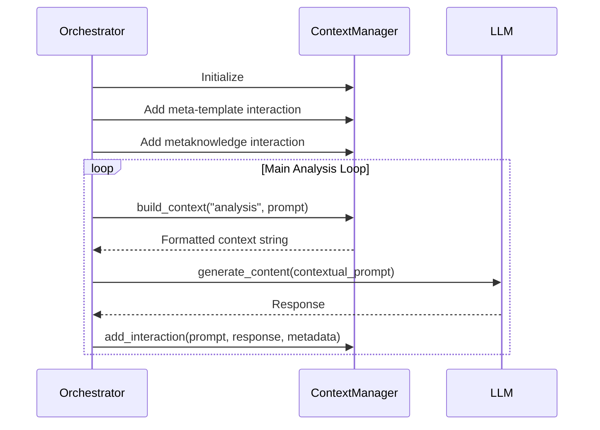
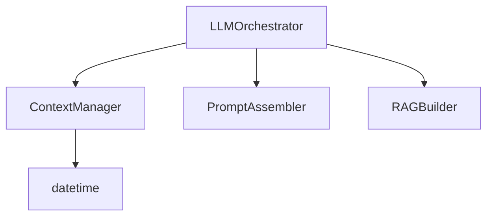

# Persistent Context Management

<cite>
**Referenced Files in This Document**   
- [ContextManager.py](file://src/core/ContextManager.py#L1-L45)
- [LLMOrchestrator.py](file://src/core/LLMOrchestrator.py#L1-L726)
- [PERSISTENT_CONTEXT_IMPLEMENTATION.md](file://PERSISTENT_CONTEXT_IMPLEMENTATION.md#L1-L619)
- [README.md](file://README.md#L1-L298)
</cite>

## Table of Contents
1. [Introduction](#introduction)
2. [Project Structure](#project-structure)
3. [Core Components](#core-components)
4. [Architecture Overview](#architecture-overview)
5. [Detailed Component Analysis](#detailed-component-analysis)
6. [Dependency Analysis](#dependency-analysis)
7. [Performance Considerations](#performance-considerations)
8. [Troubleshooting Guide](#troubleshooting-guide)
9. [Conclusion](#conclusion)

## Introduction

The Persistent Context Management system is a foundational enhancement to the AIDA (AI-Driven Analyzer) platform, transforming it from a stateless analysis tool into an intelligent, context-aware system. This system enables the LLM orchestrator to maintain conversation history, track variable states, and learn from previous interactions, significantly improving analysis consistency, error recovery, and decision-making quality. By preserving context across analysis steps, AIDA can build upon prior understanding, avoid redundant reasoning, and adapt its approach based on historical success patterns. This documentation provides a comprehensive overview of the system's design, implementation, and integration, serving as a reference for developers and users alike.

## Project Structure

The persistent context functionality is integrated into the core of the AIDA system, primarily within the `src/core` directory. The implementation follows a modular structure, with dedicated components for context management and orchestration.

```mermaid
graph TD
subgraph "Core Components"
CM[ContextManager.py]
LO[LLMOrchestrator.py]
PA[PromptAssembler.py]
end
subgraph "Supporting Modules"
RB[RAGBuilder.py]
QT[quantitative_parameterization_module.py]
end
CM --> LO : "Integrated via dependency"
LO --> PA : "Uses for prompt construction"
LO --> RB : "For knowledge retrieval"
LO --> QT : "For result parameterization"
```

**Diagram sources**
- [ContextManager.py](file://src/core/ContextManager.py#L1-L45)
- [LLMOrchestrator.py](file://src/core/LLMOrchestrator.py#L1-L726)

**Section sources**
- [README.md](file://README.md#L1-L298)
- [PERSISTENT_CONTEXT_IMPLEMENTATION.md](file://PERSISTENT_CONTEXT_IMPLEMENTATION.md#L1-L619)

## Core Components

The persistent context system revolves around two primary components: the `ContextManager` and the enhanced `LLMOrchestrator`. The `ContextManager` is responsible for storing and managing conversation history, variable states, and metadata, while the `LLMOrchestrator` leverages this context to make informed decisions during the analysis pipeline. This integration allows AIDA to maintain a continuous thread of reasoning, where each step is informed by the outcomes of previous interactions, leading to more coherent and effective analysis workflows.

**Section sources**
- [ContextManager.py](file://src/core/ContextManager.py#L1-L45)
- [LLMOrchestrator.py](file://src/core/LLMOrchestrator.py#L1-L726)

## Architecture Overview

The persistent context architecture is designed to seamlessly integrate with the existing AIDA pipeline. The `LLMOrchestrator` initializes a `ContextManager` instance at startup, which then accumulates interaction data throughout the analysis session. Before each LLM call, the orchestrator uses the context manager to build a contextual prompt that includes relevant history. After receiving a response, the interaction is recorded for future use. This loop ensures that context is both consumed and produced at every step, creating a rich, evolving knowledge base.



**Diagram sources**
- [LLMOrchestrator.py](file://src/core/LLMOrchestrator.py#L1-L726)
- [ContextManager.py](file://src/core/ContextManager.py#L1-L45)

## Detailed Component Analysis

### ContextManager Analysis

The `ContextManager` class is the cornerstone of the persistent context system. It manages multiple types of memory, including conversation history, semantic memory for learned patterns, episodic memory for time-ordered events, and a variable registry for tracking data states. Its primary functions are to store interactions and to format this stored data into a prompt-friendly string for the LLM.

#### Class Diagram


**Diagram sources**
- [ContextManager.py](file://src/core/ContextManager.py#L1-L45)

The `add_interaction` method stores a complete record of an LLM interaction, including the prompt, response, and metadata such as the step number and interaction type. The `build_context` method retrieves the conversation history and formats it into a string that is prepended to the current task prompt. The current implementation uses a simple concatenation of all history entries, but the design allows for future enhancements like context compression and relevance scoring.

**Section sources**
- [ContextManager.py](file://src/core/ContextManager.py#L1-L45)
- [PERSISTENT_CONTEXT_IMPLEMENTATION.md](file://PERSISTENT_CONTEXT_IMPLEMENTATION.md#L1-L619)

### LLMOrchestrator Integration

The `LLMOrchestrator` is the central component that utilizes the `ContextManager` to enable context-aware analysis. It initializes the context manager during setup and uses it throughout the analysis pipeline to maintain state and inform LLM interactions.

#### Sequence Diagram


**Diagram sources**
- [LLMOrchestrator.py](file://src/core/LLMOrchestrator.py#L1-L726)

The orchestrator's `_generate_content_with_context` method is the key integration point. It takes a base prompt and a context type, uses the context manager to build a full contextual prompt, sends it to the LLM, and then records the interaction. This method is used for all LLM calls, including metaknowledge construction, action proposal, and result evaluation, ensuring that context is consistently applied across the entire analysis process.

**Section sources**
- [LLMOrchestrator.py](file://src/core/LLMOrchestrator.py#L1-L726)

## Dependency Analysis

The persistent context system introduces a clear dependency hierarchy. The `LLMOrchestrator` depends directly on the `ContextManager`, which operates independently of other core components. This design ensures that context management is a self-contained module, making it easier to maintain and extend.



**Diagram sources**
- [LLMOrchestrator.py](file://src/core/LLMOrchestrator.py#L1-L726)
- [ContextManager.py](file://src/core/ContextManager.py#L1-L45)

The `ContextManager` has minimal external dependencies, relying only on Python's standard `datetime` module. The `LLMOrchestrator`, however, has a broader set of dependencies, including the `PromptAssembler` for building prompts and the `RAGBuilder` for knowledge retrieval. The context manager is injected into the orchestrator, promoting loose coupling and testability.

**Section sources**
- [LLMOrchestrator.py](file://src/core/LLMOrchestrator.py#L1-L726)
- [ContextManager.py](file://src/core/ContextManager.py#L1-L45)

## Performance Considerations

The persistent context system is designed with performance in mind. The `ContextManager` imposes a configurable limit on context size (50KB by default) to prevent unbounded growth that could lead to excessive token usage and increased LLM latency. The current implementation stores all history in memory, which is efficient for the duration of a session but does not persist across restarts. Future enhancements could include context compression algorithms to summarize older interactions, reducing the prompt size while preserving key information. The system's performance impact is primarily seen in the increasing size of LLM prompts, which must be monitored to ensure response times remain acceptable.

## Troubleshooting Guide

Common issues with the persistent context system typically revolve around configuration and data flow. If the context is not being maintained, verify that the `ContextManager` is properly initialized within the `LLMOrchestrator` and that the `_generate_content_with_context` method is being used for all LLM calls. If the system encounters errors during LLM interactions, check the `add_interaction` method to ensure that error states are being recorded correctly. For debugging, the `conversation_history` list can be inspected to verify that interactions are being stored as expected. Performance issues related to large context sizes can be mitigated by adjusting the `max_context_length` parameter or by implementing more sophisticated context management strategies.

**Section sources**
- [ContextManager.py](file://src/core/ContextManager.py#L1-L45)
- [LLMOrchestrator.py](file://src/core/LLMOrchestrator.py#L1-L726)

## Conclusion

The Persistent Context Management system represents a significant advancement in the AIDA platform's capabilities. By enabling the system to remember and learn from past interactions, it lays the groundwork for more intelligent, adaptive, and consistent data analysis. The current implementation provides a robust foundation for conversation history and state management, with a clear path for future enhancements such as advanced learning algorithms and context compression. This system transforms AIDA from a series of isolated analysis steps into a cohesive, intelligent agent capable of progressive problem-solving.