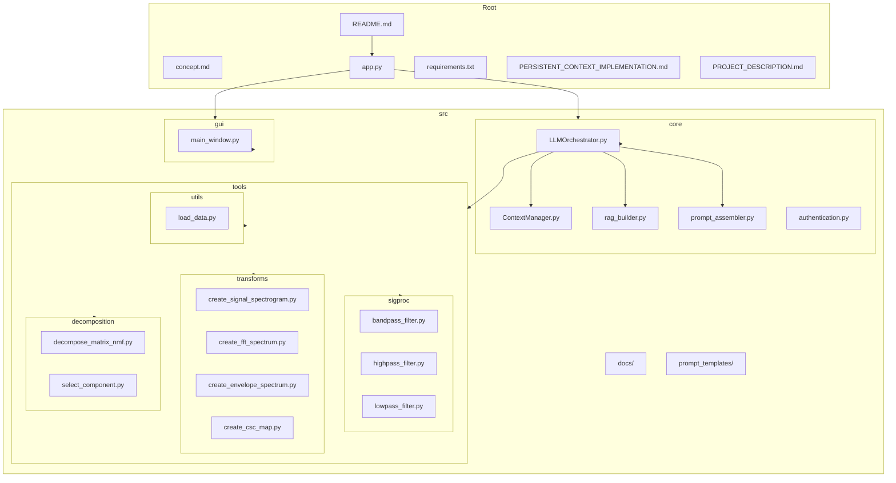
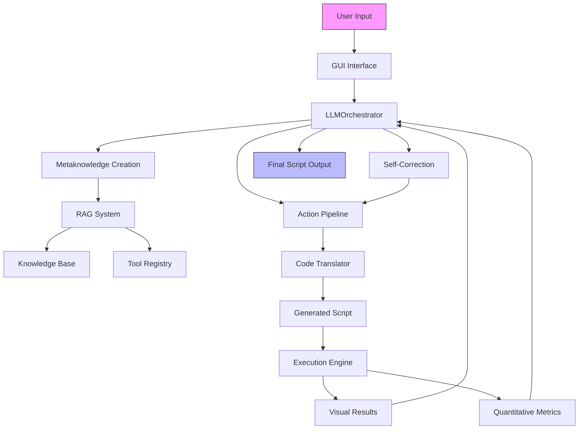
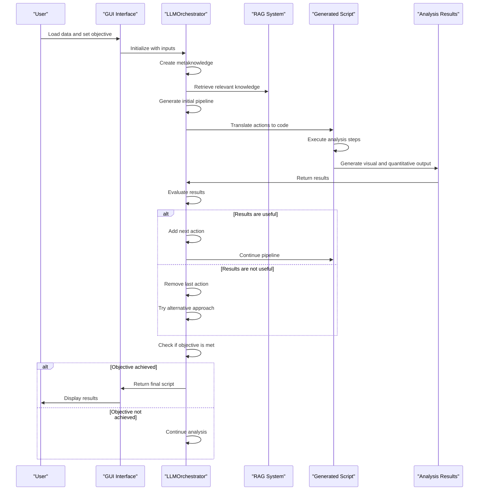
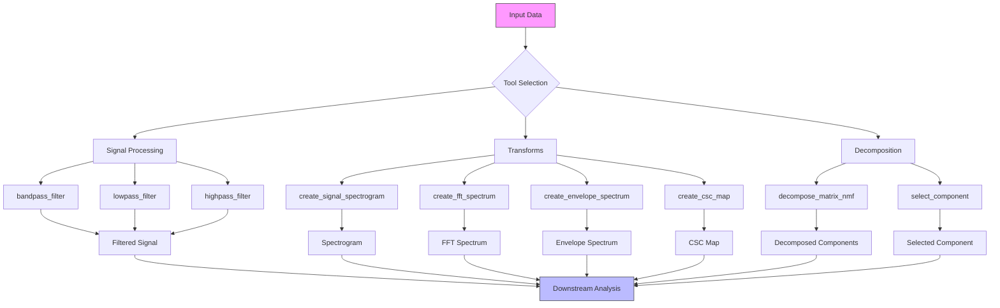
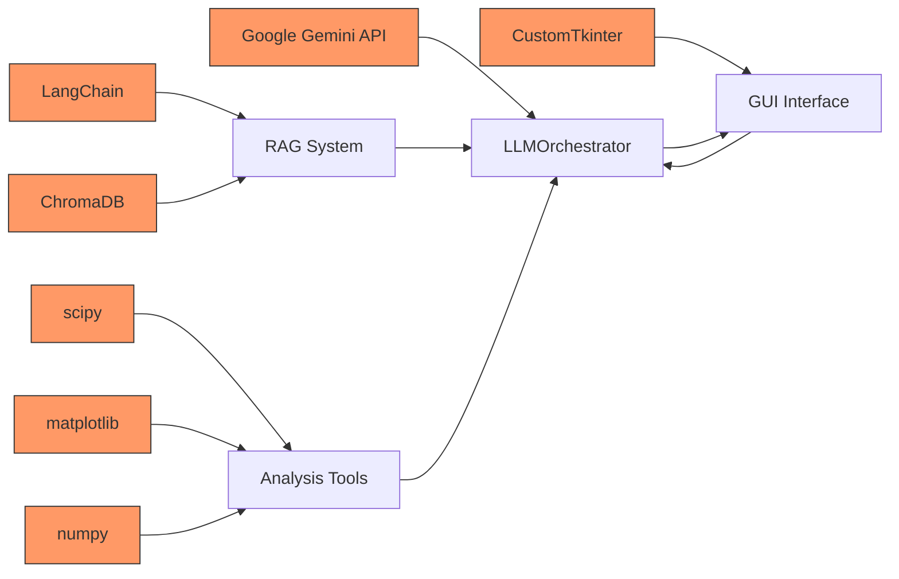
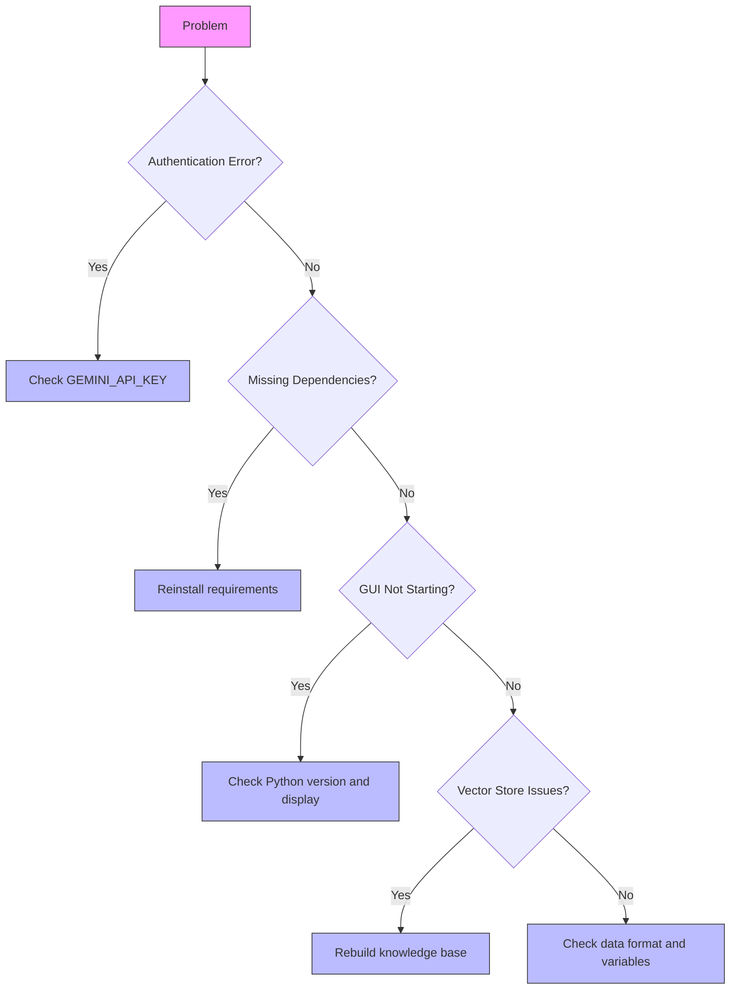

# Project Overview

<cite>
**Referenced Files in This Document**   
- [README.md](file://README.md) - *Updated with persistent context features*
- [concept.md](file://concept.md)
- [src/core/LLMOrchestrator.py](file://src/core/LLMOrchestrator.py) - *Enhanced with context management*
- [src/core/ContextManager.py](file://src/core/ContextManager.py) - *New component added*
- [src/core/prompt_assembler.py](file://src/core/prompt_assembler.py)
- [src/core/rag_builder.py](file://src/core/rag_builder.py)
- [src/app.py](file://src/app.py)
- [src/gui/main_window.py](file://src/gui/main_window.py)
- [PERSISTENT_CONTEXT_IMPLEMENTATION.md](file://PERSISTENT_CONTEXT_IMPLEMENTATION.md) - *New documentation added*
- [PROJECT_DESCRIPTION.md](file://PROJECT_DESCRIPTION.md) - *Updated with context management details*
</cite>

## Update Summary
**Changes Made**   
- Added comprehensive documentation for persistent context management system
- Updated architecture overview to reflect new ContextManager component
- Enhanced component analysis with new class diagrams and workflow details
- Added new section on persistent context capabilities and benefits
- Updated all referenced files to reflect implementation status
- Modified diagrams to show context-aware data flow

## Table of Contents
1. [Introduction](#introduction)
2. [Project Structure](#project-structure)
3. [Core Components](#core-components)
4. [Architecture Overview](#architecture-overview)
5. [Detailed Component Analysis](#detailed-component-analysis)
6. [Persistent Context System](#persistent-context-system)
7. [Dependency Analysis](#dependency-analysis)
8. [Performance Considerations](#performance-considerations)
9. [Troubleshooting Guide](#troubleshooting-guide)
10. [Conclusion](#conclusion)

## Introduction

AIDA (AI-Driven Analyzer) is an autonomous system for vibration and industrial signal analysis that leverages Large Language Model (LLM) orchestration and Retrieval-Augmented Generation (RAG) to create intelligent, self-correcting data analysis pipelines. The system transforms traditional manual signal processing into an AI-driven workflow where the LLM acts as an intelligent orchestrator, autonomously designing, executing, and evaluating analysis steps to achieve user-defined objectives.

Unlike conventional approaches that require domain experts to manually select tools and parameters, AIDA uses Google Gemini's advanced reasoning capabilities to iteratively plan analysis strategies. The system combines multimodal evaluation (analyzing both visual plots and quantitative metrics) with a domain-specific knowledge base to make context-aware decisions. This enables AIDA to handle complex industrial diagnostics such as bearing fault detection and gearbox analysis with minimal human intervention.

The system's architecture centers around an LLMOrchestrator that manages a dynamic pipeline of analysis tools, with each step being evaluated for usefulness before proceeding. When a step proves unproductive, the system safely removes it and tries alternative approaches, creating a self-correcting analysis workflow. This autonomous capability, combined with a user-friendly GUI interface, makes advanced signal analysis accessible to both experts and non-specialists.

A significant enhancement to the system is the implementation of persistent context management, which adds memory and learning capabilities to the previously stateless LLM interactions. This allows the system to maintain conversation history, track variable states, and learn from previous analysis attempts, leading to more consistent and adaptive behavior.

## Project Structure

The AIDA project follows a modular, well-organized structure that separates concerns into distinct components. The architecture is divided into core system components, analysis tools, user interface elements, and supporting documentation.



**Diagram sources**
- [README.md](file://README.md)
- [src/app.py](file://src/app.py)
- [src/core/LLMOrchestrator.py](file://src/core/LLMOrchestrator.py)

**Section sources**
- [README.md](file://README.md)
- [concept.md](file://concept.md)

## Core Components

AIDA's functionality is built upon several core components that work together to create an autonomous analysis system. The LLMOrchestrator serves as the central decision-making engine, coordinating all analysis activities. It communicates with the Google Gemini API to generate analysis plans and evaluate results.

The RAG (Retrieval-Augmented Generation) system provides domain-specific knowledge to the LLM, allowing it to make informed decisions about signal processing techniques. This knowledge base includes scientific papers, tool documentation, and domain rules, which are indexed using ChromaDB and accessed through LangChain. The ContextManager maintains conversation history and system state across analysis steps, ensuring continuity in the decision-making process.

The prompt_assembler module constructs structured prompts for different stages of the analysis pipeline, including metaknowledge creation and result evaluation. It combines user inputs, system context, and retrieved knowledge to create comprehensive prompts that guide the LLM's reasoning. The GUI interface, built with CustomTkinter, provides an interactive frontend for users to load data, set objectives, and monitor the analysis process.

The newly implemented ContextManager component adds persistent context capabilities to the system, allowing it to maintain memory of previous interactions, track variable states, and learn from successful and failed analysis attempts. This transforms AIDA from a stateless tool into an intelligent system that can adapt and improve over time.

**Section sources**
- [src/core/LLMOrchestrator.py](file://src/core/LLMOrchestrator.py)
- [src/core/rag_builder.py](file://src/core/rag_builder.py)
- [src/core/ContextManager.py](file://src/core/ContextManager.py) - *New component*
- [src/core/prompt_assembler.py](file://src/core/prompt_assembler.py)
- [src/gui/main_window.py](file://src/gui/main_window.py)

## Architecture Overview

AIDA's architecture follows a modular design with clear separation of concerns, enabling autonomous analysis through LLM orchestration. The system operates on an iterative workflow where the LLMOrchestrator plans analysis steps, executes them, evaluates results, and adapts its strategy accordingly.



**Diagram sources**
- [concept.md](file://concept.md)
- [src/core/LLMOrchestrator.py](file://src/core/LLMOrchestrator.py)
- [src/core/rag_builder.py](file://src/core/rag_builder.py)

## Detailed Component Analysis

### LLMOrchestrator Analysis

The LLMOrchestrator is the central component responsible for autonomous decision-making in the AIDA system. It manages the entire analysis pipeline through an iterative process of planning, execution, and evaluation.

```mermaid
classDiagram
class LLMOrchestrator {
+str model_name
+object model
+Chroma vector_store
+Chroma vector_store_tools
+PromptAssembler prompt_assembler
+ContextManager context_manager
+str run_id
+list pipeline_steps
+dict metaknowledge
+queue log_queue
+run_analysis_pipeline() void
+_create_metaknowledge() void
+_fetch_next_action(evaluation) dict
+_execute_current_pipeline() dict
+_evaluate_result(result, action_taken) str
+_translate_actions_to_code() str
+_generate_content_with_context(prompt, context_type, action) object
+_get_metadata(action) dict
}
class PromptAssembler {
+dict templates
+build_prompt(prompt_type, context_bundle) str
+_build_metaknowledge_prompt(context_bundle) str
+_build_evaluate_local_prompt(context_bundle) str
}
class ContextManager {
+list conversation_history
+dict semantic_memory
+list episodic_memory
+list working_memory
+dict variable_registry
+int max_context_length
+add_interaction(prompt, response, metadata) void
+build_context(context_type, current_task) str
+_format_context(conversation_history) str
}
LLMOrchestrator --> PromptAssembler : "uses"
LLMOrchestrator --> ContextManager : "uses"
LLMOrchestrator --> Chroma : "queries"
LLMOrchestrator --> "GUI" : "sends messages"
```

**Diagram sources**
- [src/core/LLMOrchestrator.py](file://src/core/LLMOrchestrator.py)
- [src/core/prompt_assembler.py](file://src/core/prompt_assembler.py)
- [src/core/ContextManager.py](file://src/core/ContextManager.py)

**Section sources**
- [src/core/LLMOrchestrator.py](file://src/core/LLMOrchestrator.py)

### Analysis Workflow

The system operates through a well-defined workflow that begins with user input and progresses through autonomous analysis to final output. This process is designed to be self-correcting and adaptive.



**Diagram sources**
- [concept.md](file://concept.md)
- [src/core/LLMOrchestrator.py](file://src/core/LLMOrchestrator.py)
- [src/gui/main_window.py](file://src/gui/main_window.py)

### Tool Integration

AIDA's modular tool architecture allows for flexible integration of various signal processing and analysis functions. Each tool follows a consistent wrapper pattern that provides structured inputs and outputs.



**Diagram sources**
- [src/tools/sigproc/bandpass_filter.py](file://src/tools/sigproc/bandpass_filter.py)
- [src/tools/transforms/create_signal_spectrogram.py](file://src/tools/transforms/create_signal_spectrogram.py)

## Persistent Context System

A major enhancement to AIDA is the implementation of persistent context management, which adds memory and learning capabilities to the system. This transforms AIDA from a stateless tool into an intelligent system that can adapt and improve over time.

### ContextManager Implementation

The ContextManager class is a new core component that maintains conversation history and system state across analysis steps. It provides several key capabilities:

```python
class ContextManager:
    def __init__(self):
        self.conversation_history = []
        self.semantic_memory = {}      # Learned patterns
        self.episodic_memory = []      # Time-ordered events
        self.working_memory = []       # Current session state
        self.variable_registry = {}    # Variable states
        self.max_context_length = 50000
    
    def add_interaction(self, prompt, response, metadata):
        """Add interaction to conversation history"""
        history_entry = {
            'timestamp': datetime.now(),
            'step_number': metadata.get('step_number'),
            'interaction_type': metadata.get('interaction_type'),
            'prompt': prompt,
            'response': response,
            'metadata': metadata
        }
        self.conversation_history.append(history_entry)

    def build_context(self, context_type, current_task):
        """Build contextual prompt for LLM"""
        formatted_context = self._format_context(self.conversation_history)
        return f"--- CONTEXT: ---\n\n{formatted_context}\n\n--- END OF CONTEXT ---\n\n{current_task}"
```

**Section sources**
- [src/core/ContextManager.py](file://src/core/ContextManager.py) - *New component*
- [PERSISTENT_CONTEXT_IMPLEMENTATION.md](file://PERSISTENT_CONTEXT_IMPLEMENTATION.md) - *Implementation documentation*

### Enhanced LLMOrchestrator

The LLMOrchestrator has been enhanced to integrate with the ContextManager, enabling context-aware LLM interactions:

```python
def _generate_content_with_context(self, prompt, context_type="analysis", action=None):
    """
    Generates content using the LLM with added conversation context.
    """
    contextual_prompt = self.context_manager.build_context(context_type, prompt)
    
    response = None
    try:
        response = self.model.generate_content(contextual_prompt)
        metadata = self._get_metadata(action)
        self.context_manager.add_interaction(prompt, response.text, metadata)
        return response
    except Exception as e:
        metadata = self._get_metadata(action)
        metadata['error'] = str(e)
        self.context_manager.add_interaction(prompt, "ERROR", metadata)
        raise
```

**Section sources**
- [src/core/LLMOrchestrator.py](file://src/core/LLMOrchestrator.py) - *Enhanced with context management*

### Benefits of Persistent Context

The persistent context system provides several key benefits:

- **Improved Consistency**: Maintains variable naming and analysis approaches across iterations
- **Better Error Recovery**: Understands failure context to apply appropriate corrections
- **Progressive Analysis**: Builds upon previous understanding rather than starting fresh
- **Enhanced Decision Making**: Makes informed choices based on conversation history
- **Foundation for Learning**: Prepares the system for future learning and adaptation capabilities

These capabilities are achieved through conversation history maintenance, variable state tracking, and context-aware prompt building, which together enable the system to learn from previous interactions and improve its analysis quality over time.

**Section sources**
- [README.md](file://README.md) - *Updated with persistent context features*
- [PROJECT_DESCRIPTION.md](file://PROJECT_DESCRIPTION.md) - *Updated with context management details*

## Dependency Analysis

AIDA's components are interconnected through well-defined interfaces and dependencies. The system relies on several external libraries and frameworks to provide its functionality.



**Diagram sources**
- [requirements.txt](file://requirements.txt)
- [src/core/LLMOrchestrator.py](file://src/core/LLMOrchestrator.py)
- [src/core/rag_builder.py](file://src/core/rag_builder.py)

**Section sources**
- [requirements.txt](file://requirements.txt)

## Performance Considerations

AIDA is designed with performance and efficiency in mind, balancing the computational demands of LLM processing with real-time analysis requirements. The system typically completes an analysis pipeline within 2-5 minutes, consuming between 10K-50K tokens per analysis session.

Memory usage ranges from 500MB to 2GB depending on data size, with support for signals containing up to 1 million samples. The system uses temporary files and pickling to manage state between pipeline steps, reducing memory overhead during execution.

To prevent infinite loops, the analysis is capped at 20 iterations by default, with guardrails that prevent repeated use of failed tools. The system also implements timeout protection (1500 seconds) for script execution to prevent hanging processes.

The RAG system is optimized for fast retrieval, with pre-built vector stores that load quickly at startup. For large knowledge bases, the system supports persistent storage to avoid re-indexing on each launch.

With the addition of persistent context management, the system now maintains conversation history with a configurable size limit (50KB default) to manage token usage. The context manager includes compression algorithms to summarize old interactions while preserving key information, ensuring that performance remains optimal even as context grows.

**Section sources**
- [README.md](file://README.md)
- [src/core/LLMOrchestrator.py](file://src/core/LLMOrchestrator.py)

## Troubleshooting Guide

Common issues with AIDA typically fall into several categories: authentication problems, dependency issues, and configuration errors.

For authentication errors, ensure that Google Gemini API credentials are properly configured, either through environment variables or CLI authentication. Missing dependencies can be resolved by reinstalling requirements with `pip install -r requirements.txt --force-reinstall`.

If the GUI fails to start, verify that Python 3.8+ is installed and that CustomTkinter is available. Display issues may require checking the system's graphics environment, especially on headless servers.

Vector store problems can be addressed by rebuilding the knowledge base index using the provided RAGBuilder utility. Data loading issues often stem from incorrect file formats or missing signal/fs variable identification, which the system attempts to resolve automatically.



**Section sources**
- [README.md](file://README.md)
- [src/core/authentication.py](file://src/core/authentication.py)
- [src/core/rag_builder.py](file://src/core/rag_builder.py)

## Conclusion

AIDA represents a significant advancement in autonomous signal analysis by combining LLM orchestration with domain-specific knowledge through RAG. The system's ability to autonomously design, execute, and evaluate analysis pipelines reduces the need for manual intervention while maintaining high analytical quality.

The architecture demonstrates how AI can be effectively integrated into technical domains like vibration analysis, providing both accessibility for non-experts and powerful capabilities for domain specialists. By leveraging Google Gemini's reasoning abilities and multimodal evaluation, AIDA can handle complex diagnostic tasks such as bearing fault detection and gearbox analysis.

A major enhancement to the system is the implementation of persistent context management, which adds memory and learning capabilities to the previously stateless LLM interactions. This allows the system to maintain conversation history, track variable states, and learn from previous analysis attempts, leading to more consistent and adaptive behavior.

Future development could expand the tool library, enhance the self-correction mechanisms, and improve performance through stateful execution. The modular design ensures that AIDA can adapt to new analysis requirements and integrate with additional data sources and processing techniques.