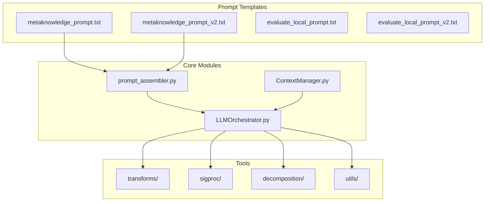
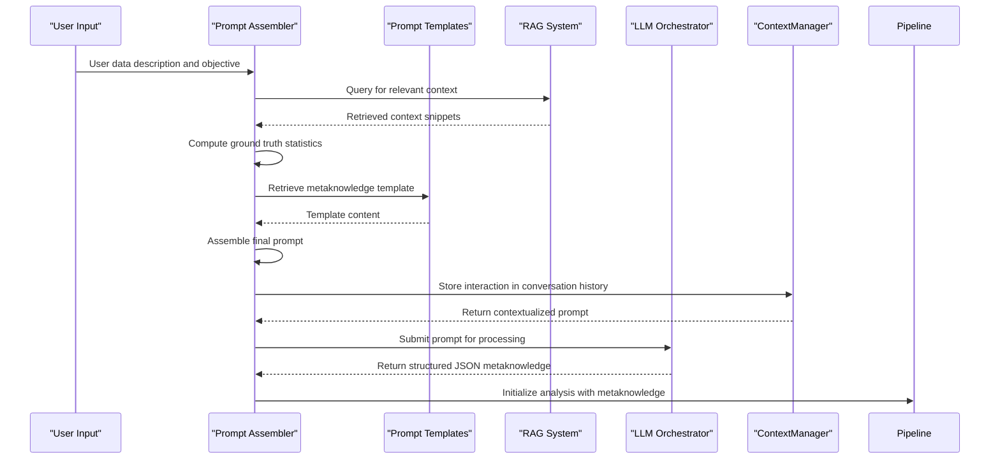
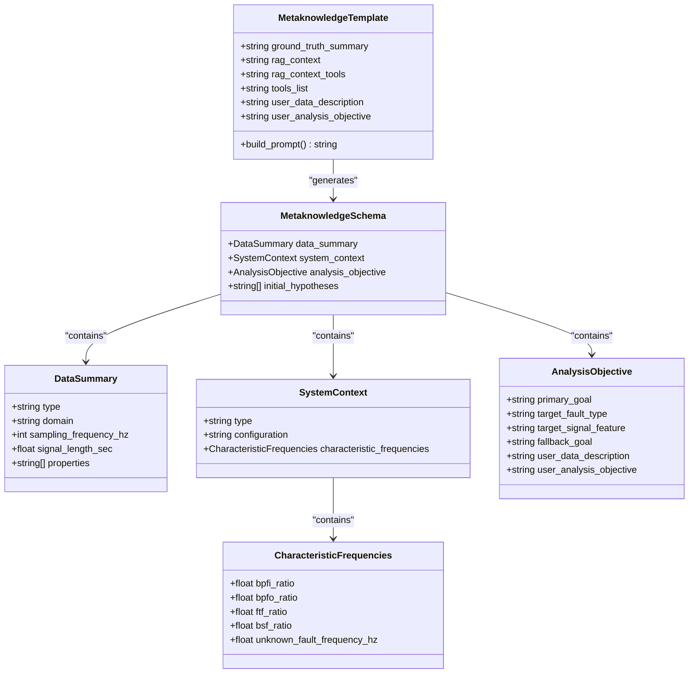
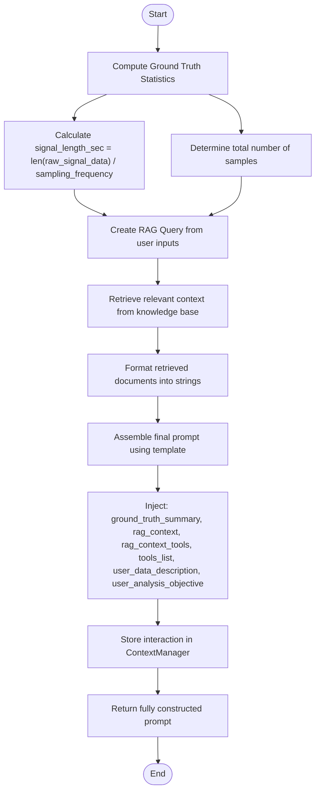
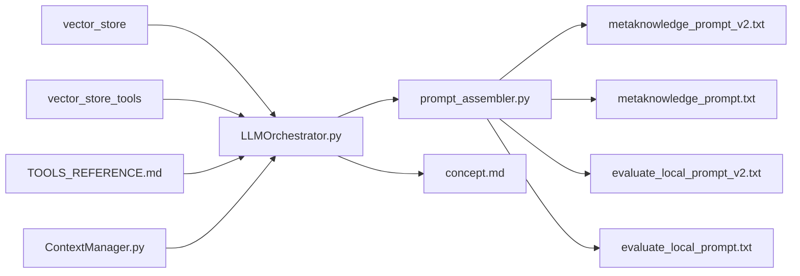

# Metaknowledge Prompt Construction

<cite>
**Referenced Files in This Document**   
- [metaknowledge_prompt.txt](file://src/prompt_templates/metaknowledge_prompt.txt) - *Updated in recent commit*
- [metaknowledge_prompt_v2.txt](file://src/prompt_templates/metaknowledge_prompt_v2.txt) - *Updated in recent commit*
- [prompt_assembler.py](file://src/core/prompt_assembler.py) - *Updated in recent commit*
- [LLMOrchestrator.py](file://src/core/LLMOrchestrator.py)
- [concept.md](file://concept.md)
- [ContextManager.py](file://src/core/ContextManager.py) - *Added in recent commit*
- [PERSISTENT_CONTEXT_IMPLEMENTATION.md](file://PERSISTENT_CONTEXT_IMPLEMENTATION.md) - *Added in recent commit*
</cite>

## Update Summary
**Changes Made**   
- Updated documentation to reflect implementation of persistent context management
- Added new section on ContextManager and its integration with prompt construction
- Enhanced architecture overview to show contextual data flow
- Updated section sources to reflect file modifications and additions
- Added references to new persistent context implementation document

## Table of Contents
1. [Introduction](#introduction)
2. [Project Structure](#project-structure)
3. [Core Components](#core-components)
4. [Architecture Overview](#architecture-overview)
5. [Detailed Component Analysis](#detailed-component-analysis)
6. [Dependency Analysis](#dependency-analysis)
7. [Performance Considerations](#performance-considerations)
8. [Troubleshooting Guide](#troubleshooting-guide)
9. [Conclusion](#conclusion)

## Introduction
This document provides a comprehensive analysis of the metaknowledge prompt construction system within the LLM analyzer context. The system is designed to convert user-provided data descriptions and analysis objectives into structured JSON metaknowledge, which serves as the foundational context for autonomous data analysis pipelines. The documentation covers the evolution from v1 to v2 of the metaknowledge prompts, their role in initializing the analysis pipeline, template variables, and best practices for extension and troubleshooting. Recent updates have implemented persistent context management to enhance the system's ability to maintain conversation history and learning capabilities across analysis sessions.

## Project Structure
The project follows a modular architecture with clearly defined components and separation of concerns. The core functionality is organized into distinct directories including core modules, prompt templates, tools, and documentation.

**Diagram sources**
- [prompt_assembler.py](file://src/core/prompt_assembler.py#L1-L178)
- [LLMOrchestrator.py](file://src/core/LLMOrchestrator.py#L1-L725)
- [ContextManager.py](file://src/core/ContextManager.py#L1-L44)

**Section sources**
- [prompt_assembler.py](file://src/core/prompt_assembler.py#L1-L178)
- [LLMOrchestrator.py](file://src/core/LLMOrchestrator.py#L1-L725)

## Core Components
The metaknowledge prompt construction system consists of two primary components: the prompt templates and the prompt assembler. The templates define the structure and content of the prompts, while the assembler dynamically populates them with runtime data.

The system's core functionality revolves around converting unstructured user input into structured machine-readable context that drives downstream analysis decisions. This conversion process involves pre-computing ground truth statistics from the raw data, retrieving relevant contextual information through RAG, and assembling these elements into a coherent prompt. With the recent implementation of persistent context management, the system now maintains conversation history and learning capabilities across analysis sessions, enabling more consistent and adaptive behavior.

**Section sources**
- [metaknowledge_prompt.txt](file://src/prompt_templates/metaknowledge_prompt.txt#L1-L60)
- [metaknowledge_prompt_v2.txt](file://src/prompt_templates/metaknowledge_prompt_v2.txt#L1-L61)
- [prompt_assembler.py](file://src/core/prompt_assembler.py#L1-L178)
- [ContextManager.py](file://src/core/ContextManager.py#L1-L44)

## Architecture Overview
The metaknowledge construction system operates as an initialization phase in the broader autonomous analysis pipeline. It serves as the bridge between human-readable user input and machine-executable analysis logic. The recent implementation of persistent context management has transformed the system from a stateless to a persistent architecture.

**Diagram sources**
- [prompt_assembler.py](file://src/core/prompt_assembler.py#L93-L113)
- [LLMOrchestrator.py](file://src/core/LLMOrchestrator.py#L202-L231)
- [ContextManager.py](file://src/core/ContextManager.py#L1-L44)

## Detailed Component Analysis

### Metaknowledge Prompt Templates
The system utilizes two versions of metaknowledge prompt templates that define the structure for converting user input into structured JSON.

#### Template Structure and Evolution
The metaknowledge prompt templates have evolved from v1 to v2 with significant improvements in clarity, specificity, and error reduction. The v2 template includes enhanced context preservation by explicitly incorporating user inputs into the analysis_objective section.

**Diagram sources**
- [metaknowledge_prompt.txt](file://src/prompt_templates/metaknowledge_prompt.txt#L1-L60)
- [metaknowledge_prompt_v2.txt](file://src/prompt_templates/metaknowledge_prompt_v2.txt#L1-L61)

**Section sources**
- [metaknowledge_prompt.txt](file://src/prompt_templates/metaknowledge_prompt.txt#L1-L60)
- [metaknowledge_prompt_v2.txt](file://src/prompt_templates/metaknowledge_prompt_v2.txt#L1-L61)

### Prompt Assembler Module
The PromptAssembler class is responsible for dynamically constructing prompts by combining template structures with runtime data.

#### Processing Flow
The prompt assembly process follows a systematic three-step approach to ensure accuracy and completeness of the generated metaknowledge.

**Diagram sources**
- [prompt_assembler.py](file://src/core/prompt_assembler.py#L35-L68)
- [prompt_assembler.py](file://src/core/prompt_assembler.py#L93-L113)
- [ContextManager.py](file://src/core/ContextManager.py#L1-L44)

**Section sources**
- [prompt_assembler.py](file://src/core/prompt_assembler.py#L1-L178)
- [ContextManager.py](file://src/core/ContextManager.py#L1-L44)

## Dependency Analysis
The metaknowledge prompt construction system has well-defined dependencies that enable its functionality while maintaining separation of concerns.

**Diagram sources**
- [prompt_assembler.py](file://src/core/prompt_assembler.py#L148-L178)
- [LLMOrchestrator.py](file://src/core/LLMOrchestrator.py#L52-L76)
- [ContextManager.py](file://src/core/ContextManager.py#L1-L44)

**Section sources**
- [prompt_assembler.py](file://src/core/prompt_assembler.py#L1-L178)
- [LLMOrchestrator.py](file://src/core/LLMOrchestrator.py#L1-L725)

## Performance Considerations
The metaknowledge construction process is optimized for accuracy and reliability rather than raw speed, as it occurs only once at the beginning of the analysis pipeline. The system prioritizes correct extraction of signal characteristics and contextual information over processing speed.

Key performance characteristics include:
- Pre-computation of ground truth statistics to prevent LLM hallucination
- Efficient RAG queries that combine user data description and analysis objective
- Minimal memory overhead as templates are loaded once during initialization
- Linear time complexity relative to input data size for ground truth calculations
- Integration with ContextManager for persistent context storage and retrieval

## Troubleshooting Guide
Common issues in metaknowledge extraction and their solutions:

**Section sources**
- [concept.md](file://concept.md#L37-L44)
- [LLMOrchestrator.py](file://src/core/LLMOrchestrator.py#L202-L231)
- [ContextManager.py](file://src/core/ContextManager.py#L1-L44)

### Incomplete Extraction
**Symptoms**: Missing fields in the generated JSON metaknowledge, particularly in system_context.characteristic_frequencies or analysis_objective sections.

**Causes**:
- Insufficient context in user data description
- RAG system failing to retrieve relevant papers
- Unrealistic values in input data (e.g., sampling_frequency_hz = 1 Hz)

**Solutions**:
1. Enhance user data description with specific technical details
2. Verify RAG index contains relevant domain knowledge
3. Implement value validation and extraction from data description when primary values are unrealistic

### Type Mismatches
**Symptoms**: Numeric values appearing as strings in JSON output, or null values where numbers are expected.

**Causes**:
- LLM misinterpreting numeric extraction requirements
- Inconsistent data formatting in input

**Solutions**:
- Explicit instruction in prompt templates to treat numeric scalars as integers
- Post-processing validation of extracted values
- Clear schema definition with type expectations

### Ambiguous User Objectives
**Symptoms**: Vague primary_goal or target_fault_type fields, generic fallback_goal statements.

**Causes**:
- Unclear user analysis objective
- Lack of domain-specific terminology in user input

**Solutions**:
1. Use RAG to expand on ambiguous terms in user objective
2. Formulate specific fallback goals that enable further analysis regardless of primary goal achievement
3. Include user inputs verbatim in analysis_objective to preserve context

## Conclusion
The metaknowledge prompt construction system effectively bridges the gap between human-readable user inputs and machine-executable analysis logic. By evolving from v1 to v2, the system has improved in clarity, context preservation, and error reduction. The structured approach to prompt assembly ensures reliable extraction of signal characteristics, metadata, and domain-specific features that form the foundation of the autonomous analysis pipeline. The recent implementation of persistent context management through the ContextManager class has transformed the system from stateless to persistent, enabling conversation history maintenance and learning capabilities across analysis sessions. Future enhancements could include more sophisticated validation of extracted values and adaptive template selection based on data modality.