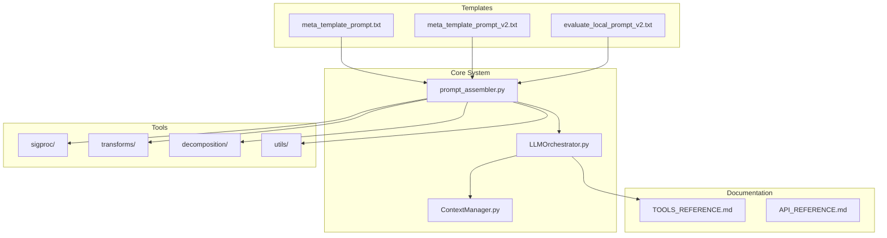
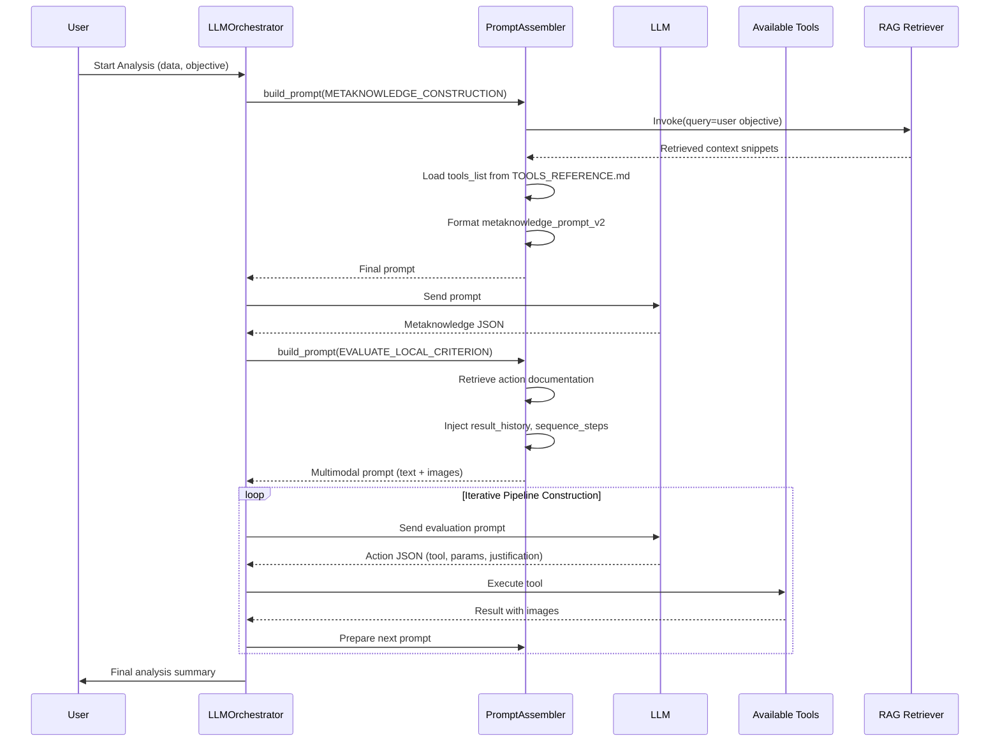
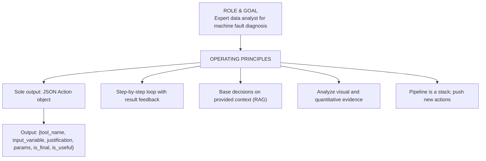
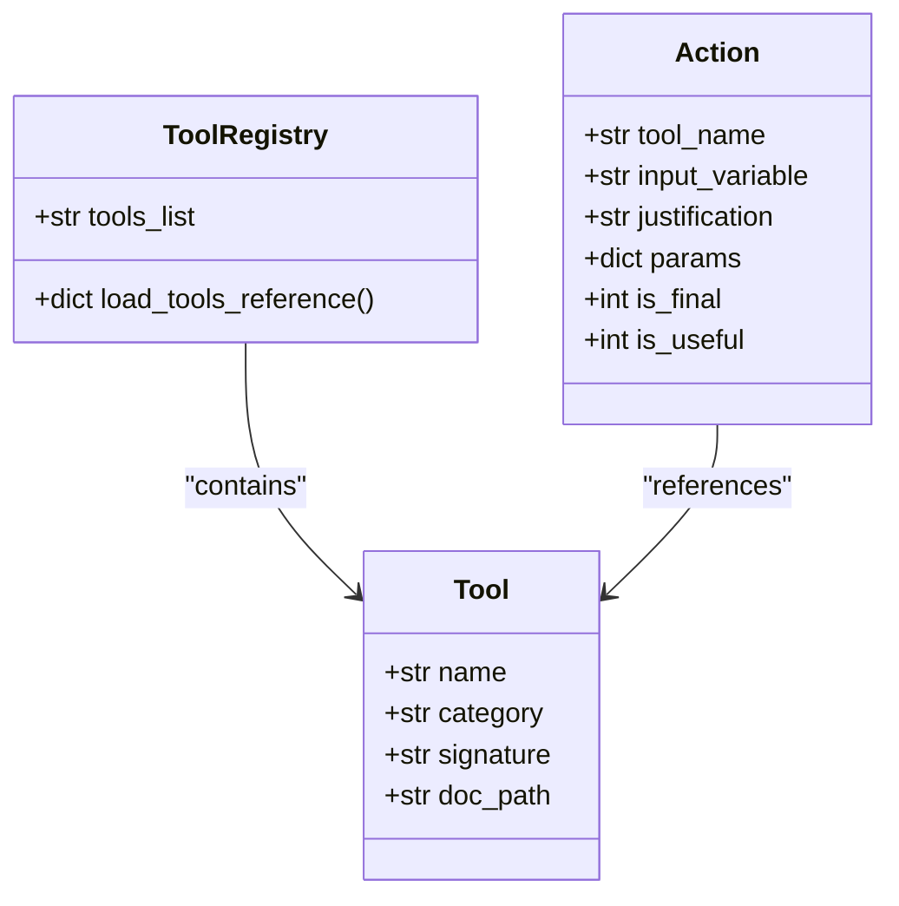
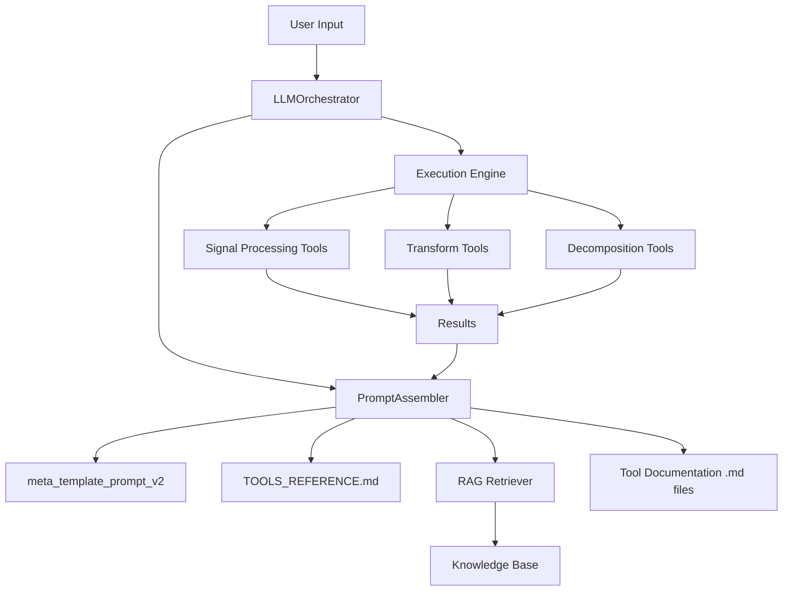

# Pipeline Design Prompts

<cite>
**Referenced Files in This Document**   
- [meta_template_prompt.txt](file://src/prompt_templates/meta_template_prompt.txt)
- [meta_template_prompt_v2.txt](file://src/prompt_templates/meta_template_prompt_v2.txt)
- [prompt_assembler.py](file://src/core/prompt_assembler.py)
- [LLMOrchestrator.py](file://src/core/LLMOrchestrator.py)
- [TOOLS_REFERENCE.md](file://src/docs/TOOLS_REFERENCE.md)
</cite>

## Table of Contents
1. [Introduction](#introduction)
2. [Project Structure](#project-structure)
3. [Core Components](#core-components)
4. [Architecture Overview](#architecture-overview)
5. [Detailed Component Analysis](#detailed-component-analysis)
6. [Dependency Analysis](#dependency-analysis)
7. [Performance Considerations](#performance-considerations)
8. [Troubleshooting Guide](#troubleshooting-guide)
9. [Conclusion](#conclusion)

## Introduction
This document provides a comprehensive analysis of the pipeline design prompt system used in the LLM-based vibration signal analysis application. It details how meta templates guide the Large Language Model (LLM) in constructing executable, iterative analysis pipelines by leveraging retrieved context, tool registries, and dynamic state variables. The focus is on the evolution from `meta_template_prompt.txt` to its improved v2 version, the injection of dynamic context, and the mechanisms that prevent invalid tool chaining and hallucination. The system enables autonomous, step-by-step diagnostic reasoning for machine fault detection using signal processing, spectral transforms, and matrix decomposition techniques.

## Project Structure
The project follows a modular, feature-based organization with clear separation between core logic, tools, documentation, and configuration. The primary components relevant to pipeline design are located in the `src/core` and `src/prompt_templates` directories. The `src/tools` directory contains domain-specific modules for signal processing, transforms, and decomposition, each with corresponding Python implementations and Markdown documentation.

**Diagram sources**
- [prompt_assembler.py](file://src/core/prompt_assembler.py#L1-L178)
- [meta_template_prompt.txt](file://src/prompt_templates/meta_template_prompt.txt#L1-L16)
- [meta_template_prompt_v2.txt](file://src/prompt_templates/meta_template_prompt_v2.txt#L1-L10)

**Section sources**
- [prompt_assembler.py](file://src/core/prompt_assembler.py#L1-L178)
- [LLMOrchestrator.py](file://src/core/LLMOrchestrator.py#L52-L76)

## Core Components
The core components driving the pipeline design system are the `PromptAssembler`, `LLMOrchestrator`, and the structured prompt templates. The `PromptAssembler` dynamically constructs prompts by injecting runtime context such as available tools, analysis history, and current results. The `LLMOrchestrator` manages the iterative execution loop, invoking the LLM with these prompts to generate the next action in the diagnostic pipeline. The `meta_template_prompt` series defines the role, constraints, and output format for the LLM, ensuring consistent JSON-based action proposals.

**Section sources**
- [prompt_assembler.py](file://src/core/prompt_assembler.py#L1-L178)
- [LLMOrchestrator.py](file://src/core/LLMOrchestrator.py#L52-L76)

## Architecture Overview
The system operates as an autonomous agent loop where the LLM proposes actions based on current context, executes them via tool calls, evaluates the results, and iteratively builds a diagnostic pipeline. The architecture integrates Retrieval-Augmented Generation (RAG) to provide domain-specific knowledge and tool documentation, ensuring decisions are grounded in accurate information.

**Diagram sources**
- [LLMOrchestrator.py](file://src/core/LLMOrchestrator.py#L52-L76)
- [prompt_assembler.py](file://src/core/prompt_assembler.py#L93-L178)

## Detailed Component Analysis

### Prompt Template System
The prompt template system is the foundation of the pipeline design logic. It uses structured text templates to guide the LLM in generating valid, executable actions.

#### meta_template_prompt Evolution
The transition from v1 to v2 of `meta_template_prompt.txt` reflects a refinement in instruction clarity and constraint enforcement. While both versions establish the LLM's role as a data analyst specializing in machine fault diagnosis using vibration signals, v2 removes redundant or ambiguous phrasing, enhancing focus on the core task.

**Diagram sources**
- [meta_template_prompt.txt](file://src/prompt_templates/meta_template_prompt.txt#L1-L16)
- [meta_template_prompt_v2.txt](file://src/prompt_templates/meta_template_prompt_v2.txt#L1-L10)

**Section sources**
- [meta_template_prompt.txt](file://src/prompt_templates/meta_template_prompt.txt#L1-L16)
- [meta_template_prompt_v2.txt](file://src/prompt_templates/meta_template_prompt_v2.txt#L1-L10)

### Dynamic Context Injection
The `PromptAssembler` injects several dynamic elements into the prompt to maintain coherence and context awareness across iterations.

#### Key Dynamic Variables
- **{available_tools}**: Injected via `tools_list`, derived from `TOOLS_REFERENCE.md`, listing all callable functions with signatures.
- **{current_context}**: Composed of `metaknowledge` (structured domain insights) and RAG-retrieved snippets relevant to the current action.
- **{analysis_history}**: Represented by `result_history` and `sequence_steps`, providing a complete record of prior actions and outcomes.
- **{last_result_params}**: Output parameters from the most recent tool execution, enabling parameterized chaining.

This injection ensures the LLM has full situational awareness, reducing hallucination and enabling informed decision-making.

**Section sources**
- [prompt_assembler.py](file://src/core/prompt_assembler.py#L93-L178)

### Tool Registry and Reference System
The tool registry is centralized in `TOOLS_REFERENCE.md`, which catalogs all available tools by category (utils, sigproc, transforms, decomposition) with their function signatures and file paths.

#### Available Tools
- **utils**: `load_data(signal_data, sampling_rate, output_image_path)`
- **sigproc**: `lowpass_filter`, `highpass_filter`, `bandpass_filter` (configurable cutoffs)
- **transforms**: `create_signal_spectrogram`, `create_fft_spectrum`, `create_envelope_spectrum`, `create_csc_map`
- **decomposition**: `decompose_matrix_nmf`, `select_component`

The system dynamically retrieves the corresponding `.md` documentation for the last executed tool (e.g., `bandpass_filter.md`) to include in the evaluation prompt, ensuring the LLM understands the immediate context.

**Diagram sources**
- [TOOLS_REFERENCE.md](file://src/docs/TOOLS_REFERENCE.md#L1-L29)
- [prompt_assembler.py](file://src/core/prompt_assembler.py#L127-L145)

### Few-Shot Learning and Structural Consistency
Although explicit few-shot examples are not visible in the provided templates, the structured output format (Action JSON) and the inclusion of `sequence_steps` in the prompt serve as implicit examples. By showing the history of actions in JSON format, the LLM learns the expected structure and can replicate it, improving consistency across iterations.

### Failure Mode Mitigation
The prompt design actively mitigates common failure modes:

#### Invalid Tool Chaining
Prevented by:
- Type checking in tool signatures (e.g., `data: dict` input)
- Contextual justification requirement in the Action JSON
- RAG context ensuring compatibility (e.g., knowing `select_component` requires NMF output)

#### Infinite Loops
Mitigated by:
- `max_iterations = 20` in `LLMOrchestrator`
- `is_final` flag allowing the LLM to terminate the pipeline
- Evaluation of `is_useful` to discard unproductive steps

## Dependency Analysis
The pipeline design system relies on a well-defined dependency chain between components, ensuring modularity and maintainability.

**Diagram sources**
- [LLMOrchestrator.py](file://src/core/LLMOrchestrator.py#L52-L76)
- [prompt_assembler.py](file://src/core/prompt_assembler.py#L1-L178)
- [TOOLS_REFERENCE.md](file://src/docs/TOOLS_REFERENCE.md#L1-L29)

**Section sources**
- [LLMOrchestrator.py](file://src/core/LLMOrchestrator.py#L52-L76)
- [prompt_assembler.py](file://src/core/prompt_assembler.py#L1-L178)

## Performance Considerations
The system prioritizes accuracy and correctness over raw speed, leveraging RAG and multimodal inputs (images + text) for robust decision-making. The use of pre-loaded templates and in-memory tool references minimizes I/O overhead during execution. Image handling is optimized by passing PIL.Image objects directly in the prompt list, avoiding serialization costs.

## Troubleshooting Guide
Common issues and their resolutions:

- **LLM ignores constraints**: Ensure `meta_template_prompt_v2.txt` is correctly loaded and no older versions are in use.
- **Missing tool documentation**: Verify that every `.py` tool has a corresponding `.md` file in the same directory.
- **RAG retrieval failures**: Check the `rag_query` construction in `prompt_assembler.py` and ensure the vector database is properly indexed.
- **Infinite loop despite max_iterations**: Review the `is_final` logic in the LLM's output and ensure the termination condition is clear in the user objective.

**Section sources**
- [prompt_assembler.py](file://src/core/prompt_assembler.py#L115-L145)
- [LLMOrchestrator.py](file://src/core/LLMOrchestrator.py#L554-L570)

## Conclusion
The pipeline design prompt system effectively transforms an LLM into an autonomous diagnostic agent by combining structured templates, dynamic context injection, and a comprehensive tool registry. The evolution from v1 to v2 of the meta template demonstrates a focus on clarity and constraint enforcement, reducing hallucination and improving output consistency. The integration of RAG and multimodal evaluation ensures decisions are grounded in both domain knowledge and empirical results. This architecture provides a robust framework for iterative, explainable machine fault diagnosis.