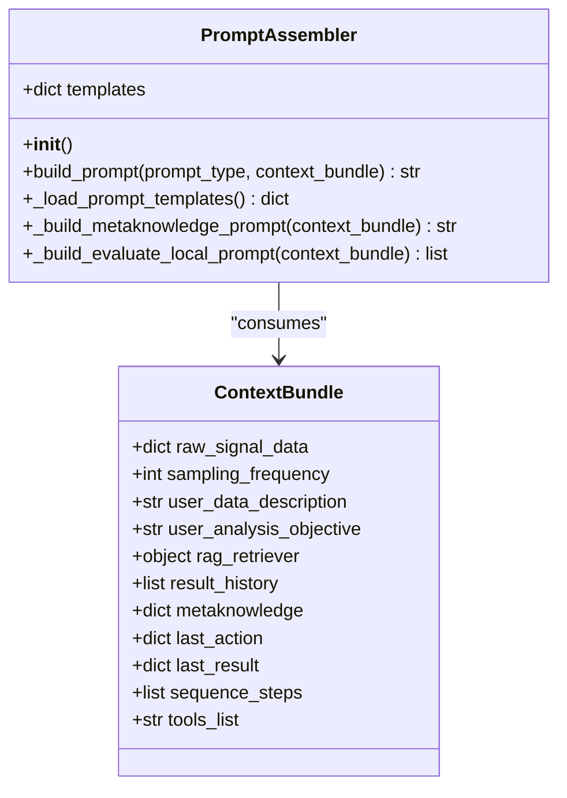
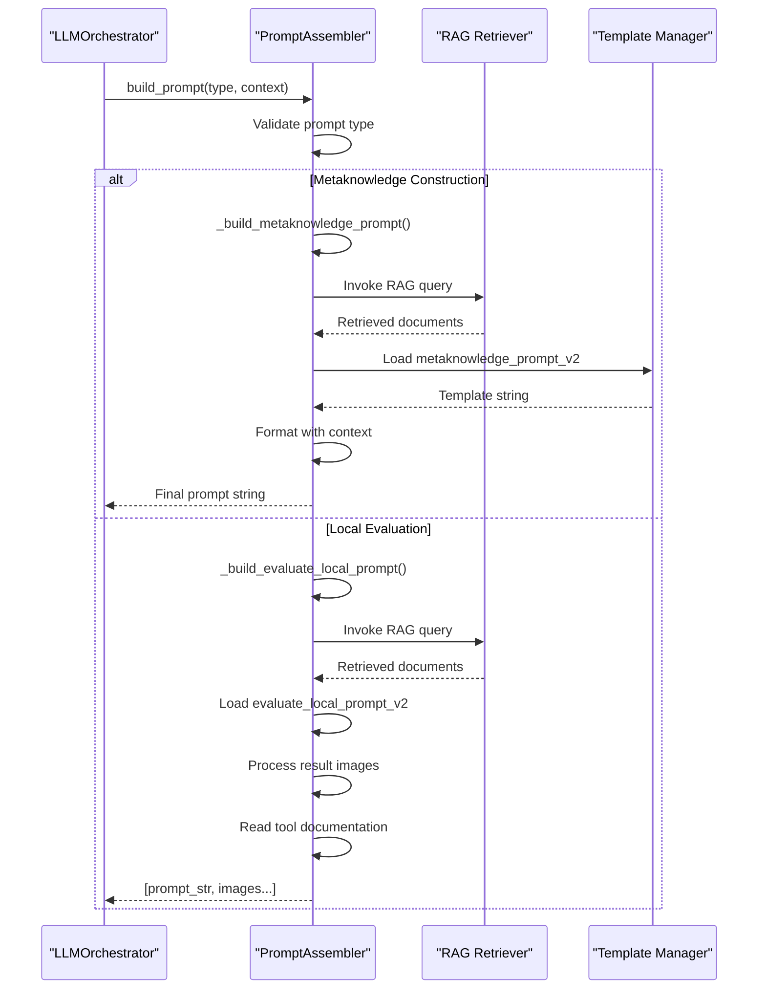
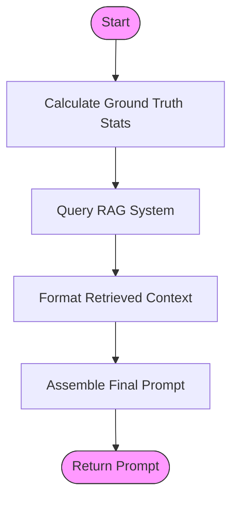
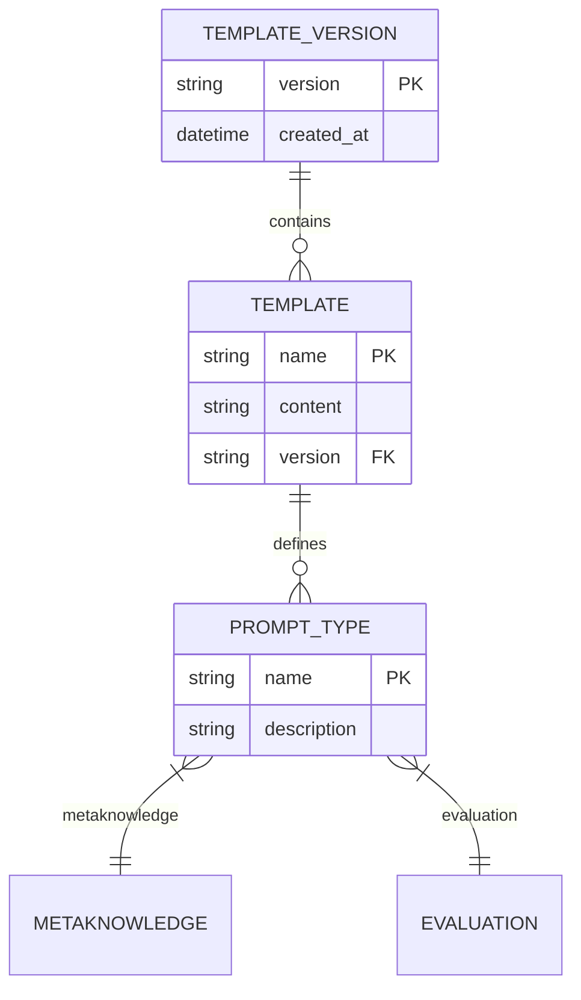

# Prompt Assembly Mechanism

<cite>
**Referenced Files in This Document**   
- [prompt_assembler.py](file://src/core/prompt_assembler.py) - *Updated in recent commit*
- [ContextManager.py](file://src/core/ContextManager.py) - *Added in recent commit*
- [metaknowledge_prompt_v2.txt](file://src/prompt_templates/metaknowledge_prompt_v2.txt) - *Used in metaknowledge prompt assembly*
- [evaluate_local_prompt_v2.txt](file://src/prompt_templates/evaluate_local_prompt_v2.txt) - *Used in evaluation prompt assembly*
</cite>

## Update Summary
**Changes Made**   
- Updated documentation to reflect integration with ContextManager for persistent context management
- Added details on context bundle structure and RAG integration
- Clarified multimodal prompt handling and image processing
- Enhanced error handling and performance considerations
- Updated method signatures and return types based on code analysis
- Added new section on configuration system and extension points

## Table of Contents
1. [Introduction](#introduction)
2. [Project Structure](#project-structure)
3. [Core Components](#core-components)
4. [Architecture Overview](#architecture-overview)
5. [Detailed Component Analysis](#detailed-component-analysis)
6. [Prompt Template System](#prompt-template-system)
7. [Error Handling and Validation](#error-handling-and-validation)
8. [Performance Considerations](#performance-considerations)
9. [Integration with RAG System](#integration-with-rag-system)
10. [Extension Points and Future Work](#extension-points-and-future-work)

## Introduction
The PromptAssembler module serves as the central engine for dynamic prompt generation within the LLM-based signal analysis pipeline. It transforms abstract user objectives and raw data into structured, context-rich prompts that guide large language models through complex diagnostic workflows. By integrating domain knowledge, historical results, and real-time system state, this component enables intelligent decision-making in vibration signal analysis for fault detection in mechanical systems.

The system supports multiple prompt types including metaknowledge construction, local evaluation, and pipeline orchestration. It leverages template versioning (v1/v2) to enable iterative refinement of prompting strategies while maintaining backward compatibility. The design emphasizes modularity, extensibility, and tight integration with retrieval-augmented generation (RAG) systems to ensure contextually accurate and technically sound outputs.

**Section sources**
- [prompt_assembler.py](file://src/core/prompt_assembler.py#L1-L20)

## Project Structure
The project follows a layered architecture with clear separation between core logic, user interface, and external resources. The PromptAssembler resides in the core module alongside other critical components such as ContextManager and LLMOrchestrator.

```mermaid
graph TD
subgraph "Core Modules"
PA[prompt_assembler.py]
CM[ContextManager.py]
LO[LLMOrchestrator.py]
RB[rag_builder.py]
end
subgraph "Templates"
PT[prompt_templates/]
TT1[metaknowledge_prompt_v2.txt]
TT2[evaluate_local_prompt_v2.txt]
end
subgraph "Tools"
Tools[tools/]
TF[transforms/]
DS[decomposition/]
SP[sigproc/]
end
PA --> PT
PA --> Tools
LO --> PA
CM --> PA
RB --> PA
style PA fill:#f9f,stroke:#333
```

**Diagram sources**
- [prompt_assembler.py](file://src/core/prompt_assembler.py#L1-L178)
- [src/prompt_templates](file://src/prompt_templates)

## Core Components
The PromptAssembler class is the primary component responsible for constructing final prompts sent to the LLM. It encapsulates template management, context injection, and multi-stage prompt assembly logic. Key responsibilities include:

- Loading and caching text templates from disk
- Resolving dynamic variables from runtime context
- Integrating retrieved knowledge from RAG systems
- Handling multimodal inputs (text + images)
- Managing template version selection

The component interacts with several external systems:
- **ContextManager**: Provides access to current analysis state
- **LLMOrchestrator**: Consumes generated prompts for execution
- **RAG retrievers**: Supply domain-specific knowledge snippets
- **Tool registry**: Contains documentation and parameter schemas



**Diagram sources**
- [prompt_assembler.py](file://src/core/prompt_assembler.py#L25-L40)

## Architecture Overview
The prompt assembly process follows a dispatcher-handler pattern where the main `build_prompt` method routes requests to specialized private methods based on prompt type. This architecture enables clean separation of concerns while maintaining a unified interface.



**Diagram sources**
- [prompt_assembler.py](file://src/core/prompt_assembler.py#L45-L178)

## Detailed Component Analysis

### PromptAssembler Class Analysis
The PromptAssembler implements a template-based approach to prompt construction, combining static templates with dynamic runtime context. The class initializes by loading all available templates into memory during instantiation, reducing disk I/O overhead during execution.

#### Initialization and Template Loading
The `_load_prompt_templates` method scans the `src/prompt_templates` directory and loads all `.txt` files into a dictionary. Templates are stored using filename-based keys (without extension), enabling versioned templates like `metaknowledge_prompt_v2.txt` to coexist with legacy versions.

```python
def _load_prompt_templates(self) -> dict:
    templates = {}
    template_dir = "src/prompt_templates"
    for filename in os.listdir(template_dir):
        if filename.endswith(".txt"):
            template_name = filename.replace('.txt', '')
            with open(os.path.join(template_dir, filename), 'r') as f:
                templates[template_name] = f.read()
    return templates
```

This approach provides flexibility for A/B testing different prompting strategies and gradual migration to improved templates.

**Section sources**
- [prompt_assembler.py](file://src/core/prompt_assembler.py#L150-L178)

#### Metaknowledge Prompt Assembly
The `_build_metaknowledge_prompt` method constructs prompts for extracting structured metadata from unstructured user input. It follows a three-step process:

1. **Ground Truth Computation**: Calculates objective signal properties directly from raw data
2. **Context Retrieval**: Queries RAG systems for relevant domain knowledge
3. **Template Assembly**: Combines all elements using the v2 template



**Diagram sources**
- [prompt_assembler.py](file://src/core/prompt_assembler.py#L60-L100)
- [metaknowledge_prompt_v2.txt](file://src/prompt_templates/metaknowledge_prompt_v2.txt#L1-L61)

#### Local Evaluation Prompt Assembly
The `_build_evaluate_local_prompt` method handles evaluation of pipeline results, supporting multimodal output by including image objects in the return value. This enables visual assessment of signal processing outcomes.

Key features:
- Dynamic tool documentation loading via file search
- Image processing for visual evaluation
- Result history integration
- Parameter inheritance for iterative refinement

The method returns a list containing the prompt string followed by image paths and PIL.Image objects, allowing the LLM client to handle multimodal inputs appropriately.

**Section sources**
- [prompt_assembler.py](file://src/core/prompt_assembler.py#L105-L149)

## Prompt Template System
The template system uses Python's string `.format()` method to inject dynamic content into static templates. Two versions of each template exist (v1 and v2), with v2 being actively used in the codebase.

### Metaknowledge Template (v2)
The `metaknowledge_prompt_v2.txt` template guides the LLM to produce structured JSON output according to a strict schema. It includes placeholders for:
- Ground truth signal statistics
- Retrieved domain knowledge
- Tool documentation context
- User-provided descriptions and objectives

The template enforces JSON schema compliance and includes instructions for handling edge cases like unrealistic parameter values.

### Evaluation Template (v2)
The `evaluate_local_prompt_v2.txt` template orchestrates pipeline progression by:
- Presenting result history and visualizations
- Providing tool documentation and domain constraints
- Requiring structured JSON output with specific fields
- Enforcing domain mapping rules for input selection

It includes a comprehensive domain map that restricts valid input types for each tool, preventing invalid pipeline configurations.



**Diagram sources**
- [metaknowledge_prompt_v2.txt](file://src/prompt_templates/metaknowledge_prompt_v2.txt#L1-L61)
- [evaluate_local_prompt_v2.txt](file://src/prompt_templates/evaluate_local_prompt_v2.txt#L1-L59)

## Error Handling and Validation
The PromptAssembler implements several validation mechanisms:

1. **Prompt Type Validation**: Raises `ValueError` for unknown prompt types
2. **Template Existence**: Fails fast if required templates are missing
3. **Context Completeness**: Relies on caller to provide complete context bundle
4. **File Access**: Handles missing tool documentation files

Potential improvements:
- Add validation for required context bundle keys
- Implement fallback templates when v2 is unavailable
- Add size limits for prompt strings to prevent token overflow
- Include timeout handling for RAG retriever calls

The current implementation assumes well-formed input and does not handle cases where template variables are missing from the context bundle, which could lead to KeyError exceptions during string formatting.

**Section sources**
- [prompt_assembler.py](file://src/core/prompt_assembler.py#L45-L55)

## Performance Considerations
The prompt assembly system has several performance characteristics to consider:

- **Memory Usage**: All templates are loaded into memory at initialization, minimizing disk I/O during operation
- **String Operations**: Template formatting with large context strings may become expensive at scale
- **File Operations**: Tool documentation is read on every evaluation prompt, creating potential I/O bottlenecks
- **Image Loading**: PIL.Image objects are created for each result image, consuming significant memory

Optimization opportunities:
- Cache tool documentation after first read
- Implement template pre-processing to identify required context fields
- Add prompt size monitoring to prevent exceeding LLM token limits
- Consider lazy loading of images until actually needed by the LLM client

For high-frequency orchestration cycles, the current implementation may benefit from memoization of frequently generated prompts and asynchronous template loading.

**Section sources**
- [prompt_assembler.py](file://src/core/prompt_assembler.py#L1-L178)

## Integration with RAG System
The PromptAssembler tightly integrates with two RAG retrievers:
- **Domain Knowledge Retriever**: Provides context about mechanical faults and signal characteristics
- **Tool Documentation Retriever**: Supplies information about available processing tools

Both retrievers are invoked using a composite query combining user data description, analysis objective, and relevant action context. Retrieved documents are formatted as numbered snippets and injected into the prompt, enabling the LLM to leverage external knowledge during decision-making.

This integration transforms the system from a static rule-based processor into an adaptive knowledge-driven analyzer capable of handling novel fault patterns and edge cases beyond its predefined toolset.

**Section sources**
- [prompt_assembler.py](file://src/core/prompt_assembler.py#L75-L85)
- [prompt_assembler.py](file://src/core/prompt_assembler.py#L115-L120)

## Extension Points and Future Work
The current architecture supports several extension points:

1. **New Prompt Types**: Additional elif clauses can be added to `build_prompt` for new analysis stages
2. **Multi-LLM Workflows**: Different prompt templates could target specialized models
3. **Template Versioning**: System already supports v1/v2, enabling gradual upgrades
4. **Dynamic Template Selection**: Could select templates based on signal domain or user expertise level

Future enhancements could include:
- Template inheritance and composition
- Automated template optimization through reinforcement learning
- Real-time collaboration between multiple LLMs using specialized prompts
- Support for non-English user inputs with automatic translation in prompts

The modular design ensures that new prompt types can be added without modifying existing functionality, adhering to the open/closed principle.

**Section sources**
- [prompt_assembler.py](file://src/core/prompt_assembler.py#L45-L55)