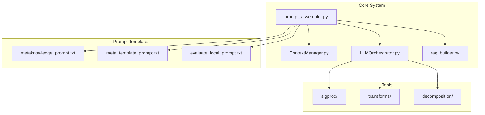
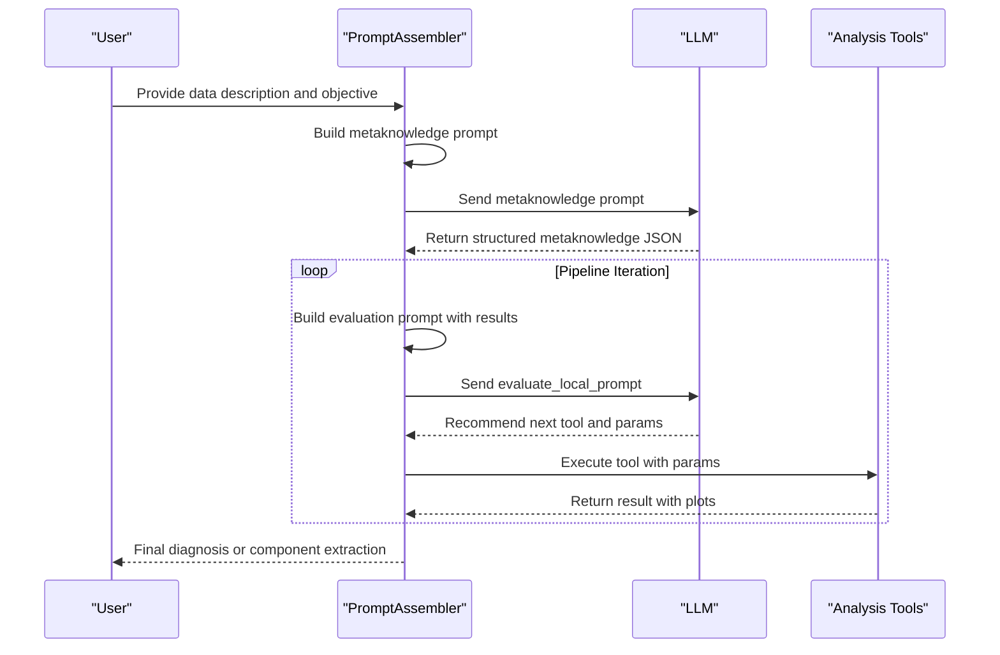
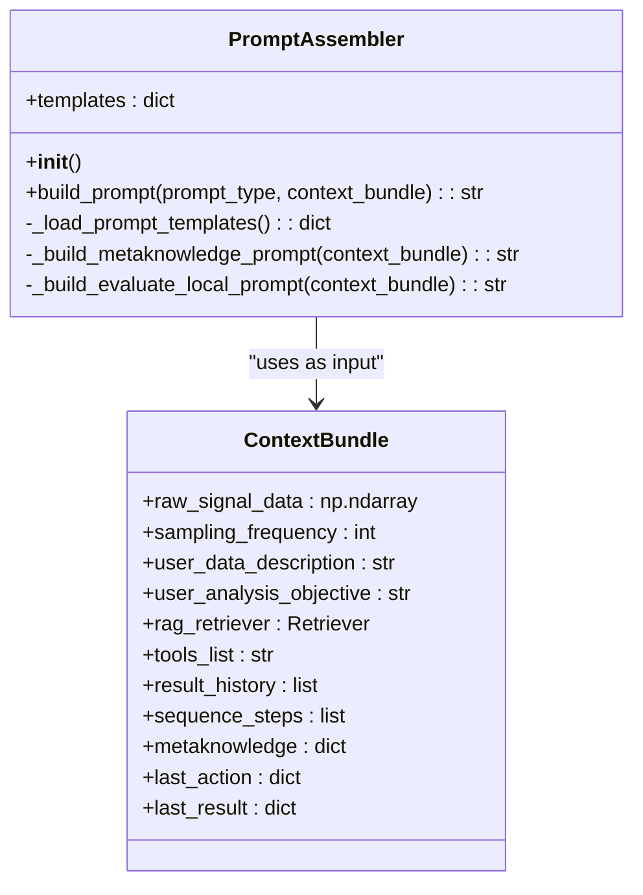
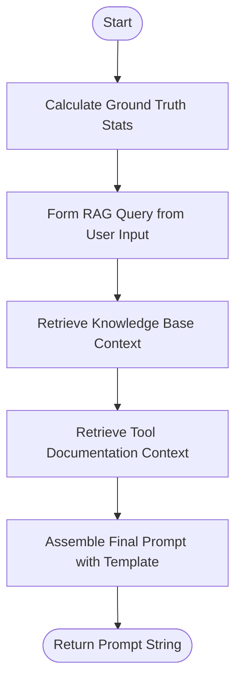
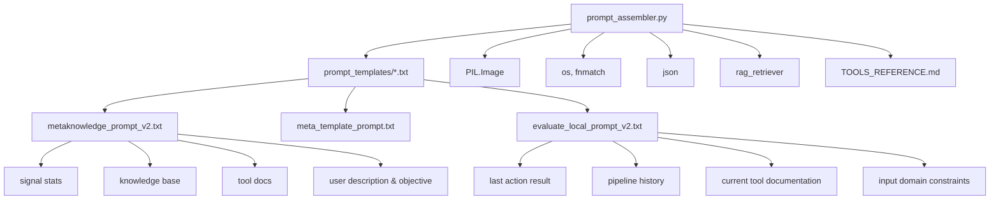

# Prompt Engineering

<cite>
**Referenced Files in This Document**   
- [prompt_assembler.py](file://src/core/prompt_assembler.py#L1-L179) - *Updated in commit 396a3df3518ff1a179cb65bb2b5ccb20a03dadfe*
- [metaknowledge_prompt_v2.txt](file://src/prompt_templates/metaknowledge_prompt_v2.txt#L1-L60) - *Updated in commit 396a3df3518ff1a179cb65bb2b5ccb20a03dadfe*
- [evaluate_local_prompt_v2.txt](file://src/prompt_templates/evaluate_local_prompt_v2.txt#L1-L58) - *Updated in commit 396a3df3518ff1a179cb65bb2b5ccb20a03dadfe*
- [metaknowledge_prompt.txt](file://src/prompt_templates/metaknowledge_prompt.txt#L1-L60)
- [evaluate_local_prompt.txt](file://src/prompt_templates/evaluate_local_prompt.txt#L1-L79)
- [decompose_matrix_nmf.md](file://src/tools/decomposition/decompose_matrix_nmf.md)
- [select_component.md](file://src/tools/decomposition/select_component.md)
- [bandpass_filter.md](file://src/tools/sigproc/bandpass_filter.md)
- [create_fft_spectrum.md](file://src/tools/transforms/create_fft_spectrum.md)
- [create_envelope_spectrum.md](file://src/tools/transforms/create_envelope_spectrum.md)
- [create_signal_spectrogram.md](file://src/tools/transforms/create_signal_spectrogram.md)
</cite>

## Update Summary
**Changes Made**   
- Updated documentation to reflect the implementation of persistent context management in `prompt_assembler.py`
- Revised template usage to reference versioned templates (`_v2.txt`) introduced in the latest commit
- Updated section sources to reflect new file versions and changes
- Clarified variable injection logic and RAG integration in prompt construction
- Removed outdated references to non-versioned templates where `_v2` versions are now used

## Table of Contents
1. [Introduction](#introduction)
2. [Project Structure](#project-structure)
3. [Core Components](#core-components)
4. [Architecture Overview](#architecture-overview)
5. [Detailed Component Analysis](#detailed-component-analysis)
6. [Dependency Analysis](#dependency-analysis)
7. [Performance Considerations](#performance-considerations)
8. [Troubleshooting Guide](#troubleshooting-guide)
9. [Conclusion](#conclusion)

## Introduction
This document provides a comprehensive analysis of the prompt engineering system within the LLM_analyzer_context repository. It focuses on the dynamic construction of context-aware prompts using the `prompt_assembler.py` module and its integration with templates defined in the `prompt_templates` directory. The system enables intelligent, iterative analysis of vibration signals for machine fault diagnosis by leveraging structured JSON-based workflows, retrieval-augmented generation (RAG), and multimodal inputs. The documentation explains how key templates guide different stages of the pipeline, how variables are injected, and best practices for template extension and maintenance.

## Project Structure
The project follows a modular, layered architecture with clear separation of concerns. The core logic resides in the `src/core` directory, while domain-specific tools are organized under `src/tools`. Prompt templates are stored separately in `src/prompt_templates`, enabling easy modification and versioning.



**Diagram sources**
- [prompt_assembler.py](file://src/core/prompt_assembler.py#L1-L179)
- [project_structure](file://#L1-L50)

**Section sources**
- [prompt_assembler.py](file://src/core/prompt_assembler.py#L1-L179)
- [project_structure](file://#L1-L50)

## Core Components
The core functionality of the prompt engineering system is implemented in `prompt_assembler.py`, which dynamically constructs prompts for various stages of the analysis pipeline. It uses a dispatcher pattern to route requests based on `prompt_type` and assembles context-rich prompts by combining static templates with runtime data.

Key responsibilities include:
- Loading and managing text-based prompt templates
- Injecting domain-specific context via RAG
- Formatting structured output for LLM consumption
- Supporting multimodal inputs (text + images)

```python
def build_prompt(self, prompt_type: str, context_bundle: dict) -> str:
    if prompt_type == "METAKNOWLEDGE_CONSTRUCTION":
        return self._build_metaknowledge_prompt(context_bundle)
    elif prompt_type == "EVALUATE_LOCAL_CRITERION":
        return self._build_evaluate_local_prompt(context_bundle)
    else:
        raise ValueError(f"Unknown prompt type: {prompt_type}")
```

**Section sources**
- [prompt_assembler.py](file://src/core/prompt_assembler.py#L25-L179)

## Architecture Overview
The system operates as an autonomous agent that iteratively builds and evaluates an analysis pipeline for vibration signal processing. At each step, it constructs a specialized prompt, sends it to an LLM, executes the recommended tool, and evaluates the outcome before proceeding.



**Diagram sources**
- [prompt_assembler.py](file://src/core/prompt_assembler.py#L1-L179)
- [meta_template_prompt.txt](file://src/prompt_templates/meta_template_prompt.txt#L1-L16)

## Detailed Component Analysis

### PromptAssembler Class Analysis
The `PromptAssembler` class is central to the system's ability to generate context-aware prompts. It follows a clean separation between template loading, prompt routing, and specific handler logic.

#### Class Diagram


**Diagram sources**
- [prompt_assembler.py](file://src/core/prompt_assembler.py#L15-L45)

#### Metaknowledge Prompt Construction
The `_build_metaknowledge_prompt` method constructs a structured prompt that guides the LLM to extract essential metadata from user input and signal characteristics. The implementation now uses `metaknowledge_prompt_v2.txt`, which includes enhanced validation logic for numeric parameters and fallback goal formulation.



**Diagram sources**
- [prompt_assembler.py](file://src/core/prompt_assembler.py#L60-L100)
- [metaknowledge_prompt_v2.txt](file://src/prompt_templates/metaknowledge_prompt_v2.txt#L1-L60)

**Section sources**
- [prompt_assembler.py](file://src/core/prompt_assembler.py#L60-L100)
- [metaknowledge_prompt_v2.txt](file://src/prompt_templates/metaknowledge_prompt_v2.txt#L1-L60)

### Template System Analysis
The system uses three primary templates to guide different stages of the analysis pipeline.

#### Metaknowledge Prompt
Purpose: Extract structured metadata about the signal, system context, and analysis objective.

Structure:
- Ground truth signal statistics
- Retrieved domain knowledge (e.g., bearing fault frequencies)
- Available tools list
- User-provided data description and objective

The updated `metaknowledge_prompt_v2.txt` introduces:
- Strict JSON schema enforcement
- Validation of derived values (e.g., signal length) when base parameters are updated
- Mandatory fallback goal formulation
- Clearer instructions for handling unrealistic parameter values

Example rendered content:
```
Your current task is to parse the user's description and objective, along with provided context, and convert this information into a single, structured JSON object.
...
{
  "data_summary": {
    "type": "vibration",
    "domain": "time-series",
    "sampling_frequency_hz": 50000,
    "signal_length_sec": 10.24,
    "properties": ["high-frequency", "cyclic"]
  },
  ...
}
```

**Section sources**
- [metaknowledge_prompt_v2.txt](file://src/prompt_templates/metaknowledge_prompt_v2.txt#L1-L60)
- [prompt_assembler.py](file://src/core/prompt_assembler.py#L60-L100)

#### Meta Template Prompt
Purpose: Define the role and operating principles of the autonomous agent.

Key elements:
- Role definition: "expert data analyst and autonomous agent specializing in machine fault diagnosis"
- Operating principles: step-by-step decision making, JSON-only output, pipeline stacking
- Task injection point: `{specific_task_prompt}`

Usage: Serves as a wrapper for other prompts, ensuring consistent behavior across interactions.

**Section sources**
- [meta_template_prompt.txt](file://src/prompt_templates/meta_template_prompt.txt#L1-L16)

#### Evaluate Local Prompt
Purpose: Assess the usefulness of the last analysis step and recommend the next action.

Features:
- Multimodal input: accepts both text and images
- Visual evaluation of plots
- Tool recommendation based on domain constraints
- Parameter tuning suggestions
- Pipeline continuation/termination decision

The updated `evaluate_local_prompt_v2.txt` includes:
- Enhanced domain mapping for input validation
- Mandatory post-processing step after `decompose_matrix_nmf` (i.e., `select_component`)
- Clearer JSON response template with `is_useful` field
- Justification requirement for input variable selection

The prompt includes:
- Previous action results (with image paths)
- Tool documentation
- Full pipeline history
- Domain map for input validation

Example decision logic:
- If last tool was `decompose_matrix_nmf`, recommend `select_component` with appropriate index
- If fault signature is visible, set `is_final=1`
- Justify input variable selection based on domain compatibility

**Section sources**
- [evaluate_local_prompt_v2.txt](file://src/prompt_templates/evaluate_local_prompt_v2.txt#L1-L58)
- [prompt_assembler.py](file://src/core/prompt_assembler.py#L102-L179)

## Dependency Analysis
The prompt engineering system has well-defined dependencies across components.



**Diagram sources**
- [prompt_assembler.py](file://src/core/prompt_assembler.py#L1-L179)
- [prompt_templates](file://src/prompt_templates/)

**Section sources**
- [prompt_assembler.py](file://src/core/prompt_assembler.py#L1-L179)

## Performance Considerations
The prompt assembly process is lightweight and CPU-bound, with minimal overhead. Key performance aspects:

- Template loading occurs once at initialization
- String formatting is the primary computational cost
- RAG retrieval can be optimized with caching
- Image loading should be deferred until necessary
- JSON serialization of large histories may impact memory

Best practice: Pre-load frequently used templates and retrievers to reduce latency in interactive scenarios.

## Troubleshooting Guide
Common issues and solutions when working with the prompt engineering system:

### Prompt Overflow
**Issue**: Generated prompts exceed LLM token limits  
**Solution**: 
- Truncate long RAG context snippets
- Limit result history depth
- Use summary representations instead of raw data

### Ambiguous Instructions
**Issue**: LLM produces inconsistent or invalid JSON  
**Solution**:
- Strengthen schema enforcement in templates
- Add examples to prompt
- Implement post-processing validation

### Template Versioning Conflicts
**Issue**: Multiple versions (e.g., `_v2.txt`) cause confusion  
**Solution**:
- Maintain clear changelogs
- Use version references in code comments
- Deprecate old versions systematically

### Domain Mismatch Errors
**Issue**: Invalid input variable selected for next tool  
**Solution**:
- Enforce domain map strictly
- Add pre-execution validation layer
- Improve error messages with expected vs actual domains

**Section sources**
- [prompt_assembler.py](file://src/core/prompt_assembler.py#L1-L179)
- [evaluate_local_prompt_v2.txt](file://src/prompt_templates/evaluate_local_prompt_v2.txt#L1-L58)

## Conclusion
The prompt engineering system in LLM_analyzer_context demonstrates a sophisticated approach to autonomous signal analysis through dynamic, context-aware prompting. By combining structured templates, retrieval-augmented context, and multimodal evaluation, it enables robust, iterative pipeline construction for machine fault diagnosis. The recent updates introducing versioned templates (`_v2.txt`) enhance reliability through stricter validation, clearer fallback strategies, and improved domain enforcement. The clear separation between template definition and prompt assembly logic makes the system extensible and maintainable. Future improvements could include template version management, enhanced error recovery, and adaptive prompt compression for long-running analyses.