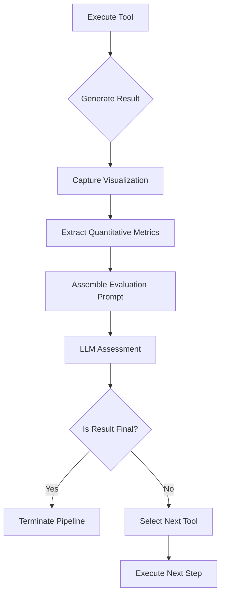
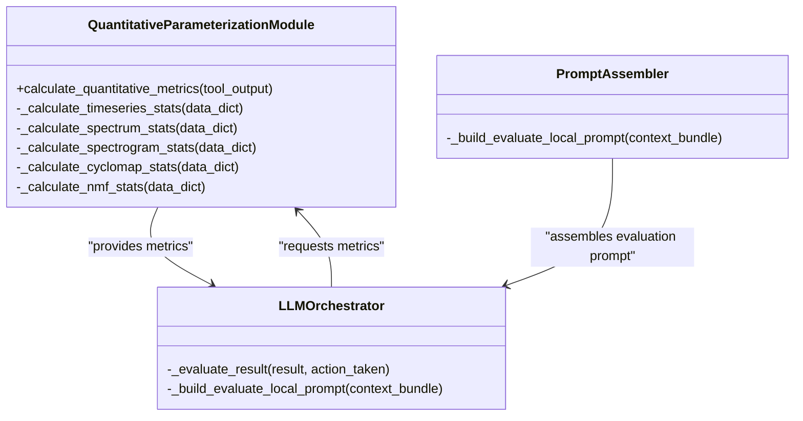
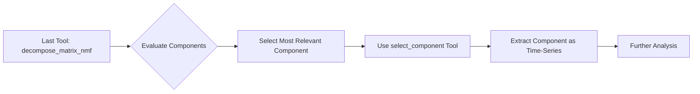
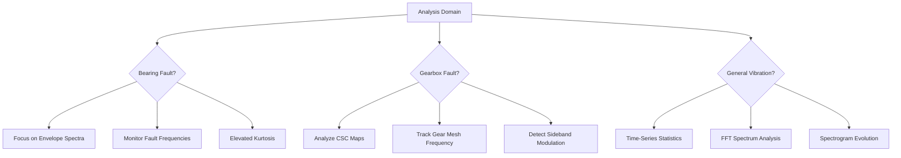
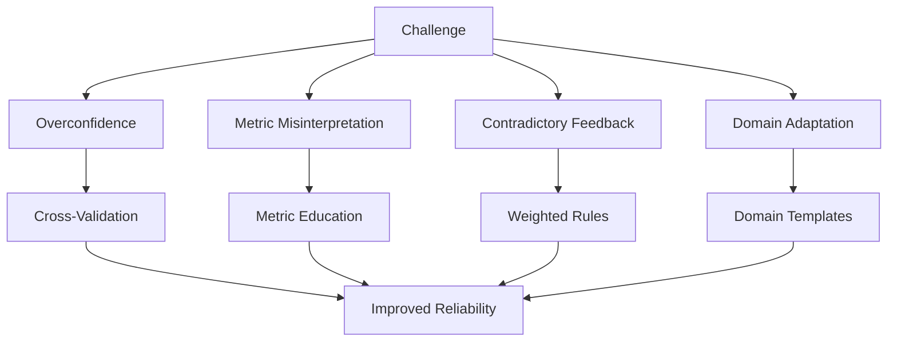
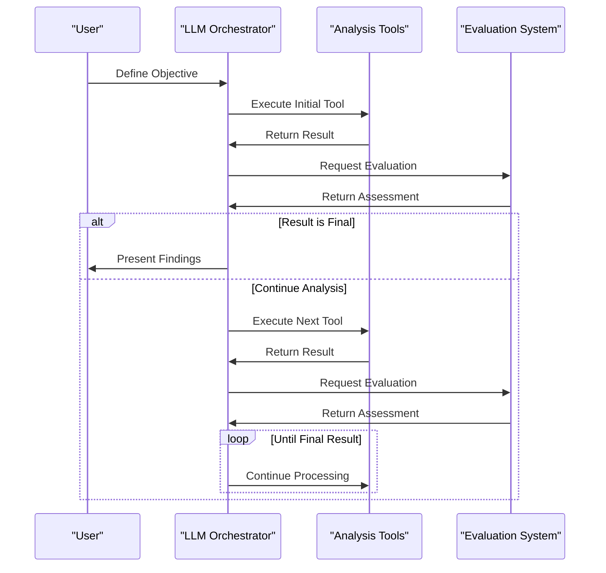

# Result Evaluation Prompts

<cite>
**Referenced Files in This Document**   
- [evaluate_local_prompt.txt](file://src/prompt_templates/evaluate_local_prompt.txt)
- [evaluate_local_prompt_v2.txt](file://src/prompt_templates/evaluate_local_prompt_v2.txt)
- [prompt_assembler.py](file://src/core/prompt_assembler.py)
- [LLMOrchestrator.py](file://src/core/LLMOrchestrator.py)
- [quantitative_parameterization_module.py](file://src/core/quantitative_parameterization_module.py)
- [PERSISTENT_CONTEXT_IMPLEMENTATION.md](file://PERSISTENT_CONTEXT_IMPLEMENTATION.md)
- [concept.md](file://concept.md)
</cite>

## Table of Contents
1. [Introduction](#introduction)
2. [Core Functionality of Result Evaluation Prompts](#core-functionality-of-result-evaluation-prompts)
3. [Integration with Quantitative Parameterization](#integration-with-quantitative-parameterization)
4. [Evaluation Workflow and Decision Logic](#evaluation-workflow-and-decision-logic)
5. [Improvements in v2 Evaluation Prompt](#improvements-in-v2-evaluation-prompt)
6. [Best Practices for Domain-Specific Tuning](#best-practices-for-domain-specific-tuning)
7. [Common Challenges and Mitigation Strategies](#common-challenges-and-mitigation-strategies)
8. [Impact on Analysis Convergence and Reliability](#impact-on-analysis-convergence-and-reliability)
9. [Conclusion](#conclusion)

## Introduction

The result evaluation prompt system is a critical component of the LLM-based signal analysis pipeline, enabling intelligent assessment of intermediate results against user-defined objectives and domain-specific criteria. This system allows the orchestrator to make informed decisions about whether to continue, refine, or terminate the analysis based on both qualitative observations and quantitative metrics. The evaluation process is facilitated by two primary prompt templates: `evaluate_local_prompt.txt` and its enhanced version `evaluate_local_prompt_v2.txt`, which guide the LLM in assessing the relevance and quality of analysis results.

**Section sources**
- [evaluate_local_prompt.txt](file://src/prompt_templates/evaluate_local_prompt.txt#L1-L78)
- [evaluate_local_prompt_v2.txt](file://src/prompt_templates/evaluate_local_prompt_v2.txt#L1-L58)

## Core Functionality of Result Evaluation Prompts

The result evaluation prompts serve as decision-making mechanisms within the analysis pipeline, allowing the LLM to assess whether the output of a processing step brings the system closer to achieving the user's objective. These prompts are invoked after each tool execution to evaluate the resulting data and visualization.

The evaluation process considers multiple dimensions:
- Visual identification of components of interest
- Alignment with the analysis objective
- Quality of signal representation
- Potential for further refinement

The prompts are designed to produce structured JSON output containing:
- An evaluation summary describing the observed results
- A recommended next tool from the available toolset
- Input variable selection based on domain compatibility
- Parameter adjustments for the next step
- Binary flags indicating whether the result is final or useful

This structured response enables the orchestrator to programmatically interpret the LLM's assessment and proceed accordingly.



**Diagram sources**
- [evaluate_local_prompt.txt](file://src/prompt_templates/evaluate_local_prompt.txt#L1-L78)
- [prompt_assembler.py](file://src/core/prompt_assembler.py#L0-L178)

**Section sources**
- [evaluate_local_prompt.txt](file://src/prompt_templates/evaluate_local_prompt.txt#L1-L78)
- [prompt_assembler.py](file://src/core/prompt_assembler.py#L0-L178)

## Integration with Quantitative Parameterization

The evaluation system integrates qualitative observations with quantitative metrics through the quantitative parameterization module, which automatically computes domain-specific statistical features from tool outputs. This integration provides the LLM with both visual and numerical information for more robust decision-making.

When a tool produces output, the parameterization module analyzes the data based on its domain (e.g., time-series, time-frequency-matrix) and computes relevant metrics:

```python
def calculate_quantitative_metrics(tool_output: Dict[str, Any]) -> Dict[str, Any]:
    """
    Enhance tool output with domain-specific quantitative metrics.
    Dispatches to specialized handlers based on the 'domain' field.
    """
```

For different data domains, the module calculates appropriate metrics:
- **Time-series**: Kurtosis, skewness, RMS, crest factor
- **Frequency-spectrum**: Dominant frequency, spectral centroid
- **Time-frequency-matrix**: Gini index for sparsity, spectral kurtosis
- **Bi-frequency-matrix**: Maximum coherence, peak frequencies
- **Decomposed-matrix**: Component-specific statistical properties

These quantitative metrics ({metric_values}) are incorporated into the evaluation prompt alongside the visualization ({result_visualization}) and the expected signature ({expected_signature}) of the fault or phenomenon being analyzed. This multimodal input allows the LLM to correlate visual patterns with numerical indicators, improving the reliability of its assessment.



**Diagram sources**
- [quantitative_parameterization_module.py](file://src/core/quantitative_parameterization_module.py#L0-L34)
- [LLMOrchestrator.py](file://src/core/LLMOrchestrator.py#L500-L528)

**Section sources**
- [quantitative_parameterization_module.py](file://src/core/quantitative_parameterization_module.py#L0-L1075)
- [LLMOrchestrator.py](file://src/core/LLMOrchestrator.py#L500-L528)

## Evaluation Workflow and Decision Logic

The evaluation workflow follows a systematic process where the LLM assesses results and recommends subsequent actions. The decision logic is encoded in the evaluation prompt, which provides explicit instructions for determining the next step.

Key decision pathways include:

- **Continue analysis**: When the result shows promising features but requires further processing
- **Refine parameters**: When the result is relevant but suboptimal due to parameter settings
- **Terminate pipeline**: When the component of interest is clearly identified and characterized
- **Backtrack**: When the result is not useful and alternative approaches should be explored

The domain map strictly governs input-output compatibility between tools:

```
- create_fft_spectrum: time-series
- create_envelope_spectrum: time-series or bi-frequency-matrix
- create_signal_spectrogram: time-series
- create_csc_map: time-series
- bandpass_filter: time-series
- decompose_matrix_nmf: time-frequency-matrix or bi-frequency-matrix
- select_component: decomposed_matrix
```

A critical rule in the evaluation logic mandates that after `decompose_matrix_nmf`, the `select_component` tool must be used to extract the most relevant component. This post-processing step ensures that the decomposition results are properly utilized in subsequent analysis.



**Section sources**
- [evaluate_local_prompt.txt](file://src/prompt_templates/evaluate_local_prompt.txt#L35-L78)
- [evaluate_local_prompt_v2.txt](file://src/prompt_templates/evaluate_local_prompt_v2.txt#L35-L58)

## Improvements in v2 Evaluation Prompt

The v2 version of the evaluation prompt introduces several enhancements that improve the reliability and effectiveness of the assessment process:

### Structured Output Formatting
The v2 prompt enforces stricter JSON schema compliance, reducing parsing errors and ensuring consistent output structure. This allows for more reliable programmatic interpretation of the LLM's recommendations.

### Clearer Decision Boundaries
The v2 prompt provides more explicit criteria for determining when a result should be considered "final" versus when further analysis is needed. This reduces ambiguity in the decision-making process.

### Enhanced Context Integration
The v2 prompt incorporates additional contextual information, including:
- Complete history of previous actions
- Detailed tool documentation
- Retrieved domain knowledge from RAG system
- Quantitative metrics from parameterization module

### Improved Error Handling
The v2 prompt includes better guidance for handling edge cases and ambiguous results, reducing the likelihood of the system entering unproductive loops.

The implementation in `prompt_assembler.py` demonstrates how the evaluation prompt is constructed by combining multiple contextual elements:

```python
def _build_evaluate_local_prompt(self, context_bundle: dict) -> str:
    """Handler for the 'Are results useful?' decision."""
    # Combine user texts for RAG query
    rag_query = context_bundle['user_data_description'] + " " + \
                context_bundle['user_analysis_objective'] + " " + \
                context_bundle['last_action'].get('tool_name') + " next steps"
    
    # Retrieve relevant context
    retrieved_docs = context_bundle['rag_retriever'].invoke(rag_query)
    retrieved_docs_tools = context_bundle['rag_retriever_tools'].invoke(rag_query)
    
    # Get tool documentation
    action_documentation_path = self._find_tool_documentation(
        context_bundle["last_action"].get('tool_name')
    )
    
    # Format the final prompt with all contextual information
    prompt = self.templates['evaluate_local_prompt_v2'].format(
        metaknowledge=context_bundle['metaknowledge'],
        last_action_documenation=tool_doc,
        tools_list=tools_list,
        result_history=result_history,
        sequence_steps=json.dumps(context_bundle['sequence_steps'], indent=4),
        last_result_params=last_result_params
    )
```

**Section sources**
- [evaluate_local_prompt_v2.txt](file://src/prompt_templates/evaluate_local_prompt_v2.txt#L1-L58)
- [prompt_assembler.py](file://src/core/prompt_assembler.py#L0-L178)

## Best Practices for Domain-Specific Tuning

Effective use of the evaluation system requires domain-specific tuning of criteria based on the application context. Different fault types and analysis scenarios require different evaluation strategies.

### Bearing Fault Analysis
For bearing fault detection, evaluation criteria should focus on:
- Presence of characteristic fault frequencies
- Modulation sidebands in envelope spectra
- Periodic impacts in time-domain signals
- Elevated kurtosis values

Recommended settings:
- Emphasize spectral kurtosis in evaluation
- Prioritize envelope spectrum analysis after bandpass filtering
- Use narrowband filtering around suspected fault frequencies

### Gearbox Analysis
For gearbox fault detection, evaluation criteria should emphasize:
- Gear mesh frequency and its harmonics
- Sideband patterns indicating modulation
- Cyclostationary behavior in bi-frequency maps
- Phase relationships between components

Recommended settings:
- Prioritize cyclostationary map (CSC) analysis
- Focus on joint frequency-cyclic frequency patterns
- Use order tracking when rotational speed varies

### General Tuning Guidelines
- Adjust sensitivity based on signal-to-noise ratio
- Balance between false positives and missed detections
- Consider operational conditions (load, speed, temperature)
- Incorporate historical data when available
- Validate against known fault signatures



**Section sources**
- [concept.md](file://concept.md#L323-L361)
- [PERSISTENT_CONTEXT_IMPLEMENTATION.md](file://PERSISTENT_CONTEXT_IMPLEMENTATION.md#L40-L72)

## Common Challenges and Mitigation Strategies

The evaluation system faces several common challenges that can affect analysis reliability:

### Overconfidence in Assessments
LLMs may express high confidence in incorrect assessments, particularly when visual patterns appear compelling but are actually noise artifacts.

**Mitigation**:
- Cross-validate with quantitative metrics
- Require multiple lines of evidence
- Implement confidence calibration
- Use ensemble approaches when possible

### Metric Misinterpretation
The LLM may misinterpret the significance of quantitative metrics, especially when they conflict with visual impressions.

**Mitigation**:
- Provide clear explanations of metric meanings
- Establish priority hierarchies among metrics
- Include examples of typical vs. atypical values
- Use normalized metrics for consistent interpretation

### Contradictory Feedback
Different evaluation criteria may provide conflicting signals (e.g., high kurtosis but no clear fault pattern).

**Mitigation**:
- Implement weighted decision rules
- Prioritize domain-specific indicators
- Maintain analysis history for trend detection
- Allow for temporary ambiguity while gathering more evidence

### Domain Adaptation Issues
Evaluation criteria that work well in one domain may fail in another due to different signal characteristics.

**Mitigation**:
- Implement domain-specific evaluation templates
- Use RAG to retrieve appropriate context
- Allow for user-specified weighting of criteria
- Continuously refine evaluation rules based on outcomes



**Section sources**
- [concept.md](file://concept.md#L399-L419)
- [PERSISTENT_CONTEXT_IMPLEMENTATION.md](file://PERSISTENT_CONTEXT_IMPLEMENTATION.md#L607-L618)

## Impact on Analysis Convergence and Reliability

The design of the evaluation prompts significantly influences both the speed of convergence and the reliability of the analysis process.

### Convergence Speed
Well-designed evaluation criteria accelerate convergence by:
- Quickly eliminating unproductive analysis paths
- Identifying promising directions early
- Minimizing parameter tuning iterations
- Preventing circular processing loops

Factors that enhance convergence:
- Clear decision boundaries
- Effective use of domain knowledge
- Appropriate sensitivity settings
- Strategic tool sequencing

### Analysis Reliability
The reliability of the final results depends on:
- Consistency of evaluation criteria
- Robustness to noise and artifacts
- Ability to detect subtle fault signatures
- Resistance to confirmation bias

The v2 prompt improvements directly address reliability concerns by:
- Standardizing output format
- Enhancing contextual awareness
- Improving error handling
- Strengthening domain-specific guidance

The iterative feedback loop creates a self-correcting system where each evaluation informs the next action, gradually refining the analysis toward the objective:



**Diagram sources**
- [LLMOrchestrator.py](file://src/core/LLMOrchestrator.py#L530-L552)
- [concept.md](file://concept.md#L175-L178)

**Section sources**
- [LLMOrchestrator.py](file://src/core/LLMOrchestrator.py#L530-L552)
- [concept.md](file://concept.md#L175-L178)

## Conclusion

The result evaluation prompt system represents a sophisticated mechanism for guiding automated signal analysis through iterative refinement. By combining qualitative visual assessment with quantitative metric analysis, the system enables the LLM orchestrator to make informed decisions about the direction of the analysis pipeline.

The evolution from the initial evaluation prompt to the v2 version demonstrates important improvements in structured output, clearer decision boundaries, and enhanced contextual integration. These advancements contribute to faster convergence and higher reliability in fault detection and diagnosis.

Effective implementation requires careful consideration of domain-specific requirements, particularly in tuning evaluation criteria for different types of mechanical faults. The system's ability to integrate multimodal information—visual, quantitative, and contextual—makes it a powerful tool for complex diagnostic tasks.

Future enhancements could include adaptive learning from successful analyses, dynamic adjustment of evaluation criteria based on confidence levels, and more sophisticated handling of ambiguous or contradictory evidence. The current foundation provides a robust platform for these advancements, supporting the goal of creating increasingly autonomous and reliable analysis systems.