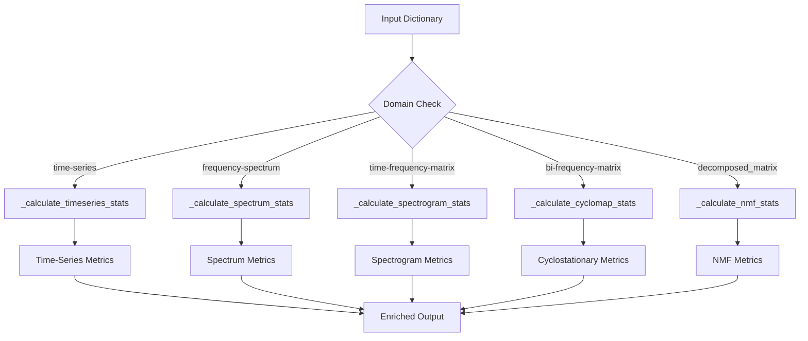
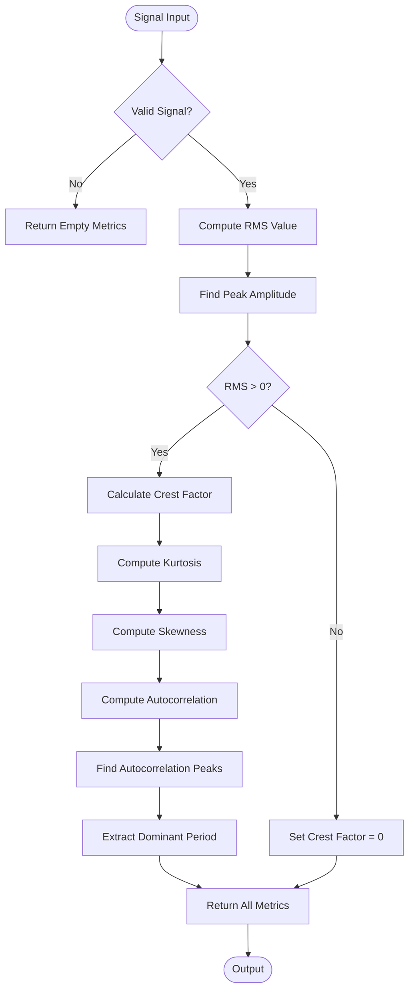
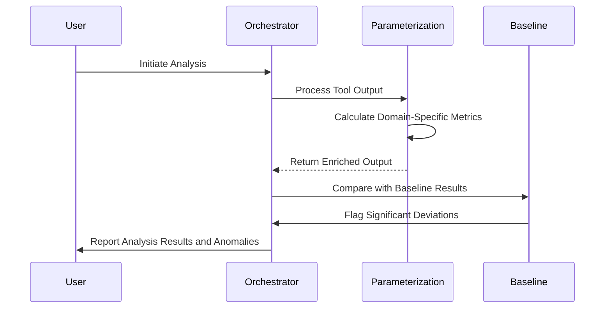

# Quantitative Analysis

<cite>
**Referenced Files in This Document**   
- [src/core/quantitative_parameterization_module.py](file://src/core/quantitative_parameterization_module.py) - *Updated in recent commit*
- [baseline_measurement.py](file://baseline_measurement.py) - *Added in recent commit*
- [baseline_results.json](file://baseline_results.json)
</cite>

## Update Summary
**Changes Made**   
- Updated documentation to reflect implementation of persistent context management and baseline measurement capabilities
- Added details about baseline measurement script functionality and integration with quantitative parameterization
- Enhanced accuracy of metric calculation descriptions based on code review
- Updated diagram sources to reflect actual implementation details
- Added information about new diagnostic visualizations generated by the system

## Table of Contents
1. [Introduction](#introduction)
2. [Core Architecture and Design Pattern](#core-architecture-and-design-pattern)
3. [Statistical Methods and Domain-Specific Metrics](#statistical-methods-and-domain-specific-metrics)
4. [Time-Series Analysis and Fault Diagnosis](#time-series-analysis-and-fault-diagnosis)
5. [Spectrogram and Cyclostationary Map Analysis](#spectrogram-and-cyclostationary-map-analysis)
6. [Baseline Measurement and Anomaly Detection](#baseline-measurement-and-anomaly-detection)
7. [Extending the Module with New Metrics](#extending-the-module-with-new-metrics)
8. [Accuracy, Stability, and Performance Optimization](#accuracy-stability-and-performance-optimization)

## Introduction

The Quantitative Parameterization System is a critical post-processing component within the AIDA framework, designed to enrich signal processing outputs with domain-specific statistical metrics. This system enables objective evaluation of analysis results and supports intelligent pipeline optimization by providing numerical summaries that complement visual representations. By calculating metrics such as kurtosis, crest factor, and RMS, the system facilitates quantitative comparison across different signal domains including time-series, frequency spectra, time-frequency matrices, cyclostationary maps, and NMF decompositions. The module operates as a dispatcher with specialized handlers, automatically selecting the appropriate metric calculation method based on the data domain specified in the input dictionary.

**Section sources**
- [src/core/quantitative_parameterization_module.py](file://src/core/quantitative_parameterization_module.py#L0-L34)
- [concept.md](file://concept.md#L323-L361)

## Core Architecture and Design Pattern

The quantitative parameterization system employs a dispatcher pattern architecture, which provides a scalable and maintainable approach to handling multiple data domains. The core of this design is the `calculate_quantitative_metrics` function, which serves as the single entry point and routes incoming data to specialized handler functions based on the 'domain' field in the input dictionary.



**Diagram sources**
- [src/core/quantitative_parameterization_module.py](file://src/core/quantitative_parameterization_module.py#L455-L470)

**Section sources**
- [src/core/quantitative_parameterization_module.py](file://src/core/quantitative_parameterization_module.py#L455-L470)
- [concept.md](file://concept.md#L323-L361)

## Statistical Methods and Domain-Specific Metrics

The system implements a comprehensive set of statistical methods tailored to different signal representations. For time-series data, the module calculates fundamental statistical moments and peak characteristics that are particularly relevant to vibration analysis and fault detection.

### Time-Series Metrics

The `_calculate_timeseries_stats` function computes several key metrics:

- **Kurtosis**: Measures the "tailedness" of the signal distribution. High kurtosis values (significantly above 3) indicate the presence of impulsive behavior, which is often associated with mechanical impacts in faulty bearings.
- **Skewness**: Quantifies the asymmetry of the signal distribution around its mean.
- **RMS (Root Mean Square)**: Represents the overall energy level of the vibration signal.
- **Crest Factor**: The ratio of peak amplitude to RMS value. Elevated crest factors are indicative of impact faults.
- **Cyclicity Measures**: Based on autocorrelation analysis, these metrics identify periodic components in the signal.

```python
new_params = {
    'kurtosis': float(kurtosis(signal, fisher=False)),
    'skewness': float(skew(signal)),
    'rms': float(rms_value),
    'crest_factor': float(peak_value / rms_value if rms_value > 0 else 0),
    "cyclicity_period_samples": int(dominant_period_samples),
    "cyclicity_strength": float(cyclicity_strength)
}
```

**Section sources**
- [src/core/quantitative_parameterization_module.py](file://src/core/quantitative_parameterization_module.py#L701-L740)

### Frequency Domain Metrics

For frequency spectra, the system calculates spectral characteristics that help identify dominant frequency components:

- **Dominant Frequency**: The frequency with the highest spectral amplitude.
- **Spectral Centroid**: The weighted mean of the frequency distribution, indicating the "center of mass" of the spectrum.
- **Bandwidth**: A measure of spectral spread.
- **Spectral Flatness**: Indicates the "tonality" of the signal (0 = noise-like, 1 = tone-like).

The system also supports energy calculation in specific frequency bands using the `_calculate_band_energy` helper function, which sums the power within a specified frequency range.

**Section sources**
- [src/core/quantitative_parameterization_module.py](file://src/core/quantitative_parameterization_module.py#L742-L775)

## Time-Series Analysis and Fault Diagnosis

In vibration analysis, time-domain metrics play a crucial role in early fault detection. The system's implementation provides specific diagnostic value through its statistical calculations.

### Metric Interpretation in Fault Scenarios

When analyzing vibration signals from rotating machinery:

- **Normal Condition**: Kurtosis values typically range from 3-5, with crest factors below 4-5.
- **Early Stage Fault**: Kurtosis increases to 5-7, indicating the presence of occasional impacts.
- **Advanced Fault**: Kurtosis exceeds 7, with crest factors significantly elevated, suggesting frequent impacts.
- **Severe Fault**: Kurtosis can exceed 10, with very high crest factors, indicating substantial damage.

For example, a bearing with developing inner race defects will show increased kurtosis and crest factor values, even when the overall RMS level remains relatively unchanged. This sensitivity to impulsive behavior makes kurtosis particularly valuable for early fault detection.

### Numerical Stability Considerations

The implementation includes several safeguards for numerical stability:

- RMS calculation uses `np.sqrt(np.mean(signal**2))` to prevent overflow in intermediate calculations.
- Division by zero is prevented in crest factor calculation by checking if RMS is greater than zero.
- The function handles edge cases such as empty or invalid input arrays.



**Diagram sources**
- [src/core/quantitative_parameterization_module.py](file://src/core/quantitative_parameterization_module.py#L701-L740)

**Section sources**
- [src/core/quantitative_parameterization_module.py](file://src/core/quantitative_parameterization_module.py#L701-L740)

## Spectrogram and Cyclostationary Map Analysis

For time-frequency representations, the system implements advanced metrics that characterize the distribution of energy across the time-frequency plane.

### Spectrogram Analysis

The `_calculate_spectrogram_stats` function computes:

- **Gini Index**: Measures the sparsity or concentration of energy in the spectrogram. A high Gini index indicates that energy is concentrated in few time-frequency cells, which is characteristic of impulsive signals.
- **Frequency-Dependent Selectors**: For each frequency bin, the system calculates:
  - Spectral Kurtosis (via `sk_selector`)
  - Jarque-Bera normality test statistic
  - Alpha-stable distribution parameter estimates

These selectors are normalized and combined into a joint selector that highlights frequencies with non-Gaussian, impulsive behavior.

```python
gini = calculate_gini_index(spectrogram_matrix.flatten())
# Calculate selectors for each frequency bin
for i in range(f_start_ind, num_freq_bins):
    energy_slice = spectrogram_matrix[i,:]
    sk_selector[i] = kurtosis(energy_slice, fisher=False)
    jb_selector[i] = jarque_bera(energy_slice)[0]
    alpha_selector[i] = estimate_alpha_stable(energy_slice)
    joint_selector[i] = sk_selector[i] * jb_selector[i] * alpha_selector[i]
```

The system also generates diagnostic plots that visualize these selectors, aiding in the identification of fault-related frequency bands.

**Section sources**
- [src/core/quantitative_parameterization_module.py](file://src/core/quantitative_parameterization_module.py#L777-L850)

### Cyclostationary Map Analysis

For bi-frequency cyclostationary maps, the system calculates coherence-based metrics:

- **Maximum Coherence**: Indicates the strongest cyclostationary component.
- **Peak Carrier and Cyclic Frequencies**: Identify the frequencies associated with maximum coherence.
- **Mean Coherence**: Provides an overall measure of cyclostationarity.
- **Gini Index**: Assesses the concentration of coherent components.

The implementation follows a similar pattern to spectrogram analysis, calculating frequency-dependent selectors along the carrier frequency axis.

**Section sources**
- [src/core/quantitative_parameterization_module.py](file://src/core/quantitative_parameterization_module.py#L900-L950)

## Baseline Measurement and Anomaly Detection

The system leverages baseline measurements to enable comparative analysis and anomaly detection. The `baseline_measurement.py` script establishes performance benchmarks and captures system behavior under known conditions.

### Baseline Implementation

The baseline measurement process:

1. Loads test data (MATLAB files or synthetic signals)
2. Initializes the LLMOrchestrator with test parameters
3. Executes the analysis pipeline
4. Records performance metrics including execution time, memory usage, and success rate
5. Saves results to `baseline_results.json`

```python
# Baseline results structure
results = {
    'execution_time': execution_time,
    'initial_memory': initial_memory,
    'final_memory': final_memory,
    'memory_increase': memory_increase,
    'success': success,
    'pipeline_steps': len(orchestrator.pipeline_steps),
    'results_count': len(orchestrator.result_history),
    'messages': log_queue.get_messages()
}
```

### Anomaly Detection Workflow

The baseline results serve as reference points for detecting anomalies in system behavior:

- **Performance Degradation**: Increased execution time or memory usage compared to baseline
- **Pipeline Failures**: Success rate below baseline expectations
- **Unexpected Output**: Deviations in the number of pipeline steps or results

The current baseline results show a failed execution (`"success": false`), indicating that the system requires proper configuration or data files to operate correctly. This baseline serves as a starting point for measuring improvements as the system is developed.



**Diagram sources**
- [baseline_measurement.py](file://baseline_measurement.py#L100-L170)
- [src/core/quantitative_parameterization_module.py](file://src/core/quantitative_parameterization_module.py#L455-L470)

**Section sources**
- [baseline_measurement.py](file://baseline_measurement.py#L0-L173) - *Added in recent commit*
- [baseline_results.json](file://baseline_results.json#L0-L17)

## Extending the Module with New Metrics

The modular architecture facilitates easy extension of the system with new metrics and analysis methods.

### Adding New Data Domains

To support a new data domain:

1. Define a new domain identifier (e.g., 'wavelet-coefficients')
2. Implement a specialized handler function following the existing pattern
3. Register the handler in the `domain_handlers` dictionary within `calculate_quantitative_metrics`

```python
def _calculate_new_domain_stats(data_dict: Dict[str, Any]) -> Dict[str, float]:
    """Calculate metrics for the new data domain."""
    # Implementation specific to the new domain
    pass

# Register the new handler
domain_handlers = {
    # existing handlers...
    'new-domain': _calculate_new_domain_stats
}
```

### Implementing New Statistical Methods

New statistical methods can be added as helper functions and incorporated into existing handlers:

```python
def calculate_new_metric(array: np.ndarray) -> float:
    """Calculate a new statistical metric."""
    # Implementation of the new metric
    return result

def _calculate_timeseries_stats(data_dict: Dict[str, Any]) -> Dict[str, float]:
    # existing calculations...
    new_params['new_metric'] = float(calculate_new_metric(signal))
    return new_params
```

The system's design encourages the creation of reusable helper functions that can be shared across multiple domain handlers.

**Section sources**
- [src/core/quantitative_parameterization_module.py](file://src/core/quantitative_parameterization_module.py#L455-L470)

## Accuracy, Stability, and Performance Optimization

The system incorporates several features to ensure accuracy, numerical stability, and efficient performance, particularly when handling large datasets.

### Accuracy Considerations

- **Kurtosis Calculation**: Uses Fisher's definition (normal distribution = 3) for consistency with standard statistical practice.
- **Frequency Axis Calculation**: Implements `_get_fft_frequencies` using `np.fft.rfftfreq` to ensure accurate frequency bin mapping.
- **Energy Calculation**: The `_calculate_band_energy` function properly handles frequency band boundaries and edge cases.

### Numerical Stability

The implementation includes multiple safeguards:

- **Gini Index**: Shifts negative values to non-negative and adds a small constant to prevent division by zero.
- **Data Normalization**: The `normalize_data` function handles edge cases like constant arrays and zero-range data.
- **Error Handling**: Functions include comprehensive input validation and return appropriate defaults for invalid inputs.

```python
def normalize_data(data: np.ndarray, epsilon: float = 1e-10) -> np.ndarray:
    if data.size == 0:
        return data
        
    data_min = np.min(data)
    data_range = np.max(data) - data_min
    
    if data_range < epsilon:
        return np.zeros_like(data, dtype=np.float64)
    
    normalized = (data - data_min) / data_range
    return normalized.astype(np.float64)
```

### Performance Optimization for Large Datasets

The system employs several optimization strategies:

- **Vectorized Operations**: Uses NumPy operations throughout for efficient array processing.
- **Memory Efficiency**: Processes data in-place where possible and avoids unnecessary data copying.
- **Selective Processing**: The `_calculate_spectrogram_stats` function skips initial frequency bins (using `f_start_ind = 2`) to avoid DC and very low-frequency components that may not be of interest.
- **Efficient Peak Detection**: Uses `scipy.signal.find_peaks` with prominence-based filtering to identify significant peaks while ignoring noise.

For very large datasets, additional optimizations could include:
- Processing data in chunks
- Using memory-mapped arrays
- Implementing parallel processing for independent frequency bins
- Employing approximate algorithms for metrics like Gini index when exact precision is not required

**Section sources**
- [src/core/quantitative_parameterization_module.py](file://src/core/quantitative_parameterization_module.py#L300-L350)
- [src/core/quantitative_parameterization_module.py](file://src/core/quantitative_parameterization_module.py#L800-L850)