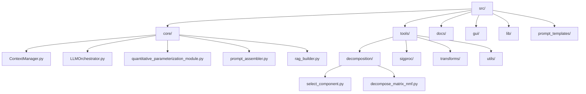
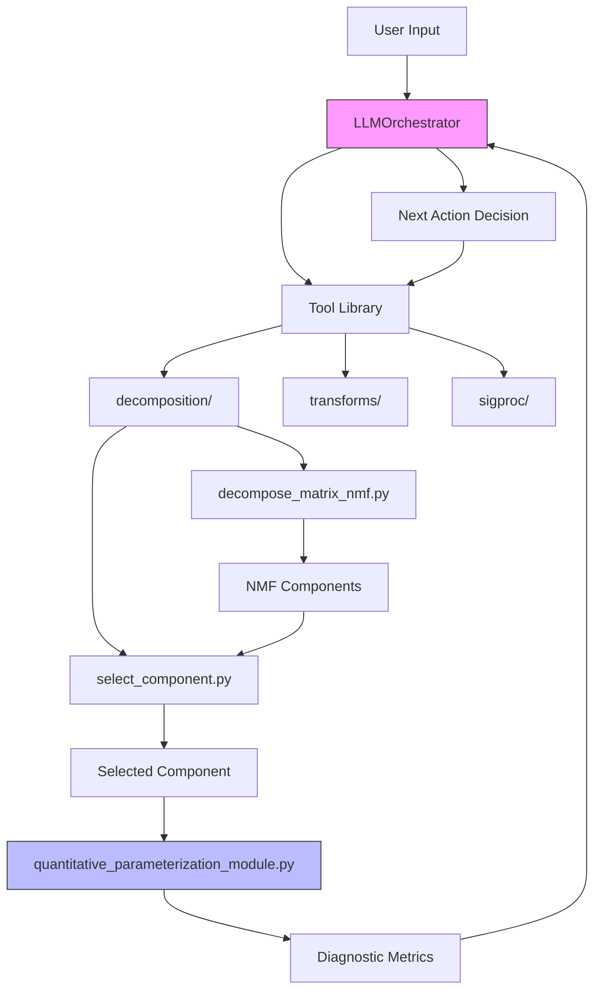
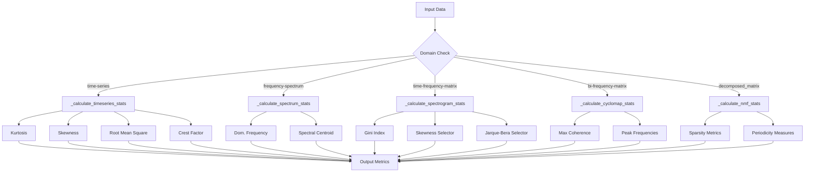
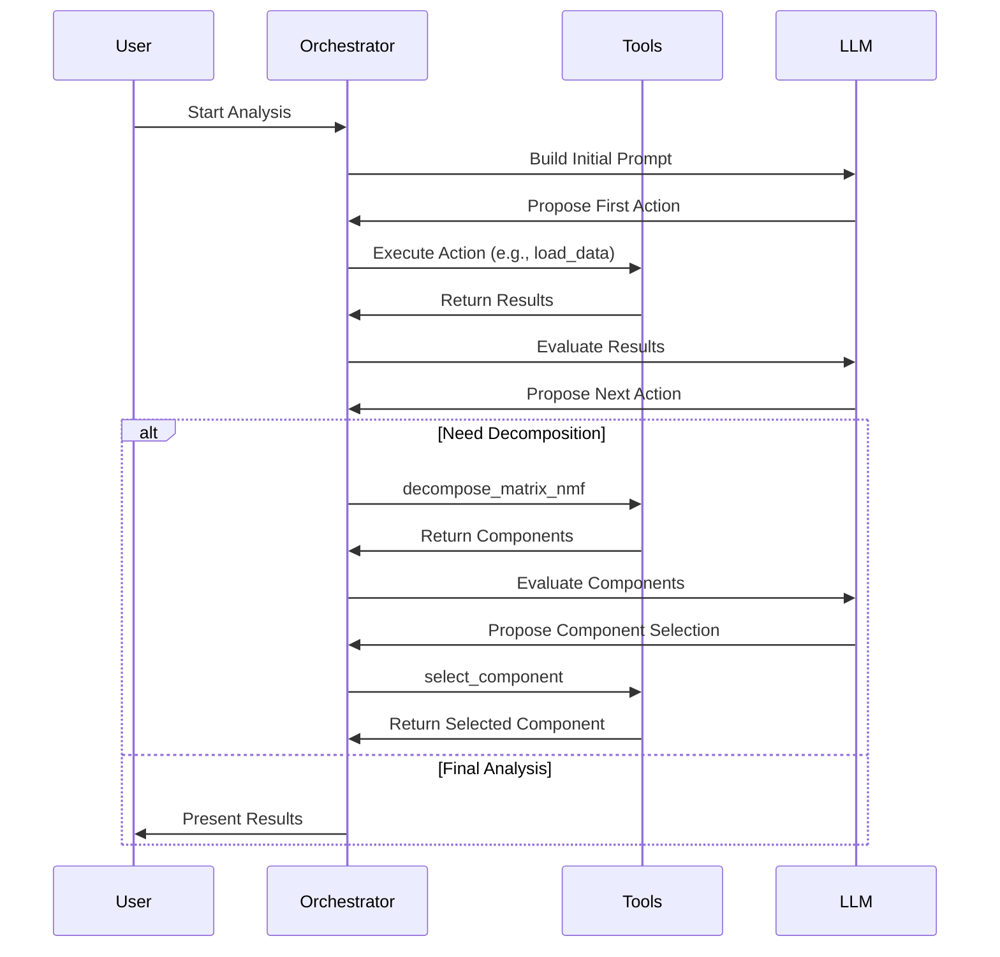
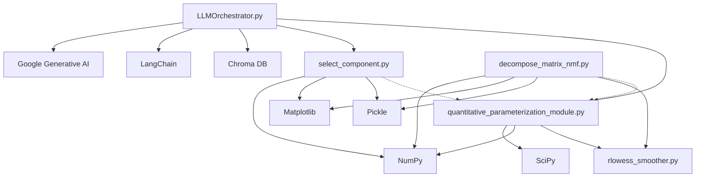

# Component Selection

<cite>
**Referenced Files in This Document**   
- [select_component.py](file://src/tools/decomposition/select_component.py#L1-L113)
- [quantitative_parameterization_module.py](file://src/core/quantitative_parameterization_module.py#L1-L1075)
- [LLMOrchestrator.py](file://src/core/LLMOrchestrator.py#L1-L725)
- [decompose_matrix_nmf.py](file://src/tools/decomposition/decompose_matrix_nmf.py#L1-L195)
</cite>

## Table of Contents
1. [Introduction](#introduction)
2. [Project Structure](#project-structure)
3. [Core Components](#core-components)
4. [Architecture Overview](#architecture-overview)
5. [Detailed Component Analysis](#detailed-component-analysis)
6. [Dependency Analysis](#dependency-analysis)
7. [Performance Considerations](#performance-considerations)
8. [Troubleshooting Guide](#troubleshooting-guide)
9. [Conclusion](#conclusion)

## Introduction
This document provides comprehensive documentation for the component selection module within the LLM-based signal analysis system. The module is responsible for selecting specific components derived from non-negative matrix factorization (NMF) based on diagnostic relevance. It interfaces with quantitative parameterization and orchestration components to enable autonomous fault diagnosis in mechanical systems. The system leverages an LLM orchestrator to autonomously decide which signal processing tools to apply and which components to select for further analysis.

## Project Structure
The project follows a modular architecture with distinct directories for core logic, tools, GUI components, and documentation. The component selection functionality resides in the decomposition tools module, while higher-level orchestration and decision-making are handled by the core modules.



**Diagram sources**
- [select_component.py](file://src/tools/decomposition/select_component.py#L1-L113)
- [decompose_matrix_nmf.py](file://src/tools/decomposition/decompose_matrix_nmf.py#L1-L195)

**Section sources**
- [select_component.py](file://src/tools/decomposition/select_component.py#L1-L113)
- [decompose_matrix_nmf.py](file://src/tools/decomposition/decompose_matrix_nmf.py#L1-L195)

## Core Components
The core components of the system include the LLM orchestrator, which manages the analysis workflow, the quantitative parameterization module that computes diagnostic metrics, and the component selection tool that extracts specific NMF components. These components work together to enable autonomous signal analysis and fault detection.

**Section sources**
- [LLMOrchestrator.py](file://src/core/LLMOrchestrator.py#L1-L725)
- [quantitative_parameterization_module.py](file://src/core/quantitative_parameterization_module.py#L1-L1075)

## Architecture Overview
The system architecture follows a pipeline-based approach where the LLM orchestrator sequentially applies signal processing tools, evaluates results, and decides on subsequent actions. The component selection module is a key part of this pipeline, allowing the system to focus on specific components identified as potentially diagnostic.



**Diagram sources**
- [LLMOrchestrator.py](file://src/core/LLMOrchestrator.py#L1-L725)
- [select_component.py](file://src/tools/decomposition/select_component.py#L1-L113)
- [quantitative_parameterization_module.py](file://src/core/quantitative_parameterization_module.py#L1-L1075)

## Detailed Component Analysis

### Component Selection Module Analysis
The component selection module provides functionality to extract specific components from NMF-decomposed signals. It serves as a bridge between decomposition and further analysis, enabling focused examination of individual components.

#### Function Implementation
```python
def select_component(
    data: Dict[str, Any],
    output_image_path: str,
    component_index: int,
    **kwargs
) -> Dict[str, Any]:
    """
    Select and extract a specific component from a set of reconstructed signals.
    
    Parameters
    ----------
    data : Dict[str, Any]
        Dictionary containing:
        - 'new_params': Dict[str, Any] with 'signals_reconstructed' key
        - 'sampling_rate': float, signal sampling rate in Hz
    output_image_path : str
        Path to save visualization of selected component
    component_index : int
        Zero-based index of component to select
    **kwargs
        Additional keyword arguments for future extensions

    Returns
    -------
    Dict[str, Any]
        Dictionary with selected component data and metadata
    """
```

**Section sources**
- [select_component.py](file://src/tools/decomposition/select_component.py#L1-L113)

### Quantitative Parameterization Module
The quantitative parameterization module computes diagnostic metrics from signal representations, providing the LLM with quantitative information to guide component selection.

#### Metric Calculation Flow


**Diagram sources**
- [quantitative_parameterization_module.py](file://src/core/quantitative_parameterization_module.py#L1-L1075)

**Section sources**
- [quantitative_parameterization_module.py](file://src/core/quantitative_parameterization_module.py#L1-L1075)

### LLM Orchestrator Integration
The LLM orchestrator manages the end-to-end analysis pipeline, deciding when to decompose signals and which components to select based on diagnostic relevance.

#### Action Selection Sequence


**Diagram sources**
- [LLMOrchestrator.py](file://src/core/LLMOrchestrator.py#L1-L725)

**Section sources**
- [LLMOrchestrator.py](file://src/core/LLMOrchestrator.py#L1-L725)

## Dependency Analysis
The component selection module depends on several other components within the system, forming a complex interdependent network that enables autonomous signal analysis.



**Diagram sources**
- [select_component.py](file://src/tools/decomposition/select_component.py#L1-L113)
- [quantitative_parameterization_module.py](file://src/core/quantitative_parameterization_module.py#L1-L1075)
- [LLMOrchestrator.py](file://src/core/LLMOrchestrator.py#L1-L725)
- [decompose_matrix_nmf.py](file://src/tools/decomposition/decompose_matrix_nmf.py#L1-L195)

## Performance Considerations
The component selection process is computationally lightweight compared to the NMF decomposition itself. The selection operation involves simple array indexing and basic plotting, making it efficient for real-time analysis. However, the overall performance of the autonomous analysis pipeline depends on the LLM response time and the computational cost of preceding decomposition steps.

The system employs several optimization strategies:
- Caching of intermediate results using pickle serialization
- Efficient memory management through NumPy arrays
- Asynchronous execution of pipeline steps
- Pre-computed vector stores for rapid retrieval of tool documentation

## Troubleshooting Guide
Common issues and their solutions when using the component selection module:

**Section sources**
- [select_component.py](file://src/tools/decomposition/select_component.py#L1-L113)
- [LLMOrchestrator.py](file://src/core/LLMOrchestrator.py#L1-L725)

### Component Index Out of Bounds
**Issue**: IndexError when selecting a component index that exceeds available components
**Solution**: Verify the number of components from the NMF decomposition before selection. Use the quantitative parameterization module to inspect the decomposition results first.

### Missing Input Data
**Issue**: KeyError when required data keys are missing from input dictionary
**Solution**: Ensure the input dictionary contains 'new_params' with 'signals_reconstructed' and 'sampling_rate' keys. Validate the output of the preceding decomposition step.

### LLM Not Selecting Components
**Issue**: The LLM orchestrator fails to propose component selection after decomposition
**Solution**: Check the evaluation criteria in the LLM prompt. Ensure the quantitative metrics are being computed and available for the LLM to assess component relevance.

### Visualization Issues
**Issue**: Component visualization not saving correctly
**Solution**: Verify the output directory exists and is writable. Check file paths for invalid characters. Ensure matplotlib is properly configured.

## Conclusion
The component selection module plays a crucial role in the autonomous signal analysis system by enabling focused examination of specific components identified through NMF decomposition. Integrated with quantitative parameterization and LLM-based decision making, it forms part of a sophisticated pipeline for fault diagnosis in mechanical systems. The modular design allows for easy extension and adaptation to different signal processing workflows and diagnostic requirements.