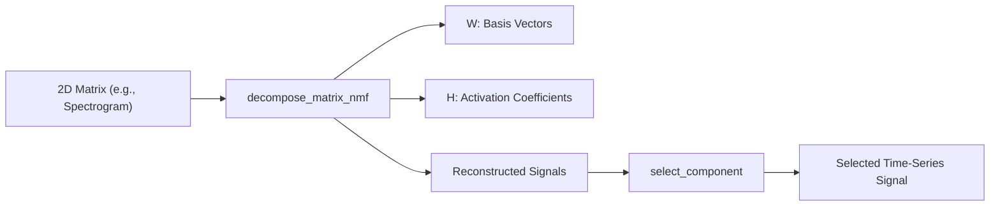
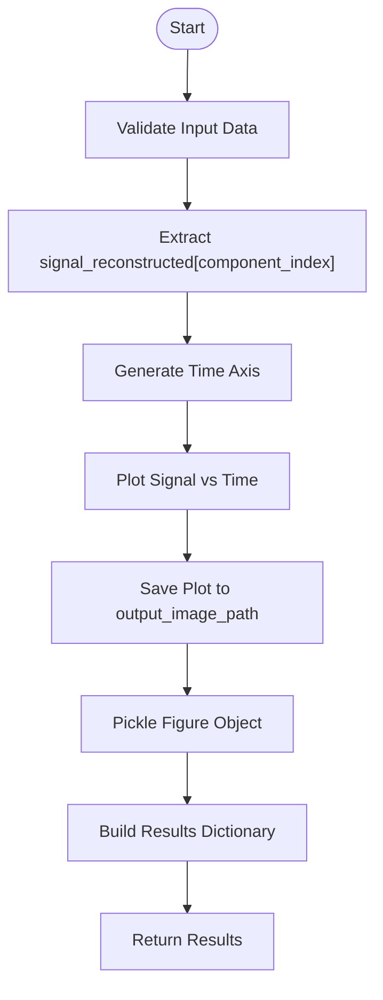
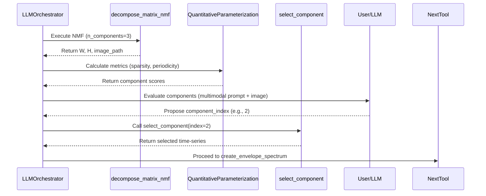

# Decomposition Tools

<cite>
**Referenced Files in This Document**   
- [decompose_matrix_nmf.py](file://src/tools/decomposition/decompose_matrix_nmf.py#L1-L195)
- [decompose_matrix_nmf.md](file://src/tools/decomposition/decompose_matrix_nmf.md#L1-L76)
- [select_component.py](file://src/tools/decomposition/select_component.py#L1-L113)
- [select_component.md](file://src/tools/decomposition/select_component.md#L1-L61)
- [LLMOrchestrator.py](file://src/core/LLMOrchestrator.py#L1-L570)
</cite>

## Table of Contents
1. [Introduction](#introduction)  
2. [Core Tools Overview](#core-tools-overview)  
3. [Non-negative Matrix Factorization (NMF)](#non-negative-matrix-factorization-nmf)  
4. [Component Selection Process](#component-selection-process)  
5. [Integration with Autonomous Pipeline](#integration-with-autonomous-pipeline)  
6. [Usage Patterns and Examples](#usage-patterns-and-examples)  
7. [Common Challenges and Tuning Recommendations](#common-challenges-and-tuning-recommendations)  
8. [Conclusion](#conclusion)

## Introduction

This document provides comprehensive documentation for two core signal decomposition tools: `decompose_matrix_nmf` and `select_component`. These tools are designed to enable interpretable source separation in vibration and acoustic signal analysis by decomposing complex 2D representations (e.g., spectrograms, CSC maps) into additive components. The process supports fault diagnosis in mechanical systems by isolating distinct operational or fault-related sources.

The `decompose_matrix_nmf` tool performs Non-negative Matrix Factorization (NMF), factorizing a non-negative input matrix into basis vectors and activation coefficients. The `select_component` tool then enables selection of a specific component for downstream analysis. Together, they form a critical stage in an autonomous diagnostic pipeline orchestrated by the `LLMOrchestrator`.

**Section sources**
- [decompose_matrix_nmf.py](file://src/tools/decomposition/decompose_matrix_nmf.py#L1-L195)
- [select_component.py](file://src/tools/decomposition/select_component.py#L1-L113)

## Core Tools Overview

The decomposition module consists of two primary tools:

1. **`decompose_matrix_nmf`**: Performs NMF on a 2D non-negative matrix to extract interpretable components.
2. **`select_component`**: Selects a single time-series component from a list of reconstructed signals.

These tools are used sequentially: first decomposing a complex signal representation, then selecting one of the resulting components for focused analysis.



**Diagram sources**
- [decompose_matrix_nmf.py](file://src/tools/decomposition/decompose_matrix_nmf.py#L1-L195)
- [select_component.py](file://src/tools/decomposition/select_component.py#L1-L113)

## Non-negative Matrix Factorization (NMF)

### Purpose and Functionality

The `decompose_matrix_nmf` function applies Non-negative Matrix Factorization to decompose a non-negative 2D matrix $ V $ into two non-negative matrices:
- $ W $: Basis vectors (shape: `n_features × n_components`)
- $ H $: Activation coefficients (shape: `n_components × n_samples`)

Such that $ V \approx WH $, enabling parts-based representation of data.

This is particularly effective for time-frequency representations like spectrograms or CSC (Cyclic Spectral Coherence) maps, where different physical sources contribute additively to the overall signal.

### Input and Output Structure

**Input:**
- `data`: Dictionary containing:
  - `primary_data`: Key name for the 2D matrix (e.g., `'magnitude'`, `'csc_map'`)
  - `secondary_data`: Horizontal axis labels (e.g., time)
  - `tertiary_data`: Vertical axis labels (e.g., frequency)
  - Optional metadata: `sampling_rate`, `nperseg`, `noverlap`, `original_phase`, `original_signal_data`

**Output:**
- `W_basis_vectors`: Extracted spectral profiles ("what" is happening)
- `H_activations`: Temporal activation patterns ("when" it is happening)
- `image_path`: Path to visualization of components
- Metadata passthrough: sampling rate, phase, domain, etc.

### Algorithm Implementation

The implementation uses the **multiplicative update algorithm** by Lee and Seung, which iteratively updates $ W $ and $ H $:

$$
H \leftarrow H \cdot \frac{W^T V}{W^T W H + \epsilon}
$$
$$
W \leftarrow W \cdot \frac{V H^T}{W H H^T + \epsilon}
$$

Normalization is applied after each iteration to stabilize learning:
- $ H $ is normalized by column norms
- $ W $ is scaled accordingly to preserve $ WH $

A power transform $ V^{1/4} $ and max-normalization are applied to the input matrix to improve convergence and component separation.

### Parameters

| Name | Type | Description | Default |
| :---- | :---- | :---- | :---- |
| `data` | dict | Input dictionary with matrix and metadata | Required |
| `output_image_path` | str | Path to save component visualization | Required |
| `n_components` | int | Number of components to extract | 3 |
| `max_iter` | int | Maximum number of iterations | 150 |

### Visualization

The function generates a subplot for each component:
- Left: Basis vector $ W_i $ (e.g., frequency profile)
- Right: Activation vector $ H_i $ (e.g., temporal envelope)

A red LOESS-smoothed curve is overlaid on each basis vector using `rlowess2` for trend visualization.

**Section sources**
- [decompose_matrix_nmf.py](file://src/tools/decomposition/decompose_matrix_nmf.py#L1-L195)
- [decompose_matrix_nmf.md](file://src/tools/decomposition/decompose_matrix_nmf.md#L1-L76)

## Component Selection Process

### Purpose and Functionality

The `select_component` function selects a single time-series signal from a list of reconstructed components based on a given index. It acts as a bridge between decomposition and final diagnostic analysis.

It is typically used after a quantitative parameterization module evaluates all components and determines which one is most relevant (e.g., highest sparsity, clearest periodicity, strongest diagnostic indicator).

### Input and Output Structure

**Input:**
- `data`: Dictionary containing:
  - `new_params.signals_reconstructed`: List of 1D NumPy arrays (reconstructed time-series signals)
  - `sampling_rate`: Sampling frequency in Hz
- `output_image_path`: Path to save the plot of the selected signal
- `component_index`: Zero-based index of the component to select

**Output:**
- `signal_data`: Selected 1D time-series signal
- `sampling_rate`: Signal sampling rate
- `domain`: Set to `'time-series'`
- `image_path`: Path to saved plot
- `component_index`: Index of selected component

### Algorithm Implementation

The function:
1. Retrieves the signal at `component_index` from `signals_reconstructed`
2. Generates a time axis using `np.arange(len(signal)) / sampling_rate`
3. Plots the signal with grid and axis labels
4. Saves the plot and pickles the figure for later reuse
5. Returns structured output dictionary

### Error Handling

The function raises:
- `KeyError` if required keys are missing
- `IndexError` if `component_index` is out of bounds
- Custom `ComponentSelectionError` for internal issues



**Diagram sources**
- [select_component.py](file://src/tools/decomposition/select_component.py#L1-L113)

**Section sources**
- [select_component.py](file://src/tools/decomposition/select_component.py#L1-L113)
- [select_component.md](file://src/tools/decomposition/select_component.md#L1-L61)

## Integration with Autonomous Pipeline

### Role of LLMOrchestrator

The `LLMOrchestrator` class coordinates the entire analysis pipeline, including decomposition and component selection. It:
- Builds prompts using `PromptAssembler`
- Manages context via `ContextManager`
- Executes tool calls
- Evaluates results
- Proposes next actions

After `decompose_matrix_nmf` is executed, the `LLMOrchestrator` uses multimodal evaluation (including visual plots) to assess component quality.

### Evaluation and Decision Workflow



**Diagram sources**
- [LLMOrchestrator.py](file://src/core/LLMOrchestrator.py#L1-L570)
- [decompose_matrix_nmf.py](file://src/tools/decomposition/decompose_matrix_nmf.py#L1-L195)
- [select_component.py](file://src/tools/decomposition/select_component.py#L1-L113)

### Context Propagation

The `LLMOrchestrator` maintains state across steps:
- `metaknowledge`: High-level data understanding
- `pipeline_steps`: History of executed actions
- `result_history`: Outputs of previous tools
- `variable_registry`: Data variable states

This enables informed decisions about which component to select based on both quantitative metrics and learned diagnostic patterns.

**Section sources**
- [LLMOrchestrator.py](file://src/core/LLMOrchestrator.py#L1-L570)

## Usage Patterns and Examples

### Example 1: Spectrogram Decomposition

```python
# Input data structure
spectrogram_data = {
    'primary_data': 'magnitude',
    'secondary_data': 'time_axis',
    'tertiary_data': 'freq_axis',
    'magnitude': spectrogram_matrix,
    'time_axis': time_vector,
    'freq_axis': freq_vector,
    'sampling_rate': 50000,
    'nperseg': 1024,
    'noverlap': 512
}

# Decompose into 4 components
nmf_result = decompose_matrix_nmf(
    data=spectrogram_data,
    output_image_path="./outputs/nmf_components.png",
    n_components=4,
    max_iter=200
)

# Later, select component 2
selected = select_component(
    data={
        'new_params': {'signals_reconstructed': all_reconstructed_signals},
        'sampling_rate': 50000
    },
    output_image_path="./outputs/selected_component.png",
    component_index=2
)
```

### Example 2: Autonomous Pipeline Action

```json
{
  "tool_name": "decompose_matrix_nmf",
  "params": {
    "data": "spectrogram_results",
    "output_image_path": "./outputs/nmf.png",
    "n_components": 3
  },
  "output_variable": "nmf_output"
}
```

Followed by:
```json
{
  "tool_name": "select_component",
  "params": {
    "data": "reconstruction_bundle",
    "output_image_path": "./outputs/final_signal.png",
    "component_index": 1
  },
  "output_variable": "diagnostic_signal"
}
```

**Section sources**
- [decompose_matrix_nmf.md](file://src/tools/decomposition/decompose_matrix_nmf.md#L1-L76)
- [select_component.md](file://src/tools/decomposition/select_component.md#L1-L61)

## Common Challenges and Tuning Recommendations

### Over-Decomposition

**Problem:** Setting `n_components` too high leads to fragmented components, where one physical source is split across multiple factors.

**Solution:** Start with 2–4 components. Use domain knowledge and quantitative metrics (sparsity, kurtosis) to guide selection.

### Basis Ambiguity

**Problem:** NMF solutions are not unique; different initializations can yield different $ W $ and $ H $.

**Solution:** 
- Use consistent random seeds for reproducibility
- Apply post-processing (e.g., sorting by dominant frequency)
- Validate components against known fault signatures

### Computational Load

**Problem:** High `max_iter` or large matrices increase computation time.

**Recommendations:**
- Use `max_iter=100–200` as default
- Downsample large matrices if resolution allows
- Pre-normalize input data to speed up convergence

### Poor Component Separation

**Causes and Fixes:**
- **Cause:** Input matrix not sufficiently non-negative or additive  
  **Fix:** Apply power transform (e.g., $ V^{1/4} $) — already implemented
- **Cause:** Components too similar in frequency/time  
  **Fix:** Use CSC maps instead of spectrograms for better modulation separation
- **Cause:** Noise dominance  
  **Fix:** Apply pre-filtering (e.g., bandpass) before decomposition

### Best Practices

1. **Always visualize** the decomposition output before selection.
2. **Use `select_component` immediately** after reconstruction to isolate the signal.
3. **Chain with `create_envelope_spectrum`** on the selected component for fault frequency identification.
4. **Leverage LLMOrchestrator’s evaluation** to automate component selection based on diagnostic relevance.

**Section sources**
- [decompose_matrix_nmf.py](file://src/tools/decomposition/decompose_matrix_nmf.py#L1-L195)
- [select_component.py](file://src/tools/decomposition/select_component.py#L1-L113)

## Conclusion

The `decompose_matrix_nmf` and `select_component` tools provide a robust framework for interpretable signal decomposition in machine condition monitoring. By factorizing complex 2D representations into additive components, they enable isolation of distinct fault sources or operational modes. When integrated into an autonomous pipeline via the `LLMOrchestrator`, these tools support intelligent, context-aware decision-making for diagnostic analysis.

Key strengths include:
- Interpretable basis and activation matrices
- Seamless integration with time-series analysis tools
- Support for automated component selection
- Visual feedback at every stage

Future enhancements could include probabilistic NMF, sparse regularization, or integration with deep learning-based source separation methods.