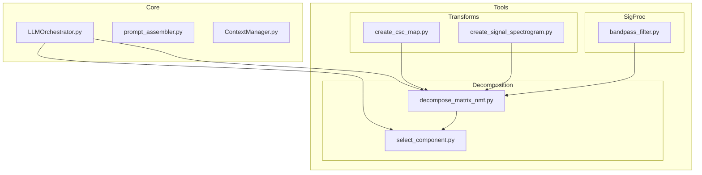
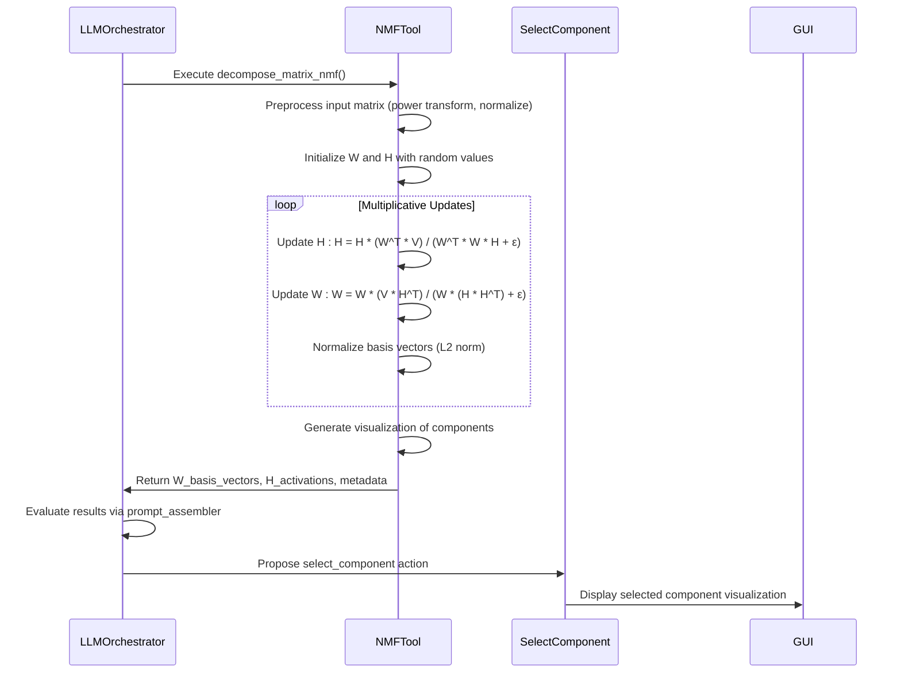
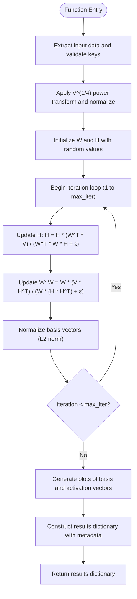
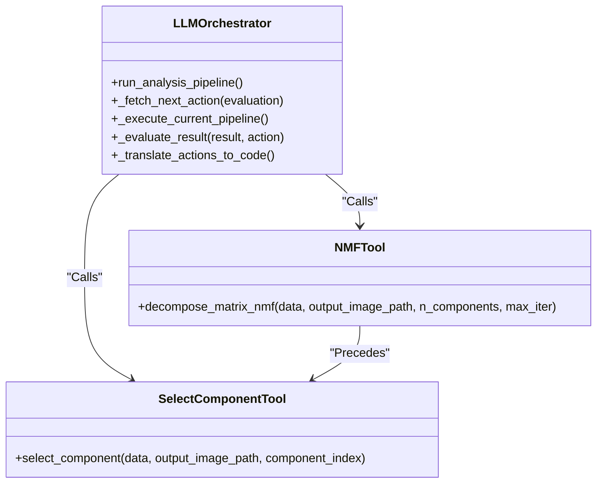
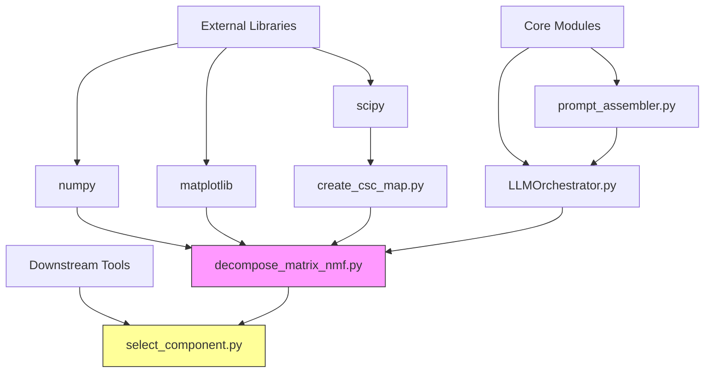

# NMF Decomposition

<cite>
**Referenced Files in This Document**   
- [decompose_matrix_nmf.py](file://src/tools/decomposition/decompose_matrix_nmf.py)
- [decompose_matrix_nmf.md](file://src/tools/decomposition/decompose_matrix_nmf.md)
- [select_component.py](file://src/tools/decomposition/select_component.py)
- [select_component.md](file://src/tools/decomposition/select_component.md)
- [LLMOrchestrator.py](file://src/core/LLMOrchestrator.py)
- [prompt_assembler.py](file://src/core/prompt_assembler.py)
</cite>

## Table of Contents
1. [Introduction](#introduction)
2. [Project Structure](#project-structure)
3. [Core Components](#core-components)
4. [Architecture Overview](#architecture-overview)
5. [Detailed Component Analysis](#detailed-component-analysis)
6. [Dependency Analysis](#dependency-analysis)
7. [Performance Considerations](#performance-considerations)
8. [Troubleshooting Guide](#troubleshooting-guide)
9. [Conclusion](#conclusion)

## Introduction
This document provides comprehensive documentation for the Non-negative Matrix Factorization (NMF) decomposition tool used in vibration signal analysis. The `decompose_matrix_nmf` function is designed to factorize non-negative 2D matrices such as spectrograms or Cyclic Spectral Coherence (CSC) maps into additive basis vectors and their corresponding activations. This enables the isolation of fault-related components from complex composite signals in industrial machinery diagnostics. The implementation follows the multiplicative update algorithm by Lee and Seung and integrates seamlessly with downstream tools like `select_component` for component selection and further analysis.

## Project Structure
The NMF decomposition functionality resides within the `src/tools/decomposition/` directory of the project. This modular organization separates signal processing tools by functional category, with decomposition tools handling source separation tasks. The core implementation is in `decompose_matrix_nmf.py`, accompanied by a markdown specification file that documents usage patterns and strategic advice. The tool integrates with the broader analysis pipeline orchestrated by `LLMOrchestrator`, which manages the sequence of processing steps from data loading to final diagnosis.

**Diagram sources**
- [decompose_matrix_nmf.py](file://src/tools/decomposition/decompose_matrix_nmf.py)
- [select_component.py](file://src/tools/decomposition/select_component.py)
- [LLMOrchestrator.py](file://src/core/LLMOrchestrator.py)

**Section sources**
- [decompose_matrix_nmf.py](file://src/tools/decomposition/decompose_matrix_nmf.py#L1-L195)
- [decompose_matrix_nmf.md](file://src/tools/decomposition/decompose_matrix_nmf.md#L1-L76)

## Core Components
The core functionality of the NMF decomposition tool centers around the `decompose_matrix_nmf` function, which implements the mathematical foundation of Non-negative Matrix Factorization. This function takes a non-negative 2D matrix V and factorizes it into two non-negative matrices W (basis vectors) and H (activations) such that V ≈ WH. The implementation applies preprocessing steps including a power transform (V^(1/4)) and normalization to improve decomposition quality. The algorithm uses random initialization followed by multiplicative updates with L2 normalization of basis vectors at each iteration.

The tool produces visualizations of both basis vectors and activation patterns, saving them to the specified output path. It also preserves metadata from the input such as sampling rate, phase information, and domain context, enabling proper reconstruction and interpretation in downstream processing steps. The output structure is designed to integrate with the `select_component` tool, which requires the basis and activation matrices for component selection and time-domain reconstruction.

**Section sources**
- [decompose_matrix_nmf.py](file://src/tools/decomposition/decompose_matrix_nmf.py#L1-L195)
- [decompose_matrix_nmf.md](file://src/tools/decomposition/decompose_matrix_nmf.md#L1-L76)

## Architecture Overview
The NMF decomposition tool operates within an autonomous analysis pipeline orchestrated by the `LLMOrchestrator`. This architecture enables automated, context-aware signal processing where the LLM agent determines when to apply NMF based on the characteristics of intermediate results. The tool receives pre-processed 2D matrices from upstream transforms (such as spectrograms or CSC maps) and outputs decomposed components that are then evaluated for diagnostic relevance.

**Diagram sources**
- [decompose_matrix_nmf.py](file://src/tools/decomposition/decompose_matrix_nmf.py#L1-L195)
- [LLMOrchestrator.py](file://src/core/LLMOrchestrator.py#L1-L725)
- [prompt_assembler.py](file://src/core/prompt_assembler.py#L1-L178)

## Detailed Component Analysis

### decompose_matrix_nmf Function Analysis
The `decompose_matrix_nmf` function implements Non-negative Matrix Factorization using the multiplicative update algorithm. It begins by extracting the primary 2D matrix from the input dictionary using the `primary_data` key, then applies a power transform (V^(1/4)) and normalization to enhance decomposition performance. The algorithm initializes random basis (W) and activation (H) matrices, then iteratively updates them using element-wise multiplication and division operations that guarantee non-negativity.

**Diagram sources**
- [decompose_matrix_nmf.py](file://src/tools/decomposition/decompose_matrix_nmf.py#L1-L195)

**Section sources**
- [decompose_matrix_nmf.py](file://src/tools/decomposition/decompose_matrix_nmf.py#L1-L195)

### Integration with LLMOrchestrator
The NMF decomposition tool is integrated into the autonomous analysis pipeline through the `LLMOrchestrator`, which manages the sequence of processing steps. When the orchestrator determines that signal decomposition is appropriate based on the current analysis state, it generates an action dictionary specifying the `decompose_matrix_nmf` tool and its parameters. The orchestrator handles data flow between tools, ensuring that the output of one step becomes the input to the next.

**Diagram sources**
- [LLMOrchestrator.py](file://src/core/LLMOrchestrator.py#L1-L725)
- [decompose_matrix_nmf.py](file://src/tools/decomposition/decompose_matrix_nmf.py#L1-L195)
- [select_component.py](file://src/tools/decomposition/select_component.py#L1-L113)

**Section sources**
- [LLMOrchestrator.py](file://src/core/LLMOrchestrator.py#L1-L725)
- [prompt_assembler.py](file://src/core/prompt_assembler.py#L1-L178)

## Dependency Analysis
The NMF decomposition tool has dependencies on several core components within the analysis framework. It relies on `numpy` for matrix operations and `matplotlib` for visualization, with additional use of `rlowess2` from the `src.lib.rlowess_smoother` module for smoothing basis vector plots. The tool is designed to receive input from various transform tools that generate 2D matrices, such as `create_signal_spectrogram` and `create_csc_map`.

**Diagram sources**
- [decompose_matrix_nmf.py](file://src/tools/decomposition/decompose_matrix_nmf.py#L1-L195)
- [LLMOrchestrator.py](file://src/core/LLMOrchestrator.py#L1-L725)
- [select_component.py](file://src/tools/decomposition/select_component.py#L1-L113)

**Section sources**
- [decompose_matrix_nmf.py](file://src/tools/decomposition/decompose_matrix_nmf.py#L1-L195)
- [LLMOrchestrator.py](file://src/core/LLMOrchestrator.py#L1-L725)

## Performance Considerations
The NMF decomposition algorithm has O(n_features × n_samples × n_components) space complexity and O(n_features × n_samples × n_components × max_iter) time complexity. For large datasets, performance can be optimized by adjusting the `max_iter` parameter and carefully selecting the number of components. The current implementation uses 150 iterations as a default, which provides a balance between convergence and computation time.

Memory usage is primarily determined by the size of the input matrix and the three matrices (V, W, H) stored during computation. For very large matrices, consider preprocessing to reduce dimensionality before decomposition. The algorithm's convergence is not guaranteed due to the non-convex nature of NMF, so results may vary between runs due to random initialization.

To improve performance on large datasets:
- Reduce `n_components` to the minimum necessary for fault isolation
- Decrease `max_iter` if preliminary results show convergence
- Apply data reduction techniques (e.g., downsampling) before decomposition
- Use power-of-two dimensions for better FFT performance in upstream transforms

**Section sources**
- [decompose_matrix_nmf.py](file://src/tools/decomposition/decompose_matrix_nmf.py#L1-L195)

## Troubleshooting Guide
Common issues with the NMF decomposition tool include failure to converge, poor component separation, and incorrect data formatting. The function includes input validation that prints warnings when required keys are missing from the input dictionary. Ensure that the input matrix is non-negative, as negative values can lead to unstable decomposition.

Initialization sensitivity is a known limitation of NMF. If results appear inconsistent across runs, try:
- Increasing `max_iter` to allow more time for convergence
- Experimenting with different `n_components` values
- Preprocessing the input with additional normalization
- Using domain knowledge to guide component selection

When integrating with the `select_component` tool, ensure that the output structure from `decompose_matrix_nmf` matches the expected input format. The `primary_data` and `secondary_data` fields are automatically set to 'H_activations' and 'W_basis_vectors' respectively, which should be preserved when passing data between tools.

**Section sources**
- [decompose_matrix_nmf.py](file://src/tools/decomposition/decompose_matrix_nmf.py#L1-L195)
- [select_component.py](file://src/tools/decomposition/select_component.py#L1-L113)

## Conclusion
The NMF decomposition tool provides a powerful method for isolating fault-related components from complex vibration signals through non-negative matrix factorization. Its integration within the autonomous analysis pipeline enables automated source separation that enhances diagnostic accuracy in industrial machinery monitoring. By decomposing 2D representations like spectrograms or CSC maps into additive components, the tool reveals hidden patterns that correspond to specific mechanical faults.

The implementation follows best practices for NMF with appropriate preprocessing, random initialization, and multiplicative updates. When combined with the `select_component` tool and envelope spectrum analysis, it forms a complete workflow for fault isolation and diagnosis. Future improvements could include alternative initialization methods (e.g., NNDSVD), convergence criteria based on reconstruction error, and support for sparse NMF variants to enhance parts-based representation.