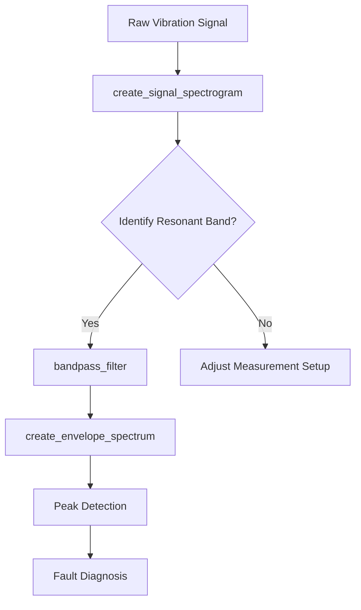

# Bandpass Filter

<cite>
**Referenced Files in This Document**   
- [bandpass_filter.py](file://src/tools/sigproc/bandpass_filter.py#L1-L245)
- [bandpass_filter.md](file://src/tools/sigproc/bandpass_filter.md#L1-L65)
- [create_envelope_spectrum.py](file://src/tools/transforms/create_envelope_spectrum.py#L1-L274)
- [create_envelope_spectrum.md](file://src/tools/transforms/create_envelope_spectrum.md#L1-L58)
</cite>

## Table of Contents
1. [Introduction](#introduction)
2. [Function Signature and Parameters](#function-signature-and-parameters)
3. [Internal Implementation](#internal-implementation)
4. [Zero-Phase Filtering with filtfilt](#zero-phase-filtering-with-filtfilt)
5. [Code Example and Usage in Analysis Pipelines](#code-example-and-usage-in-analysis-pipelines)
6. [Best Practices and Configuration Guidance](#best-practices-and-configuration-guidance)
7. [Common Issues and Mitigation Strategies](#common-issues-and-mitigation-strategies)
8. [Performance Considerations](#performance-considerations)
9. [Integration with Diagnostic Workflows](#integration-with-diagnostic-workflows)

## Introduction
The **bandpass_filter** tool is a critical component in vibration signal analysis for industrial machinery diagnostics. It isolates a specific frequency band from a time-domain signal by attenuating frequencies outside the defined range. This capability is essential for detecting early-stage bearing faults, gear mesh anomalies, and other mechanical defects that manifest as periodic impacts within resonant frequency bands. By focusing on a narrow band of interest, the filter significantly improves the signal-to-noise ratio, enabling more accurate downstream analysis such as envelope spectrum computation.

The implementation uses a zero-phase Butterworth filter design, ensuring that temporal alignment between the original and filtered signals is preserved. This is crucial for maintaining the integrity of transient events like impact pulses, which are key indicators of mechanical faults.

**Section sources**
- [bandpass_filter.md](file://src/tools/sigproc/bandpass_filter.md#L1-L19)
- [bandpass_filter.py](file://src/tools/sigproc/bandpass_filter.py#L1-L20)

## Function Signature and Parameters
The `bandpass_filter` function applies a digital bandpass filter to a time-series signal using a zero-phase Butterworth design.

```python
def bandpass_filter(
    data: Dict[str, Any],
    output_image_path: str,
    lowcut_freq: float = 1000.0,
    highcut_freq: float = 4000.0,
    order: int = 4,
    **kwargs
) -> Dict[str, Any]:
```

### Parameter Descriptions
- **data**: Dict[str, Any]  
  Input dictionary containing:
  - `primary_data`: str – Key name for the 1D signal array (e.g., `'signal'`)
  - `sampling_rate`: float – Sampling frequency in Hz
  - `image_path`: str (optional) – Not currently used; included for API consistency

- **output_image_path**: str  
  Filesystem path where the filtered signal plot will be saved. Parent directories are created if they do not exist.

- **lowcut_freq**: float, optional, default=1000.0  
  Lower cutoff frequency in Hz. Frequencies below this value are attenuated. Must be positive and less than `highcut_freq`.

- **highcut_freq**: float, optional, default=4000.0  
  Upper cutoff frequency in Hz. Frequencies above this value are attenuated. Must be greater than `lowcut_freq` and less than the Nyquist frequency (half the sampling rate).

- **order**: int, optional, default=4  
  Order of the Butterworth filter. Higher orders provide steeper roll-off but may introduce numerical instability.

- **\*\*kwargs**:  
  Reserved for future extensions; currently unused.

### Return Value
- **Dict[str, Any]**: Contains the following keys:
  - `filtered_signal`: NDArray[np.float64] – The filtered time-domain signal.
  - `domain`: str – Set to `'time-series'`.
  - `primary_data`: str – Set to `'filtered_signal'`.
  - `sampling_rate`: float – Original sampling rate.
  - `image_path`: str – Path to the generated visualization.
  - `filter_params`: Dict[str, Any] – Metadata about the filter used:
    - `type`: `'butterworth_bandpass'`
    - `order`: int
    - `lowcut_hz`: float
    - `highcut_hz`: float
    - `normalized_freqs`: List[float] – Normalized cutoff frequencies [low, high]

**Section sources**
- [bandpass_filter.py](file://src/tools/sigproc/bandpass_filter.py#L37-L92)
- [bandpass_filter.md](file://src/tools/sigproc/bandpass_filter.md#L47-L64)

## Internal Implementation
The `bandpass_filter` function implements a digital bandpass filter using the `scipy.signal.butter` and `scipy.signal.filtfilt` functions.

### Filter Design
The Butterworth filter is designed in the normalized frequency domain:
```python
nyquist_freq = 0.5 * sampling_rate
low_norm = lowcut_freq / nyquist_freq
high_norm = highcut_freq / nyquist_freq

b, a = butter(
    N=order,
    Wn=[low_norm, high_norm],
    btype='band',
    analog=False,
    output='ba'
)
```
- `b`, `a`: Numerator and denominator coefficients of the IIR filter.
- Normalization ensures frequencies are scaled relative to the Nyquist frequency (0.5 × sampling rate).
- The `band` type specifies a bandpass filter.

### Input Validation and Clipping
The function includes robust input validation:
- Swaps `lowcut_freq` and `highcut_freq` if improperly ordered.
- Clips `highcut_freq` to 95% of the Nyquist frequency if it exceeds it.
- Sets `lowcut_freq` to a small positive value (e.g., 0.1 Hz) if non-positive.
- Ensures all parameters are within valid ranges to prevent runtime errors.

**Section sources**
- [bandpass_filter.py](file://src/tools/sigproc/bandpass_filter.py#L150-L175)

## Zero-Phase Filtering with filtfilt
To prevent time-domain distortion and preserve the temporal alignment of transient events, the filter uses `scipy.signal.filtfilt`, which applies the filter in both forward and reverse directions.

```python
filtered_signal = filtfilt(
    b,
    a,
    signal_data,
    padlen=3*(max(len(a), len(b)) - 1)
)
```

### Key Advantages
- **Zero Phase Distortion**: Eliminates time shift introduced by causal filtering.
- **Preserves Transient Timing**: Critical for detecting impact timing in bearing fault diagnosis.
- **Improved Signal Fidelity**: Maintains waveform shape without phase warping.

### Padding Strategy
- `padlen` is set to `3*(max(len(a), len(b)) - 1)` to minimize edge effects from transients.
- This padding reduces artifacts at the beginning and end of the filtered signal.

**Section sources**
- [bandpass_filter.py](file://src/tools/sigproc/bandpass_filter.py#L174-L185)

## Code Example and Usage in Analysis Pipelines
The following example demonstrates how to use `bandpass_filter` in a diagnostic workflow:

```python
import numpy as np

# Generate a test signal
fs = 10000  # 10 kHz sampling rate
t = np.linspace(0, 1, fs, endpoint=False)
signal_data = (
    np.sin(2*np.pi*100*t) +           # 100 Hz (background)
    0.5*np.sin(2*np.pi*1000*t) +      # 1 kHz (in-band)
    0.2*np.sin(2*np.pi*5000*t)        # 5 kHz (out-of-band)
)

# Apply bandpass filter (1–3 kHz)
result = bandpass_filter(
    data={
        'primary_data': 'signal',
        'signal': signal_data,
        'sampling_rate': fs
    },
    output_image_path='filtered_signal.png',
    lowcut_freq=1000,
    highcut_freq=3000,
    order=4
)

filtered_signal = result['filtered_signal']
```

### Integration with Envelope Spectrum
A common diagnostic pipeline:
1. Use `create_signal_spectrogram` to identify a resonant frequency band with impact activity.
2. Apply `bandpass_filter` to isolate that band.
3. Compute `create_envelope_spectrum` on the filtered signal to detect fault repetition rates.

```python
# Example pipeline
bandpassed = bandpass_filter(data=raw_data, output_image_path="bandpassed.png", lowcut_freq=2000, highcut_freq=4000)
envelope_result = create_envelope_spectrum(data=bandpassed, output_image_path="envelope.png")
```

**Section sources**
- [bandpass_filter.py](file://src/tools/sigproc/bandpass_filter.py#L120-L152)
- [create_envelope_spectrum.md](file://src/tools/transforms/create_envelope_spectrum.md#L42-L57)

## Best Practices and Configuration Guidance
For optimal results, refer to `bandpass_filter.md` for configuration best practices.

### Frequency Selection
- Choose `lowcut_freq` and `highcut_freq` based on prior spectrogram analysis.
- Target resonant bands where impact energy is concentrated.
- Avoid very narrow bands (<100 Hz width) unless justified by signal characteristics.

### Filter Order
- **Order 4**: Recommended default; balances roll-off steepness and stability.
- **Higher Orders (6–8)**: Use only when adjacent frequency components require strong separation.
- **Avoid Orders >8**: Risk of numerical instability and ringing artifacts.

### Output Visualization
- The function generates a plot of the filtered signal over time.
- Saved in both PNG and pickled figure format for later inspection.
- Visual confirmation helps verify correct filtering behavior.

**Section sources**
- [bandpass_filter.md](file://src/tools/sigproc/bandpass_filter.md#L21-L45)

## Common Issues and Mitigation Strategies
### Filter Roll-Off and Transition Band
- **Issue**: Slow roll-off with low-order filters allows leakage from adjacent bands.
- **Solution**: Increase filter order (e.g., from 2 to 4) or widen the passband.

### Instability at Extreme Cutoff Ratios
- **Issue**: High-order filters with very low `lowcut_freq` or very high `highcut_freq` can become unstable.
- **Solution**: 
  - Ensure `lowcut_freq` > 1 Hz.
  - Keep `highcut_freq` < 0.95 × Nyquist frequency.
  - Use lower orders (2–4) for extreme ratios.

### Edge Effects
- **Issue**: Signal distortion at boundaries due to filtering transients.
- **Solution**: 
  - Use `filtfilt` with appropriate `padlen`.
  - Discard edge regions in post-processing if necessary.

### Numerical Precision
- **Issue**: Coefficient quantization errors in high-order IIR filters.
- **Solution**: Prefer lower orders or consider cascaded second-order sections (not currently implemented).

**Section sources**
- [bandpass_filter.py](file://src/tools/sigproc/bandpass_filter.py#L100-L120)

## Performance Considerations
### Batch Processing
- The function is vectorized and efficient for large signals.
- For batch processing, pre-allocate output paths and process signals sequentially.
- Consider parallel execution for independent signals using multiprocessing.

### Real-Time Applications
- **Not recommended** for real-time use due to:
  - Non-causal nature of `filtfilt` (requires full signal).
  - High latency from bidirectional filtering.
- For real-time systems, use causal filters like `lfilter` with phase compensation.

### Computational Complexity
- **Time Complexity**: O(N × order), where N is signal length.
- **Memory**: Minimal; operates in-place where possible.
- Efficient for signals up to several million samples on modern hardware.

**Section sources**
- [bandpass_filter.py](file://src/tools/sigproc/bandpass_filter.py#L203-L232)

## Integration with Diagnostic Workflows
The `bandpass_filter` is a foundational step in machinery fault diagnosis:



### Key Workflow Steps
1. **Wideband Analysis**: Use spectrogram to locate frequency bands with impulsive activity.
2. **Band Isolation**: Apply `bandpass_filter` to extract the band of interest.
3. **Envelope Detection**: Use `create_envelope_spectrum` to reveal modulation frequencies.
4. **Fault Identification**: Match detected frequencies to known fault signatures (e.g., BPFI, BPFO).

This workflow is standard in predictive maintenance systems for detecting early-stage bearing and gear faults.

**Diagram sources**
- [bandpass_filter.md](file://src/tools/sigproc/bandpass_filter.md#L21-L45)
- [create_envelope_spectrum.md](file://src/tools/transforms/create_envelope_spectrum.md#L1-L58)

**Section sources**
- [bandpass_filter.md](file://src/tools/sigproc/bandpass_filter.md#L21-L45)
- [create_envelope_spectrum.md](file://src/tools/transforms/create_envelope_spectrum.md#L1-L58)