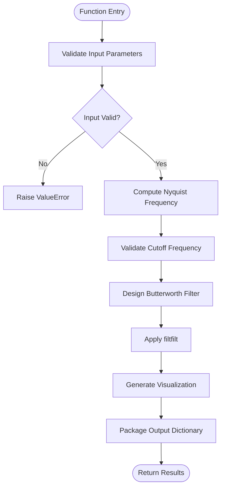
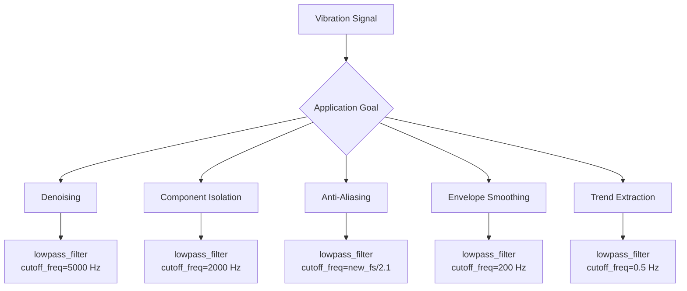

# Lowpass Filter

<cite>
**Referenced Files in This Document**   
- [lowpass_filter.py](file://src/tools/sigproc/lowpass_filter.py)
- [lowpass_filter.md](file://src/tools/sigproc/lowpass_filter.md)
- [LLMOrchestrator.py](file://src/core/LLMOrchestrator.py)
- [create_envelope_spectrum.py](file://src/tools/transforms/create_envelope_spectrum.py)
</cite>

## Table of Contents
1. [Introduction](#introduction)
2. [Function Signature and Parameters](#function-signature-and-parameters)
3. [Implementation Details](#implementation-details)
4. [Zero-Phase Filtering with filtfilt](#zero-phase-filtering-with-filtfilt)
5. [Common Applications in Vibration Analysis](#common-applications-in-vibration-analysis)
6. [Best Practices and Configuration Guidelines](#best-practices-and-configuration-guidelines)
7. [Common Issues and Practical Solutions](#common-issues-and-practical-solutions)
8. [Performance Optimization for Long Signals](#performance-optimization-for-long-signals)
9. [Integration in Signal Processing Pipelines](#integration-in-signal-processing-pipelines)
10. [Example Usage in Codebase](#example-usage-in-codebase)

## Introduction

The **lowpass_filter** tool is a digital signal processing function designed to remove high-frequency noise or aliasing components from time-series vibration data while preserving lower frequency content critical for machine health monitoring. It implements a zero-phase Butterworth low-pass filter using forward-backward filtering to maintain temporal alignment between the original and filtered signals. This ensures that diagnostic features such as impact timing and amplitude modulation remain intact after filtering.

The tool is particularly valuable in industrial condition monitoring systems where high-frequency electrical noise, sensor artifacts, or unwanted mechanical resonances can obscure fault-related signals in bearings, gears, and rotating machinery. By selectively attenuating frequencies above a user-defined cutoff, the filter enhances signal clarity for downstream analysis such as envelope detection, spectral decomposition, and feature extraction.

**Section sources**
- [lowpass_filter.py](file://src/tools/sigproc/lowpass_filter.py#L1-L36)
- [lowpass_filter.md](file://src/tools/sigproc/lowpass_filter.md#L0-L21)

## Function Signature and Parameters

The `lowpass_filter` function accepts the following parameters:

```python
def lowpass_filter(
    data: Dict[str, Any],
    output_image_path: str,
    cutoff_freq: float = 3500,
    order: int = 4
) -> Dict[str, Any]:
```

### Parameter Descriptions

- **data**: `dict`  
  Input dictionary containing signal metadata and array. Must include:
  - `primary_data`: `str` – Key name of the signal array within the dictionary
  - `sampling_rate`: `int` or `float` – Sampling frequency in Hz

- **output_image_path**: `str`  
  Filesystem path where the filtered signal visualization will be saved. The parent directory is created if it does not exist.

- **cutoff_freq**: `float`, optional (default: 3500 Hz)  
  Frequency threshold above which components are attenuated. Must be positive and less than the Nyquist frequency (half the sampling rate).

- **order**: `int`, optional (default: 4)  
  Order of the Butterworth filter. Higher values produce steeper roll-off but may introduce numerical instability or ringing artifacts.

### Return Value

Returns a dictionary with the following structure:

```python
{
    'filtered_signal': np.ndarray,           # Filtered time-domain signal
    'domain': 'time-series',                 # Data domain identifier
    'primary_data': 'filtered_signal',       # Key to main data field
    'sampling_rate': float,                  # Sampling rate in Hz
    'image_path': str,                       # Path to generated plot
    'filter_params': {                       # Configuration used
        'type': 'butterworth_lowpass',
        'order': int,
        'cutoff_hz': float,
        'normalized_cutoff': float
    }
}
```

**Section sources**
- [lowpass_filter.py](file://src/tools/sigproc/lowpass_filter.py#L36-L68)
- [lowpass_filter.md](file://src/tools/sigproc/lowpass_filter.md#L5-L66)

## Implementation Details

The implementation leverages `scipy.signal.butter` for filter design and `scipy.signal.filtfilt` for zero-phase filtering. The process follows these stages:

1. **Input Validation**: Ensures required keys (`primary_data`, `sampling_rate`) are present and valid.
2. **Nyquist Frequency Calculation**: Computes `nyquist_freq = 0.5 * sampling_rate`.
3. **Cutoff Frequency Validation**: Verifies `0 < cutoff_freq < nyquist_freq`.
4. **Frequency Normalization**: Converts `cutoff_freq` to normalized units: `cutoff_norm = cutoff_freq / nyquist_freq`.
5. **Filter Design**: Uses `butter(N=order, Wn=cutoff_norm, btype='low')` to generate filter coefficients.
6. **Signal Filtering**: Applies `filtfilt(b, a, signal_data)` with appropriate padding.
7. **Visualization**: Generates a time-domain plot of the filtered signal.
8. **Result Packaging**: Returns structured output with metadata.



**Diagram sources**
- [lowpass_filter.py](file://src/tools/sigproc/lowpass_filter.py#L69-L106)

**Section sources**
- [lowpass_filter.py](file://src/tools/sigproc/lowpass_filter.py#L69-L106)

## Zero-Phase Filtering with filtfilt

A key feature of this implementation is the use of `scipy.signal.filtfilt`, which applies the filter in both forward and reverse directions. This eliminates phase distortion that would otherwise shift transient events in time—a critical concern in vibration analysis where precise timing of impacts indicates fault severity.

### Advantages of filtfilt:
- **Zero phase delay**: No temporal misalignment between original and filtered signals
- **Improved transient preservation**: Impact timing remains accurate
- **Symmetric impulse response**: Ideal for diagnostic applications

### Padding Strategy:
The function uses `padlen=3*(max(len(a), len(b)) - 1)` to minimize edge effects caused by filter initialization. This padding reduces artifacts at the beginning and end of long recordings.

**Section sources**
- [lowpass_filter.py](file://src/tools/sigproc/lowpass_filter.py#L98-L106)

## Common Applications in Vibration Analysis

The lowpass_filter tool serves multiple strategic purposes in machine health monitoring:

1. **Denoising**: Removes high-frequency electrical noise without affecting fault-related low-frequency modulations.
2. **Component Isolation**: Separates low-frequency mechanical faults from high-frequency structural resonances visible in spectrograms.
3. **Anti-Aliasing Before Downsampling**: Required before reducing sampling rate to prevent frequency folding.
4. **Envelope Smoothing**: Applied post-Hilbert transform to smooth noisy envelope signals before spectral analysis.
5. **Trend Extraction**: With very low cutoff (e.g., <1 Hz), extracts slow-varying baseline trends for detrending.



**Diagram sources**
- [lowpass_filter.md](file://src/tools/sigproc/lowpass_filter.md#L21-L40)

**Section sources**
- [lowpass_filter.md](file://src/tools/sigproc/lowpass_filter.md#L21-L40)

## Best Practices and Configuration Guidelines

Refer to `lowpass_filter.md` for recommended configurations:

- **Default Cutoff**: 3500 Hz balances noise reduction and signal preservation for typical industrial sensors.
- **Filter Order**: Start with order=4; increase only if sharper roll-off is needed, monitoring for ripple.
- **Sampling Rate Compatibility**: Always ensure `cutoff_freq < 0.5 * sampling_rate`.
- **Visual Inspection**: Review output plots to verify expected attenuation and absence of artifacts.

For envelope analysis workflows, apply lowpass_filter after bandpass filtering and Hilbert transformation to smooth the envelope before FFT computation.

**Section sources**
- [lowpass_filter.md](file://src/tools/sigproc/lowpass_filter.md#L5-L66)

## Common Issues and Practical Solutions

### Issue 1: Passband Ripple
Higher-order filters (>6) may exhibit gain variations in the passband.

**Solution**: Use lower orders (4–6) or consider alternative filter types (e.g., Bessel) if phase linearity is acceptable.

### Issue 2: Edge Effects
Transient artifacts at signal boundaries due to filter startup.

**Solution**: The current implementation mitigates this with `padlen` parameter in `filtfilt`. For critical applications, consider trimming edges or using longer recordings.

### Issue 3: Numerical Instability
Very high orders or extreme cutoff ratios can cause coefficient overflow.

**Solution**: Limit order ≤ 8 and avoid cutoff frequencies near 0 or Nyquist.

### Issue 4: Over-Filtering
Excessively low cutoff frequencies may remove fault-related content.

**Solution**: Base cutoff selection on known fault frequencies (e.g., bearing defect frequencies) and validate with domain knowledge.

**Section sources**
- [lowpass_filter.py](file://src/tools/sigproc/lowpass_filter.py#L85-L95)

## Performance Optimization for Long Signals

For processing long-duration vibration data (hours/days), consider:

- **Chunked Processing**: Divide signal into segments, apply filter, then reassemble.
- **Memory Mapping**: Use `numpy.memmap` for large arrays to reduce RAM usage.
- **Parallel Execution**: Process multiple channels or files concurrently.
- **Downsampling First**: If high-frequency content is irrelevant, downsample after anti-aliasing.

While `filtfilt` is computationally more expensive than single-pass filtering, its zero-phase property justifies the cost in diagnostic applications.

**Section sources**
- [lowpass_filter.py](file://src/tools/sigproc/lowpass_filter.py#L98-L106)

## Integration in Signal Processing Pipelines

The lowpass_filter is integrated into automated pipelines via the `LLMOrchestrator`, which generates action dictionaries for execution:

```python
action = {
    "tool_name": "lowpass_filter",
    "params": {
        "input_signal": input_variable,
        "image_path": os.path.join(self.state_dir, f"step_{len(self.pipeline_steps)}_lowpass_filter.png"),
        "cutoff_freq": 1500,
        "order": 4
    },
    "output_variable": f"lp_filter_{len(self.pipeline_steps)}"
}
```

This enables dynamic insertion of filtering steps based on real-time analysis decisions.

**Section sources**
- [LLMOrchestrator.py](file://src/core/LLMOrchestrator.py#L341-L365)

## Example Usage in Codebase

### Basic Denoising Application
```python
denoise_action = {
    "tool_name": "lowpass_filter",
    "params": {
        "data": loaded_data,
        "output_dir": "./outputs/run_xyz/",
        "cutoff_freq": 5000
    },
    "output_variable": "denoised_signal"
}
```

### Preprocessing for Envelope Analysis
In workflows involving `create_envelope_spectrum`, lowpass_filter is often used after bandpass filtering to smooth the envelope:

```python
# After bandpass filtering
bandpassed_signal = bandpass_filter(data, ..., lowcut_freq=2000, highcut_freq=4000)

# Apply lowpass to smooth envelope
envelope_input = lowpass_filter(bandpassed_signal, ..., cutoff_freq=500)
```

This two-stage filtering isolates fault bands and produces clean envelope spectra for bearing defect detection.

**Section sources**
- [lowpass_filter.md](file://src/tools/sigproc/lowpass_filter.md#L50-L66)
- [create_envelope_spectrum.py](file://src/tools/transforms/create_envelope_spectrum.py#L150-L181)