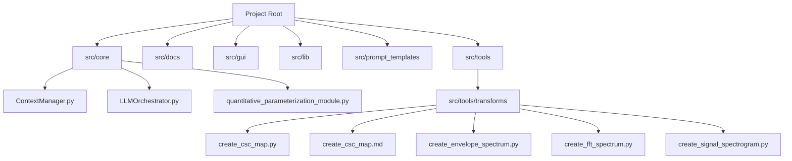
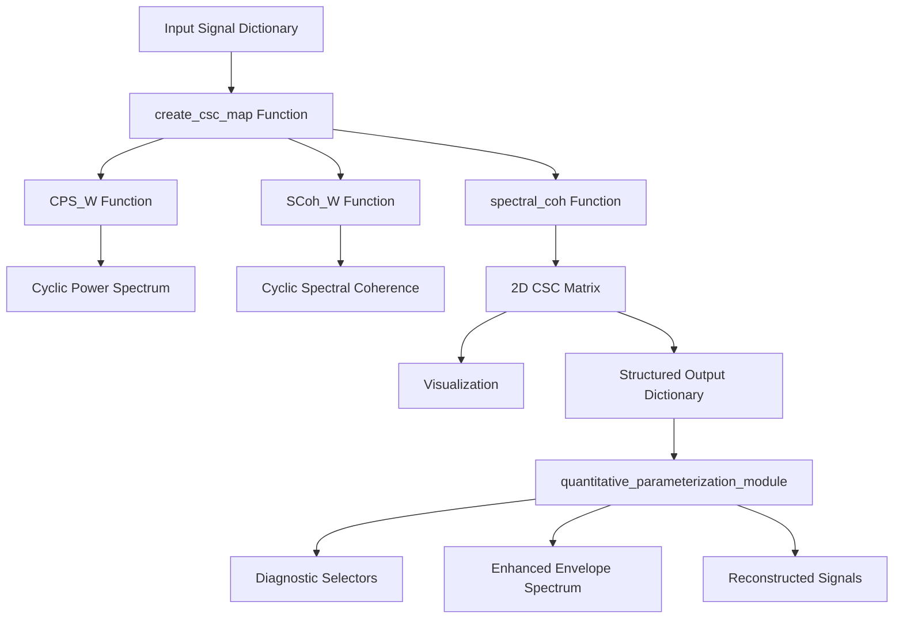
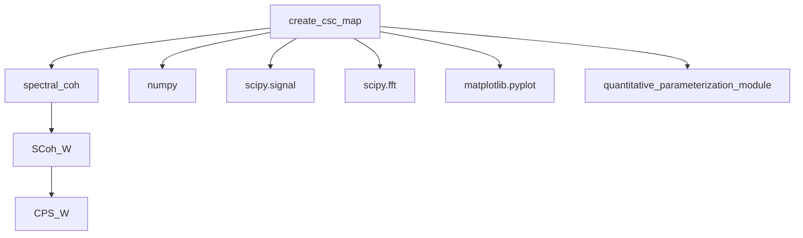

# CSC Map

<cite>
**Referenced Files in This Document**   
- [create_csc_map.py](file://src/tools/transforms/create_csc_map.py)
- [create_csc_map.md](file://src/tools/transforms/create_csc_map.md)
- [quantitative_parameterization_module.py](file://src/core/quantitative_parameterization_module.py)
</cite>

## Table of Contents
1. [Introduction](#introduction)
2. [Project Structure](#project-structure)
3. [Core Components](#core-components)
4. [Architecture Overview](#architecture-overview)
5. [Detailed Component Analysis](#detailed-component-analysis)
6. [Dependency Analysis](#dependency-analysis)
7. [Performance Considerations](#performance-considerations)
8. [Troubleshooting Guide](#troubleshooting-guide)
9. [Conclusion](#conclusion)

## Introduction
The CSC (Cyclic Spectral Coherence) Map tool is a specialized signal processing utility designed to detect cyclostationary features in vibration signals, particularly those arising from repetitive impacts caused by mechanical faults such as gear tooth damage or bearing defects. Unlike traditional FFT-based methods, the CSC Map excels in low signal-to-noise ratio (SNR) environments by analyzing the correlation between frequency components separated by a cyclic frequency (alpha), thereby revealing hidden periodic modulations. This document provides a comprehensive overview of the tool's mathematical foundation, processing pipeline, parameter configuration, and diagnostic applications, with a focus on its implementation within the broader signal analysis framework.

## Project Structure
The CSC Map tool is part of a larger signal processing and diagnostic software suite. It resides within the `src/tools/transforms/` directory, indicating its role as a data transformation utility. The project follows a modular structure with distinct directories for core logic, user interface, documentation, and various tool categories. The primary implementation file is `create_csc_map.py`, accompanied by a markdown documentation file `create_csc_map.md`. The tool integrates with other components, such as the `quantitative_parameterization_module.py`, which performs post-processing analysis on the CSC Map output.



**Diagram sources**
- [create_csc_map.py](file://src/tools/transforms/create_csc_map.py)
- [create_csc_map.md](file://src/tools/transforms/create_csc_map.md)

**Section sources**
- [create_csc_map.py](file://src/tools/transforms/create_csc_map.py)
- [create_csc_map.md](file://src/tools/transforms/create_csc_map.md)

## Core Components
The core functionality of the CSC Map tool is encapsulated in the `create_csc_map.py` module. The primary component is the `create_csc_map` function, which serves as the public interface for generating the CSC Map. This function orchestrates the entire processing pipeline, from input validation and parameter handling to the computation of the spectral coherence matrix and the generation of a visual output. It relies on a suite of internal helper functions: `CPS_W` for computing the Cyclic Power Spectrum using Welch's method, `SCoh_W` for calculating the Cyclic Spectral Coherence, and `spectral_coh` for generating the full 2D coherence matrix across a range of cyclic frequencies. The output is a structured dictionary containing the computed CSC map, frequency axes, metadata, and the path to the generated visualization.

**Section sources**
- [create_csc_map.py](file://src/tools/transforms/create_csc_map.py#L95-L192)

## Architecture Overview
The CSC Map tool operates as a standalone processing module within a larger diagnostic pipeline. Its architecture is based on a functional design, where a single entry-point function (`create_csc_map`) processes an input signal and produces a rich output dictionary. The tool follows a clear data flow: it receives a signal dictionary, computes the bi-frequency CSC matrix, generates a visual representation, and returns an enriched result. This output is designed to be consumed by downstream modules, most notably the `quantitative_parameterization_module`, which performs advanced statistical analysis and selector generation. The architecture emphasizes modularity and data interoperability, allowing the CSC Map to be used as a building block in automated diagnostic workflows.



**Diagram sources**
- [create_csc_map.py](file://src/tools/transforms/create_csc_map.py)
- [quantitative_parameterization_module.py](file://src/core/quantitative_parameterization_module.py)

## Detailed Component Analysis

### create_csc_map Function Analysis
The `create_csc_map` function is the central component of the tool. It acts as a wrapper that manages the entire CSC Map generation process. It begins by extracting the input signal and sampling rate from the provided dictionary, using the `primary_data` key as a pointer to the signal array. The function includes robust input validation and applies default values for parameters like `min_alpha`, `max_alpha`, `window`, and `overlap` if they are invalid or missing. A key design decision is the automatic limitation of the analysis to the first 3 seconds of the signal to prevent excessive computation time. The function then calls the `spectral_coh` function to perform the core computation. After receiving the 2D coherence matrix, it generates a publication-quality visualization using `matplotlib`, saving it to the specified `output_image_path`. Finally, it constructs and returns a comprehensive dictionary containing the CSC map, frequency axes, original signal data, and metadata.

**Section sources**
- [create_csc_map.py](file://src/tools/transforms/create_csc_map.py#L95-L192)

### spectral_coh Function Analysis
The `spectral_coh` function is responsible for the core mathematical computation of the CSC matrix. It takes a 1D signal and a range of cyclic frequencies (defined by `alphamin` and `alphamax`) and returns a 2D matrix of coherence values. The function first applies a Hanning window and the Hilbert transform to the input signal to create an analytic signal, which is essential for complex spectral analysis. It then calculates the indices for the cyclic frequency range based on the signal length and sampling rate. The function initializes the output matrix `SC` and computes the Cyclic Spectral Coherence for each cyclic frequency using the `SCoh_W` function. The loop iterates over the range of cyclic frequencies, populating the matrix column by column. The function returns the complex-valued coherence matrix along with the carrier frequency axis (`f`) and the cyclic frequency axis (`a`), which are used for plotting and interpretation.

**Section sources**
- [create_csc_map.py](file://src/tools/transforms/create_csc_map.py#L365-L415)

### SCoh_W and CPS_W Functions Analysis
The `SCoh_W` and `CPS_W` functions implement the fundamental algorithms for cyclostationary signal analysis. `CPS_W` computes the Cross-Cyclic Power Spectrum using Welch's method, which segments the signal, applies a window function, performs FFTs on frequency-shifted versions of the signal, and averages the results to reduce variance. The `opt` parameter allows for a symmetric or asymmetric computation, with the symmetric version being the default. `SCoh_W` builds upon `CPS_W` to calculate the Cyclic Spectral Coherence, which is a normalized measure. It computes the cross-spectral density (`Syx`) and the auto-spectral densities (`Sy`, `Sx`) at zero cyclic frequency and then calculates the coherence as `Syx / sqrt(Sy * Sx)`. This normalization makes the CSC robust to variations in signal power and focuses on the phase relationship between frequency components, which is crucial for detecting cyclostationarity.

**Section sources**
- [create_csc_map.py](file://src/tools/transforms/create_csc_map.py#L200-L364)

### Integration with Quantitative Parameterization Module
The CSC Map tool is designed to work seamlessly with the `quantitative_parameterization_module`. The output dictionary from `create_csc_map`, which has a `domain` of `'bi-frequency-matrix'`, is passed to the `calculate_quantitative_metrics` function. This function dispatches the data to the `_calculate_cyclomap_stats` handler. This handler performs a deep statistical analysis of the CSC map, calculating metrics like the Gini index (a measure of sparsity) and generating diagnostic selectors. It computes a "Spectral Kurtosis" selector by measuring kurtosis along the carrier frequency axis for each cyclic frequency. Similarly, it calculates "Jarque-Bera" and "Alpha Parameter" selectors. These selectors are then combined into a "Joint Selector" and smoothed using the `rlowess2` function. The module also generates an "Enhanced Envelope Spectrum" (EES) by weighting the cyclic frequency axis with these selectors, producing a cleaner 1D spectrum that highlights the most impulsive fault frequencies.

```mermaid
flowchart TD
A[CSC Map Output] --> B[calculate_quantitative_metrics]
B --> C{_calculate_cyclomap_stats}
C --> D[Compute Spectral Kurtosis Selector]
C --> E[Compute Jarque-Bera Selector]
C --> F[Compute Alpha Parameter Selector]
C --> G[Generate Joint Selector]
C --> H[Create Selectors Visualization]
G --> I[Compute Enhanced Envelope Spectrum (EES)]
I --> J[Generate EES Visualization]
H --> K[Return Enriched Output with Supporting Images]
```

**Diagram sources**
- [quantitative_parameterization_module.py](file://src/core/quantitative_parameterization_module.py#L700-L1074)

**Section sources**
- [quantitative_parameterization_module.py](file://src/core/quantitative_parameterization_module.py#L700-L1074)

## Dependency Analysis
The CSC Map tool has a clear dependency hierarchy. The primary function `create_csc_map` depends directly on the `spectral_coh` function, which in turn depends on `SCoh_W`. The `SCoh_W` function depends on `CPS_W` for its core spectral computation. This creates a linear dependency chain: `create_csc_map` → `spectral_coh` → `SCoh_W` → `CPS_W`. The tool also has external dependencies on standard scientific Python libraries: `numpy` for numerical operations, `scipy.signal` and `scipy.fft` for signal processing and FFTs, and `matplotlib.pyplot` for visualization. The integration with the `quantitative_parameterization_module` represents a higher-level dependency, where the CSC Map's output is used as input for further analysis. There are no circular dependencies, and the modular design ensures that each component has a single, well-defined responsibility.



**Diagram sources**
- [create_csc_map.py](file://src/tools/transforms/create_csc_map.py)

## Performance Considerations
The CSC Map computation is inherently computationally intensive due to its 2D nature and the repeated application of FFTs. The performance is primarily governed by the `window` size, the number of cyclic frequencies analyzed (determined by `max_alpha` and `min_alpha`), and the length of the signal. The current implementation limits the analysis to the first 3 seconds of the signal to mitigate this. The use of Welch's method with overlapping segments improves spectral estimate reliability but increases computation time. For large datasets or real-time applications, optimization strategies include using smaller window sizes, reducing the overlap, or limiting the `max_alpha` range. The `quantitative_parameterization_module` also performs significant post-processing, including the calculation of multiple selectors and the generation of visualizations, which adds to the overall computational load. The use of efficient NumPy operations and the `rlowess2` smoother helps to keep this processing manageable.

## Troubleshooting Guide
Common issues with the CSC Map tool typically stem from input data or parameter configuration. If the output image is not generated, verify that the `output_image_path` directory exists and is writable. If the CSC map appears blank or shows no peaks, check that the `max_alpha` parameter is set high enough to capture the expected fault frequencies (e.g., at least four times the suspected modulation frequency). An error related to `primary_data` indicates that the input dictionary is missing the key specified by the `primary_data` field. If the computation is excessively slow, the signal may be longer than 3 seconds; the tool will automatically truncate it, but consider pre-processing the signal to a shorter duration. Finally, ensure that the input signal is a 1D numpy array of float values and that the `sampling_rate` is a positive number. Warnings printed to the console during execution can provide additional clues for diagnosing problems.

**Section sources**
- [create_csc_map.py](file://src/tools/transforms/create_csc_map.py#L135-L151)

## Conclusion
The CSC Map tool is a powerful and sophisticated instrument for the diagnosis of mechanical faults in noisy environments. By leveraging the mathematical principles of cyclostationarity and spectral coherence, it provides a robust method for detecting repetitive impacts that may be obscured in traditional frequency-domain analyses. Its well-structured code, clear parameter interface, and integration with a comprehensive post-processing module make it a valuable component of an automated diagnostic system. The tool's design prioritizes usability and interoperability, enabling it to be effectively used for applications in gearbox and bearing diagnostics where early fault detection is critical. Future enhancements could include support for confidence interval estimation and more advanced visualization options.