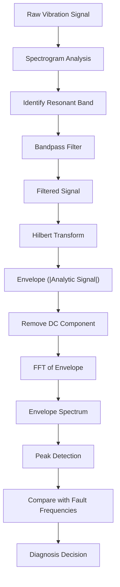

# Envelope Spectrum

<cite>
**Referenced Files in This Document**   
- [create_envelope_spectrum.py](file://src/tools/transforms/create_envelope_spectrum.py#L0-L273)
- [create_envelope_spectrum.md](file://src/tools/transforms/create_envelope_spectrum.md#L0-L57)
- [bandpass_filter.py](file://src/tools/sigproc/bandpass_filter.py#L0-L244)
- [bandpass_filter.md](file://src/tools/sigproc/bandpass_filter.md#L0-L45)
- [concept.md](file://concept.md#L45-L83)
</cite>

## Table of Contents
1. [Introduction](#introduction)  
2. [Two-Stage Envelope Spectrum Process](#two-stage-envelope-spectrum-process)  
3. [Core Algorithm: Hilbert Transform and FFT](#core-algorithm-hilbert-transform-and-fft)  
4. [Key Parameters and Configuration](#key-parameters-and-configuration)  
5. [Usage Example: Bearing Fault Diagnosis](#usage-example-bearing-fault-diagnosis)  
6. [Visualization and Output](#visualization-and-output)  
7. [Common Pitfalls and Optimization Strategies](#common-pitfalls-and-optimization-strategies)  
8. [Integration with Diagnostic Decision Logic](#integration-with-diagnostic-decision-logic)  
9. [Recommended Settings by Machine Type](#recommended-settings-by-machine-type)  

## Introduction

The **Envelope Spectrum** is a specialized signal processing technique used to detect early-stage mechanical faults—particularly in rotating machinery such as bearings and gearboxes—by analyzing amplitude modulation in high-frequency vibration signals. Unlike conventional FFT-based spectral analysis, which reveals dominant frequency components, the envelope spectrum uncovers low-frequency modulating signals that are often buried in noise and masked by high-energy carrier frequencies.

This technique is especially effective for identifying periodic impacts caused by localized defects like inner/outer race spalls, rolling element damage, or gear tooth cracks. These faults generate transient impulses that excite the natural resonant frequencies of the machine structure. The envelope spectrum isolates these impulses by first filtering around the resonant band and then demodulating the signal to extract the fault-related repetition rates.

The implementation in this repository is encapsulated in the `create_envelope_spectrum` tool, which follows a two-stage process: bandpass filtering followed by Hilbert transform demodulation and FFT analysis.

**Section sources**  
- [create_envelope_spectrum.md](file://src/tools/transforms/create_envelope_spectrum.md#L0-L28)  
- [concept.md](file://concept.md#L45-L83)

## Two-Stage Envelope Spectrum Process

The envelope spectrum analysis is performed in two critical stages:

1. **Bandpass Filtering**:  
   A high-frequency carrier band containing impulsive energy (often identified via spectrogram analysis) is isolated using a zero-phase Butterworth bandpass filter. This step enhances the signal-to-noise ratio by removing irrelevant frequency content.

2. **Hilbert Transform Demodulation and FFT**:  
   The filtered signal undergoes Hilbert transformation to compute its analytic signal. The magnitude of this analytic signal yields the **envelope**, which contains the amplitude modulation information. An FFT is then applied to the envelope to reveal the **modulating frequencies**, which correspond directly to fault repetition rates.

This two-stage approach effectively separates the high-frequency carrier (resonance) from the low-frequency modulation (fault signature), enabling clear identification of incipient faults.



**Diagram sources**  
- [create_envelope_spectrum.py](file://src/tools/transforms/create_envelope_spectrum.py#L15-L273)  
- [bandpass_filter.py](file://src/tools/sigproc/bandpass_filter.py#L0-L244)

**Section sources**  
- [create_envelope_spectrum.md](file://src/tools/transforms/create_envelope_spectrum.md#L0-L28)  
- [bandpass_filter.md](file://src/tools/sigproc/bandpass_filter.md#L0-L45)

## Core Algorithm: Hilbert Transform and FFT

The core computation of the envelope spectrum is implemented in the `_compute_envelope_spectrum` function within `create_envelope_spectrum.py`. The algorithm proceeds as follows:

### Step-by-Step Processing:
1. **Analytic Signal via Hilbert Transform**:  
   The Hilbert transform generates the analytic signal:  
   $$
   x_a(t) = x(t) + j \cdot \mathcal{H}\{x(t)\}
   $$  
   where $ \mathcal{H}\{x(t)\} $ is the Hilbert transform of the real signal $ x(t) $.

2. **Envelope Extraction**:  
   The envelope is computed as the magnitude of the analytic signal:  
   $$
   e(t) = |x_a(t)|
   $$

3. **DC Component Removal**:  
   The mean value (DC component) is subtracted from the envelope to prevent spectral leakage at 0 Hz:  
   $$
   e_{\text{ac}}(t) = e(t) - \text{mean}(e(t))
   $$

4. **One-Sided FFT**:  
   The FFT of the AC-coupled envelope is computed, and only the positive frequencies are retained:  
   $$
   X_{\text{env}}(f) = \text{FFT}\{e_{\text{ac}}(t)\}
   $$  
   Amplitudes are normalized by $ 2/N $ to represent true physical amplitudes.

### Code Implementation:
```python
def _compute_envelope_spectrum(signal: np.ndarray, sampling_rate: float):
    analytic_signal = hilbert(signal)
    envelope = np.abs(analytic_signal)
    envelope = envelope - np.mean(envelope)
    fft_vals = fft(envelope)
    n_onesided = len(envelope) // 2
    amplitudes = 2.0 / len(envelope) * np.abs(fft_vals[:n_onesided])
    frequencies = fftfreq(len(envelope), 1.0/sampling_rate)[:n_onesided]
    return frequencies, amplitudes
```

This method ensures that only the modulating frequencies—directly related to mechanical fault rates—are visible in the output spectrum.

**Section sources**  
- [create_envelope_spectrum.py](file://src/tools/transforms/create_envelope_spectrum.py#L15-L55)

## Key Parameters and Configuration

The `create_envelope_spectrum` function accepts several parameters that control its behavior:

| Parameter | Type | Description | Required | Default |
| :--- | :--- | :--- | :--- | :--- |
| data | dict | Input dictionary containing signal and sampling rate | Yes | None |
| output_image_path | str | Path to save the generated plot | Yes | None |
| fft_normalization | str | Normalization type: 'amplitude', 'power', or 'psd' | No | 'amplitude' |
| max_freq | float | Maximum frequency to display in Hz | No | None (shows up to Nyquist) |

### Input Data Structure:
The input `data` dictionary must include:
- `primary_data`: Key name for the 1D signal array (or 2D matrix for enhanced spectrum)
- `sampling_rate`: Sampling frequency in Hz
- `secondary_data` (optional): For 2D input, key for x-axis data

### Enhanced Envelope Spectrum:
For 2D inputs (e.g., cyclic spectral coherence maps), the function computes an **Enhanced Envelope Spectrum** by summing along the carrier frequency axis before applying the FFT.

**Section sources**  
- [create_envelope_spectrum.md](file://src/tools/transforms/create_envelope_spectrum.md#L29-L57)  
- [create_envelope_spectrum.py](file://src/tools/transforms/create_envelope_spectrum.py#L150-L181)

## Usage Example: Bearing Fault Diagnosis

### Scenario:
A vibration signal is acquired from an industrial bearing operating at a shaft frequency of 24 Hz. The objective is to detect inner race damage, which typically manifests at the Ball Pass Frequency Inner (BPFI). From system context, BPFI is calculated as:
$$
\text{BPFI} = 3.5 \times \text{Shaft Frequency} = 3.5 \times 24 = 84 \text{ Hz}
$$

### Diagnostic Workflow:
1. **Spectrogram Analysis**: Identify a resonant frequency band (e.g., 1–4 kHz) where impulsive energy is concentrated.
2. **Bandpass Filtering**: Apply a 4th-order Butterworth filter (1000–4000 Hz) to isolate the carrier signal.
3. **Envelope Spectrum**: Compute the envelope spectrum of the filtered signal.
4. **Peak Detection**: Search for peaks at 84 Hz and its harmonics (168 Hz, 252 Hz, etc.).

### Expected Outcome:
A clear peak at 84 Hz in the envelope spectrum confirms inner race damage. The presence of harmonics strengthens the diagnosis.

```python
# Example usage
filtered_signal = bandpass_filter(
    data={'primary_data': 'vibration', 'vibration': raw_signal, 'sampling_rate': 50000},
    output_image_path='./plots/bandpassed.png',
    lowcut_freq=1000,
    highcut_freq=4000,
    order=4
)

envelope_results = create_envelope_spectrum(
    data=filtered_signal,
    output_image_path='./plots/envelope_spectrum.png',
    max_freq=300
)
```

**Section sources**  
- [concept.md](file://concept.md#L45-L83)  
- [create_envelope_spectrum.md](file://src/tools/transforms/create_envelope_spectrum.md#L42-L57)

## Visualization and Output

The `create_envelope_spectrum` function generates a publication-quality plot of the envelope spectrum and saves it to the specified path. The visualization includes:

- **X-axis**: Frequency in Hz (limited by `max_freq` if provided)
- **Y-axis**: Amplitude (labeled based on `fft_normalization`)
- **Grid**: Dashed lines for improved readability
- **Title**: "Envelope Spectrum" or "Enhanced Envelope Spectrum"
- **Legend**: Identifies the plotted data
- **File Formats**: PNG (image) and `.kl` (pickled Matplotlib figure for later editing)

### Output Dictionary:
The function returns a dictionary with the following structure:
```json
{
  "frequencies": [0.0, 1.0, 2.0, ...],
  "amplitudes": [0.01, 0.05, 0.98, ...],
  "domain": "frequency-spectrum",
  "primary_data": "amplitudes",
  "secondary_data": "frequencies",
  "sampling_rate": 50000.0,
  "image_path": "./plots/envelope_spectrum.png",
  "metadata": {
    "fft_normalization": "amplitude",
    "max_frequency_shown": 300.0,
    "signal_length": 100000,
    "processing_steps": [
      "Hilbert transform to get analytic signal",
      "Envelope detection via magnitude",
      "DC component removal",
      "One-sided FFT of envelope"
    ]
  }
}
```

This structured output enables seamless integration into automated diagnostic pipelines.

**Section sources**  
- [create_envelope_spectrum.py](file://src/tools/transforms/create_envelope_spectrum.py#L183-L273)

## Common Pitfalls and Optimization Strategies

### Common Pitfalls:
1. **Improper Filter Selection**:  
   Choosing a bandpass range that does not contain the resonant frequency will result in a weak or absent envelope signal. Always use a spectrogram to guide filter design.

2. **Incorrect Sampling Rate**:  
   An inaccurate `sampling_rate` value distorts the frequency axis. Ensure metadata is correctly passed through the pipeline.

3. **Short Signal Length**:  
   Signals with fewer than 2 samples are rejected. For meaningful FFT resolution, use signals ≥ 1 second in duration.

4. **Noise Dominance**:  
   If the signal-to-noise ratio is too low, the envelope may be dominated by random fluctuations rather than true modulation.

### Optimization Strategies:
- **Filter Order**: Use higher-order filters (e.g., 6–8) for sharper roll-off when adjacent frequency bands are noisy.
- **Frequency Range**: Limit `max_freq` to the expected fault frequency range (e.g., 0–300 Hz) to improve visualization clarity.
- **Pre-filtering**: Apply a high-pass filter before bandpass filtering to remove low-frequency drift.
- **Smoothing**: Optionally apply a low-pass filter to the envelope before FFT to reduce high-frequency ripple.

**Section sources**  
- [bandpass_filter.md](file://src/tools/sigproc/bandpass_filter.md#L0-L45)  
- [create_envelope_spectrum.py](file://src/tools/transforms/create_envelope_spectrum.py#L150-L181)

## Integration with Diagnostic Decision Logic

The envelope spectrum output is designed to integrate directly into automated diagnostic systems. The presence and amplitude of peaks at characteristic fault frequencies (BPFI, BPFO, FTF, BSF) can be used to trigger alerts or classification decisions.

### Decision Logic Example:
```python
def diagnose_bearing(envelope_result, shaft_freq):
    bpfi = 3.5 * shaft_freq
    bpfo = 3.2 * shaft_freq
    # Check for significant peak at BPFI ±5%
    idx = np.abs(envelope_result['frequencies'] - bpfi).argmin()
    if envelope_result['amplitudes'][idx] > threshold:
        return "Inner Race Fault Detected"
    return "No Fault Detected"
```

This logic can be extended to harmonic analysis, kurtosis-based impulsiveness metrics, or machine learning classifiers.

**Section sources**  
- [concept.md](file://concept.md#L45-L83)  
- [create_envelope_spectrum.py](file://src/tools/transforms/create_envelope_spectrum.py#L200-L273)

## Recommended Settings by Machine Type

| Machine Type | Typical Resonant Band (Hz) | Filter Order | Suggested max_freq (Hz) | Notes |
| :--- | :--- | :--- | :--- | :--- |
| Industrial Bearings | 1000–10000 | 4–6 | 300 | Use spectrogram to pinpoint exact band |
| Gearboxes | 2000–8000 | 4–8 | 200 | Multiple faults may require separate bands |
| Electric Motors | 500–5000 | 4 | 150 | Watch for electrical harmonics at 100/120 Hz |
| Pumps & Compressors | 1000–6000 | 4 | 250 | Reciprocating impacts may require higher resolution |

Always validate filter settings using a spectrogram before envelope analysis.

**Section sources**  
- [bandpass_filter.md](file://src/tools/sigproc/bandpass_filter.md#L0-L45)  
- [create_signal_spectrogram.md](file://src/tools/transforms/create_signal_spectrogram.md#L0-L15)