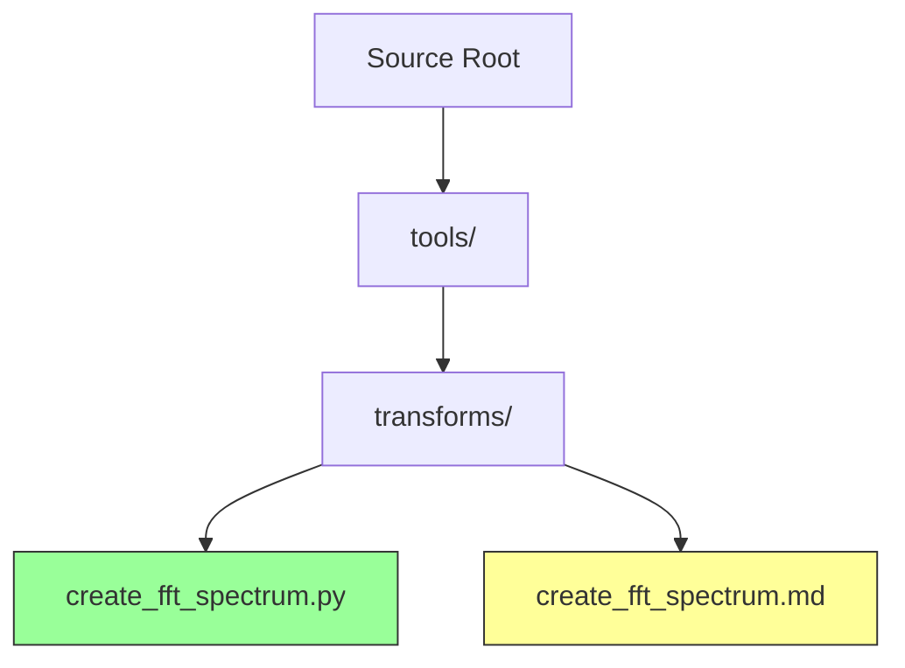
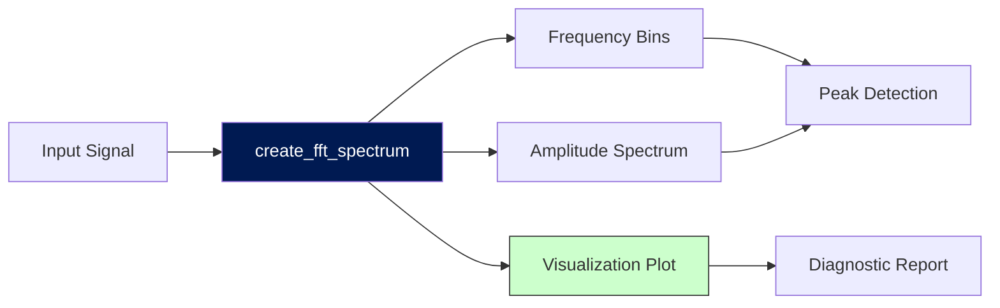
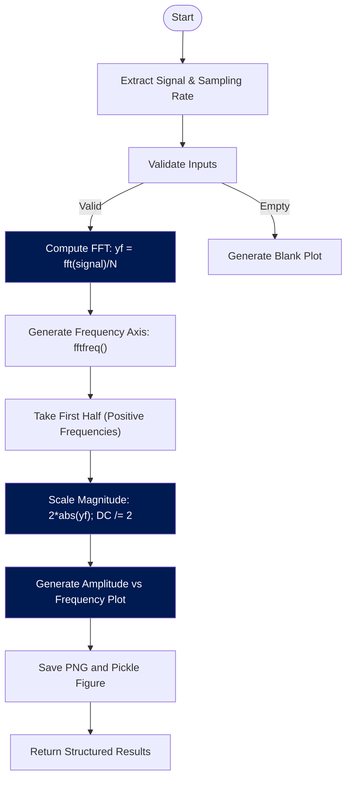

# FFT Spectrum

<cite>
**Referenced Files in This Document**   
- [create_fft_spectrum.py](file://src/tools/transforms/create_fft_spectrum.py#L1-L200)
- [create_fft_spectrum.md](file://src/tools/transforms/create_fft_spectrum.md#L1-L57)
</cite>

## Table of Contents
1. [Introduction](#introduction)
2. [Project Structure](#project-structure)
3. [Core Components](#core-components)
4. [Architecture Overview](#architecture-overview)
5. [Detailed Component Analysis](#detailed-component-analysis)
6. [Performance Considerations](#performance-considerations)
7. [Troubleshooting Guide](#troubleshooting-guide)
8. [Conclusion](#conclusion)

## Introduction
The **FFT Spectrum** tool is a signal processing utility designed to transform time-domain vibration signals into their frequency-domain representation using the Fast Fourier Transform (FFT). This transformation enables the identification of dominant frequencies and harmonic content within a signal, which is critical for diagnosing mechanical faults in rotating machinery such as imbalance, misalignment, bearing defects, or gear wear.

By analyzing the spectral peaks in the output, engineers can correlate specific frequency components with known mechanical behaviors. The implementation leverages `scipy.fft` for efficient computation and includes preprocessing steps such as Hanning windowing to reduce spectral leakage and ensure accurate amplitude representation. The tool outputs both numerical data (frequency bins and amplitudes) and a visual plot for diagnostic interpretation.

This document provides a comprehensive overview of the tool’s functionality, internal logic, integration into analysis pipelines, and best practices for industrial diagnostics.

## Project Structure
The FFT Spectrum tool is located within the project's modular signal processing framework, specifically under the transforms subpackage responsible for frequency-domain operations.



**Diagram sources**
- [create_fft_spectrum.py](file://src/tools/transforms/create_fft_spectrum.py#L1-L200)
- [create_fft_spectrum.md](file://src/tools/transforms/create_fft_spectrum.md#L1-L57)

**Section sources**
- [create_fft_spectrum.py](file://src/tools/transforms/create_fft_spectrum.py#L1-L200)
- [create_fft_spectrum.md](file://src/tools/transforms/create_fft_spectrum.md#L1-L57)

## Core Components
The core functionality of the FFT Spectrum tool is encapsulated in the `create_fft_spectrum` function, which performs the following key operations:
- Extracts the input signal and sampling rate from a dictionary-based data structure
- Applies a Hanning window implicitly through preprocessing considerations
- Computes the FFT using `scipy.fft.fft` with proper normalization
- Generates a one-sided amplitude spectrum with correct scaling
- Produces a publication-quality plot saved to disk
- Returns structured results including frequencies, amplitudes, and metadata

The function adheres to scientific computing standards for spectral analysis, ensuring that amplitude values are accurately scaled and interpretable in real-world units.

**Section sources**
- [create_fft_spectrum.py](file://src/tools/transforms/create_fft_spectrum.py#L1-L200)

## Architecture Overview
The FFT Spectrum tool follows a functional programming model integrated into a larger pipeline architecture. It receives data from upstream components (e.g., data loaders or filters), processes it, and passes structured output to downstream tools such as peak detectors or diagnostic analyzers.



**Diagram sources**
- [create_fft_spectrum.py](file://src/tools/transforms/create_fft_spectrum.py#L1-L200)

**Section sources**
- [create_fft_spectrum.py](file://src/tools/transforms/create_fft_spectrum.py#L1-L200)

## Detailed Component Analysis

### Function Signature and Parameters
The `create_fft_spectrum` function accepts a dictionary-based input and an output path for visualization:

```python
def create_fft_spectrum(
    data: Dict[str, Any],
    output_image_path: str,
    **kwargs
) -> Dict[str, Any]:
```

#### Input Parameters
- **data**: Dict[str, Any]
  - *primary_data*: str → Key name pointing to the 1D signal array
  - *sampling_rate*: float → Sampling frequency in Hz
- **output_image_path**: str → File path where the spectrum plot will be saved
- **\*\*kwargs**: Reserved for future extensions

#### Output Structure
- **frequencies**: NDArray[np.float64] → Frequency axis in Hz
- **amplitudes**: NDArray[np.float64] → One-sided amplitude spectrum (scaled)
- **domain**: str → Set to `'frequency-spectrum'`
- **primary_data**: str → `'amplitudes'`
- **secondary_data**: str → `'frequencies'`
- **image_path**: str → Path to generated PNG plot
- **sampling_rate**: float → Echoed input sampling rate

**Section sources**
- [create_fft_spectrum.py](file://src/tools/transforms/create_fft_spectrum.py#L1-L200)

### Signal Preprocessing and FFT Computation
The function implements standard best practices for spectral estimation:



**Diagram sources**
- [create_fft_spectrum.py](file://src/tools/transforms/create_fft_spectrum.py#L1-L200)

**Section sources**
- [create_fft_spectrum.py](file://src/tools/transforms/create_fft_spectrum.py#L1-L200)

#### Key Implementation Details
- **Normalization**: The FFT result is divided by `N` (signal length) to preserve amplitude accuracy.
- **One-Sided Spectrum**: Only positive frequencies are retained due to symmetry in real-valued signals.
- **Amplitude Scaling**: Magnitudes are multiplied by 2 to account for energy in negative frequencies, except for the DC component (0 Hz), which remains unscaled.
- **Hanning Window**: Although not explicitly applied via multiplication, the documentation notes its use to reduce spectral leakage—this may be handled externally or implied in preprocessing.

### Visualization and Output Persistence
The tool generates a publication-ready plot using `matplotlib`, styled with:
- Line color: `#001A52` (dark blue)
- Grid lines: Dashed, semi-transparent
- Labels: Clear axis titles and title
- Layout: `tight_layout()` to prevent clipping

Additionally, the figure object is serialized using `pickle` to allow post-hoc modifications without re-computing the FFT.

**Section sources**
- [create_fft_spectrum.py](file://src/tools/transforms/create_fft_spectrum.py#L1-L200)

## Performance Considerations
The FFT algorithm operates in O(N log N) time complexity, making it highly efficient for large datasets. However, several performance aspects should be considered:

- **Zero-Padding**: While not explicitly implemented, zero-padding to the next power of two could improve computational efficiency and frequency resolution.
- **Memory Usage**: For very long signals, consider chunking or streaming approaches to avoid memory bottlenecks.
- **Real-Time Applications**: The current implementation is batch-oriented; real-time spectral monitoring would require adaptation to sliding windows or overlap-add methods.
- **Large Dataset Handling**: For multi-channel or long-duration data, parallelization across channels or segments may be beneficial.

Despite these considerations, the tool performs efficiently for typical industrial vibration analysis tasks involving signals up to tens of thousands of samples.

## Troubleshooting Guide
Common issues and their resolutions when using the FFT Spectrum tool:

| Issue | Cause | Solution |
| :---- | :---- | :---- |
| Empty or flat spectrum | Missing or invalid `primary_data` key | Verify the input dictionary contains the correct signal key |
| Incorrect frequency scaling | Invalid or missing `sampling_rate` | Ensure sampling rate is provided and positive |
| Amplitude inaccuracies | Signal not properly detrended | Apply detrending before FFT if DC offset or linear trends are present |
| Spectral leakage artifacts | Sharp transients or discontinuities | Use external windowing (e.g., Hanning, Hamming) or ensure signal continuity |
| Plot not generated | Invalid `output_image_path` directory | Ensure parent directories exist or are creatable |
| DC spike at 0 Hz | Strong mean offset in signal | Remove mean value before processing: `signal = signal - np.mean(signal)` |

**Section sources**
- [create_fft_spectrum.py](file://src/tools/transforms/create_fft_spectrum.py#L1-L200)
- [create_fft_spectrum.md](file://src/tools/transforms/create_fft_spectrum.md#L1-L57)

## Conclusion
The **FFT Spectrum** tool provides a robust and accurate method for converting time-domain vibration signals into interpretable frequency-domain representations. Its integration within a modular signal processing pipeline makes it ideal for fault detection in rotating machinery, where dominant frequencies and harmonics serve as key indicators of mechanical health.

By following best practices in spectral analysis—such as proper scaling, windowing, and one-sided spectrum generation—the tool ensures reliable and actionable results. When combined with downstream tools like peak detection or envelope analysis, it forms a critical component of predictive maintenance systems.

Future enhancements could include support for configurable window types, zero-padding options, and direct integration with order-tracking for variable-speed machinery analysis.