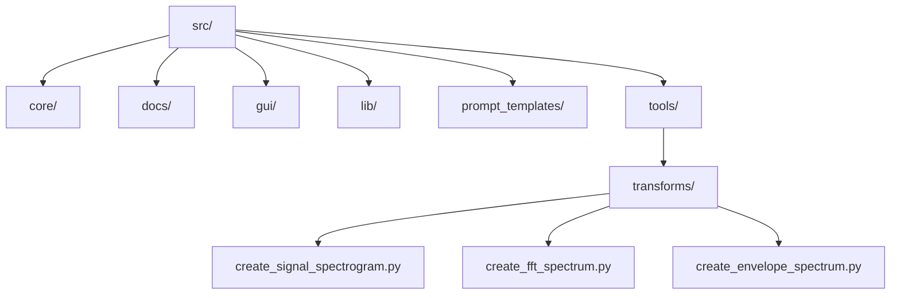
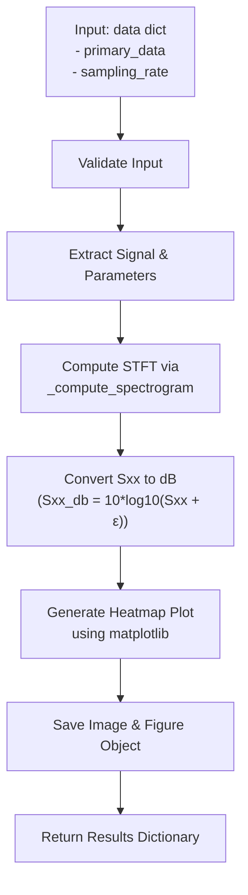
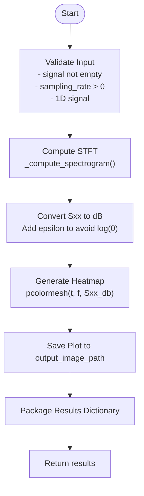
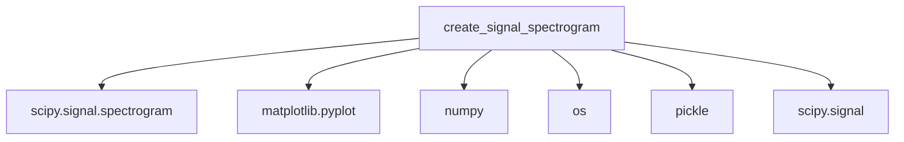

# Signal Spectrogram

<cite>
**Referenced Files in This Document**   
- [create_signal_spectrogram.py](file://src/tools/transforms/create_signal_spectrogram.py)
- [create_signal_spectrogram.md](file://src/tools/transforms/create_signal_spectrogram.md)
- [create_fft_spectrum.py](file://src/tools/transforms/create_fft_spectrum.py)
- [LLMOrchestrator.py](file://src/core/LLMOrchestrator.py)
- [quantitative_parameterization_module.py](file://src/core/quantitative_parameterization_module.py)
- [decompose_matrix_nmf.py](file://src/tools/decomposition/decompose_matrix_nmf.py)
</cite>

## Table of Contents
1. [Introduction](#introduction)
2. [Project Structure](#project-structure)
3. [Core Components](#core-components)
4. [Architecture Overview](#architecture-overview)
5. [Detailed Component Analysis](#detailed-component-analysis)
6. [Dependency Analysis](#dependency-analysis)
7. [Performance Considerations](#performance-considerations)
8. [Troubleshooting Guide](#troubleshooting-guide)
9. [Conclusion](#conclusion)

## Introduction
The **Signal Spectrogram** tool provides a time-frequency representation of a signal using the Short-Time Fourier Transform (STFT), enabling visualization of non-stationary signal behaviors such as transient impacts, speed variations, and evolving faults. It is particularly useful in vibration analysis, audio processing, and condition monitoring of rotating machinery. This document details the algorithmic implementation, parameter configuration, output format, practical applications, and performance optimization strategies for the tool.

## Project Structure
The project follows a modular structure with clearly defined directories for core logic, GUI components, documentation, and reusable tools. The spectrogram functionality resides in the `transforms` module under `src/tools/transforms/`.



**Diagram sources**
- [create_signal_spectrogram.py](file://src/tools/transforms/create_signal_spectrogram.py#L1-L250)
- [create_fft_spectrum.py](file://src/tools/transforms/create_fft_spectrum.py#L1-L200)

**Section sources**
- [create_signal_spectrogram.py](file://src/tools/transforms/create_signal_spectrogram.py#L1-L250)
- [create_signal_spectrogram.md](file://src/tools/transforms/create_signal_spectrogram.md#L1-L70)

## Core Components
The core functionality of the Signal Spectrogram tool is implemented in two primary functions:
- `_compute_spectrogram`: A low-level wrapper around `scipy.signal.spectrogram` with input validation and error handling.
- `create_signal_spectrogram`: The main interface that orchestrates computation, visualization, and result packaging.

These functions support key signal processing operations including windowing, overlap control, FFT computation, and logarithmic scaling for visualization.

**Section sources**
- [create_signal_spectrogram.py](file://src/tools/transforms/create_signal_spectrogram.py#L1-L250)

## Architecture Overview
The spectrogram generation process follows a pipeline architecture involving data validation, STFT computation, visualization, and structured output generation.



**Diagram sources**
- [create_signal_spectrogram.py](file://src/tools/transforms/create_signal_spectrogram.py#L80-L250)

## Detailed Component Analysis

### Algorithmic Implementation
The spectrogram is computed using the Short-Time Fourier Transform (STFT) with configurable parameters that control time-frequency resolution trade-offs.

#### STFT Computation
```python
f, t, Sxx = scipy.signal.spectrogram(
    signal,
    fs=sampling_rate,
    nperseg=nperseg,
    noverlap=noverlap,
    nfft=nfft
)
```

- **Window Type**: Default is Hann window (implied by `scipy.signal.spectrogram` default).
- **Segment Length (`nperseg`)**: Number of samples per segment (default: 128). Controls frequency resolution.
- **Overlap (`noverlap`)**: Number of overlapping points between segments (default: 110). Higher overlap improves time resolution.
- **FFT Size (`nfft`)**: Length of FFT (default: 256). Zero-padding if larger than `nperseg`.

The output `Sxx` is a 2D matrix where:
- Rows represent frequency bins (`f`)
- Columns represent time segments (`t`)
- Values represent power spectral density (PSD)

For visualization, `Sxx` is converted to decibels:  
`Sxx_db = 10 * np.log10(Sxx + np.finfo(float).eps)`

**Section sources**
- [create_signal_spectrogram.py](file://src/tools/transforms/create_signal_spectrogram.py#L47-L78)

### Output Format and GUI Rendering
The function returns a dictionary containing both numerical data and metadata:

**Output Structure**
- `frequencies`: 1D array of frequency values (Hz)
- `times`: 1D array of time values (s)
- `Sxx`: 2D time-frequency matrix (linear scale)
- `domain`: "time-frequency-matrix"
- `primary_data`: "Sxx"
- `secondary_data`: "frequencies"
- `tertiary_data`: "times"
- `sampling_rate`, `nperseg`, `noverlap`, `nfft`: STFT parameters
- `image_path`: Path to saved heatmap

The GUI renders the spectrogram as a heatmap using `matplotlib.pyplot.pcolormesh` with:
- Colormap: `'jet'` (configurable via `cmap` parameter)
- Shading: `'gouraud'` for smooth interpolation
- Colorbar: Labeled in dB/Hz
- Axes: Time (x), Frequency (y)



**Diagram sources**
- [create_signal_spectrogram.py](file://src/tools/transforms/create_signal_spectrogram.py#L80-L250)

**Section sources**
- [create_signal_spectrogram.py](file://src/tools/transforms/create_signal_spectrogram.py#L80-L250)

### Practical Applications
The Signal Spectrogram tool enables several key use cases in signal diagnostics:

#### Monitoring Startup/Shutdown Sequences
During machine startup, frequency components "sweep" upward as rotational speed increases. The spectrogram visualizes this as diagonal ridges, allowing identification of resonant frequencies and critical speeds.

#### Detecting Intermittent Faults
Faults such as bearing defects or gear tooth cracks produce impulsive signals. These appear as vertical stripes in the spectrogram at regular intervals, indicating periodic impacts.

#### Identifying Evolving Faults
Changes in fault severity over time manifest as variations in the intensity or frequency content of spectral features. For example, increasing amplitude of a fault-related frequency band indicates degradation.

**Section sources**
- [create_signal_spectrogram.md](file://src/tools/transforms/create_signal_spectrogram.md#L1-L70)

### Time-Frequency Resolution Trade-offs
The choice of STFT parameters directly affects resolution:

| Parameter | Effect on Time Resolution | Effect on Frequency Resolution |
|---------|--------------------------|-------------------------------|
| `nperseg` ↑ | Decreases (worse) | Increases (better) |
| `nperseg` ↓ | Increases (better) | Decreases (worse) |
| `noverlap` ↑ | Increases (better) | No direct effect |
| `nfft` ↑ | No effect | Increases (better, via zero-padding) |

**Guidelines:**
- Use **longer windows** (`nperseg`) to resolve closely spaced frequencies (e.g., harmonics).
- Use **shorter windows** for better time localization of transients.
- Set **overlap** to 50–90% of window length for smooth time evolution.

Example configurations:
- High frequency resolution: `nperseg=1024`, `noverlap=900`, `nfft=2048`
- High time resolution: `nperseg=64`, `noverlap=60`, `nfft=128`

**Section sources**
- [create_signal_spectrogram.py](file://src/tools/transforms/create_signal_spectrogram.py#L47-L78)
- [LLMOrchestrator.py](file://src/core/LLMOrchestrator.py#L285-L286)

## Dependency Analysis
The `create_signal_spectrogram` tool depends on several external and internal modules:



Internally, it is used by:
- `LLMOrchestrator`: For automated signal analysis workflows
- `quantitative_parameterization_module`: For feature extraction
- `decompose_matrix_nmf`: As input for matrix decomposition

**Diagram sources**
- [create_signal_spectrogram.py](file://src/tools/transforms/create_signal_spectrogram.py#L1-L10)
- [LLMOrchestrator.py](file://src/core/LLMOrchestrator.py#L285-L286)

**Section sources**
- [create_signal_spectrogram.py](file://src/tools/transforms/create_signal_spectrogram.py#L1-L250)
- [LLMOrchestrator.py](file://src/core/LLMOrchestrator.py#L285-L286)
- [quantitative_parameterization_module.py](file://src/core/quantitative_parameterization_module.py#L913-L914)
- [decompose_matrix_nmf.py](file://src/tools/decomposition/decompose_matrix_nmf.py#L36-L38)

## Performance Considerations
### Handling Long-Duration Signals
For long signals:
- Use appropriate `nperseg` to balance resolution and memory
- Consider chunked processing for very long signals
- Use `nfft` for zero-padding instead of increasing `nperseg` unnecessarily

### Memory-Efficient Computation
- The 2D spectrogram matrix `Sxx` has size `(len(f), len(t))`
- Memory usage ≈ `64 * len(f) * len(t)` bits (for float64)
- Reduce `nfft` or increase `nperseg` to reduce frequency bins
- Reduce overlap to decrease time segments

### Recommended Configurations for Variable-Speed Machinery
Refer to [PERSISTENT_CONTEXT_IMPLEMENTATION.md](file://PERSISTENT_CONTEXT_IMPLEMENTATION.md) for recommended settings. General guidelines:
- Use adaptive windowing based on rotational speed
- Synchronize STFT segments with rotational periods when possible
- Apply order tracking for more accurate analysis under speed variation

**Section sources**
- [create_signal_spectrogram.py](file://src/tools/transforms/create_signal_spectrogram.py#L47-L78)
- [LLMOrchestrator.py](file://src/core/LLMOrchestrator.py#L285-L286)

## Troubleshooting Guide
Common issues and solutions:

**Issue: Empty signal error**  
*Cause*: Input signal array is empty  
*Fix*: Validate data loading step; ensure `primary_data` key exists and points to valid signal

**Issue: Invalid shape error**  
*Cause*: Signal is multi-dimensional  
*Fix*: Flatten 2D arrays with shape (1, N) or (N, 1); otherwise reshape or select channel

**Issue: Plot generation fails**  
*Cause*: Directory permissions or invalid path  
*Fix*: Ensure parent directory exists or is creatable; validate `output_image_path`

**Issue: Overlap >= window length**  
*Cause*: `noverlap >= nperseg`  
*Fix*: Automatically corrected to `nperseg // 2` with warning

**Issue: Log(0) in dB conversion**  
*Cause*: Zero values in `Sxx`  
*Fix*: Epsilon added: `Sxx_db = 10 * np.log10(Sxx + np.finfo(float).eps)`

**Section sources**
- [create_signal_spectrogram.py](file://src/tools/transforms/create_signal_spectrogram.py#L47-L78)
- [create_signal_spectrogram.py](file://src/tools/transforms/create_signal_spectrogram.py#L141-L180)

## Conclusion
The Signal Spectrogram tool provides a robust implementation of STFT-based time-frequency analysis with comprehensive error handling, visualization, and integration capabilities. By carefully selecting window parameters (`nperseg`, `noverlap`, `nfft`), users can optimize for either time or frequency resolution based on application needs. The tool is particularly effective for diagnosing non-stationary behaviors in mechanical systems and serves as a foundational component for advanced signal decomposition and fault detection workflows.