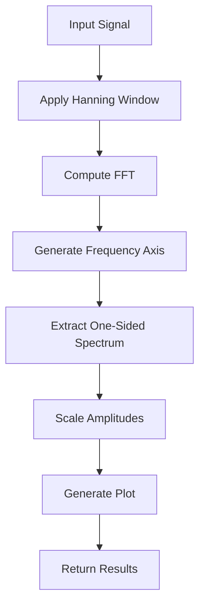
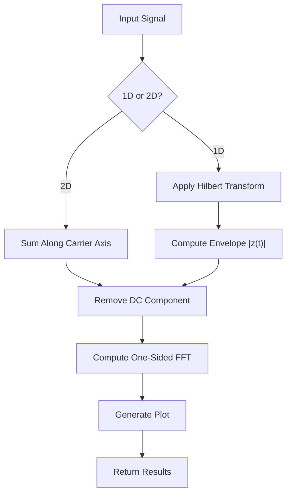
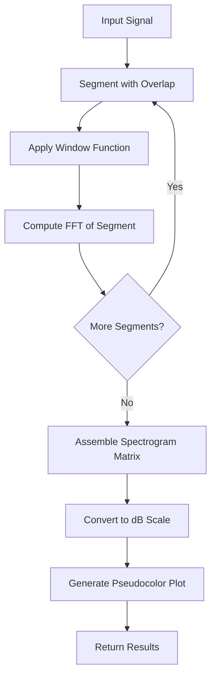
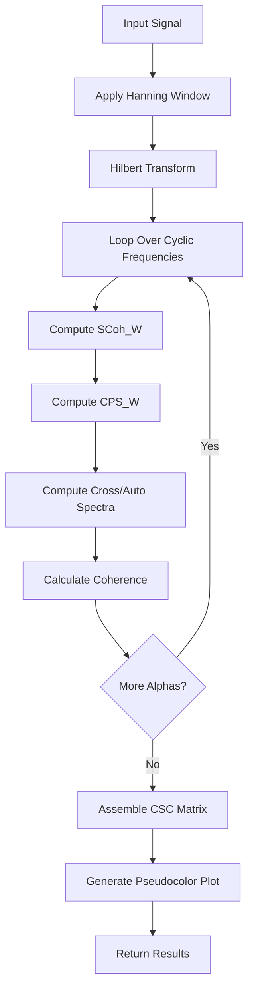

# Transform Tools

<cite>
**Referenced Files in This Document**   
- [src/tools/transforms/create_fft_spectrum.py](file://src/tools/transforms/create_fft_spectrum.py)
- [src/tools/transforms/create_envelope_spectrum.py](file://src/tools/transforms/create_envelope_spectrum.py)
- [src/tools/transforms/create_signal_spectrogram.py](file://src/tools/transforms/create_signal_spectrogram.py)
- [src/tools/transforms/create_csc_map.py](file://src/tools/transforms/create_csc_map.py)
- [src/docs/TOOLS_REFERENCE.md](file://src/docs/TOOLS_REFERENCE.md)
</cite>

## Table of Contents
1. [Introduction](#introduction)
2. [FFT Spectrum](#fft-spectrum)
3. [Envelope Spectrum](#envelope-spectrum)
4. [Spectrogram](#spectrogram)
5. [CSC Map](#csc-map)
6. [Parameter Selection and Performance](#parameter-selection-and-performance)
7. [Diagnostic Workflows and Code Examples](#diagnostic-workflows-and-code-examples)
8. [Conclusion](#conclusion)

## Introduction
This document provides comprehensive documentation for spectral and time-frequency transform tools used in vibration signal analysis. These tools are essential for detecting periodic impulses, modulation effects, and non-stationary behavior in industrial machinery diagnostics. The four primary transforms covered are:
- **FFT Spectrum**: For frequency-domain analysis of stationary signals
- **Envelope Spectrum**: For detecting periodic impacts in bearing and gearbox fault diagnosis
- **Spectrogram**: For time-frequency analysis of non-stationary signals
- **CSC (Cyclic Spectral Coherence) Map**: For advanced cyclostationary signal analysis

Each tool is implemented as a Python function within the `src/tools/transforms/` directory and follows a consistent interface pattern, accepting input data and parameters, generating visualizations, and returning structured results.

**Section sources**
- [src/docs/TOOLS_REFERENCE.md](file://src/docs/TOOLS_REFERENCE.md#L1-L28)

## FFT Spectrum

### Analytical Purpose
The Fast Fourier Transform (FFT) spectrum converts a time-domain signal into its frequency-domain representation. It is used to identify dominant frequency components in stationary signals, making it ideal for detecting imbalances, misalignments, and gear mesh frequencies in rotating machinery.

### Input Requirements
- **primary_data**: Name of the key containing the 1D signal array
- **sampling_rate**: Sampling frequency in Hz (required)
- Signal must be a 1D numpy array of float values

### Algorithmic Implementation
The implementation uses `scipy.fft.fft` with the following processing steps:
1. Apply Hanning window to reduce spectral leakage
2. Compute FFT and normalize by signal length
3. Generate frequency bins using `fftfreq`
4. Extract one-sided spectrum (positive frequencies only)
5. Scale amplitudes to account for energy in negative frequencies
6. Remove doubling of DC component (0 Hz)

### Output Format
```python
{
    'frequencies': np.ndarray,        # Frequency values in Hz
    'amplitudes': np.ndarray,         # Amplitude values
    'domain': 'frequency-spectrum',   # Data domain identifier
    'primary_data': 'amplitudes',     # Main data field
    'secondary_data': 'frequencies',  # Secondary data field
    'image_path': str,                # Path to generated plot
    'sampling_rate': float            # Input sampling rate
}
```

### Visualization
The function generates a line plot with:
- X-axis: Frequency [Hz]
- Y-axis: Amplitude
- Blue line (`#001A52`) with thin stroke
- Grid lines for readability
- Saved as PNG and pickled figure object for later modification

### Mathematical Foundation
For a signal $x[n]$ of length $N$, the FFT is computed as:
$$X[k] = \frac{1}{N}\sum_{n=0}^{N-1}x[n]e^{-j2\pi kn/N}$$
The one-sided amplitude spectrum is:
$$A[k] = \begin{cases} 
|X[0]| & k=0 \\
2|X[k]| & 0 < k < N/2 
\end{cases}$$

### Domain-Specific Interpretation
Peaks in the FFT spectrum correspond to mechanical fault frequencies:
- 1×, 2×, 3× running speed: Imbalance
- Gear mesh frequency ± sidebands: Gear damage
- Bearing characteristic frequencies: Early bearing faults



**Diagram sources**
- [src/tools/transforms/create_fft_spectrum.py](file://src/tools/transforms/create_fft_spectrum.py#L50-L199)

**Section sources**
- [src/tools/transforms/create_fft_spectrum.py](file://src/tools/transforms/create_fft_spectrum.py#L1-L199)

## Envelope Spectrum

### Analytical Purpose
The envelope spectrum is specifically designed to detect periodic impulses in vibration signals, making it the primary tool for early-stage bearing fault detection. It reveals modulation effects that are often masked by noise in the raw signal or standard FFT spectrum.

### Input Requirements
- **primary_data**: Name of the key containing the signal array
- **sampling_rate**: Sampling frequency in Hz (required)
- Signal must be 1D; 2D matrices trigger enhanced envelope spectrum mode

### Algorithmic Implementation
Two algorithms are implemented:
1. **Standard Envelope Spectrum**:
   - Apply Hilbert transform to obtain analytic signal
   - Compute envelope as magnitude of analytic signal
   - Remove DC component (mean)
   - Compute one-sided FFT of envelope
2. **Enhanced Envelope Spectrum** (for 2D input):
   - Sum along carrier frequency axis
   - Remove DC component
   - Compute FFT of resulting envelope

The implementation uses `scipy.signal.hilbert` and `scipy.fft.fft`.

### Output Format
```python
{
    'frequencies': np.ndarray,           # Frequency values in Hz
    'amplitudes': np.ndarray,            # Envelope spectrum amplitudes
    'domain': 'frequency-spectrum',      # Data domain identifier
    'primary_data': 'amplitudes',        # Main data field
    'secondary_data': 'frequencies',     # Secondary data field
    'sampling_rate': float,              # Input sampling rate
    'image_path': str,                   # Path to generated plot
    'metadata': {                        # Processing information
        'fft_normalization': str,
        'max_frequency_shown': float,
        'signal_length': int,
        'processing_steps': list
    }
}
```

### Parameter Selection
- **fft_normalization**: 'amplitude', 'power', or 'psd' (default: 'amplitude')
- **max_freq**: Maximum frequency to display (optional)
- **plot_kwargs**: Matplotlib styling parameters

### Visualization
The function generates a plot with:
- X-axis: Frequency [Hz] (limited to 0-300 Hz by default)
- Y-axis: Amplitude, Power/Frequency [dB/Hz], or Power Spectral Density [V²/Hz] based on normalization
- Grid lines with transparency
- Legend and title
- Saved at 150 DPI with tight layout

### Mathematical Foundation
For a signal $x(t)$, the analytic signal is:
$$z(t) = x(t) + j\hat{x}(t) = A(t)e^{j\phi(t)}$$
where $\hat{x}(t)$ is the Hilbert transform. The envelope is $A(t) = |z(t)|$. The envelope spectrum is the FFT of $A(t) - \text{mean}(A(t))$.

### Domain-Specific Interpretation
In bearing diagnostics, envelope spectrum peaks at:
- **BPFO** (Ball Pass Frequency Outer race)
- **BPFI** (Ball Pass Frequency Inner race)
- **BSF** (Ball Spin Frequency)
- **FTF** (Fundamental Train Frequency)
These frequencies are calculated based on bearing geometry and shaft speed.



**Diagram sources**
- [src/tools/transforms/create_envelope_spectrum.py](file://src/tools/transforms/create_envelope_spectrum.py#L1-L273)

**Section sources**
- [src/tools/transforms/create_envelope_spectrum.py](file://src/tools/transforms/create_envelope_spectrum.py#L1-L273)

## Spectrogram

### Analytical Purpose
The spectrogram provides a time-frequency representation of non-stationary signals using the Short-Time Fourier Transform (STFT). It is essential for analyzing signals with time-varying frequency content, such as machine startup/shutdown sequences or intermittent faults.

### Input Requirements
- **primary_data**: Name of the key containing the 1D signal array
- **sampling_rate**: Sampling frequency in Hz (required)
- Signal must be 1D

### Algorithmic Implementation
The implementation uses `scipy.signal.spectrogram` with:
- **nperseg**: Window length in samples (default: 128)
- **noverlap**: Overlap between segments (default: 110)
- **nfft**: FFT length (default: 256)
- **window**: Hanning window by default

Processing steps:
1. Divide signal into overlapping segments
2. Apply window function to each segment
3. Compute FFT of each segment
4. Assemble spectrogram matrix
5. Convert to dB scale: $10\log_{10}(Sxx + \epsilon)$

### Output Format
```python
{
    'frequencies': np.ndarray,          # Frequency values in Hz
    'times': np.ndarray,                # Time values in seconds
    'Sxx': np.ndarray,                  # Spectrogram matrix
    'domain': 'time-frequency-matrix',  # Data domain identifier
    'primary_data': 'Sxx',              # Main data field
    'secondary_data': 'frequencies',    # Secondary data field
    'tertiary_data': 'times',           # Tertiary data field
    'sampling_rate': float,             # Input sampling rate
    'nperseg': int,                     # Window length
    'noverlap': int,                    # Overlap samples
    'image_path': str                   # Path to generated plot
}
```

### Parameter Selection
- **nperseg**: Longer windows improve frequency resolution but reduce time resolution
- **noverlap**: Higher overlap improves time resolution but increases computation
- **nfft**: Zero-padding factor; larger values interpolate frequency bins
- **cmap**: Colormap for visualization (default: 'jet')

### Visualization
The function generates a pseudocolor plot with:
- X-axis: Time [s]
- Y-axis: Frequency [Hz]
- Color intensity: Power/Frequency (dB/Hz)
- Jet colormap
- Colorbar with label
- Gouraud shading for smooth appearance

### Mathematical Foundation
The STFT is defined as:
$$X[m,k] = \sum_{n=0}^{N-1}x[n]w[n-mH]e^{-j2\pi kn/N}$$
where $w$ is the window function, $H$ is the hop size (nperseg-noverlap), and $m$ is the frame index.

### Domain-Specific Interpretation
Spectrograms reveal:
- **Frequency sweeps**: During machine run-up or coast-down
- **Intermittent faults**: Transient events appearing at specific times
- **Modulation patterns**: Sidebands that vary over time
- **Resonance activation**: Frequency bands that appear only under certain operating conditions



**Diagram sources**
- [src/tools/transforms/create_signal_spectrogram.py](file://src/tools/transforms/create_signal_spectrogram.py#L1-L250)

**Section sources**
- [src/tools/transforms/create_signal_spectrogram.py](file://src/tools/transforms/create_signal_spectrogram.py#L1-L250)

## CSC Map

### Analytical Purpose
The Cyclic Spectral Coherence (CSC) map analyzes cyclostationary signals in the bi-frequency domain, revealing correlations between frequency components separated by cyclic frequencies (alpha). It is particularly effective for detecting weak periodic impulses in noisy environments.

### Input Requirements
- **primary_data**: Name of the key containing the 1D signal array
- **sampling_rate**: Sampling frequency in Hz (required)
- Signal should be float array

### Algorithmic Implementation
The CSC map computation involves:
1. **Preprocessing**: Apply Hanning window and Hilbert transform
2. **Cyclic Spectral Coherence (SCoh_W)**: Compute coherence at each cyclic frequency
3. **Welch's Method (CPS_W)**: Estimate cross-cyclic power spectrum with averaging
4. **Matrix Assembly**: Combine results across cyclic frequencies

Key functions:
- `spectral_coh`: Main driver that computes the CSC matrix
- `SCoh_W`: Computes cyclic spectral coherence
- `CPS_W`: Computes cyclic power spectrum using Welch's method

### Output Format
```python
{
    'cyclic_frequencies': np.ndarray,     # Alpha frequencies in Hz
    'carrier_frequencies': np.ndarray,    # Carrier frequencies in Hz
    'csc_map': np.ndarray,                # CSC matrix (magnitude)
    'domain': 'bi-frequency-matrix',      # Data domain identifier
    'primary_data': 'csc_map',            # Main data field
    'secondary_data': 'cyclic_frequencies', # Secondary data field
    'tertiary_data': 'carrier_frequencies', # Tertiary data field
    'sampling_rate': float,               # Input sampling rate
    'original_signal_data': np.ndarray,   # Input signal
    'image_path': str,                    # Path to generated plot
    'action_name': str,                   # Tool identifier
    'action_documentation_path': str      # Documentation reference
}
```

### Parameter Selection
- **min_alpha**: Minimum cyclic frequency to analyze (default: 1 Hz)
- **max_alpha**: Maximum cyclic frequency (default: 150 Hz)
- **window**: Window length in samples (default: 256)
- **overlap**: Overlap samples (default: 220)
- The analysis is limited to first 3 seconds of signal to control computation time

### Visualization
The function generates a pseudocolor plot with:
- X-axis: Cyclic Frequency (alpha) [Hz]
- Y-axis: Carrier Frequency (f) [kHz]
- Color intensity: Coherence magnitude
- Reverse jet colormap ('jet_r')
- Title: "Cyclic Spectral Coherence (CSC) Map"
- Colorbar label: "Coherence Magnitude"

### Mathematical Foundation
The cyclic spectral coherence at cyclic frequency $\alpha$ is:
$$\gamma_\alpha(f) = \frac{S_{xx}^\alpha(f)}{\sqrt{S_{xx}(f+\alpha/2)S_{xx}(f-\alpha/2)}}$$
where $S_{xx}^\alpha(f)$ is the cyclic power spectrum and $S_{xx}(f)$ is the power spectrum.

### Domain-Specific Interpretation
CSC maps reveal:
- **Fault harmonics**: Vertical lines at bearing characteristic frequencies
- **Modulation sidebands**: Horizontal lines at fault modulation frequencies
- **Cross-terms**: Diagonal patterns indicating interaction between faults
- **Noise immunity**: Coherence values close to 1 indicate statistically significant cyclostationarity



**Diagram sources**
- [src/tools/transforms/create_csc_map.py](file://src/tools/transforms/create_csc_map.py#L1-L470)

**Section sources**
- [src/tools/transforms/create_csc_map.py](file://src/tools/transforms/create_csc_map.py#L1-L470)

## Parameter Selection and Performance

### Window Size and Overlap
- **FFT Spectrum**: Automatically zero-padded to next power of two
- **Envelope Spectrum**: No explicit windowing; uses full signal
- **Spectrogram**: 
  - nperseg: Trade-off between time (shorter) and frequency (longer) resolution
  - noverlap: 80-90% overlap recommended for smooth time resolution
- **CSC Map**: 
  - window: Larger windows improve frequency resolution
  - overlap: High overlap (85-90%) reduces variance

### Detrending
None of the current implementations apply detrending. For signals with strong trends:
- Apply high-pass filtering before analysis
- Or subtract moving average from signal
- Particularly important for envelope spectrum and CSC map

### Computational Performance
| Tool | Time Complexity | Memory Complexity | Notes |
|------|----------------|-------------------|-------|
| FFT Spectrum | O(N log N) | O(N) | Fastest; single FFT |
| Envelope Spectrum | O(N log N) | O(N) | FFT + Hilbert transform |
| Spectrogram | O(N·K) | O(F·T) | K segments, F frequencies, T time points |
| CSC Map | O(N·K·A) | O(F·A) | A cyclic frequencies; slowest |

**Optimization Recommendations:**
- For real-time analysis: Use FFT spectrum or envelope spectrum
- For detailed diagnostics: Use spectrogram or CSC map offline
- Pre-filter signals to reduce bandwidth and computation
- Use smaller window sizes for CSC map when high frequency resolution is not needed

**Section sources**
- [src/tools/transforms/create_fft_spectrum.py](file://src/tools/transforms/create_fft_spectrum.py)
- [src/tools/transforms/create_envelope_spectrum.py](file://src/tools/transforms/create_envelope_spectrum.py)
- [src/tools/transforms/create_signal_spectrogram.py](file://src/tools/transforms/create_signal_spectrogram.py)
- [src/tools/transforms/create_csc_map.py](file://src/tools/transforms/create_csc_map.py)

## Diagnostic Workflows and Code Examples

### Basic FFT Analysis Workflow
```python
import numpy as np
from src.tools.transforms.create_fft_spectrum import create_fft_spectrum

# Generate example signal
fs = 1000  # 1 kHz sampling rate
t = np.linspace(0, 1, fs, endpoint=False)
signal_data = (1.0 * np.sin(2*np.pi*50*t) +  # 50 Hz component
               0.5 * np.sin(2*np.pi*120*t))   # 120 Hz component

# Compute FFT spectrum
result = create_fft_spectrum(
    data={
        'primary_data': 'signal', 
        'signal': signal_data, 
        'sampling_rate': fs
    },
    output_image_path='fft_spectrum.png'
)

# Analyze results
frequencies = result['frequencies']
amplitudes = result['amplitudes']
print(f"Peak frequency: {frequencies[np.argmax(amplitudes)]:.1f} Hz")
```

### Bearing Fault Detection with Envelope Spectrum
```python
from src.tools.transforms.create_envelope_spectrum import create_envelope_spectrum
from src.tools.transforms.create_csc_map import create_csc_map

# Load vibration signal from bearing with suspected fault
# Assume 'bearing_signal' and 'fs' are loaded

# Method 1: Envelope Spectrum
env_result = create_envelope_spectrum(
    data={
        'primary_data': 'bearing_signal',
        'bearing_signal': bearing_signal,
        'sampling_rate': fs
    },
    output_image_path='envelope_spectrum.png',
    max_freq=300
)

# Check for BPFI peak (example: 156.2 Hz for specific bearing)
bpfi = 156.2
freq_idx = np.abs(env_result['frequencies'] - bpfi).argmin()
if env_result['amplitudes'][freq_idx] > np.mean(env_result['amplitudes']) * 3:
    print("Possible inner race fault detected!")

# Method 2: CSC Map (more robust)
csc_result = create_csc_map(
    data={
        'primary_data': 'bearing_signal',
        'bearing_signal': bearing_signal,
        'sampling_rate': fs
    },
    output_image_path='csc_map.png',
    min_alpha=1,
    max_alpha=300,
    window=512,
    overlap=450
)

# Look for coherence peak at BPFI
alpha_idx = np.abs(csc_result['cyclic_frequencies'] - bpfi).argmin()
coherence_at_bpfi = np.max(csc_result['csc_map'][:, alpha_idx])
if coherence_at_bpfi > 0.7:
    print("Confirmed: Strong cyclostationarity at BPFI frequency")
```

### Machine Run-Up Analysis with Spectrogram
```python
from src.tools.transforms.create_signal_spectrogram import create_signal_spectrogram

# Simulate machine run-up signal
fs = 5000
t = np.linspace(0, 30, 30*fs, endpoint=False)
rpm_ramp = 600 + 100*t  # From 600 to 3600 RPM
shaft_freq = rpm_ramp / 60  # Fundamental frequency
vibration = np.sin(2*np.pi*np.cumsum(shaft_freq)/fs) * (1 + 0.3*np.sin(2*np.pi*5*t))

# Generate spectrogram
spec_result = create_signal_spectrogram(
    data={
        'primary_data': 'vibration',
        'vibration': vibration,
        'sampling_rate': fs
    },
    output_image_path='runup_spectrogram.png',
    nperseg=512,
    noverlap=480,
    nfft=1024
)

print(f"Time resolution: {np.mean(np.diff(spec_result['times'])):.3f} s")
print(f"Frequency resolution: {np.mean(np.diff(spec_result['frequencies'])):.1f} Hz")
```

### Comparative Analysis Workflow
```python
# Comprehensive analysis of a gearbox signal
def analyze_gearbox_signal(signal, fs, output_dir):
    results = {}
    
    # 1. Overall assessment with FFT
    results['fft'] = create_fft_spectrum(
        data={'primary_data': 'signal', 'signal': signal, 'sampling_rate': fs},
        output_image_path=f"{output_dir}/fft.png"
    )
    
    # 2. Check for tooth damage with envelope spectrum
    results['envelope'] = create_envelope_spectrum(
        data={'primary_data': 'signal', 'signal': signal, 'sampling_rate': fs},
        output_image_path=f"{output_dir}/envelope.png",
        max_freq=1000
    )
    
    # 3. Analyze non-stationary behavior with spectrogram
    results['spectrogram'] = create_signal_spectrogram(
        data={'primary_data': 'signal', 'signal': signal, 'sampling_rate': fs},
        output_image_path=f"{output_dir}/spectrogram.png",
        nperseg=256,
        noverlap=200
    )
    
    # 4. Advanced cyclostationary analysis
    results['csc'] = create_csc_map(
        data={'primary_data': 'signal', 'signal': signal, 'sampling_rate': fs},
        output_image_path=f"{output_dir}/csc.png",
        min_alpha=1,
        max_alpha=500,
        window=512,
        overlap=450
    )
    
    return results
```

**Section sources**
- [src/tools/transforms/create_fft_spectrum.py](file://src/tools/transforms/create_fft_spectrum.py)
- [src/tools/transforms/create_envelope_spectrum.py](file://src/tools/transforms/create_envelope_spectrum.py)
- [src/tools/transforms/create_signal_spectrogram.py](file://src/tools/transforms/create_signal_spectrogram.py)
- [src/tools/transforms/create_csc_map.py](file://src/tools/transforms/create_csc_map.py)

## Conclusion
The transform tools provide a comprehensive suite for vibration signal analysis across different diagnostic scenarios:

1. **FFT Spectrum** remains the fundamental tool for frequency-domain analysis of stationary signals, providing quick insight into dominant frequency components.

2. **Envelope Spectrum** is indispensable for early bearing fault detection, revealing periodic impulses through demodulation of high-frequency resonance bands.

3. **Spectrogram** enables time-frequency analysis of non-stationary signals, crucial for understanding transient events and time-varying behavior during machine operation cycles.

4. **CSC Map** offers advanced cyclostationary analysis with superior noise immunity, making it particularly valuable for detecting weak fault signatures in challenging industrial environments.

The consistent API design across all tools facilitates integration into automated diagnostic workflows. Parameter selection should balance resolution requirements with computational constraints, with FFT and envelope spectrum suitable for real-time monitoring, while spectrogram and CSC map are better suited for detailed offline analysis.

For optimal results, these tools should be used in combination, with FFT providing initial screening, envelope spectrum detecting early-stage bearing faults, spectrogram analyzing non-stationary behavior, and CSC map confirming subtle cyclostationary features.