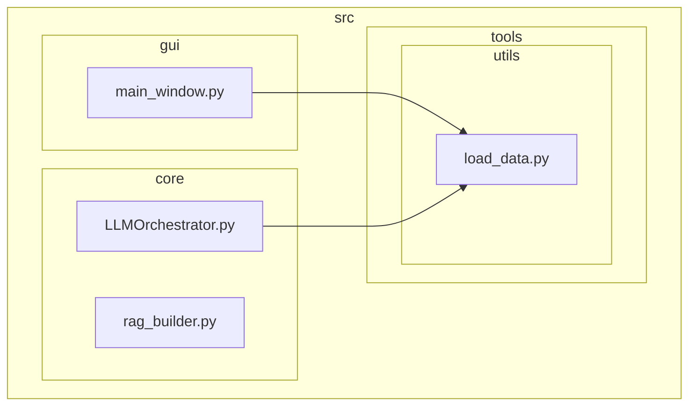
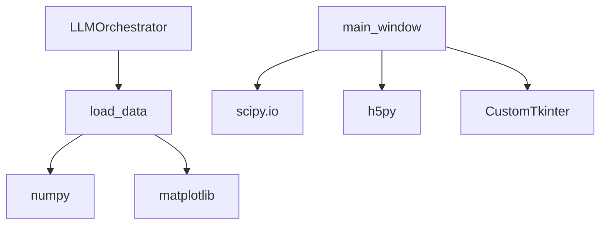

# Utility Tools

<cite>
**Referenced Files in This Document**   
- [load_data.py](file://src/tools/utils/load_data.py)
- [load_data.md](file://src/tools/utils/load_data.md)
- [main_window.py](file://src/gui/main_window.py)
- [mcpsettings.json](file://mcpsettings.json)
</cite>

## Table of Contents
1. [Introduction](#introduction)
2. [Project Structure](#project-structure)
3. [Core Components](#core-components)
4. [Architecture Overview](#architecture-overview)
5. [Detailed Component Analysis](#detailed-component-analysis)
6. [Dependency Analysis](#dependency-analysis)
7. [Performance Considerations](#performance-considerations)
8. [Troubleshooting Guide](#troubleshooting-guide)
9. [Conclusion](#conclusion)

## Introduction
The `load_data` utility is a foundational component in the AIDA (AI-Driven Analyzer) system, responsible for visualizing and structuring raw time-series signal data for downstream processing. It does not perform file I/O but instead accepts pre-loaded signal data and generates a standardized output dictionary and a visual plot. This tool is designed to be the first step in any analysis pipeline, providing a visual baseline and structured metadata for subsequent modules. The integration with the GUI enables users to load heterogeneous data formats (primarily MATLAB `.mat` files), which are then passed to this utility after preprocessing.

## Project Structure
The project follows a modular structure with distinct directories for core logic, GUI components, documentation, and utility tools. The `load_data` utility resides in the `src/tools/utils/` directory, indicating its role as a shared helper function. The GUI layer, located in `src/gui/`, handles user interactions and file loading, while the core processing logic is encapsulated in `src/core/`. Configuration files such as `mcpsettings.json` manage external service integrations.



**Diagram sources**
- [src/tools/utils/load_data.py](file://src/tools/utils/load_data.py)
- [src/gui/main_window.py](file://src/gui/main_window.py)
- [src/core/LLMOrchestrator.py](file://src/core/LLMOrchestrator.py)

**Section sources**
- [src/tools/utils/load_data.py](file://src/tools/utils/load_data.py)
- [src/gui/main_window.py](file://src/gui/main_window.py)

## Core Components
The primary component discussed is the `load_data` function, which serves as a data standardization and visualization tool. It takes raw signal data and sampling rate as input, produces a time-series plot, and returns a dictionary with consistent keys used by downstream modules. This function is critical for establishing a uniform data interface across the system, enabling seamless integration between the GUI, orchestrator, and processing tools.

**Section sources**
- [src/tools/utils/load_data.py](file://src/tools/utils/load_data.py#L15-L72)

## Architecture Overview
The system architecture is layered, with the GUI handling user input and file loading, the core orchestrator managing the analysis pipeline, and utility tools performing specific data transformations. The `load_data` utility acts as a bridge between raw data ingestion and structured processing. Data flows from the GUI, where `.mat` files are parsed using `scipy.io` or `h5py`, to the `load_data` function, which prepares it for analysis.


**Diagram sources**
- [src/gui/main_window.py](file://src/gui/main_window.py#L100-L127)
- [src/tools/utils/load_data.py](file://src/tools/utils/load_data.py#L15-L72)

## Detailed Component Analysis

### load_data Function Analysis
The `load_data` function is a stateless utility that visualizes and packages time-series data. It assumes the input is a 1D NumPy array and trims it to approximately three seconds of data based on the sampling rate. The function generates a PNG plot and optionally saves a pickled Matplotlib figure for interactive use.

#### Input and Output Specification
The function expects three parameters:
- **signal_data**: A 1D NumPy array containing the raw time-series signal.
- **sampling_rate**: An integer representing the sampling frequency in Hz.
- **output_image_path**: A string specifying where to save the generated plot.

It returns a dictionary with the following keys:
- **signal_data**: The (possibly trimmed) input signal.
- **sampling_rate**: The original sampling rate.
- **domain**: Set to `'time-series'` to indicate the data domain.
- **primary_data**: Set to `'signal_data'` to identify the main data field.
- **image_path**: Path to the saved visualization.

#### Code Implementation
```python
def load_data(
    signal_data: np.ndarray,
    sampling_rate: int,
    output_image_path: str
) -> dict:
    if signal_data is None or len(signal_data) == 0:
        # Handle empty data case
        ...
    signal_data = signal_data[:min(len(signal_data), round(3*sampling_rate))]
    time_axis = np.arange(len(signal_data)) / sampling_rate
    # Generate plot
    ...
    return {
        'signal_data': signal_data,
        'sampling_rate': sampling_rate,
        'domain': 'time-series',
        'primary_data': 'signal_data',
        'image_path': output_image_path
    }
```

**Section sources**
- [src/tools/utils/load_data.py](file://src/tools/utils/load_data.py#L15-L72)

### GUI Data Loader Integration
The `main_window.py` file contains the GUI logic for loading `.mat` files. It uses `scipy.io.loadmat` for standard MAT files and falls back to `h5py.File` for HDF5-based MAT files (v7.3). After loading, it extracts variables, filters out metadata, and assumes the longest array is the signal and any scalar value is the sampling rate.

#### Data Extraction Logic
```python
varnames = [k for k in mat_data.keys() if not (k.startswith('__') and k.endswith('__'))]
self.loaded_data = {k: np.asarray(mat_data[k])[:, 0] for k in varnames}
```
This code assumes 2D arrays where the first column contains the signal data.

#### Variable Identification
The `_find_data_variables` method automatically identifies:
- **signal_var_name**: The key corresponding to the longest array.
- **fs_var_name**: The key corresponding to a scalar (length 1) value.

If automatic identification fails, the orchestrator attempts to interpret the variables.

**Section sources**
- [src/gui/main_window.py](file://src/gui/main_window.py#L100-L127)
- [src/gui/main_window.py](file://src/gui/main_window.py#L409-L444)

## Dependency Analysis
The `load_data` utility depends on `numpy`, `matplotlib`, and standard Python libraries. The GUI depends on `scipy.io`, `h5py`, and `CustomTkinter`. There are no circular dependencies, and the architecture promotes loose coupling between components.



**Diagram sources**
- [src/tools/utils/load_data.py](file://src/tools/utils/load_data.py)
- [src/gui/main_window.py](file://src/gui/main_window.py)

## Performance Considerations
For large industrial datasets, the `load_data` function trims the signal to three seconds, which limits memory usage and ensures fast visualization. However, the initial loading of large `.mat` files via `h5py` or `scipy.io` can be memory-intensive. Users should ensure sufficient RAM for large files. The pickling of Matplotlib figures (`fig_path`) adds overhead but enables interactive exploration.

## Troubleshooting Guide
Common issues include:
- **Empty or corrupted .mat files**: Handled by try-except blocks; logs an error message.
- **Missing signal or fs variables**: If automatic detection fails, the user must manually specify them.
- **Incorrect data shape**: The loader assumes 2D arrays with signal in the first column; non-conforming data may cause indexing errors.
- **File not found**: Ensure the correct path is provided in `output_image_path`.

Error handling is implemented in the GUI with user-facing log messages.

**Section sources**
- [src/gui/main_window.py](file://src/gui/main_window.py#L377-L406)
- [src/tools/utils/load_data.py](file://src/tools/utils/load_data.py#L10-L15)

## Conclusion
The `load_data` utility is a critical entry point in the AIDA system, providing standardized data packaging and visualization. Its integration with the GUI enables seamless loading of MATLAB files, while its output structure supports downstream processing and analysis. Proper use of this tool ensures robust and reproducible signal analysis workflows.