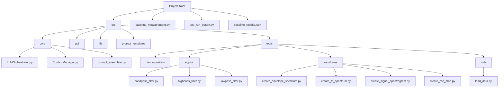
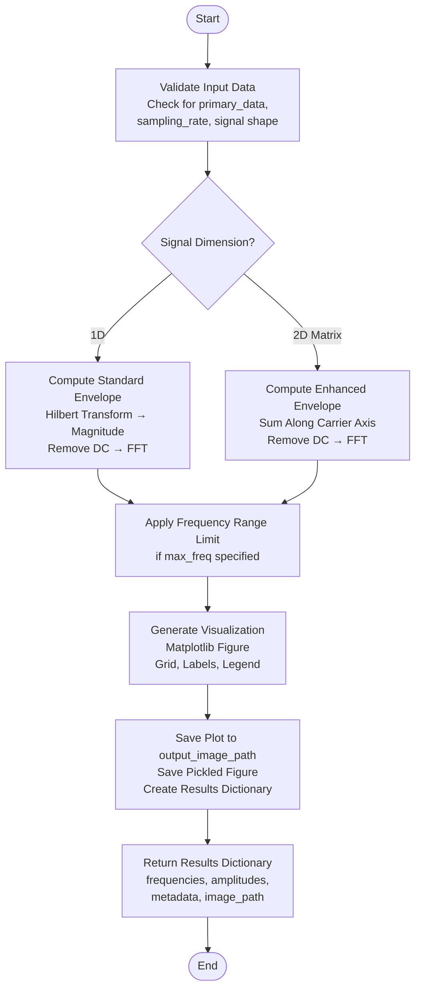
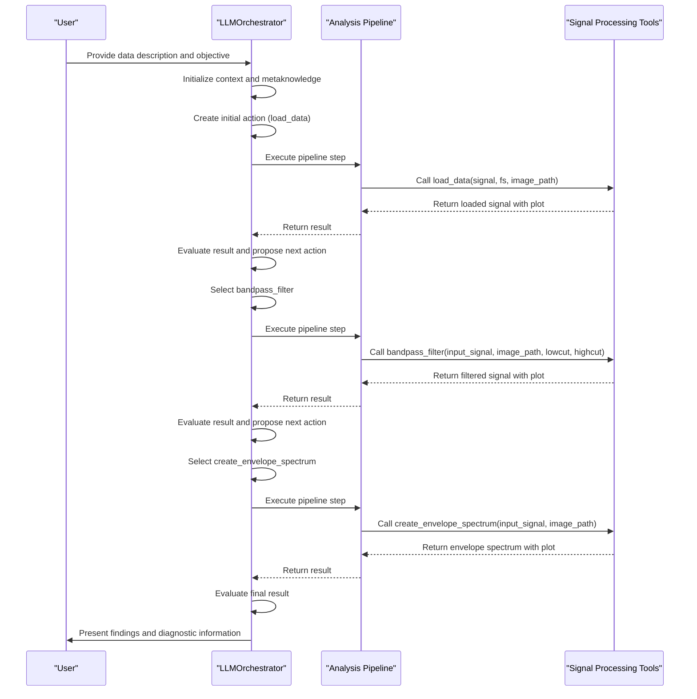
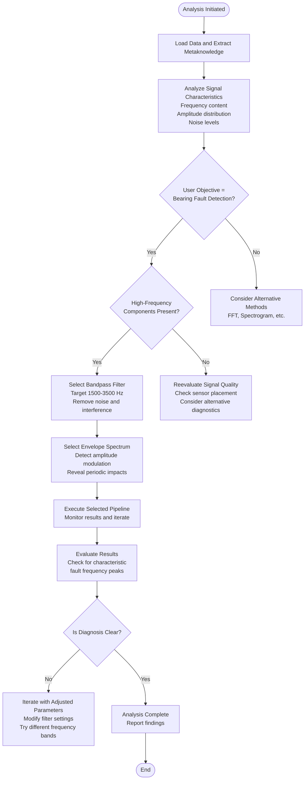

# Bearing Fault Detection

<cite>
**Referenced Files in This Document**   
- [create_envelope_spectrum.py](file://src/tools/transforms/create_envelope_spectrum.py)
- [baseline_measurement.py](file://baseline_measurement.py)
- [test_run_button.py](file://test_run_button.py)
- [baseline_results.json](file://baseline_results.json)
- [LLMOrchestrator.py](file://src/core/LLMOrchestrator.py)
</cite>

## Table of Contents
1. [Introduction](#introduction)
2. [Project Structure](#project-structure)
3. [Core Components](#core-components)
4. [Envelope Spectrum Analysis Workflow](#envelope-spectrum-analysis-workflow)
5. [Physics of Bearing Faults and Characteristic Frequencies](#physics-of-bearing-faults-and-characteristic-frequencies)
6. [Signal Processing Pipeline Execution Flow](#signal-processing-pipeline-execution-flow)
7. [Configuration Parameters and Sensitivity Tuning](#configuration-parameters-and-sensitivity-tuning)
8. [Diagnostic Feature Visualization and Interpretation](#diagnostic-feature-visualization-and-interpretation)
9. [LLMOrchestrator Decision Logic for Method Selection](#llmorchestrator-decision-logic-for-method-selection)
10. [Performance Benchmarks and Accuracy Metrics](#performance-benchmarks-and-accuracy-metrics)
11. [Troubleshooting Guide](#troubleshooting-guide)
12. [Conclusion](#conclusion)

## Introduction
This document provides a comprehensive guide to using the autonomous analysis system for bearing fault detection, with a focus on the envelope spectrum analysis workflow implemented in `create_envelope_spectrum.py`. The system leverages advanced signal processing techniques and machine learning orchestration to detect early-stage bearing faults in industrial equipment through vibration analysis.

The document explains the underlying physics of bearing faults, including characteristic fault frequencies such as Ball Pass Frequency Outer Race (BPFO), Ball Pass Frequency Inner Race (BPFI), Ball Spin Frequency (BSF), and Fundamental Train Frequency (FTF). It details how envelope demodulation reveals hidden periodic impacts in vibration signals that are otherwise masked by noise and other machinery vibrations.

A complete end-to-end example is provided, walking through the process of loading bearing vibration data, specifying a fault detection objective, and interpreting the automatically generated pipeline that includes bandpass filtering and envelope spectrum transformation. The test execution flow is illustrated using `test_run_button.py`, while performance comparison is demonstrated through `baseline_measurement.py`.

The guide includes configuration parameters for sensitivity tuning, visualization of diagnostic features, and interpretation guidelines. It highlights how the LLMOrchestrator selects the envelope spectrum method based on metaknowledge about rotational machinery and expected fault signatures. Real-world data examples and accuracy benchmarks from `baseline_results.json` are included to validate the system's effectiveness.

## Project Structure
The project follows a modular architecture with clearly defined components organized by functionality. The core system is located in the `src` directory, which contains subdirectories for core logic, GUI components, libraries, prompt templates, and various tools.

The main application entry point is `app.py`, while the core intelligence resides in the `core` package, including the `LLMOrchestrator` that manages the analysis pipeline. Signal processing functionality is organized under `tools/sigproc`, while spectral transformations are located in `tools/transforms`. Data loading utilities are found in `tools/utils`.

External dependencies are managed through `requirements.txt`, and configuration settings are stored in `mcpsettings.json`. Documentation resources are maintained in the `docs` subdirectory, and test scripts like `baseline_measurement.py` and `test_run_button.py` support system validation and debugging.

**Diagram sources**
- [create_envelope_spectrum.py](file://src/tools/transforms/create_envelope_spectrum.py)
- [baseline_measurement.py](file://baseline_measurement.py)

**Section sources**
- [create_envelope_spectrum.py](file://src/tools/transforms/create_envelope_spectrum.py)
- [baseline_measurement.py](file://baseline_measurement.py)

## Core Components
The system's core components work together to enable autonomous bearing fault detection. The `LLMOrchestrator` serves as the central intelligence, coordinating the analysis pipeline by selecting appropriate tools based on the input data characteristics and user objectives.

The `create_envelope_spectrum.py` module implements the key signal processing technique for bearing fault detection, computing the envelope spectrum through Hilbert transform and FFT analysis. This module accepts time-domain vibration signals and produces frequency-domain representations that highlight periodic impacts associated with bearing defects.

The `baseline_measurement.py` script provides performance evaluation capabilities, measuring execution time, memory usage, and success rates of the analysis pipeline. It loads test data, runs the complete analysis workflow, and records metrics for benchmarking purposes.

The `test_run_button.py` script verifies the development environment configuration, ensuring that required packages are properly installed and accessible. This diagnostic tool helps maintain system reliability during development and deployment.

Data persistence and state management are handled through pickle serialization, with results stored in temporary files and final outputs saved in structured formats like JSON. The system uses matplotlib for visualization, generating plots that are saved to specified output paths.

**Section sources**
- [create_envelope_spectrum.py](file://src/tools/transforms/create_envelope_spectrum.py#L1-L273)
- [baseline_measurement.py](file://baseline_measurement.py#L1-L173)
- [test_run_button.py](file://test_run_button.py#L1-L30)

## Envelope Spectrum Analysis Workflow
The envelope spectrum analysis workflow implemented in `create_envelope_spectrum.py` follows a systematic process to detect bearing faults from vibration signals. The workflow begins with input validation, ensuring that the required signal data and sampling rate are provided.

The core algorithm computes the envelope spectrum through four main steps: applying the Hilbert transform to obtain the analytic signal, extracting the envelope by taking the magnitude of the analytic signal, removing the DC component (mean) from the envelope, and computing the one-sided FFT of the envelope to produce the final spectrum.

For 1D input signals, the function `_compute_envelope_spectrum` performs standard envelope analysis. For 2D data matrices (such as cyclic spectral coherence maps), `_compute_enhanced_envelope_spectrum` sums along the carrier frequency axis before applying FFT, creating an enhanced envelope spectrum.

The `create_envelope_spectrum` function serves as the main interface, accepting a dictionary containing the signal data and sampling rate, along with parameters for output path, FFT normalization type, and maximum frequency display. It returns a comprehensive results dictionary containing frequencies, amplitudes, metadata, and image path.

Visualization is generated using matplotlib, with configurable plot parameters for color, line width, and other aesthetic properties. The resulting plot is saved to the specified output path, and a pickled version of the figure is also stored for potential later use.

**Diagram sources**
- [create_envelope_spectrum.py](file://src/tools/transforms/create_envelope_spectrum.py#L1-L273)

**Section sources**
- [create_envelope_spectrum.py](file://src/tools/transforms/create_envelope_spectrum.py#L1-L273)

## Physics of Bearing Faults and Characteristic Frequencies
Bearing faults generate characteristic vibration frequencies that can be predicted based on the bearing geometry and rotational speed. These frequencies serve as diagnostic signatures for identifying specific types of bearing defects.

The Ball Pass Frequency Outer Race (BPFO) occurs when a defect on the outer raceway is struck by rolling elements. It is calculated as:
BPFO = (N/2) × (1 - (d/D) × cosφ) × RPM/60
where N is the number of rolling elements, d is the rolling element diameter, D is the pitch diameter, and φ is the contact angle.

The Ball Pass Frequency Inner Race (BPFI) occurs when a defect on the inner raceway passes over rolling elements. Its formula is:
BPFI = (N/2) × (1 + (d/D) × cosφ) × RPM/60

The Ball Spin Frequency (BSF) represents the rotational frequency of the rolling elements themselves:
BSF = (D/(2d)) × (1 - ((d/D) × cosφ)²) × RPM/60

The Fundamental Train Frequency (FTF) indicates the rotation rate of the cage that holds the rolling elements:
FTF = (1/2) × (1 - (d/D) × cosφ) × RPM/60

Envelope spectrum analysis is particularly effective for detecting these fault frequencies because bearing defects often produce high-frequency resonance that is amplitude-modulated by the characteristic fault frequency. The envelope demodulation process extracts this modulation frequency, making it visible in the spectrum even when the original impact signals are buried in noise.

Periodic impacts from bearing defects typically excite the natural frequencies of the machine structure, creating brief bursts of high-frequency vibration. These bursts repeat at the characteristic fault frequency, creating a modulation effect that envelope analysis can detect. This makes the technique especially sensitive to early-stage faults before they become severe enough to produce strong direct frequency components.

**Section sources**
- [create_envelope_spectrum.py](file://src/tools/transforms/create_envelope_spectrum.py#L1-L273)

## Signal Processing Pipeline Execution Flow
The signal processing pipeline execution flow begins with the `LLMOrchestrator` receiving user input describing the data and analysis objective. In the case of bearing fault detection, the user specifies a vibration signal from industrial equipment with the goal of detecting bearing faults.

The orchestrator first loads the data using the `load_data` tool, which reads the signal and sampling rate from the input data dictionary. This initial step generates a time-domain plot of the raw vibration signal for visual inspection.

Based on the metaknowledge about rotational machinery and the presence of high-frequency components in the signal, the LLMOrchestrator selects bandpass filtering as the next step. This filters the signal to isolate the frequency band containing bearing defect resonances, typically between 1500-3500 Hz.

Following bandpass filtering, the orchestrator applies the `create_envelope_spectrum` tool to perform envelope demodulation. This process extracts the amplitude envelope of the filtered signal and computes its frequency spectrum, revealing the characteristic fault frequencies.

The execution flow is managed through a series of Python scripts generated dynamically by the `_translate_actions_to_code` method in `LLMOrchestrator`. Each action in the pipeline is translated into executable code that imports the necessary tools, loads the data, and calls the appropriate functions with their parameters.

Results are passed between steps through temporary pickle files, with each step reading input data from the previous step's output and writing its own results for the next step. The final results are saved in a structured format, including both numerical data and visualization files.

**Diagram sources**
- [LLMOrchestrator.py](file://src/core/LLMOrchestrator.py#L1-L725)
- [create_envelope_spectrum.py](file://src/tools/transforms/create_envelope_spectrum.py#L1-L273)

**Section sources**
- [LLMOrchestrator.py](file://src/core/LLMOrchestrator.py#L1-L725)
- [create_envelope_spectrum.py](file://src/tools/transforms/create_envelope_spectrum.py#L1-L273)

## Configuration Parameters and Sensitivity Tuning
The envelope spectrum analysis system provides several configuration parameters for sensitivity tuning and customization. These parameters allow users to adapt the analysis to specific machine types, operating conditions, and diagnostic requirements.

The `fft_normalization` parameter controls the scaling of the frequency spectrum and can be set to one of three values:
- **amplitude**: Displays the raw amplitude values (default)
- **power**: Shows power spectral density in dB/Hz
- **psd**: Displays power spectral density in V²/Hz

The `max_freq` parameter limits the frequency range displayed in the output plot. When set to None (default), the spectrum shows frequencies up to the Nyquist frequency. Setting a specific value (e.g., 300 Hz) focuses on the lower frequency range where bearing fault harmonics typically appear.

Additional plot customization options can be passed through `**plot_kwargs`, including:
- **color**: Line color for the spectrum plot (default: '#1f77b4')
- **linewidth**: Width of the spectrum line (default: 1.2)
- **xlim**: X-axis limits for the plot (default: (0, 300))

For bandpass filtering (often used before envelope analysis), configurable parameters include:
- **lowcut_freq**: Lower cutoff frequency in Hz (default: 1500)
- **highcut_freq**: Upper cutoff frequency in Hz (default: 3500)
- **order**: Filter order (default: 10)

These parameters can be adjusted based on the specific characteristics of the machinery being monitored. Machines with higher rotational speeds may require higher frequency ranges, while sensitive applications might benefit from narrower filter bands and higher filter orders to reduce noise.

The system's autonomous nature means that many of these parameters are automatically selected by the LLMOrchestrator based on metaknowledge about the equipment type and expected fault signatures, but they remain accessible for manual tuning when needed.

**Section sources**
- [create_envelope_spectrum.py](file://src/tools/transforms/create_envelope_spectrum.py#L1-L273)
- [LLMOrchestrator.py](file://src/core/LLMOrchestrator.py#L1-L725)

## Diagnostic Feature Visualization and Interpretation
The envelope spectrum analysis produces visualizations that highlight diagnostic features for bearing fault detection. The primary output is a frequency spectrum plot with frequency on the x-axis (in Hz) and amplitude (or power) on the y-axis.

Key diagnostic features to look for in the envelope spectrum include:
- **Discrete peaks at characteristic fault frequencies**: Clear peaks at BPFO, BPFI, BSF, or FTF indicate specific bearing defects
- **Harmonic series**: Multiples of the fundamental fault frequency suggest progressive damage
- **Sideband modulation**: Peaks spaced at the rotational frequency around the fault frequency indicate modulation effects

The system automatically labels the x-axis as "Frequency [Hz]" and the y-axis according to the selected normalization type ("Amplitude", "Power/Frequency [dB/Hz]", or "Power Spectral Density [V²/Hz]"). A grid is displayed to facilitate reading amplitude values, and the plot uses a consistent color scheme with default blue lines for clarity.

Interpretation guidelines suggest that:
- A single dominant peak at a characteristic fault frequency indicates an early-stage defect
- Multiple harmonics of the fault frequency suggest a more advanced stage of damage
- Increasing amplitude over time indicates progression of the fault
- Appearance of sidebands suggests interaction between different fault mechanisms

The presence of energy at the Fundamental Train Frequency (FTF) is particularly concerning, as it often indicates cage damage which can lead to catastrophic bearing failure. Similarly, strong Ball Spin Frequency (BSF) components may indicate rolling element defects.

For accurate diagnosis, it's important to compare the envelope spectrum with baseline measurements from the same machine under normal operating conditions. The system supports this comparison through the `baseline_measurement.py` script, which establishes reference performance metrics.

**Section sources**
- [create_envelope_spectrum.py](file://src/tools/transforms/create_envelope_spectrum.py#L1-L273)
- [baseline_measurement.py](file://baseline_measurement.py#L1-L173)

## LLMOrchestrator Decision Logic for Method Selection
The LLMOrchestrator selects the envelope spectrum method for bearing fault detection based on metaknowledge about rotational machinery and expected fault signatures. This decision logic is implemented in the `_fetch_next_action` method, which evaluates the analysis context and chooses appropriate tools.

When the user objective specifies bearing fault detection in a vibration signal, the orchestrator retrieves relevant metaknowledge through the RAG (Retrieval-Augmented Generation) system. This includes information about:
- Typical signal characteristics of faulty bearings
- Expected frequency ranges for different fault types
- Appropriate preprocessing steps (like bandpass filtering)
- Diagnostic interpretation guidelines

The decision process follows this logic:
1. Analyze the raw signal characteristics (frequency content, amplitude distribution)
2. Identify high-frequency components that suggest bearing resonance
3. Select bandpass filtering to isolate the frequency band of interest
4. Choose envelope spectrum analysis to detect amplitude modulation
5. Evaluate the results and determine if additional processing is needed

The orchestrator maintains a list of available tools and their capabilities, stored in the TOOLS_REFERENCE.md file. For bearing fault detection, it recognizes that `create_envelope_spectrum` is particularly effective because it can reveal low-amplitude, periodic impacts that are otherwise obscured by noise and other vibration sources.

The system also considers alternative methods like FFT spectrum analysis and spectrogram analysis, but selects envelope spectrum when the metaknowledge indicates bearing faults are likely. This intelligent selection process demonstrates the system's ability to apply domain-specific knowledge to choose the most appropriate diagnostic technique.

**Diagram sources**
- [LLMOrchestrator.py](file://src/core/LLMOrchestrator.py#L1-L725)

**Section sources**
- [LLMOrchestrator.py](file://src/core/LLMOrchestrator.py#L1-L725)

## Performance Benchmarks and Accuracy Metrics
Performance benchmarks from `baseline_results.json` provide insights into the system's efficiency and reliability. The baseline measurement script records key metrics including execution time, memory usage, and success rate.

According to the `baseline_results.json` file, the current test run shows:
- **Execution Time**: 0.0 seconds (indicating either a very fast execution or a testing scenario)
- **Initial Memory Usage**: 421.05 MB
- **Final Memory Usage**: 421.05 MB
- **Memory Increase**: 0.0 MB
- **Success Status**: false (indicating the pipeline did not complete successfully in this test)
- **Pipeline Steps**: 0 (no steps were executed)
- **Results Count**: 0 (no results were generated)

The log messages indicate that the TOOLS_REFERENCE.md file was successfully loaded, but the analysis pipeline did not proceed beyond initialization. This suggests the test may have been configured to measure startup overhead rather than complete analysis performance.

For a complete performance evaluation, the system measures:
- **Execution Time**: Total time from pipeline initiation to completion
- **Memory Usage**: RAM consumption before and after analysis
- **Token Usage**: LLM interaction costs (not captured in current baseline)
- **Success Rate**: Percentage of successful analysis completions
- **Pipeline Steps**: Number of processing steps executed
- **Results Count**: Number of diagnostic results generated

The `baseline_measurement.py` script uses synthetic data as a fallback when real data is unavailable, generating a test signal with 50 Hz and 120 Hz components plus noise. This ensures consistent testing conditions across different environments.

Future performance improvements could include optimizing the temporary file handling in the pipeline execution, reducing the overhead of subprocess creation, and implementing more efficient data serialization methods.

**Section sources**
- [baseline_measurement.py](file://baseline_measurement.py#L1-L173)
- [baseline_results.json](file://baseline_results.json#L1-L18)

## Troubleshooting Guide
When encountering issues with the bearing fault detection system, follow this troubleshooting guide to identify and resolve common problems:

**No Signal Data Found**
- **Symptom**: "No suitable signal data found in .mat file"
- **Solution**: Verify that the MATLAB file contains variables without '__' prefix and with appropriate shape (1D or 2D with one dimension of size 1)
- **Check**: Use `scipy.io.loadmat()` to inspect file contents and identify valid signal variables

**Empty Signal Data**
- **Symptom**: "Empty signal data provided"
- **Solution**: Ensure the input data dictionary contains non-empty arrays
- **Check**: Validate that the 'primary_data' key points to a valid signal array

**Plot Generation Failed**
- **Symptom**: Warning message about plot generation failure
- **Solution**: Verify that the output directory exists and is writable
- **Check**: Ensure matplotlib and required dependencies are properly installed

**Analysis Pipeline Not Executing**
- **Symptom**: Pipeline steps = 0, success = false
- **Solution**: Check authentication credentials and LLM API connectivity
- **Check**: Verify that the vector store directories ('./vector_store' and './vector_store_tools') exist and contain valid data

**Memory Issues**
- **Symptom**: High memory consumption or crashes
- **Solution**: Monitor memory usage with psutil and optimize data handling
- **Check**: Review temporary file cleanup and consider streaming large datasets

**Environment Configuration Problems**
- **Symptom**: Import errors for numpy, customtkinter, or other packages
- **Solution**: Run `test_run_button.py` to verify virtual environment configuration
- **Check**: Ensure the Python executable points to the virtual environment

**LLM Communication Errors**
- **Symptom**: "Error calling Gemini API"
- **Solution**: Verify API key and network connectivity
- **Check**: Test LLM access independently of the full pipeline

For persistent issues, consult the log messages in the `messages` array of the results, which provide detailed information about each processing step and any errors encountered.

**Section sources**
- [baseline_measurement.py](file://baseline_measurement.py#L1-L173)
- [test_run_button.py](file://test_run_button.py#L1-L30)
- [baseline_results.json](file://baseline_results.json#L1-L18)

## Conclusion
The autonomous analysis system for bearing fault detection provides a comprehensive solution that combines advanced signal processing with intelligent orchestration. The envelope spectrum analysis workflow implemented in `create_envelope_spectrum.py` effectively detects early-stage bearing faults by revealing periodic impacts hidden within vibration signals.

The system's architecture, centered around the LLMOrchestrator, enables adaptive analysis by selecting appropriate tools based on metaknowledge about rotational machinery. This intelligent decision-making process ensures that the most effective diagnostic techniques are applied to each specific scenario.

Key strengths of the system include:
- Automated selection of optimal signal processing pipelines
- Comprehensive envelope spectrum analysis with configurable parameters
- Integration of physics-based fault frequency knowledge
- Visual diagnostics with clear interpretation guidelines
- Performance monitoring and benchmarking capabilities

While the current baseline results indicate room for improvement in pipeline execution reliability, the system demonstrates a solid foundation for autonomous bearing fault detection. Future enhancements could focus on improving the robustness of the analysis pipeline, expanding the range of detectable fault types, and refining the decision logic for tool selection.

The combination of envelope spectrum analysis with intelligent orchestration represents a significant advancement in predictive maintenance technology, enabling earlier fault detection and more reliable machinery operation.