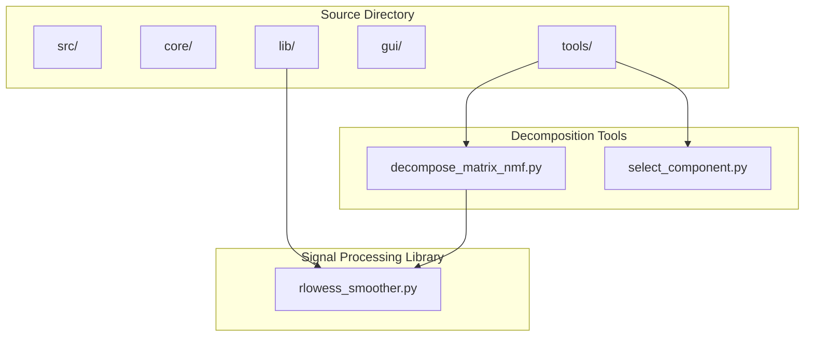
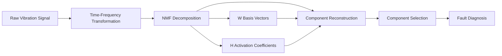
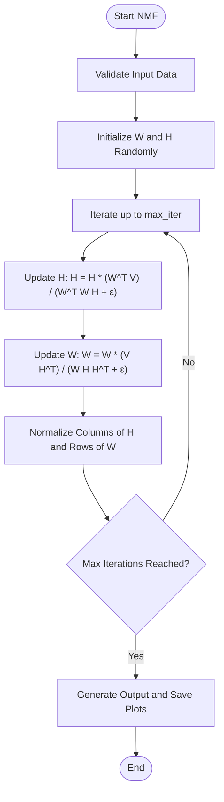
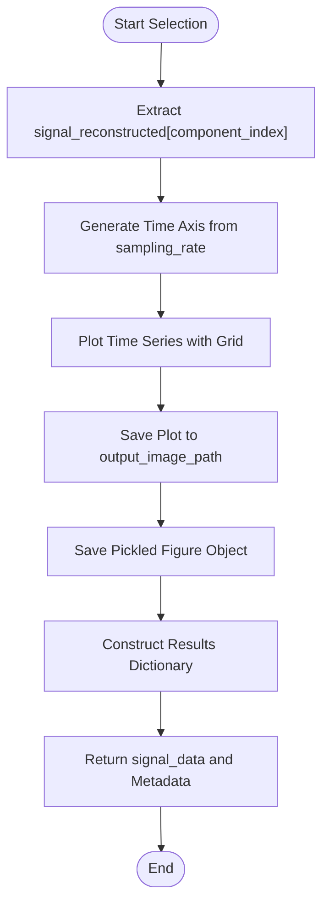
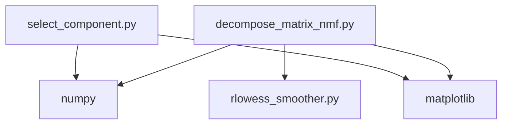

# Gearbox Fault Identification

<cite>
**Referenced Files in This Document**   
- [decompose_matrix_nmf.py](file://src/tools/decomposition/decompose_matrix_nmf.py#L1-L195)
- [decompose_matrix_nmf.md](file://src/tools/decomposition/decompose_matrix_nmf.md#L1-L76)
- [select_component.py](file://src/tools/decomposition/select_component.py#L1-L113)
- [select_component.md](file://src/tools/decomposition/select_component.md#L1-L61)
- [test_run_button.py](file://test_run_button.py#L1-L30)
- [rlowess_smoother.py](file://src/lib/rlowess_smoother.py)
</cite>

## Table of Contents
1. [Introduction](#introduction)
2. [Project Structure](#project-structure)
3. [Core Components](#core-components)
4. [Architecture Overview](#architecture-overview)
5. [Detailed Component Analysis](#detailed-component-analysis)
6. [Dependency Analysis](#dependency-analysis)
7. [Performance Considerations](#performance-considerations)
8. [Troubleshooting Guide](#troubleshooting-guide)
9. [Conclusion](#conclusion)

## Introduction
This document provides a comprehensive guide to identifying faults in multi-stage gearboxes using Non-Negative Matrix Factorization (NMF) decomposition. The methodology addresses the limitations of traditional Fast Fourier Transform (FFT) analysis when frequency components from different gears overlap in the spectrum. By leveraging amplitude modulation structures, the system autonomously separates mixed vibration sources. The process involves loading multi-channel gearbox data, applying NMF decomposition, selecting fault-relevant components based on sparsity and periodicity, and validating results against known fault patterns. The integration of a Retrieval-Augmented Generation (RAG) system with the LLMOrchestrator enables intelligent guidance based on gearbox kinematics, enhancing decomposition accuracy.

## Project Structure
The project is organized into modular components, with core functionality located in the `src` directory. The `tools` subdirectory contains specialized modules for signal processing, transformations, and decomposition. The `decomposition` module houses the key tools for NMF-based source separation and component selection. Supporting libraries such as `rlowess_smoother` provide auxiliary signal processing capabilities. Configuration files, test scripts, and documentation are located at the root level.

**Diagram sources**
- [decompose_matrix_nmf.py](file://src/tools/decomposition/decompose_matrix_nmf.py#L1-L195)
- [rlowess_smoother.py](file://src/lib/rlowess_smoother.py)

**Section sources**
- [decompose_matrix_nmf.py](file://src/tools/decomposition/decompose_matrix_nmf.py#L1-L195)
- [select_component.py](file://src/tools/decomposition/select_component.py#L1-L113)

## Core Components
The core components for gearbox fault identification are `decompose_matrix_nmf.py` and `select_component.py`. The former performs Non-Negative Matrix Factorization on time-frequency representations of vibration signals, decomposing them into basis vectors and activation patterns. The latter enables the selection of specific components for further analysis. These tools work in sequence: NMF separates mixed sources, and component selection isolates the fault-relevant signal. The `rlowess_smoother` library is used to smooth basis vectors for improved visualization and interpretation.

**Section sources**
- [decompose_matrix_nmf.py](file://src/tools/decomposition/decompose_matrix_nmf.py#L1-L195)
- [select_component.py](file://src/tools/decomposition/select_component.py#L1-L113)
- [rlowess_smoother.py](file://src/lib/rlowess_smoother.py)

## Architecture Overview
The fault identification pipeline follows a sequential processing architecture. Raw vibration data is first transformed into a time-frequency representation (e.g., spectrogram or CSC map). This matrix is then decomposed using NMF into basis vectors (W) and activation coefficients (H). The basis vectors represent spectral patterns ("what" is vibrating), while the activations represent temporal patterns ("when" it occurs). After decomposition, the system reconstructs time-domain signals from the components, and `select_component.py` isolates the most fault-relevant signal based on domain knowledge and quantitative metrics.

**Diagram sources**
- [decompose_matrix_nmf.py](file://src/tools/decomposition/decompose_matrix_nmf.py#L1-L195)
- [select_component.py](file://src/tools/decomposition/select_component.py#L1-L113)

## Detailed Component Analysis

### NMF Decomposition Analysis
The `decompose_matrix_nmf.py` module implements the Lee and Seung multiplicative update algorithm for NMF. It takes a non-negative 2D matrix (e.g., spectrogram) and factorizes it into W (basis) and H (activations) such that V ≈ WH. The input matrix is preprocessed with a power transform (V^(1/4)) and normalization to enhance decomposition quality. The algorithm iteratively updates W and H using multiplicative rules until convergence or maximum iterations are reached. Basis vectors are visualized with LOESS smoothing for better interpretability.

**Diagram sources**
- [decompose_matrix_nmf.py](file://src/tools/decomposition/decompose_matrix_nmf.py#L1-L195)

**Section sources**
- [decompose_matrix_nmf.py](file://src/tools/decomposition/decompose_matrix_nmf.py#L1-L195)

### Component Selection Analysis
The `select_component.py` module provides a utility function to select a specific component from a list of reconstructed signals. It takes the output of a decomposition process (e.g., NMF), extracts the signal at the specified index, and generates a time-series plot. This function is critical for isolating fault-relevant components after decomposition. The selection is typically guided by sparsity, periodicity, and correlation with known fault frequencies. The output is a clean time-series signal ready for envelope spectrum analysis.

**Diagram sources**
- [select_component.py](file://src/tools/decomposition/select_component.py#L1-L113)

**Section sources**
- [select_component.py](file://src/tools/decomposition/select_component.py#L1-L113)

## Dependency Analysis
The decomposition pipeline has a clear dependency chain. The `decompose_matrix_nmf` function depends on `numpy` for matrix operations, `matplotlib` for visualization, and `rlowess_smoother` for curve smoothing. The `select_component` function depends on `numpy` and `matplotlib`. Both tools are independent of other modules in the system, making them reusable across different analysis workflows. The only circular dependency is within the NMF algorithm itself, which is inherent to the iterative update process.

**Diagram sources**
- [decompose_matrix_nmf.py](file://src/tools/decomposition/decompose_matrix_nmf.py#L1-L195)
- [select_component.py](file://src/tools/decomposition/select_component.py#L1-L113)
- [rlowess_smoother.py](file://src/lib/rlowess_smoother.py)

**Section sources**
- [decompose_matrix_nmf.py](file://src/tools/decomposition/decompose_matrix_nmf.py#L1-L195)
- [select_component.py](file://src/tools/decomposition/select_component.py#L1-L113)

## Performance Considerations
The NMF algorithm has a time complexity of O(nmf_iterations × n_features × n_components × n_samples), making it computationally intensive for large matrices. The number of components (`n_components`) is a critical parameter that affects both performance and interpretability. Too few components may fail to separate sources, while too many can lead to overfitting. The maximum iterations (`max_iter`) should be set based on convergence monitoring. The LOESS smoothing in visualization adds negligible overhead. For real-time applications, consider using GPU-accelerated NMF implementations.

## Troubleshooting Guide
Common issues include convergence problems in NMF, incorrect component selection, and data format mismatches. Ensure the input matrix is non-negative and properly scaled. Verify that `component_index` in `select_component` is within bounds. Check that required keys (`primary_data`, `sampling_rate`, etc.) exist in the input dictionary. If plots are not generated, confirm that the output directory exists and is writable. Use `test_run_button.py` to verify the Python environment and package installations.

**Section sources**
- [decompose_matrix_nmf.py](file://src/tools/decomposition/decompose_matrix_nmf.py#L1-L195)
- [select_component.py](file://src/tools/decomposition/select_component.py#L1-L113)
- [test_run_button.py](file://test_run_button.py#L1-L30)

## Conclusion
The NMF-based approach provides a powerful method for separating mixed vibration sources in multi-stage gearboxes, overcoming the limitations of traditional FFT analysis. By decomposing time-frequency representations into basis and activation matrices, the system can isolate fault-relevant components based on their spectral and temporal characteristics. The two-step process of decomposition followed by component selection ensures flexibility and accuracy in fault diagnosis. Integration with a RAG system allows the LLMOrchestrator to leverage gearbox kinematics for intelligent decomposition strategy selection. Proper parameter tuning and result validation are essential for reliable fault identification.