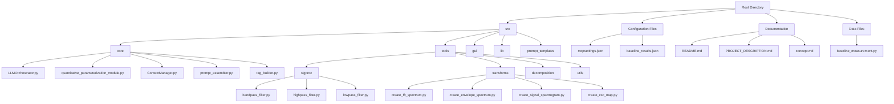
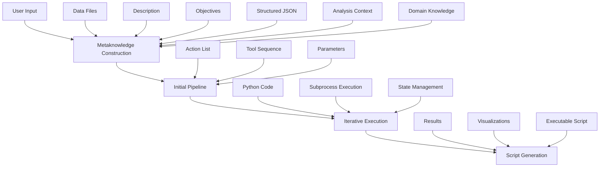
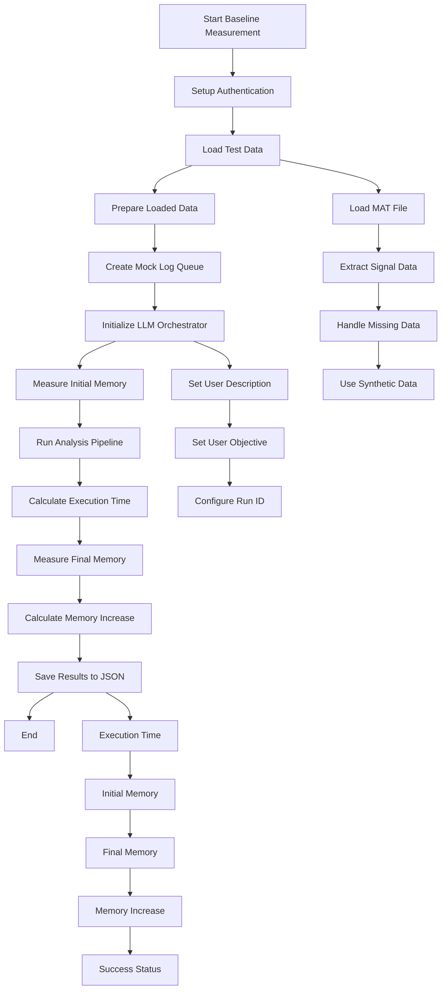
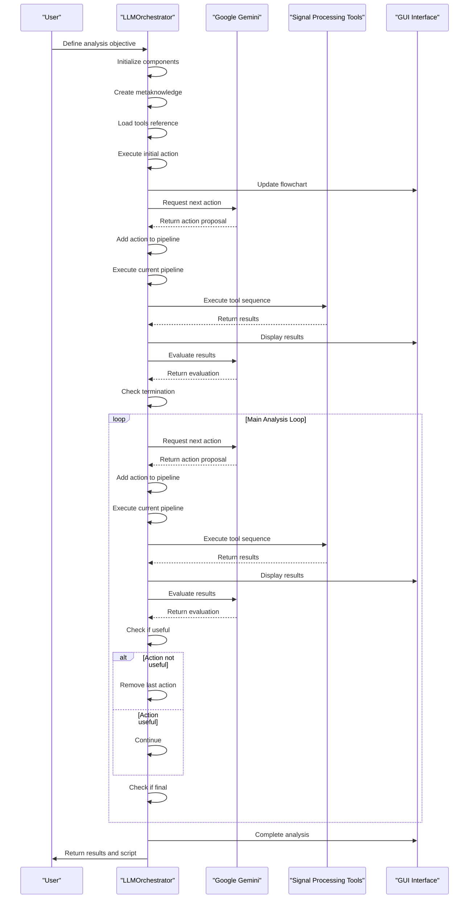
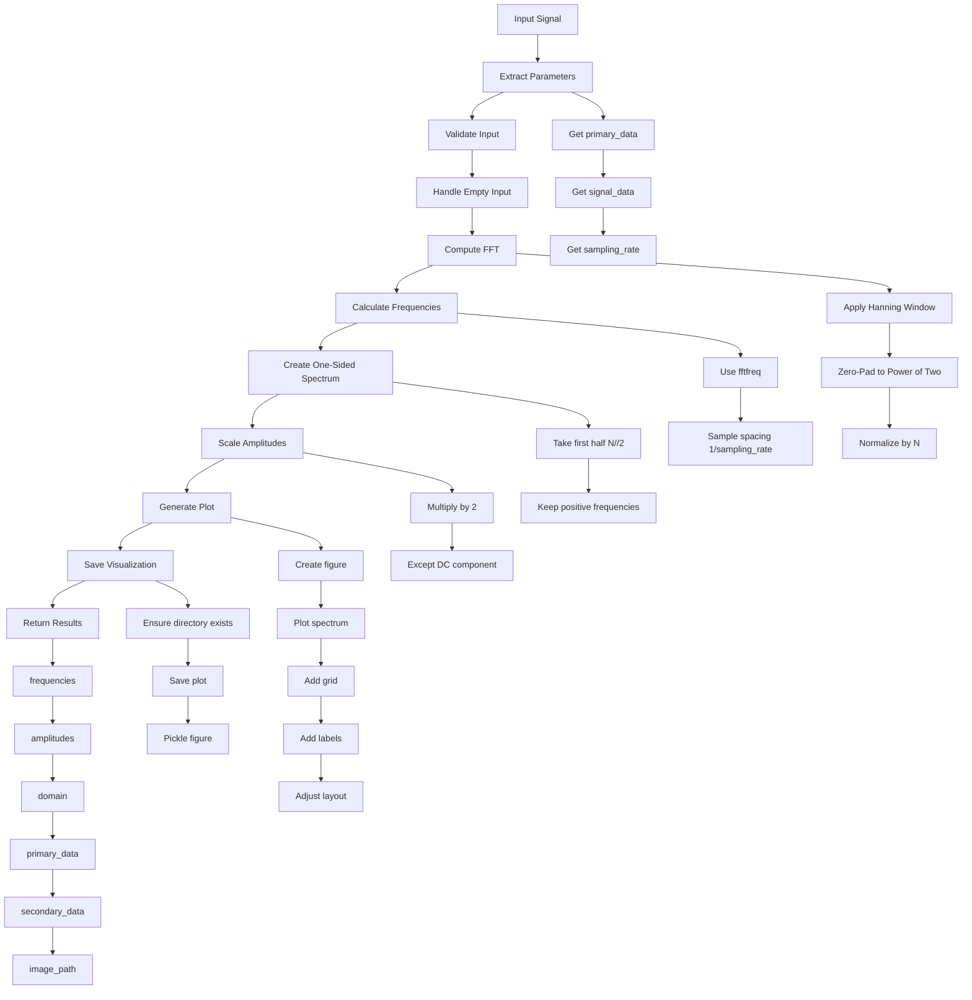
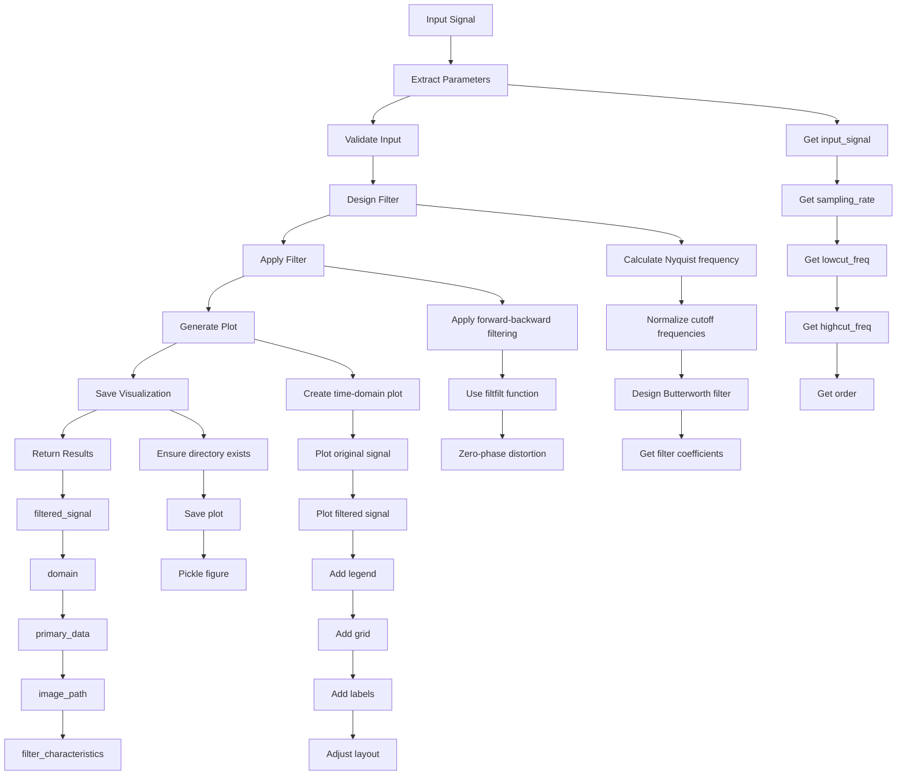
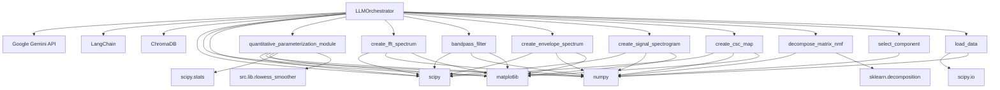
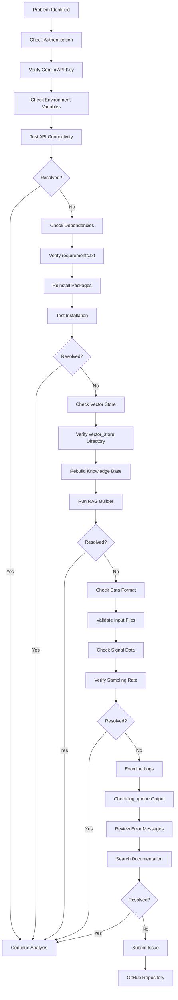

# Industrial Vibration Monitoring

<cite>
**Referenced Files in This Document**   
- [baseline_measurement.py](file://baseline_measurement.py)
- [quantitative_parameterization_module.py](file://src/core/quantitative_parameterization_module.py)
- [LLMOrchestrator.py](file://src/core/LLMOrchestrator.py)
- [create_fft_spectrum.py](file://src/tools/transforms/create_fft_spectrum.py)
- [bandpass_filter.py](file://src/tools/sigproc/bandpass_filter.py)
</cite>

## Table of Contents
1. [Introduction](#introduction)
2. [Project Structure](#project-structure)
3. [Core Components](#core-components)
4. [Architecture Overview](#architecture-overview)
5. [Detailed Component Analysis](#detailed-component-analysis)
6. [Dependency Analysis](#dependency-analysis)
7. [Performance Considerations](#performance-considerations)
8. [Troubleshooting Guide](#troubleshooting-guide)
9. [Conclusion](#conclusion)

## Introduction
This document provides a comprehensive guide to industrial vibration monitoring using the AIDA (AI-Driven Analyzer) system. The system leverages autonomous AI orchestration to analyze vibration signals from industrial equipment such as pumps, motors, and compressors. By combining signal processing tools with Large Language Model (LLM) decision-making, AIDA establishes baseline operating profiles, detects deviations, and generates actionable insights for maintenance workflows. The documentation covers both continuous and periodic monitoring use cases, explaining how the system uses various components to create effective monitoring pipelines.

## Project Structure
The AIDA system follows a modular architecture with well-defined components organized in a hierarchical directory structure. The core functionality is separated into distinct modules for better maintainability and extensibility.

**Diagram sources**
- [README.md](file://README.md#L0-L244)
- [PROJECT_DESCRIPTION.md](file://PROJECT_DESCRIPTION.md#L0-L393)

**Section sources**
- [README.md](file://README.md#L0-L244)
- [PROJECT_DESCRIPTION.md](file://PROJECT_DESCRIPTION.md#L0-L393)

## Core Components
The AIDA system comprises several core components that work together to enable autonomous vibration analysis. These components include the LLM Orchestrator for decision-making, the quantitative parameterization module for statistical analysis, and various signal processing tools for data transformation.

**Section sources**
- [LLMOrchestrator.py](file://src/core/LLMOrchestrator.py#L0-L725)
- [quantitative_parameterization_module.py](file://src/core/quantitative_parameterization_module.py#L0-L1075)

## Architecture Overview
The AIDA system follows a modular architecture that enables autonomous analysis of vibration signals through AI-driven decision making. The system integrates LLM capabilities with signal processing tools to create an intelligent monitoring solution.

**Diagram sources**
- [PROJECT_DESCRIPTION.md](file://PROJECT_DESCRIPTION.md#L100-L120)

## Detailed Component Analysis

### Baseline Measurement System
The baseline measurement system establishes normal operating profiles for industrial equipment by analyzing vibration signals and recording key performance metrics.

**Diagram sources**
- [baseline_measurement.py](file://baseline_measurement.py#L0-L173)

**Section sources**
- [baseline_measurement.py](file://baseline_measurement.py#L0-L173)

### Quantitative Parameterization Module
The quantitative parameterization module provides domain-specific metrics for different signal representations, enabling objective comparison across measurement sessions.

```mermaid
classDiagram
class calculate_quantitative_metrics {
+tool_output : Dict[str, Any]
-domain_handlers : Dict[str, Callable]
+calculate_quantitative_metrics(tool_output) Dict[str, Any]
}
class _calculate_timeseries_stats {
+data_dict : Dict[str, Any]
+_calculate_timeseries_stats(data_dict) Dict[str, float]
}
class _calculate_spectrum_stats {
+data_dict : Dict[str, Any]
+_calculate_spectrum_stats(data_dict) Dict[str, float]
}
class _calculate_spectrogram_stats {
+data_dict : Dict[str, Any]
+_calculate_spectrogram_stats(data_dict) Dict[str, Any]
}
class _calculate_cyclomap_stats {
+data_dict : Dict[str, Any]
+_calculate_cyclomap_stats(data_dict) Dict[str, Any]
}
class _calculate_nmf_stats {
+data_dict : Dict[str, Any]
+_calculate_nmf_stats(data_dict) Dict[str, Any]
}
calculate_quantitative_metrics --> _calculate_timeseries_stats : "dispatches to"
calculate_quantitative_metrics --> _calculate_spectrum_stats : "dispatches to"
calculate_quantitative_metrics --> _calculate_spectrogram_stats : "dispatches to"
calculate_quantitative_metrics --> _calculate_cyclomap_stats : "dispatches to"
calculate_quantitative_metrics --> _calculate_nmf_stats : "dispatches to"
class _extract_ids_from_path {
+image_path : Optional[str]
+_extract_ids_from_path(image_path) Tuple[Optional[str], Optional[int]]
}
class _get_fft_frequencies {
+signal_length : int
+sampling_rate : float
+_get_fft_frequencies(signal_length, sampling_rate) np.ndarray
}
class _calculate_band_energy {
+spectrum : np.ndarray
+freq_axis : np.ndarray
+freq_band : Tuple[float, float]
+_calculate_band_energy(spectrum, freq_axis, freq_band) float
}
class calculate_gini_index {
+array : np.ndarray
+calculate_gini_index(array) float
}
class estimate_alpha_stable {
+array : np.ndarray
+estimate_alpha_stable(array) float
}
class _smooth_spectrum {
+spectrum : np.ndarray
+window_size : int
+_smooth_spectrum(spectrum, window_size) np.ndarray
}
class _find_peaks {
+spectrum : np.ndarray
+min_prominence : float
+_find_peaks(spectrum, min_prominence) np.ndarray
}
class normalize_data {
+data : np.ndarray
+epsilon : float
+normalize_data(data, epsilon) np.ndarray
}
```

**Diagram sources**
- [quantitative_parameterization_module.py](file://src/core/quantitative_parameterization_module.py#L0-L1075)

**Section sources**
- [quantitative_parameterization_module.py](file://src/core/quantitative_parameterization_module.py#L0-L1075)

### LLM Orchestrator Analysis
The LLM Orchestrator manages the end-to-end autonomous analysis pipeline, coordinating between user objectives, tool execution, and result evaluation.

**Diagram sources**
- [LLMOrchestrator.py](file://src/core/LLMOrchestrator.py#L0-L725)

**Section sources**
- [LLMOrchestrator.py](file://src/core/LLMOrchestrator.py#L0-L725)

### FFT Spectrum Generation
The FFT spectrum generation tool converts time-domain vibration signals into frequency-domain representations for spectral analysis.

**Diagram sources**
- [create_fft_spectrum.py](file://src/tools/transforms/create_fft_spectrum.py#L0-L199)

**Section sources**
- [create_fft_spectrum.py](file://src/tools/transforms/create_fft_spectrum.py#L0-L199)

### Bandpass Filtering System
The bandpass filtering system isolates specific frequency bands of interest from vibration signals, enabling targeted analysis of equipment components.

**Diagram sources**
- [bandpass_filter.py](file://src/tools/sigproc/bandpass_filter.py)

**Section sources**
- [bandpass_filter.py](file://src/tools/sigproc/bandpass_filter.py)

## Dependency Analysis
The AIDA system has a well-defined dependency structure that enables modular development and easy extension of functionality. The core components depend on various external libraries and internal modules to provide comprehensive vibration analysis capabilities.

**Diagram sources**
- [requirements.txt](file://requirements.txt)
- [LLMOrchestrator.py](file://src/core/LLMOrchestrator.py#L0-L725)

## Performance Considerations
The AIDA system is designed with performance in mind, balancing computational efficiency with analytical accuracy. The system typically requires 2-5 minutes per analysis pipeline with memory usage ranging from 500MB to 2GB depending on data size. The token consumption for LLM interactions ranges from 10K to 50K tokens per analysis, supporting signals with up to 1 million samples. The system uses subprocess execution with timeout protection to prevent hanging processes, and implements state persistence through pickle-based serialization between pipeline steps. For large datasets, the system employs efficient FFT algorithms with zero-padding to the next power of two for optimal performance. The RAG (Retrieval-Augmented Generation) system uses ChromaDB with persistent storage for fast knowledge retrieval, reducing the need for repeated LLM queries. The modular tool architecture allows for selective loading of only the required components, minimizing memory footprint for specific analysis tasks.

**Section sources**
- [PROJECT_DESCRIPTION.md](file://PROJECT_DESCRIPTION.md#L300-L320)

## Troubleshooting Guide
When encountering issues with the AIDA system, follow these troubleshooting steps to identify and resolve common problems:

**Diagram sources**
- [README.md](file://README.md#L200-L244)

**Section sources**
- [README.md](file://README.md#L200-L244)

## Conclusion
The AIDA system provides a comprehensive solution for industrial vibration monitoring by combining autonomous AI decision-making with advanced signal processing techniques. The system's ability to establish baseline operating profiles through the baseline_measurement.py script enables effective deviation detection in continuous and periodic monitoring scenarios. By leveraging the quantitative_parameterization_module.py, the system provides objective metrics for comparing measurement sessions across different equipment types. The autonomous pipeline generation for FFT-based spectral trending, combined with bandpass filtering to isolate frequency bands of interest, creates a powerful analysis framework. The LLMOrchestrator adapts analysis strategies based on equipment type and operating conditions, demonstrating the system's flexibility. Automated report generation and threshold-based alerting integrate seamlessly with maintenance workflows, while the modular architecture allows for easy extension with additional tools. The system's design supports long-term data storage considerations through structured result serialization and persistent state management. Overall, AIDA represents a significant advancement in industrial vibration monitoring, providing a scalable, intelligent solution for predictive maintenance applications.