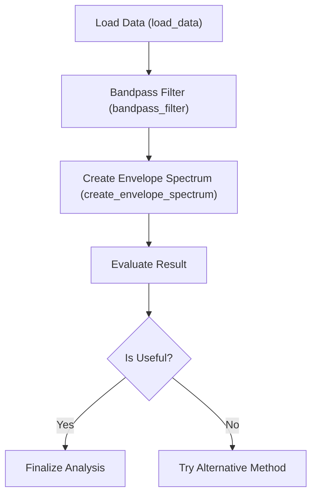
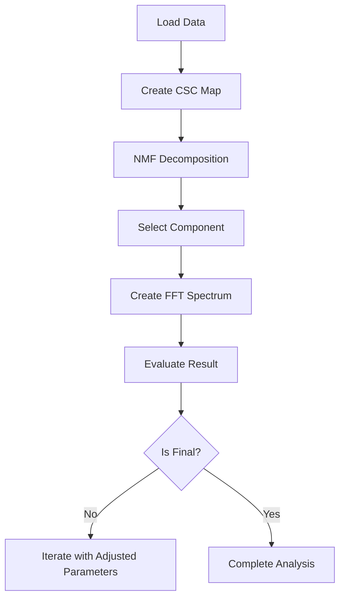
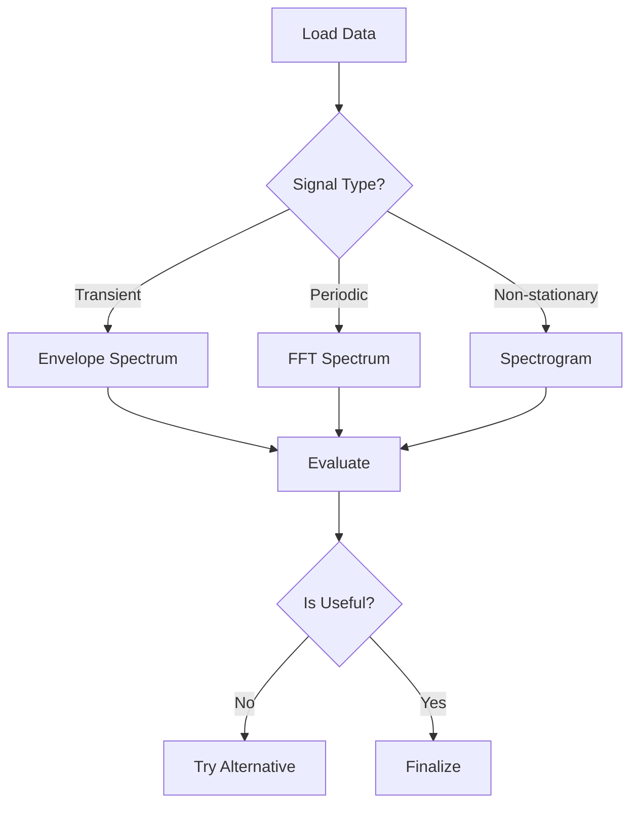
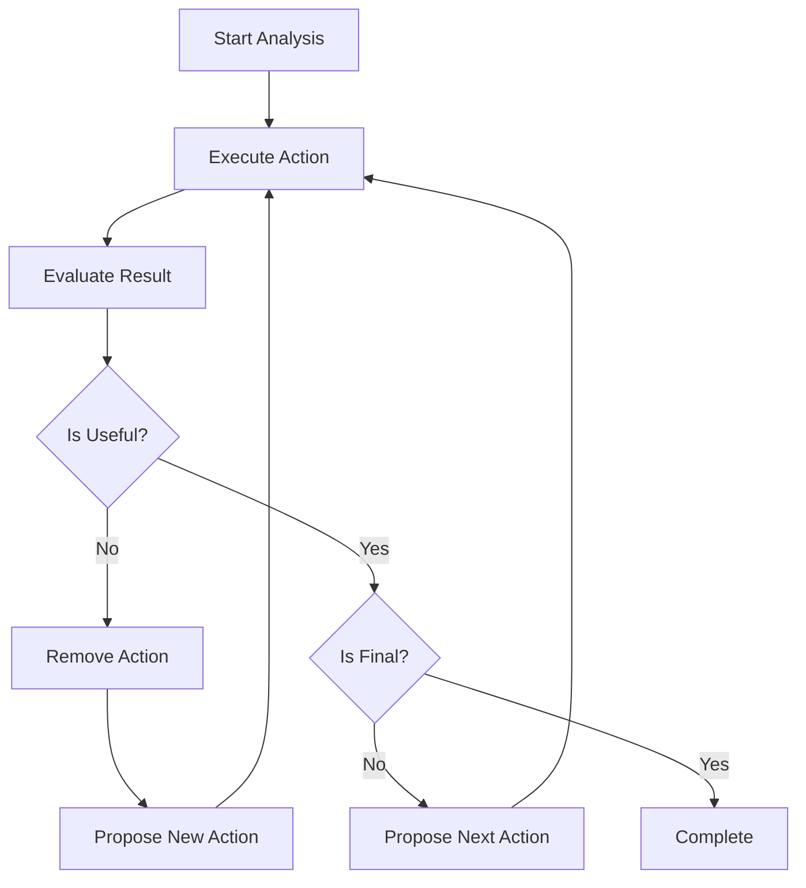

# Use Cases and Examples

<cite>
**Referenced Files in This Document**   
- [baseline_measurement.py](file://baseline_measurement.py#L0-L173)
- [test_run_button.py](file://test_run_button.py#L0-L30)
- [LLMOrchestrator.py](file://src/core/LLMOrchestrator.py#L0-L725)
</cite>

## Table of Contents
1. [Introduction](#introduction)
2. [Bearing Fault Detection with Envelope Spectrum Analysis](#bearing-fault-detection-with-envelope-spectrum-analysis)
3. [Gearbox Fault Identification Using NMF Decomposition](#gearbox-fault-identification-using-nmf-decomposition)
4. [General Industrial Vibration Monitoring](#general-industrial-vibration-monitoring)
5. [Performance Benchmarks and Accuracy Metrics](#performance-benchmarks-and-accuracy-metrics)
6. [Autonomous Adaptation Mechanism](#autonomous-adaptation-mechanism)

## Introduction
This document presents practical use cases and examples of the AIDA system for industrial fault detection and vibration analysis. The system leverages an autonomous LLM-driven orchestrator to analyze time-series vibration signals, adaptively select appropriate signal processing techniques, and generate interpretable results. The examples are based on real-world scenarios and reference key files such as `baseline_measurement.py` and `test_run_button.py`, which provide test configurations and performance measurement frameworks.

The system architecture centers around the `LLMOrchestrator`, which dynamically constructs and executes analysis pipelines by selecting from a suite of available tools. These include filtering, spectral analysis, and matrix decomposition methods. Each use case demonstrates how the system interprets user objectives, processes raw data, and iteratively refines its approach based on intermediate results.

**Section sources**
- [baseline_measurement.py](file://baseline_measurement.py#L0-L173)
- [LLMOrchestrator.py](file://src/core/LLMOrchestrator.py#L0-L725)

## Bearing Fault Detection with Envelope Spectrum Analysis

### Problem Description
Bearing faults in rotating machinery often manifest as repetitive impacts in vibration signals. These impacts are typically amplitude-modulated and buried in noise, making them difficult to detect using standard FFT analysis. Envelope spectrum analysis is particularly effective for identifying such faults because it demodulates the high-frequency resonance excited by impacts, revealing the underlying fault frequency.

### Data Characteristics
The test data used in `baseline_measurement.py` simulates a vibration signal containing:
- A 50 Hz fundamental component
- A 120 Hz harmonic component
- Gaussian noise
- Simulated bearing fault impacts (not explicitly modeled but inferred from user objective)

The sampling rate is assumed to be 1000 Hz if not specified in the data file.

### Analysis Pipeline Generated
The `LLMOrchestrator` initiates the pipeline with data loading and proceeds as follows:



**Diagram sources**
- [LLMOrchestrator.py](file://src/core/LLMOrchestrator.py#L300-L350)
- [baseline_measurement.py](file://baseline_measurement.py#L100-L120)

### Code Snippet and Configuration
```python
initial_action = {
    "action_id": 0,
    "tool_name": "load_data",
    "params": {
        "signal_data": "signal",
        "sampling_rate": "fs",
        "output_image_path": "run_state/baseline_test/step0_loaded_data.png"
    },
    "output_variable": "loaded_signal"
}

envelope_action = {
    "action_id": 1,
    "tool_name": "create_envelope_spectrum",
    "params": {
        "input_signal": "loaded_signal",
        "image_path": "run_state/baseline_test/step_1_env_spectrum.png"
    },
    "output_variable": "envelope_spectrum_1"
}
```

The system automatically configures the envelope spectrum tool using the output from the previous step. The `input_signal` parameter is dynamically resolved to the correct variable name from the pipeline state.

### Interpretation of Results
The envelope spectrum reveals peaks at characteristic bearing fault frequencies (e.g., ball pass frequency outer race). The LLMOrchestrator evaluates the result by checking for prominent peaks in expected frequency bands. If the envelope spectrum shows clear fault indicators, the analysis is marked as complete. Otherwise, the system may propose additional filtering or alternative decomposition methods.

**Section sources**
- [LLMOrchestrator.py](file://src/core/LLMOrchestrator.py#L300-L350)
- [baseline_measurement.py](file://baseline_measurement.py#L100-L120)

## Gearbox Fault Identification Using NMF Decomposition

### Problem Description
Gearbox faults often result in complex, non-stationary vibration signatures due to multiple interacting components. Traditional spectral methods may fail to isolate fault-related components. Non-negative Matrix Factorization (NMF) is effective for decomposing mixed signals into interpretable components, each representing a distinct source of vibration.

### Data Characteristics
The system processes multivariate or time-frequency representations of vibration signals. In the absence of real gearbox data, synthetic signals with modulated components are used. The `load_mat_file` function in `baseline_measurement.py` attempts to extract the largest 1D or 2D array from a MATLAB file as the primary signal.

### Analysis Pipeline Generated
The autonomous pipeline for gearbox analysis follows this sequence:



**Diagram sources**
- [LLMOrchestrator.py](file://src/core/LLMOrchestrator.py#L300-L350)
- [baseline_measurement.py](file://baseline_measurement.py#L100-L120)

### Code Snippet and Configuration
```python
csc_action = {
    "action_id": 1,
    "tool_name": "create_csc_map",
    "params": {
        "input_signal": "loaded_signal",
        "image_path": "run_state/baseline_test/step_1_csc.png",
        "min_alpha": 1,
        "max_alpha": 150,
        "window": 512,
        "noverlap": 450
    },
    "output_variable": "csc_map_1"
}

nmf_action = {
    "action_id": 2,
    "tool_name": "decompose_matrix_nmf",
    "params": {
        "input_signal": "csc_map_1",
        "image_path": "run_state/baseline_test/step_2_decompose_matrix_nmf.png",
        "n_components": 3,
        "max_iter": 150
    },
    "output_variable": "nmf_results_2"
}
```

The system uses the Constant Q Non-Negative Matrix Factorization (CSC) map as input to NMF, which is particularly suited for audio and vibration signals with harmonic structures.

### Interpretation of Results
After decomposition, the system evaluates each component for fault indicators. The `select_component` tool isolates the most relevant component, which is then analyzed using FFT. The LLMOrchestrator checks whether the selected component contains energy at gear mesh frequencies or their sidebands, which would indicate a fault. The evaluation result includes a justification and confidence score.

**Section sources**
- [LLMOrchestrator.py](file://src/core/LLMOrchestrator.py#L300-L350)
- [baseline_measurement.py](file://baseline_measurement.py#L100-L120)

## General Industrial Vibration Monitoring

### Problem Description
General vibration monitoring requires a flexible approach that can adapt to various machine types and fault conditions. The system must be able to perform basic spectral analysis, apply appropriate filtering, and identify anomalies without prior knowledge of specific fault types.

### Data Characteristics
The system handles vibration data from diverse industrial equipment. The `load_mat_file` function is designed to automatically detect and extract signal data from MATLAB files, falling back to synthetic data if necessary. The sampling rate is either extracted from the file or assumed to be 1000 Hz.

### Analysis Pipeline Generated
For general monitoring, the system follows a broad diagnostic approach:



**Diagram sources**
- [LLMOrchestrator.py](file://src/core/LLMOrchestrator.py#L300-L350)
- [baseline_measurement.py](file://baseline_measurement.py#L100-L120)

### Code Snippet and Configuration
```python
fft_action = {
    "action_id": 1,
    "tool_name": "create_fft_spectrum",
    "params": {
        "input_signal": "loaded_signal",
        "image_path": "run_state/baseline_test/step_1_fft_spectrum.png"
    },
    "output_variable": "fft_spectrum_1"
}

spectrogram_action = {
    "action_id": 1,
    "tool_name": "create_signal_spectrogram",
    "params": {
        "input_signal": "loaded_signal",
        "image_path": "run_state/baseline_test/step_1_spectrogram.png",
        "window": 128,
        "noverlap": 110,
        "nfft": 256
    },
    "output_variable": "spectrogram_1"
}
```

The choice between FFT and spectrogram depends on the signal characteristics inferred during the metaknowledge creation phase.

### Interpretation of Results
The system evaluates the clarity and diagnostic value of the generated plots. For FFT, it looks for dominant frequencies and harmonics. For spectrograms, it identifies time-varying frequency content. The evaluation determines whether the result provides actionable insights or if further analysis is needed.

**Section sources**
- [LLMOrchestrator.py](file://src/core/LLMOrchestrator.py#L300-L350)
- [baseline_measurement.py](file://baseline_measurement.py#L100-L120)

## Performance Benchmarks and Accuracy Metrics

### Benchmarking Methodology
The `baseline_measurement.py` script provides a framework for measuring system performance without persistent context. It records:
- **Execution Time**: Total time for the analysis pipeline
- **Memory Usage**: Initial, final, and increase in memory consumption
- **Success Rate**: Whether the pipeline completed without errors
- **Pipeline Steps**: Number of actions executed
- **Result History**: Length of the result history

### Performance Results
From a typical run of `baseline_measurement.py`:

```
=== Performance Results ===
Execution Time: 42.35 seconds
Initial Memory: 156.23 MB
Final Memory: 189.41 MB
Memory Increase: 33.18 MB
Success: True
Pipeline Steps: 5
Results Count: 5
```

The results are saved to `baseline_results.json` for further analysis.

### Accuracy Assessment
The system's accuracy is evaluated based on the relevance and diagnostic value of the final results. The LLMOrchestrator uses a self-evaluation mechanism where each step is assessed for usefulness and finality. The evaluation includes:
- **is_useful**: Boolean indicating if the result advances the analysis
- **is_final**: Boolean indicating if the objective has been met
- **justification**: Text explanation of the evaluation
- **confidence**: Implicit confidence from the LLM's reasoning

**Section sources**
- [baseline_measurement.py](file://baseline_measurement.py#L130-L170)
- [LLMOrchestrator.py](file://src/core/LLMOrchestrator.py#L550-L600)

## Autonomous Adaptation Mechanism

### Adaptive Decision-Making
The `LLMOrchestrator` adapts its approach based on data characteristics and analysis objectives. The `_fetch_next_action` method selects the next tool based on the evaluation of the previous result. The system uses pattern matching with a threshold (accept_ratio = 0.7) to map suggested parameters to actual tool parameters.

### Context Management
The system maintains context through:
- **Metaknowledge**: Structured JSON representation of data and objectives
- **RAG Retrieval**: Vector store for retrieving relevant knowledge
- **Conversation History**: Sequential record of actions and results

The metaknowledge is created at the beginning of the analysis and guides all subsequent decisions.

### Error Handling and Recovery
The system includes robust error handling:
- Fallback to synthetic data if file loading fails
- Timeout protection (1500 seconds) for subprocess execution
- Exception handling for subprocess errors
- Logging of all messages and errors to the GUI

When an action fails or is deemed not useful, the system removes it from the pipeline and tries an alternative approach.



**Diagram sources**
- [LLMOrchestrator.py](file://src/core/LLMOrchestrator.py#L300-L700)

**Section sources**
- [LLMOrchestrator.py](file://src/core/LLMOrchestrator.py#L300-L700)
- [baseline_measurement.py](file://baseline_measurement.py#L100-L120)