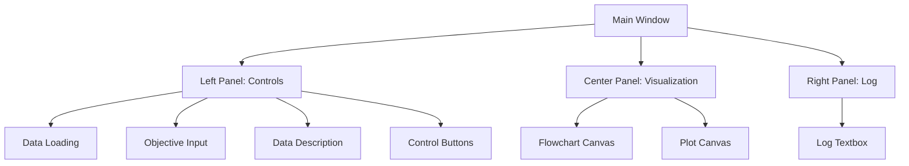
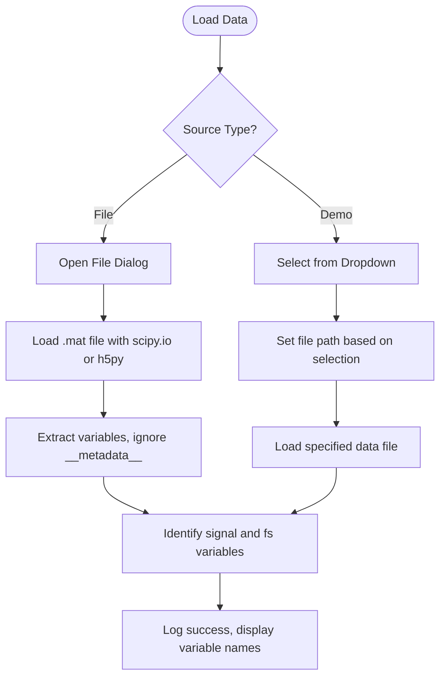
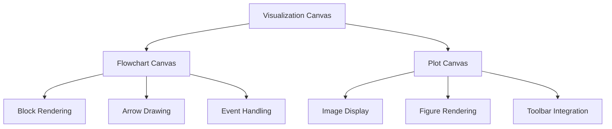
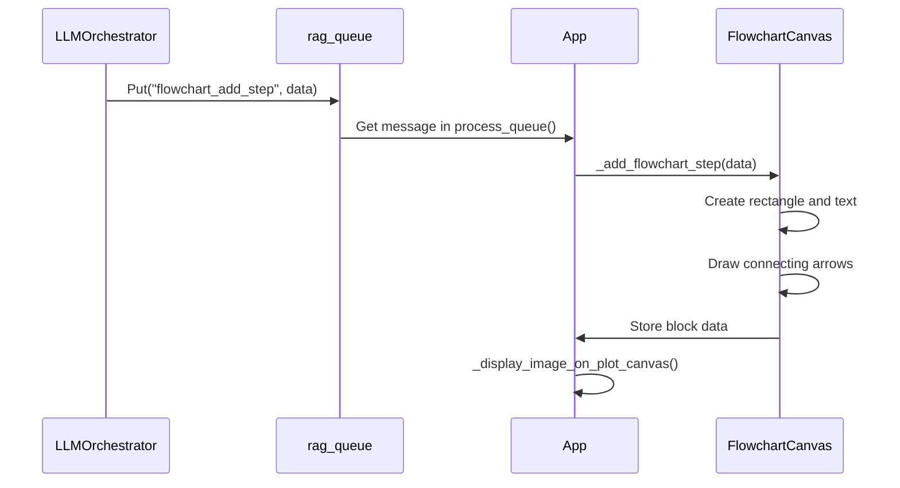
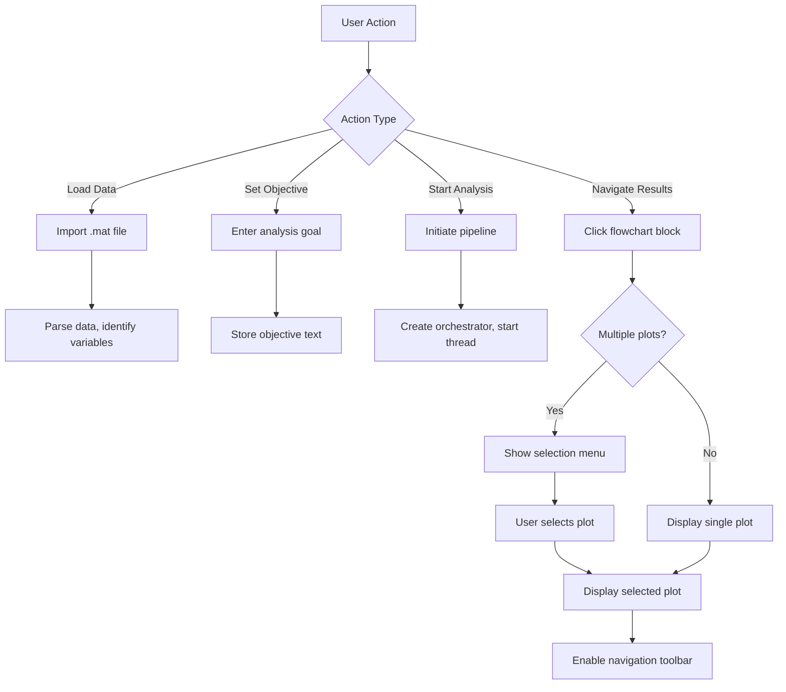
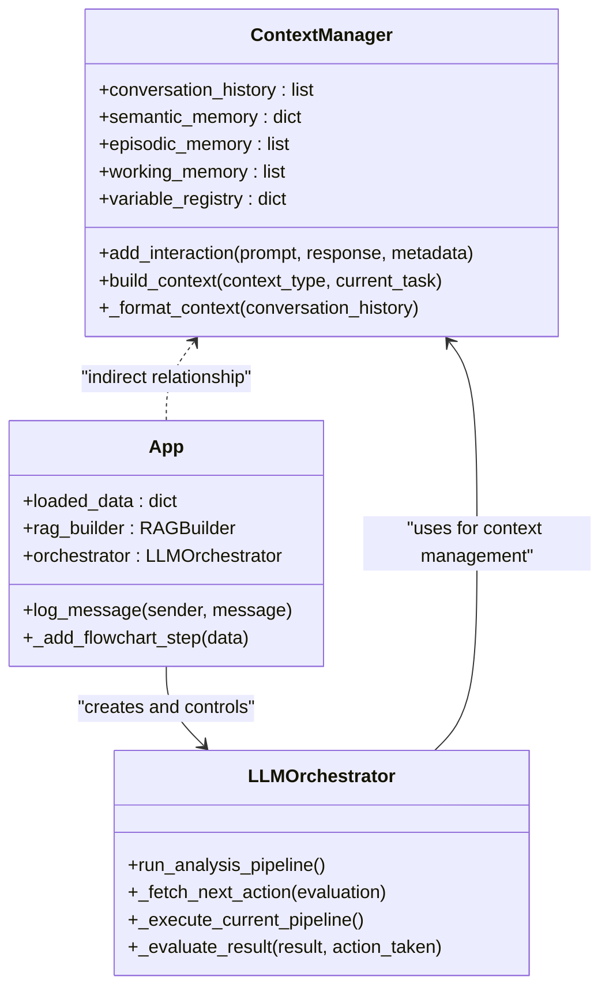
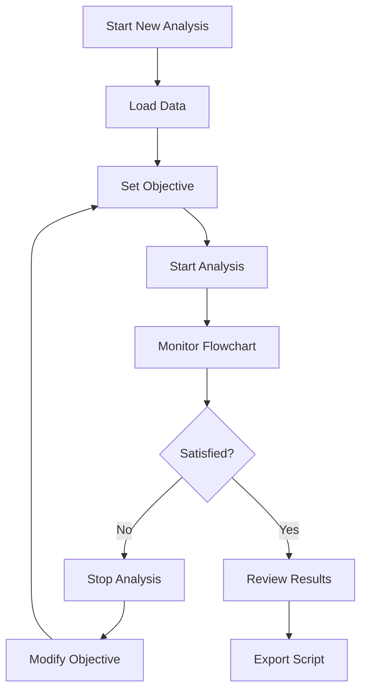

# User Interface Guide

<cite>
**Referenced Files in This Document**   
- [main_window.py](file://src/gui/main_window.py) - *Updated in recent commit*
- [LLMOrchestrator.py](file://src/core/LLMOrchestrator.py) - *Updated in recent commit*
- [ContextManager.py](file://src/core/ContextManager.py) - *Updated in recent commit*
- [load_data.py](file://src/tools/utils/load_data.py)
- [create_fft_spectrum.py](file://src/tools/transforms/create_fft_spectrum.py)
- [create_signal_spectrogram.py](file://src/tools/transforms/create_signal_spectrogram.py)
- [TOOLS_REFERENCE.md](file://src/docs/TOOLS_REFERENCE.md)
</cite>

## Update Summary
**Changes Made**   
- Updated documentation to reflect implementation of persistent context management
- Added details on ContextManager integration with LLMOrchestrator
- Enhanced backend integration section with new context flow information
- Updated class diagram to include ContextManager interactions
- Added new section on context persistence mechanism

## Table of Contents
1. [Introduction](#introduction)
2. [Main Window Layout](#main-window-layout)
3. [Data Loading Panel](#data-loading-panel)
4. [Objective Input Field](#objective-input-field)
5. [Visualization Canvas](#visualization-canvas)
6. [Flowchart Navigator](#flowchart-navigator)
7. [Control Buttons](#control-buttons)
8. [User Interaction Patterns](#user-interaction-patterns)
9. [Backend Integration](#backend-integration)
10. [Common Workflows](#common-workflows)
11. [Accessibility and Responsive Behavior](#accessibility-and-responsive-behavior)
12. [Visual Output Interpretation](#visual-output-interpretation)

## Introduction

The AIDA (AI-Driven Analyzer) application provides an interactive graphical interface for autonomous data analysis using Large Language Models (LLMs). The interface enables users to load time-series data, define analysis objectives, and visualize the AI-generated analysis pipeline. Built with CustomTkinter, the application features a modern dark theme with intuitive controls and real-time feedback mechanisms. This guide details the user interface components, interaction patterns, and integration with backend processes.

## Main Window Layout

The main application window is organized into three primary vertical panels:

- **Left Panel**: Controls and input fields
- **Center Panel**: Visualization canvas with flowchart and result plots
- **Right Panel**: Log output and system messages

The window is configured with a fixed size of 1800x1000 pixels and uses a dark color scheme (#1a202c) for improved visual comfort during extended analysis sessions.



**Diagram sources**
- [main_window.py](file://src/gui/main_window.py#L45-L648)

## Data Loading Panel

The data loading panel provides multiple methods for importing time-series data into the application.

### File-Based Loading
The "Load Data File (.mat)" button opens a file dialog allowing users to select MATLAB (.mat) files. The application supports both scipy.io and h5py formats for reading MAT files, ensuring compatibility with different MATLAB versions.

**Section sources**
- [main_window.py](file://src/gui/main_window.py#L315-L368)

### Demo Data Selection
A dropdown menu provides access to pre-configured demo datasets:
- **Kruszarka**: Vibration signal sampled at 25 kHz with theoretical fault frequency of 30.7 Hz
- **Łożysko B**: Vibration signal sampled at 19.2 kHz with theoretical fault frequency of 12.7 Hz  
- **Przekładnia**: Gearbox vibration signal sampled at 8192 Hz with unknown fault frequencies

Selecting a demo dataset automatically loads the corresponding data file and populates the objective and data description fields with appropriate values.



**Diagram sources**
- [main_window.py](file://src/gui/main_window.py#L120-L180)
- [main_window.py](file://src/gui/main_window.py#L315-L368)

## Objective Input Field

The objective input field allows users to define the analysis goal in natural language. This text is sent to the LLM orchestrator to guide the autonomous pipeline generation.

### Functionality
- **Text Input**: Multi-line text box for entering detailed analysis objectives
- **Auto-Population**: Demo dataset selection automatically fills this field with appropriate objectives
- **Validation**: The application checks for non-empty input before starting analysis

### Example Objectives
- "Detect bearing faults in vibration signals"
- "Identify periodic components in the time series" 
- "Perform spectral analysis to find dominant frequencies"
- "Decompose signal into meaningful components"

The objective, combined with the data description, forms the primary guidance for the LLM orchestrator when designing the analysis pipeline.

**Section sources**
- [main_window.py](file://src/gui/main_window.py#L200-L205)

## Data Description Input

The data description input field provides contextual information about the loaded data to the analysis system.

### Purpose
- Describe data characteristics (sampling rate, measurement conditions)
- Specify known parameters (theoretical fault frequencies)
- Provide domain-specific knowledge that may aid analysis

### Auto-Populated Content
When loading demo datasets, the application automatically populates this field with relevant information:
- Sampling frequency
- Measurement location
- Expected fault characteristics
- Frequency band considerations

This contextual information is crucial for the LLM orchestrator to make informed decisions about appropriate analysis techniques.

**Section sources**
- [main_window.py](file://src/gui/main_window.py#L120-L180)

## Visualization Canvas

The visualization canvas consists of two primary components: the flowchart navigator and the result plot display.

### Flowchart Canvas
Located in the upper center panel, this canvas displays the sequence of analysis steps as a horizontal flowchart. Each step is represented as a rectangular block with:
- Action ID and tool name
- Output variable name
- Connecting arrows showing execution order

The canvas supports vertical stacking when the horizontal space is exhausted.

### Plot Canvas
Located below the flowchart, this canvas displays the visual output of the selected analysis step. It supports:
- Static image display (PNG)
- Interactive matplotlib figures (via pickle)
- Navigation toolbar for zooming and panning



**Diagram sources**
- [main_window.py](file://src/gui/main_window.py#L250-L270)

## Flowchart Navigator

The flowchart navigator provides a visual representation of the analysis pipeline as it is constructed and executed.

### Block Structure
Each flowchart block contains:
- **Header**: Action ID and tool name in bold white text
- **Footer**: Output variable name in lighter gray text
- **Dynamic Width**: Blocks resize based on content length

### Interaction Features
- **Click to Select**: Clicking a block displays the corresponding result plot
- **Multiple Plots**: If multiple plots exist for a step, a dropdown menu appears for selection
- **Sequential Layout**: Blocks are arranged left-to-right, wrapping to new rows as needed

### Update Mechanism
The flowchart is updated in real-time via a queue-based messaging system. When the LLM orchestrator completes a step, it sends a message containing:
- Action ID
- Tool name
- Output variable
- Image path

The GUI processes this message to add the corresponding block to the flowchart.



**Diagram sources**
- [main_window.py](file://src/gui/main_window.py#L550-L648)
- [LLMOrchestrator.py](file://src/core/LLMOrchestrator.py#L150-L170)

## Control Buttons

The application provides several control buttons for managing the analysis process.

### Available Buttons
- **Load Data File (.mat)**: Opens file dialog for data import
- **Build RAG Index**: Creates a vector index from knowledge base documents
- **Load RAG Index**: Loads a pre-built vector index
- **Start Analysis**: Initiates the autonomous analysis pipeline

### Button States
Buttons are disabled during certain operations to prevent conflicting actions:
- Build/Load RAG buttons are disabled during index creation
- Start Analysis is disabled until data is loaded and objectives are specified
- All buttons are disabled during analysis execution

### Iconography
Each button includes a descriptive icon:
- **File Plus**: Data loading
- **Library**: RAG index building
- **Folder Down**: RAG index loading
- **Play**: Start analysis

**Section sources**
- [main_window.py](file://src/gui/main_window.py#L210-L245)

## User Interaction Patterns

The application supports several key interaction patterns for efficient analysis.

### Drag-and-Drop Data Loading
While the primary method is file selection via dialog, the application could be extended to support drag-and-drop functionality for data files, providing a more intuitive user experience.

### Real-time Flowchart Updates
As the analysis progresses, the flowchart updates in real-time, providing immediate visual feedback on the pipeline construction. Each new step appears as a block with connecting arrows from the previous step.

### Result Visualization
Users can interact with results through:
- **Click Navigation**: Click any flowchart block to view its output
- **Plot Selection**: When multiple plots exist, select from a dropdown menu
- **Interactive Tools**: Use matplotlib navigation toolbar for zooming and panning



**Diagram sources**
- [main_window.py](file://src/gui/main_window.py#L550-L648)

## Backend Integration

The user interface integrates with backend components through well-defined interfaces.

### ContextManager Integration
The ContextManager class maintains conversation history and builds contextual prompts for the LLM. It is now fully integrated with the LLMOrchestrator to provide persistent context management across analysis steps.



**Diagram sources**
- [ContextManager.py](file://src/core/ContextManager.py#L1-L44)
- [LLMOrchestrator.py](file://src/core/LLMOrchestrator.py#L1-L725)
- [main_window.py](file://src/gui/main_window.py#L1-L648)

### LLMOrchestrator Communication
The GUI communicates with the LLMOrchestrator through:
- **Queue-based Messaging**: Thread-safe communication via Python's queue.Queue
- **Event-driven Updates**: The GUI periodically checks the queue for new messages
- **Asynchronous Execution**: Analysis runs in a separate thread to prevent UI freezing

### Data Flow
1. User inputs → GUI components
2. GUI → LLMOrchestrator initialization
3. LLMOrchestrator → Tool execution
4. Tool results → Queue messages
5. Queue → GUI visualization updates

**Section sources**
- [main_window.py](file://src/gui/main_window.py#L100-L110)
- [LLMOrchestrator.py](file://src/core/LLMOrchestrator.py#L150-L170)

## Common Workflows

The application supports several common analysis workflows.

### Starting a New Analysis
1. Load data via file dialog or demo selection
2. Enter analysis objective in natural language
3. Provide data description with relevant context
4. Click "Start Analysis" to initiate the pipeline

The system validates inputs before starting and provides feedback through the log panel.

### Reviewing Intermediate Results
1. Monitor the flowchart as steps are added
2. Click any completed step to view its output
3. Use the navigation toolbar to explore plot details
4. Review log messages for LLM reasoning and decisions

Intermediate results are preserved throughout the analysis, allowing users to compare different stages.

### Modifying Objectives Mid-Pipeline
While the current implementation does not support mid-pipeline objective changes, users can:
1. Stop the current analysis (by closing the application)
2. Modify the objective and data description
3. Restart the analysis from the beginning

Future versions could implement checkpointing to resume from previous states with modified objectives.



**Section sources**
- [main_window.py](file://src/gui/main_window.py#L400-L440)

## Accessibility and Responsive Behavior

The application incorporates several accessibility and responsive design features.

### Color Scheme
- **Dark Theme**: Reduces eye strain during prolonged use
- **High Contrast**: Text and interface elements have sufficient contrast against background
- **Color Coding**: Log messages use different colors for different senders

### Layout Behavior
- **Fixed Size**: Ensures consistent appearance across systems
- **Grid Layout**: Components resize proportionally within their panels
- **Scrollable Elements**: Flowchart canvas includes vertical scrollbar

### Keyboard Navigation
While not explicitly implemented, the CustomTkinter framework provides basic keyboard navigation support for form elements and buttons.

### Responsive Considerations
The interface is designed for high-resolution displays (1800x1000 minimum). On smaller screens, users may need to scroll to access all components.

**Section sources**
- [main_window.py](file://src/gui/main_window.py#L45-L60)

## Visual Output Interpretation

Understanding the visual outputs is crucial for effective analysis.

### Flowchart Interpretation
- **Sequence**: Left-to-right reading indicates execution order
- **Block Colors**: Consistent gray (#4a5568) with blue (#63b3ed) borders
- **Arrows**: Blue arrows show data flow between steps
- **Wrapping**: New rows indicate logical groupings or pipeline branches

### Result Plot Types
Different analysis tools generate specific visualizations:

#### FFT Spectrum
- **Purpose**: Frequency domain analysis
- **X-axis**: Frequency (Hz)
- **Y-axis**: Amplitude
- **Features**: Peaks indicate dominant frequencies

```python
# Example FFT spectrum generation
result = create_fft_spectrum(
    data={'primary_data': 'signal', 'signal': signal_data, 'sampling_rate': fs},
    output_image_path='fft_spectrum.png'
)
```

**Section sources**
- [create_fft_spectrum.py](file://src/tools/transforms/create_fft_spectrum.py#L1-L200)

#### Spectrogram
- **Purpose**: Time-frequency representation
- **X-axis**: Time (s)
- **Y-axis**: Frequency (Hz)
- **Color**: Intensity of frequency components over time
- **Features**: Vertical lines indicate impulsive events

```python
# Example spectrogram generation
result = create_signal_spectrogram(
    data={'primary_data': 'signal', 'signal': signal_data, 'sampling_rate': fs},
    output_image_path='spectrogram.png',
    nperseg=128,
    noverlap=110,
    nfft=256
)
```

**Section sources**
- [create_signal_spectrogram.py](file://src/tools/transforms/create_signal_spectrogram.py#L1-L250)

#### Signal Data
- **Purpose**: Time-domain visualization
- **X-axis**: Time (s)
- **Y-axis**: Amplitude
- **Features**: Waveform characteristics, impulsive components

### Navigation History
The application maintains execution history through:
- **Flowchart**: Visual representation of all steps
- **Log Panel**: Textual record of system messages
- **Run State**: Persistent storage of results in ./run_state/{run_id}

Users can navigate back to any previous step by clicking its flowchart block, enabling comprehensive review of the analysis process.

**Section sources**
- [main_window.py](file://src/gui/main_window.py#L550-L648)
- [LLMOrchestrator.py](file://src/core/LLMOrchestrator.py#L150-L170)