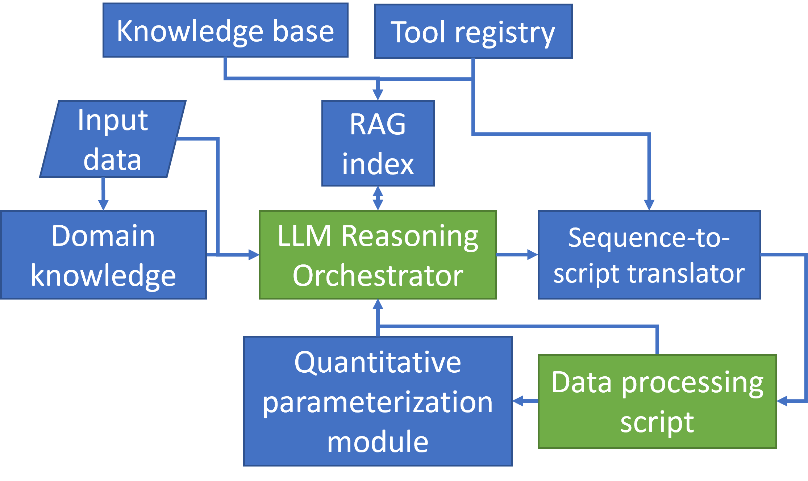
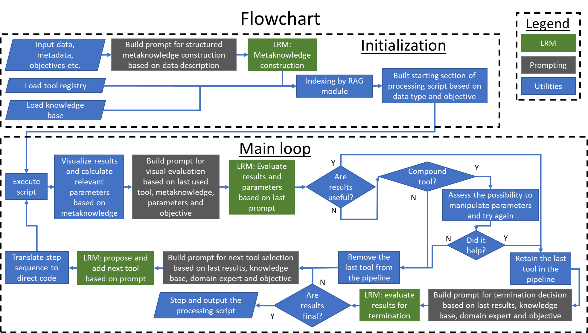

# **Project Brief: Autonomous LLM-Orchestrated Data Analysis Pipeline**

## **1\. Project Vision & Core Concept**

**Goal:** To develop a system that autonomously designs and executes a data analysis pipeline.

**Core Concept:** The system will be orchestrated by a Large Language Model (LLM). Instead of a human manually selecting tools and parameters, the LLM will iteratively plan, execute, and evaluate analysis steps to achieve a user-defined objective. The final output is a complete, validated data processing script.

## **2\. Key Technologies & Models**

* **Primary LRM:** Google Gemini 2.0 / 2.5 Flash authenticated using Gemini CLI (no API key) for higher rates.  
  * **Reasoning:** Chosen for its superior reasoning capabilities, a massive 1-million-token context window, and native multimodal features. The reasoning quality is prioritized for the core orchestration task, with its rate limits being sufficient for the system's iterative, non-real-time workflow.  
* **Knowledge Integration:** Retrieval-Augmented Generation (RAG).  
  * **Reasoning:** To provide the LLM with specialized, domain-specific knowledge without the need for expensive fine-tuning.  
  * **Analogy:** RAG is like giving the model an open-book exam. The model doesn't have to memorize the entire knowledge beforehand; it just needs to be good at quickly reading and understanding the specific pages you hand it when you ask a question.  
* **Development Stack:** Python, utilizing libraries for data science (numpy, scipy, pandas), RAG indexing (LangChain), PDF processing (PyMuPDF), vector databases (ChromaDB), and API interaction (google-generativeai, openai).

## **3\. System Architecture**

The system is composed of several key modules:

* **LRM Orchestrator:** The central "brain" of the system. It makes all decisions regarding the analysis plan, tool selection, and evaluation.  
* **Data Processing Script:** The "hands" of the system. This is a dynamically generated Python script that the Orchestrator builds and executes to perform the actual data manipulation and analysis.  
* **Code Translator:** A deterministic module that translates action sequence into direct Python code.  
* **RAG Index:** The specialized "memory" of the system. It is a searchable vector index of the knowledge base and tool base.  
* **Knowledge Base:** A curated collection of documents providing domain expertise.  
  * **Content:** Scientific articles (personal papers, simple tutorials, and classic theoretical papers), tool documentation, and codified domain rules. This will be indexed offline.  
* **Tool Registry:** A structured description of all available analysis tools and their functionalities. This is also indexed by the RAG module.  
* **Input Module:** Handles initial user inputs: raw data (e.g., CSV), metadata, and the high-level analysis objective.  
* **Visual & Quantitative Feedback:** After a script is run, results are processed for LRM evaluation.  
  * **Visual Analysis:** 2D data representations (charts, graphs) are generated and fed back to the multimodal LRM for qualitative assessment.  
  * **Quantitative Parameterization:** Relevant metrics are calculated from the output data to provide quantitative feedback.




  
## **4\. Metaknowledge Format**

At the start of each run, the LLM Orchestrator will convert the user's plain-text data description and objective into a structured **Metaknowledge JSON object**. This object serves as the foundational "understanding" of the task for all subsequent steps.

* **Purpose:** To provide unambiguous, machine-readable context to the orchestrator, driving tool selection and hypothesis generation.  
* **Format:** The JSON object will adhere to a strict schema to ensure reliability.

### **Example Metaknowledge Schema & Content:**
```
{  
  "data_summary": {  
    "type": "single-channel time-series",  
    "domain": "vibration signal",  
    "sampling_frequency_hz": 50000,  
    "signal_length_sec": 2.0,  
    "properties": [  
      "stationary operating conditions assumed"  
    ]  
  },  
  "system_context": {  
    "type": "industrial bearing",  
    "configuration": "stationary outer race",  
	"shaft_frequency_hz": 24,	
    "characteristic_frequencies": {  
      "bpfi_ratio": 3.5,  
      "bpfo_ratio": 3.2,  
      "ftf_ratio": 2.9,  
      "bsf_ratio": 4.1  
    }  
  },  
  "analysis_objective": {  
    "primary_goal": "Confirm the presence of a cyclic impulsive component related to a specific fault.",  
    "target_fault_type": "inner race damage",  
    "target_signal_feature": "cyclic impulses",  
    "fallback_goal": "If no fault type is specified, identify the most prominent cyclic component and test against all characteristic frequencies."  
  },  
  "initial_hypotheses": [  
    "The signal contains a cyclic impulsive component with a modulating frequency of 3.5 times the shaft's rotational speed.",  
    "This component will manifest as repeating vertical striations in a time-frequency representation.",  
    "The carrier frequency band for this fault signature can be identified visually from a spectrogram."  
  ]  
}
```
## **5\. Tooling Philosophy: The Wrapper Approach**

The system will **not** call external library functions (e.g., from numpy, scipy) directly. Instead, it will rely on a **custom Tool Library of wrapper functions**. This approach seamlessly accommodates both pre-existing custom tools and new functions that wrap standard libraries.

* **Implementation:** Each "tool" available to the LRM will be a custom Python function. Internally, these functions will leverage standard, robust libraries, as well as custom algorithms prepared by the author of the system, to perform the actual computation.  
* **Reasoning:** This hybrid approach provides the best of both worlds. It gives the LRM the high-quality, structured, and strategic context needed for reliable decision-making, while still harnessing the power of existing libraries. It makes the system's behavior more predictable and controllable.  
  * **Resolves Ambiguity:** When multiple tools can achieve a similar objective (e.g., Spectrogram vs. Cyclic Spectral Coherence), the detailed documentation allows the LRM to make a nuanced choice based on the specific context, data characteristics, or desired downstream analysis paths.

## **6\. Tool Documentation Format**

To ensure reliable retrieval, parsing, and comparison by the LLM, all tool documentation files fed into the RAG index **must** adhere to the following standardized Markdown schema:
```
# Tool: [callable_function_name]

## 1. Purpose  
A concise, one-sentence description of the tool's high-level function.  
*Example: "Performs signal decomposition using Non-negative Matrix Factorization."*

## 2. Strategic Advice  
High-level guidance on when and why to use this tool in an analysis pipeline.  
*Example: "Use this tool to separate a spectrogram into its constituent parts..."*

## 3. Input Specification  
- **Data Structure:** The required Python data type and shape.  
  *Example: 2D NumPy array (frequency bins, time steps).*  
- **Domain:** The scientific context of the input data.  
  *Example: Time-Frequency Matrix (e.g., a Spectrogram).*

## 4. Output Specification  
- **Data Structure:** The Python data type and shape of the output.  
  *Example: A Python dictionary containing two 2D NumPy arrays.*  
- **Domain / Context:** The scientific meaning of the output data structures.  
  *Example: `{'temporal_features': ..., 'spectral_features': ...}`.*

## 5. Parameters  
A structured table describing the function's arguments.

| Name | Type | Description | Required | Default |  
|---|---|---|---|---|  
| `n_components` | int | The number of features to extract. | Yes | `None` |  
| `tolerance` | float | The convergence tolerance. | No | `1e-4` |

## 6. Next Steps Enabled  
A list of logical downstream analysis steps that this tool's output makes possible.  
*Example: "The output feature matrices can be used for clustering..."*

## 7. Example Usage  
A clear, simple Python code snippet demonstrating how the tool is called.  
``python  
# Example code goes here
```

## **7\. Script Generation & Management: The Action-Based Model**

To ensure robustness and avoid errors associated with direct code manipulation by the LLM, the system will manage the data processing script as a list of structured `Action` objects, not as a raw text file.

* **LLM Output is a Decision, Not Code:** When the orchestrator decides on the next step, its output will be a JSON object representing a single `Action`, not a raw Python code string.  
* **The Pipeline as a List of Actions:** The entire analysis pipeline is maintained in memory as a list of these `Action` objects. This creates a **stack-like structure**, where new actions can be pushed to the end, and the most recent actions can be popped off for self-correction.  
* **Deterministic Translation:** A dedicated, reliable translator module within the system will iterate through the list of actions and generate the full, executable Python script. This process is deterministic and guarantees syntactically correct code.  
* **Safe Self-Correction:** When the LLM determines a step was not useful, the system simply removes the last `Action` object from the list (`pipeline_steps.pop()`) and regenerates the script. This is 100% safe and avoids fragile text manipulation.
* **State Management:**  
  * **Phase 1 (Prototype):** For simplicity, the entire generated script will be re-executed from the beginning at every iteration.  
  * **Long-Term Vision:** To optimize performance, the output of each `Action` will be saved to a dedicated, uniquely named file (e.g., a .pkl file). Subsequent actions will load data from these files instead of re-computing, enabling efficient, stateful execution.

**Example pipeline\_steps list:**
```
pipeline_steps = [  
    {  
        "action_id": 1,  
        "tool_name": "load_bearing_data",  
        "params": {"file_path": "bearing_data.csv"},  
        "output_variable": "raw_signal"  
    },  
    {  
        "action_id": 2,  
        "tool_name": "create_signal_spectrogram",  
        "params": {  
            "signal_data": "raw_signal",  
            "sampling_rate": 50000,  
            "output_image_path": "step2_spectrogram.png"  
        },  
        "output_variable": "spectrogram_results"  
    }  
]
```

## **8\. Handling Complex Actions (Sequences)**

To allow the system to execute and evaluate a sequence of steps as a single logical unit (e.g., smooth \-\> compress \-\> detrend), it will support the concept of "Macro-Tools."

* **Macro-Tool (or Composite Tool) Pattern:** For common, multi-step sequences where intermediate evaluation is meaningless, a single wrapper function (a "Macro-Tool") will be created. This tool internally calls the sequence of smaller tools.  
* **Atomic Operation:** From the LLM Orchestrator's perspective, this entire sequence is a single, atomic Action. It is proposed, executed, and evaluated as one unit.  
* **Parameter Exposure and Refinement:** To enable intelligent tuning, Macro-Tools must expose their key, adjustable sub-parameters (e.g., a filter's frequency band) as arguments in their own signature. When a Macro-Tool action is evaluated as "not useful," the orchestrator will first prompt the LLM to attempt a refinement by modifying these exposed parameters. The LLM can propose a new Action with updated parameters, which replaces the failed attempt on the stack. Only if refinement is not possible or also fails will the action be removed entirely. This creates a more intelligent "refine-then-remove" self-correction capability.
* **Future Evolution:** A more advanced version of the system may evolve to support "Multi-Action Proposals," where the LLM can dynamically generate a list of actions to be treated as a single transaction. For initial development, the Macro-Tool pattern provides the necessary capability with greater simplicity and robustness.


## **9\. Operational Workflow**

The system operates on an iterative, self-correcting \`Initialization \-\> Main Loop \-\> Output\` workflow. The Main Loop allows the system to execute code, evaluate real results (including visualizations), and adapt its plan based on that feedback.

### **Stage 1: Initialization**

1. **Load Inputs:** The system takes the user's data, metadata, and objective.  
2. **Load Static Knowledge:** The pre-indexed Knowledge Base and Tool Registry are loaded.  
3. **Construct Metaknowledge:** The LRM performs an initial analysis of the inputs to create a structured summary ("metaknowledge") of the task, which serves as a guiding context for the entire run.  
4. **Generate Initial Script:** Based on the data type and objective, the LRM generates the initial section of the processing script (e.g., data loading, initial cleaning, initial plotting).

### **Stage 2: Main Loop**

1. **Execute:** The current version of the data processing script is executed.  
2. **Evaluate:** The results of the execution are evaluated using a two-pronged approach:  
	* The script generates visualizations (e.g., plots, 2D maps, heatmaps). The LRM receives these images and a prompt asking it to assess the outcome based on the current objective.  
	* The script calculates quantitative metrics.  
3. **Decide \- "Are results useful?":**  
	* **If YES:** The LRM determines the next logical step. It queries the RAG index for relevant tools/methods and proposes adding a new tool to the pipeline script.  
	* **If NO:** The LRM recognizes the last step was unproductive. It removes the last tool/command from the script to self-correct and re-evaluates its strategy.  
4. **Decide \- "Are results final?":** After a useful step, the LRM determines if the overall objective has been met.  
	* **If NO:** The loop continues to the next iteration to add another tool.  
	* **If YES:** The loop terminates.  
5. **Output:** The system outputs the final, complete, and validated data processing script.



## **10\. Development Plan: Phased Approach**

The project will be built iteratively, starting with a small-scale prototype (Phase 1\) to validate the core reasoning mechanism using a limited set of tools and knowledge base articles. The focus of Phase 1 is on the "Initialization" stage of the workflow.

### **Phase 1: Core Reasoning Prototype (Current Focus)**

* **Objective:** To validate that the LLM can make an intelligent, context-aware initial decision based on a small, curated knowledge base.  
* **Scope:**  
  * **Knowledge Base:** A small set of 2-3 related tools and 5-10 relevant research papers.  
  * **Modules:** Implement a basic RAG indexing module and a simple interface to query the LLM orchestrator.  
  * **Functionality:** Focus solely on the **"Initialization"** phase of the workflow. The system will be given simple test data and a high-level objective. The goal is for the LLM to successfully:  
    1. Construct "Metaknowledge" about the task.  
    2. Query the RAG index to find relevant tools and papers.  
    3. Propose the first logical step or tool for the analysis.  
    4. Generate the initial section of the Data processing script.  
* **Out of Scope for Phase 1:** The Main Loop, script execution, visual/quantitative feedback, and self-correction mechanisms.

### **Phase 2: To be determined**

## **11\. Tool package structure**

### **One Python File Per Tool (`tool.py + tool.md`)**
* **Robustness for RAG:** By creating a direct one-to-one mapping between the tool's code (create_spectrogram.py) and its documentation (create_spectrogram.md), the entire system is incredibly robust.
	* The RAG indexing script has a simple, unbreakable rule: for every tool implementation, find the matching documentation file.
	* It's easy to validate. If a .py file exists without a corresponding .md file, the system can flag it as an error.
	* It ensures that the documentation retrieved by the LLM is always perfectly and unambiguously linked to the specific tool it's considering.
* **Maintainability:** This structure is a gift to my future self. When I need to update the lowpass_filter, you only need to touch two small, clearly named files. This is superior to managing one giant tools.py file and one giant documentation file.
 
### **Logical Subfolders (`transforms/, sigproc/,` etc.)**

Strategy for maintainability and long-term growth.
* **Scalability:** I will start small, but the toolkit will grow. This folder structure prevents the main tools directory from becoming a cluttered mess with hundreds of files.
* **Logical Grouping:** It makes the project intuitive to navigate for any human developer. If I want to find a filter, I know to look in the sigproc directory. This is a standard convention.
* **Namespace Clarity:** It creates a clean, organized project structure.

### **The Combined Structure: A Blueprint**
The general structure would look something like this:
```
tools/
├── __init__.py                 
│
├── transforms/
│   ├── __init__.py
│   ├── create_spectrogram.py
│   ├── create_spectrogram.md
│   ├── create_fft_spectrum.py
│   └── create_fft_spectrum.md
│
├── sigproc/
│   ├── __init__.py
│   ├── lowpass_filter.py
│   ├── lowpass_filter.md
│   ├── highpass_filter.py
│   ├── highpass_filter.md
│   ├── bandpass_filter.py
│   └── bandpass_filter.md
│  
├── utils/
│   ├── __init__.py
│   ├── smooth_data.py
│   ├── smooth_data.md
│   ├── findpeaks.py
│   ├── findpeaks.md
│   ├── sigmoid.py
│   └── sigmoid.md
│
└── decomposition/
    ├── __init__.py
    ├── pca_decomposition.py
    ├── pca_decomposition.md
    ├── nmf_decomposition.py
    └── nmf_decomposition.md  
```

### **The Role of `__init__.py`**

The `__init__.py` files are what make this structure so powerful. They allow you to control how the tools are imported. I can use the main `tools/__init__.py` file to import all the individual tool functions from the subfolders and present them as a single, flat API. For example, inside `tools/__init__.py`, I could have:
```
# tools/__init__.py

from .sigproc.lowpass_filter import lowpass_filter
from .sigproc.bandpass_filter import bandpass_filter
from .transforms.create_spectrogram import create_signal_spectrogram
# ... and so on for every tool

print("Analysis tools library initialized.")
```
This means that even though the files are neatly organized in subfolders, the orchestrator's generated script can still use a simple and clean call like `tools.lowpass_filter(...)`, just as planned.

## **12\. Orchestration guardrails**

To ensure robust and efficient operation, the orchestrator will operate with a set of explicit guardrails to prevent unproductive loops.

1. **Limit on Refinement Attempts:** For any single action, the system will attempt to refine its parameters a maximum of 2-3 times. If it still fails, the action will be discarded.
2. **Exclusion of Failed Tools:** If a tool is tried, refined, and ultimately removed from the pipeline stack, it will be added to a temporary "exclusion list." The LLM will be explicitly prompted not to select that tool again for the same analysis step. This list is cleared once a new, successful step is added.
3. **Maximum Pipeline Steps:** The entire analysis run will be capped at a maximum number of total iterations (e.g., 10-15 steps) to prevent infinite execution and ensure termination.

## **13\. Input module**

The Input Module is the "front door" to the entire system. Its design determines how a user (or another automated system) will interact with the orchestrator. It acts as the bootstrapper for the entire process. The `main_runner.py` script acts as the clean, "user-facing" entry point, and its primary input-related jobs are to aggregate and validate all the necessary information before handing it off to the complex, internal "engine" — the `LLMOrchestrator` class. Its main job is to trigger the Metaknowledge prompt, but there are several other crucial responsibilities it must handle to do that job reliably.

1. **Input Aggregation:** It gathers all the necessary pieces of information (data path, description, objective) into one place.
2. **Input Validation:** It performs essential sanity checks to prevent the system from starting a complex process with invalid inputs.
3. **Session Management:** It generates a unique `run_id` for each analysis. This is crucial for separating the outputs (images, state files, final scripts) from different runs.
4. **Instantiation:** It creates the main `LLMOrchestrator` object, which is the "brain" of the system.
5. **Execution Trigger:** It calls the primary `run_analysis_pipeline()` method to kick everything off.
6. **Output Handling:** It receives the final product from the orchestrator and presents it to the user (e.g., by printing it and saving it to a file).


## **14\. RAG indexing module**

The proposed stack is powerful yet simple to set up and run locally:

1. **Orchestration & Components: LangChain.** While I am building our own orchestrator for the main loop, LangChain provides excellent, battle-tested utility components for building RAG pipelines (like document loaders and text splitters). I can use these building blocks without adopting its entire agent framework.
2. **PDF Loading: PyMuPDF.** This is a dependency often used by LangChain's PDF loaders and is very robust.
3. **Embedding Model: sentence-transformers (via Hugging Face).** This library provides access to state-of-the-art, free, and locally runnable models for converting text into embeddings. A great starting model is all-MiniLM-L6-v2.
4. **Vector Database: ChromaDB.** This is a fantastic open-source vector database that is incredibly easy to set up because it can run entirely in-memory or be persisted to a folder on your disk, requiring no separate server.

After I run this script once, I will have a `vector_store` folder on my disk. The `LLMOrchestrator` will not rebuild this. It will simply load it. Then, whenever the orchestrator needs to search for context, it would just call `self.rag_retriever.get_relevant_documents(query)`.

## **15\. Quantitative parameterization module**

The Quantitative Parameterization Module cannot be a simple, one-size-fits-all function. It needs to be context-aware. The best conceptual approach is to design this module as a **Dispatcher with Specialized Handlers**. This is a clean, scalable, and powerful software design pattern.

### The Core Concept: A Dispatcher Pattern

Instead of one giant function with complex `if/else` logic, I create:

1. **A single entry point (the Dispatcher):** A main function, let's call it `calculate_quantitative_metrics`. Its only job is to look at the type or domain of the incoming data and route it to the correct specialized function.

1. **Multiple Specialized Functions (the Handlers):** I will have a separate function for each type of data I expect to analyze (e.g., `_calculate_timeseries_stats`, `_calculate_spectrogram_stats`). Each handler knows exactly what metrics are relevant for its specific data type.

### How Does the Dispatcher Know What to Do?

This is the key. I will leverage the Output Specification I designed for my tool documentation. When a tool like `create_signal_spectrogram` returns its result, the dictionary it produces will not only contain the data but also a crucial piece of metadata: the domain.

Example Tool Output:
```
# Output from tools.create_signal_spectrogram(...)
spectrogram_results = {    
	'domain': 'time-frequency-matrix', # <-- The key for the dispatcher!    
	'frequencies': ...,    
	'times': ...,    
	'Sxx_db': np.array([...]),    
	'image_path': '...’
}
```
Now, the dispatcher has a clear, unambiguous signal to work with.

### How it fits into the Orchestrator Loop?

1. The orchestrator executes an `Action`, e.g., `spectrogram_results = tools.create_signal_spectrogram(...)`.
2. The `spectrogram_results` dictionary is returned.
3. The orchestrator then calls: `quantitative_data = parameterization_module.calculate_quantitative_metrics(spectrogram_results)`.
4. The `calculate_quantitative_metrics` function sees `domain: 'time-frequency-matrix'` and calls `_calculate_spectrogram_stats`.
5. The `quantitative_data` dictionary (e.g., `{'gini_index_sparsity': 0.8, ...}`) is returned.
6. This "hard data" is then included in the next prompt to the LLM alongside the image, giving it both visual and numerical information to support its evaluation.

This approach is modular, scalable, and provides the kind of intelligent, context-aware parameterization.

## **16\. Local and global evaluation criteria**

It's not feasible to expect the orchestrator to infer the criteria purely from examples in the knowledge base. At the same time, defining the criteria explicitly with hardcoded rules would be too brittle and would defeat the purpose of using a powerful LLM. Therefore, the best approach is a **hybrid solution**: I will use **explicit, structured prompts** to frame the question, and these prompts will be dynamically filled with **implicit context from the knowledge base (RAG)** to help the LLM answer it.

### Local Criterion: "Are results useful?”

The goal is to decide if the last single step was a productive move towards the final objective. I will create a dedicated prompt template for this evaluation. When the orchestrator needs to make this decision, the "Prompt Assembler" module will gather several pieces of evidence and put them into this structured prompt.

1. **The Step's Objective:** The prompt will state what the last tool was supposed to do. (e.g., "The goal of the last step was to isolate the frequency band between 2-4 kHz.")
2. **Visual Evidence:** The image generated by the last step (e.g., `spectrogram_step3.png`) will be included directly in the prompt for multimodal analysis.
3. **Quantitative Evidence:** The metrics from our Quantitative Parameterization Module will be included. (e.g., `"kurtosis": 4.5`, `"energy_in_band_vs_total": 0.75`).
4. **Knowledge Base Context (The RAG part):** The system will perform a RAG search based on the last action. For example, it might search for "interpreting the output of a bandpass filter for bearing analysis." The top results from the papers will be injected into the prompt.
5. **The Explicit Question:** Finally, I ask the core question: *"Considering the step's objective, the visual evidence, the quantitative data, and the provided context from similar analyses, was this step successful and useful? If not, could its parameters be refined? Please respond in a structured format.”*

Why this works: I am not asking the LLM to guess what "useful" means. I am explicitly giving it a framework and all the evidence (visual, numeric, and contextual examples from RAG) it needs to make an informed, tactical decision. The knowledge base helps by providing examples of what "good" or "bad" results look like in similar situations.

### Global Criterion: "Are results final?”

The goal is to decide if the entire pipeline so far has successfully satisfied the user's original, high-level objective. This requires a different prompt template that looks at the big picture. The Prompt Assembler will gather:

1. **The Original Mission:** The prompt will start by restating the `analysis_objective` from the Metaknowledge JSON we created at the very beginning. (e.g., "The primary goal is to confirm the presence of a cyclic impulsive component related to inner race damage.")
2. **The Journey So Far:** A summary of the pipeline_steps list will be included. (e.g., "You have performed the following sequence: `load_data` -> `create_spectrogram` -> `bandpass_filter` -> `create_envelope_spectrum`.")
3. **The Final Evidence:** The image and quantitative data from the last successful step will be presented as the culminating evidence. (e.g., The final envelope spectrum plot and a list of its dominant peaks).
4. **Knowledge Base Context:** The RAG search here will be broader, searching for things like "conclusive evidence of inner race bearing fault.”
5. **The Explicit Question:** *"Considering the original mission and the entire analysis journey, is the final evidence sufficient to make a conclusion? If yes, state your conclusion. If no, what specific information is still missing?”*

Why this works: This prompt forces the LLM to compare the final state against the initial goal. It reasons about the entire process, using the RAG results to understand what a "conclusive" result looks like in this domain.

## **17\. Prompt assembler**

### A Dispatcher/Handler Blueprint
The module would be structured as a class. The public-facing method is the Dispatcher, and the internal, private methods are the Handlers for each specific case. I will have several distinct "prompting situations" (local criterion, global criterion, metaknowledge, etc.), and trying to manage them all with a single, massive if/else block would be a maintenance nightmare. A dispatcher/handler approach is clean, modular, and scalable.

### How it Fits into the Orchestrator
The `LLMOrchestrator` becomes much cleaner. Instead of having messy prompt-building logic inside its methods, it focuses on its main job: managing the flow and gathering the necessary data. Each method requiring a specific prompt will build dedicated `context_bundle` and call the assembler.  

### Example for `_evaluate_result` method
```
def _evaluate_result(self, result, action_taken):
    # 1. Orchestrator gathers the context
    context_bundle = {
        "metaknowledge": self.metaknowledge,
        "last_action": action_taken,
        "quantitative_results": self.parameterization_module.calculate_metrics(result),
        "rag_context_for_evaluation": self.rag_retriever.get_relevant_documents("interpret " + action_taken['tool_name'])
    }

    # 2. It calls the assembler to build the prompt
    final_prompt = self.prompt_assembler.build_prompt(
        prompt_type="EVALUATE_LOCAL_CRITERION",
        context_bundle=context_bundle
    )

    # 3. It sends the final prompt to the API
    response_json = self.api_client.call_multimodal(final_prompt, image=result.get('image_data'))
    return parse_json(response_json)
```